```{r setup, include=FALSE}
library(here)
fig <- function(path) here::here(path)
```

# How to use this deck

## Purpose of this document

This is a **menu of candidate slides** for the 5/15/2026 funder check-in, drawn from results, figures, and pipeline updates produced since the 4/20/2026 update. It is **not** the final funder deck.

- Each candidate slide is self-contained and can be copied into `Proxy Updates_GF-UCD_biweekly meeting.pptx` as a single new slide.
- Speaker-notes below each slide explain (a) what the figure shows, (b) why this is a candidate for the funder update, and (c) what to double-check before promoting it.
- All figures referenced exist on disk under `results/figures/`, `results/admin2/`, `results/conceptual_ablation/`, or `results/tutorial*/figures/`.
- Tier 1 = strongest funder-facing candidates. Tier 2 = methodological wins. Tier 3 = data/pipeline/admin updates. Conclusions at the end.

::: {.notes}
The funder deck currently has slides 36–38 covering the RFP launch, the Jenn Gardy meeting, and admin items. None of the new modeling results from the last ~6 weeks are reflected. The Tier 1 slides below are the strongest additions; the Tier 2 / Tier 3 slides are optional.
:::

# Tier 1 — Headline results

## National prevalence: predicted vs. observed (scatter)

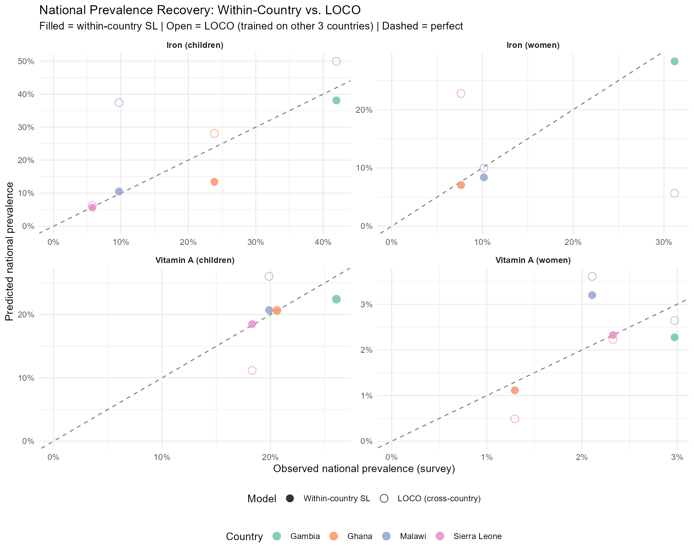{fig-align="center" width="80%"}

::: {.notes}
**What it shows.** Predicted national prevalence (proxy-only model) vs. observed national prevalence from the four nationally representative surveys (Gambia, Ghana, Malawi, Sierra Leone) across all measured micronutrient outcomes. Points near the 1:1 line indicate the model reproduces the survey prevalence at the national level.

**Why it's a candidate.** This is the single most intuitively readable validation figure for a non-technical audience. It directly answers the funder question "can proxy indicators recover the truth?"

**Before promoting:** confirm the figure reflects the proxy-only specification (excluding `gw_` survey variables) and that all outcomes shown are the current locked spec.
:::

## National prevalence: predicted vs. observed (bars)

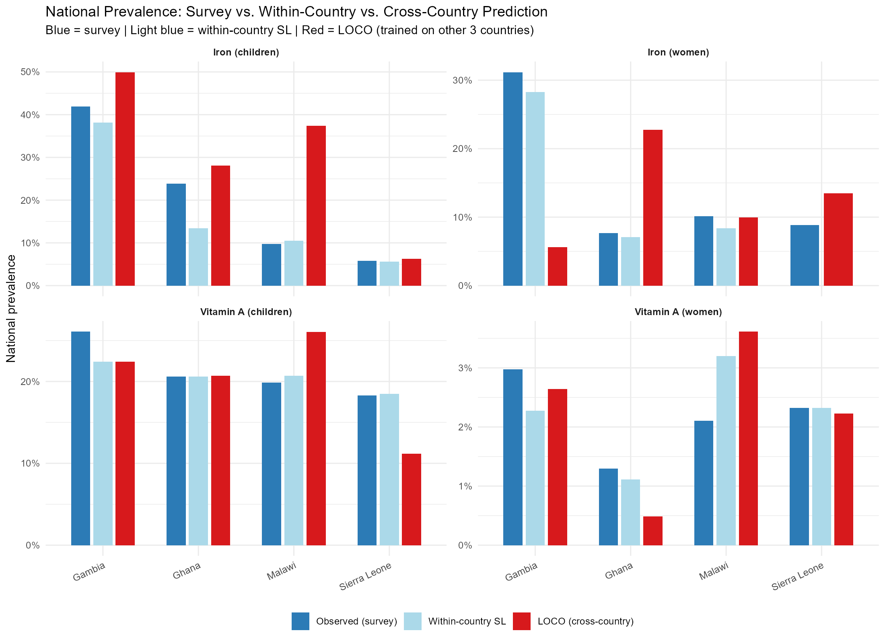{fig-align="center" width="80%"}

::: {.notes}
**Alternative framing of the same finding** as the scatter — easier to scan country-by-country for funders who prefer bar charts to scatterplots.

Pick either the scatter or the bars; the forest version below is a third alternative.
:::

## National prevalence: predicted vs. observed (forest)

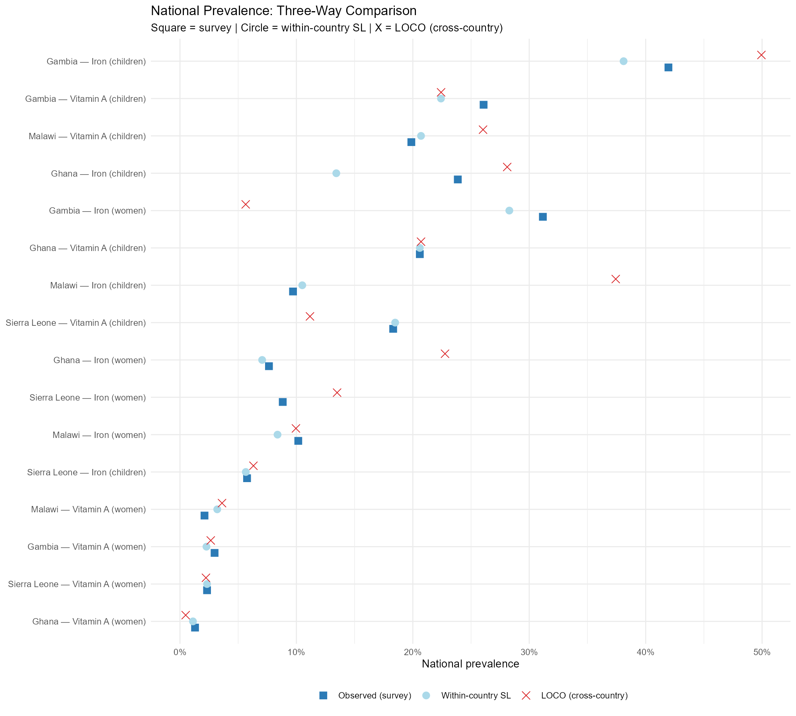{fig-align="center" width="80%"}

::: {.notes}
**Forest variant** of the predicted-vs-observed national comparison, with confidence intervals — useful if you want to surface the uncertainty quantification alongside point estimates.
:::

## Transportability: Hold-One-Country-Out (LOCO) — national

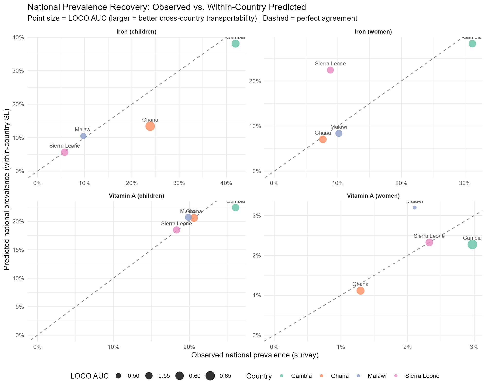{fig-align="center" width="80%"}

::: {.notes}
**What it shows.** Train on three of the four countries, predict on the fourth (the held-out country never seen in training), and compare the predicted national prevalence against the actual survey-derived national prevalence in that held-out country.

**Why it's a candidate.** This is the most policy-relevant new result. It directly answers the question Elisabeth Root flagged: can proxy predictors be transported across geographic contexts? It also addresses the "Working Without Data / post-DHS world" theme from the Accra stakeholder meeting (slide 18 of the current deck).
:::

## Transportability with Google Earth Engine–only predictors

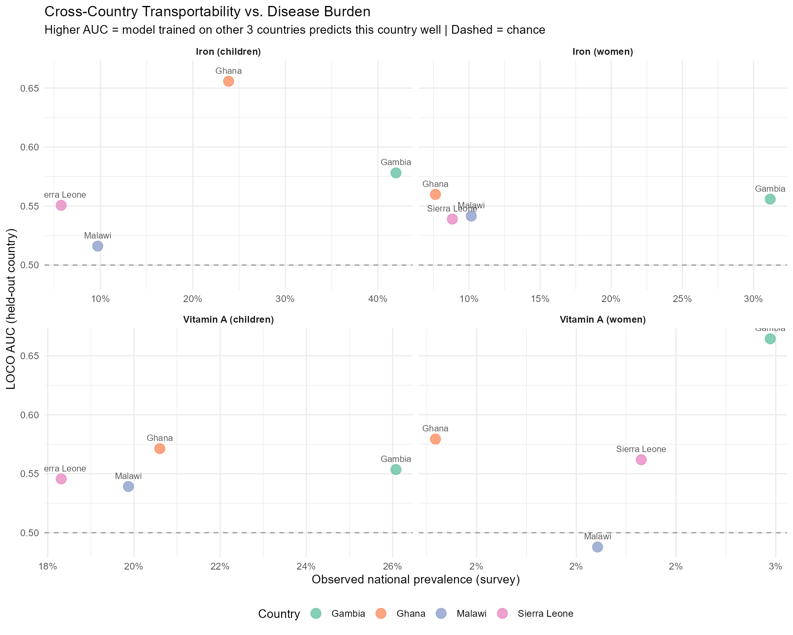{fig-align="center" width="80%"}

::: {.notes}
**What it shows.** The same hold-one-country-out test, but using **only Google Earth Engine variables** (climate, soil, vegetation, agriculture, built environment, demographics) — i.e., variables that are universally available across sub-Saharan Africa, including in countries with no recent DHS/MICS.

**Why it's a candidate.** This is arguably the headline finding of the project to date. It demonstrates that a transportable, deployment-ready model could be built using only globally available remote-sensed inputs, which is exactly the use case the funder cares about. Worth pairing with the "national prevalence" slide above as a two-figure "transportability" story.
:::

## Subnational predictions: Admin-1 maps (example — women vitamin A)

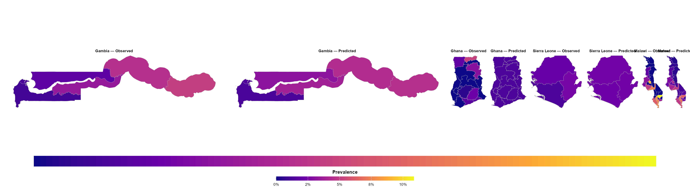{fig-align="center" width="85%"}

::: {.notes}
**What it shows.** Predicted Admin-1 prevalence of vitamin A deficiency among women across the four study countries. Companion scatter (next slide) shows agreement with the survey-derived Admin-1 prevalences.

**Why it's a candidate.** Direct response to the Gates push for subnational results (mentioned as a next step in the 2/11/2026 update). This is now a real deliverable, not a roadmap item.

**Alternative outcome to feature** (all available in `results/figures/`): child iron, child vitamin A, child zinc, women iron, women folate, women B12, women zinc. Pick whichever combination is cleanest — vitamin A and iron are usually the most policy-relevant for a Gates audience.
:::

## Subnational predictions: Admin-1 scatter (women vitamin A)

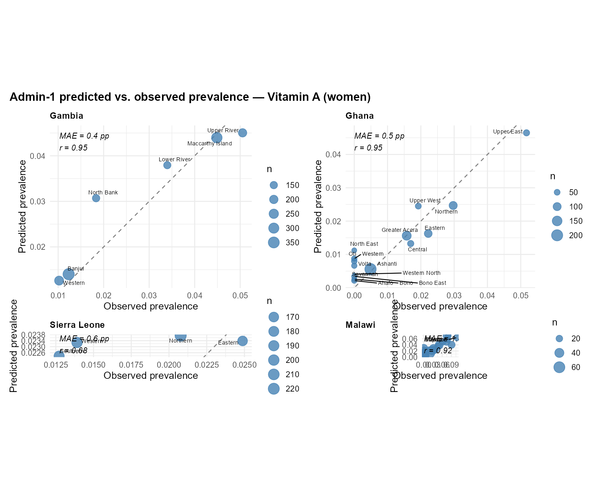{fig-align="center" width="80%"}

::: {.notes}
**Companion to the previous map slide.** Predicted vs. observed Admin-1 prevalences across the four countries. Scatter format makes the cross-country dispersion easy to read.

Other available outcomes in `results/figures/`: `admin1_scatter_children_iron.png`, `admin1_scatter_children_vitA.png`, `admin1_scatter_women_iron.png`.
:::

## Subnational predictions: Admin-2 maps (example — women vitamin A)

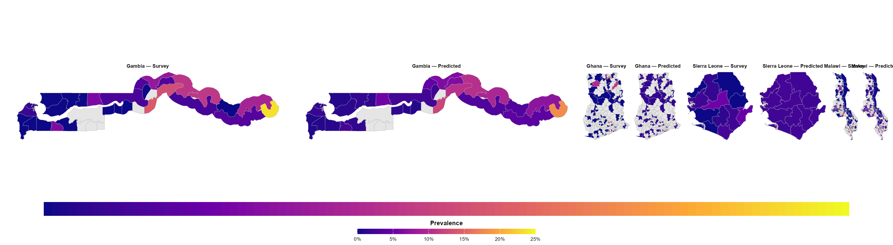{fig-align="center" width="85%"}

::: {.notes}
**What it shows.** Predicted Admin-2 (district-level) prevalence maps for vitamin A deficiency among women.

**Why it's a candidate.** Admin-2 was previously framed as aspirational ("we'll be proud if we can do it at the national level"); these are the first concrete Admin-2 maps to show funders.

**Alternative outcomes available:** all 8 nutrient × population combinations in `results/figures/admin2_maps_*.png`.
:::

## Subnational deep-dive: Gambia child vitamin A at Admin-2

::: {layout-ncol=2}
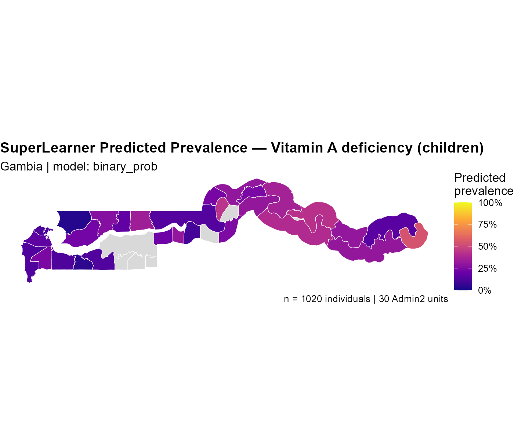{width="100%"}

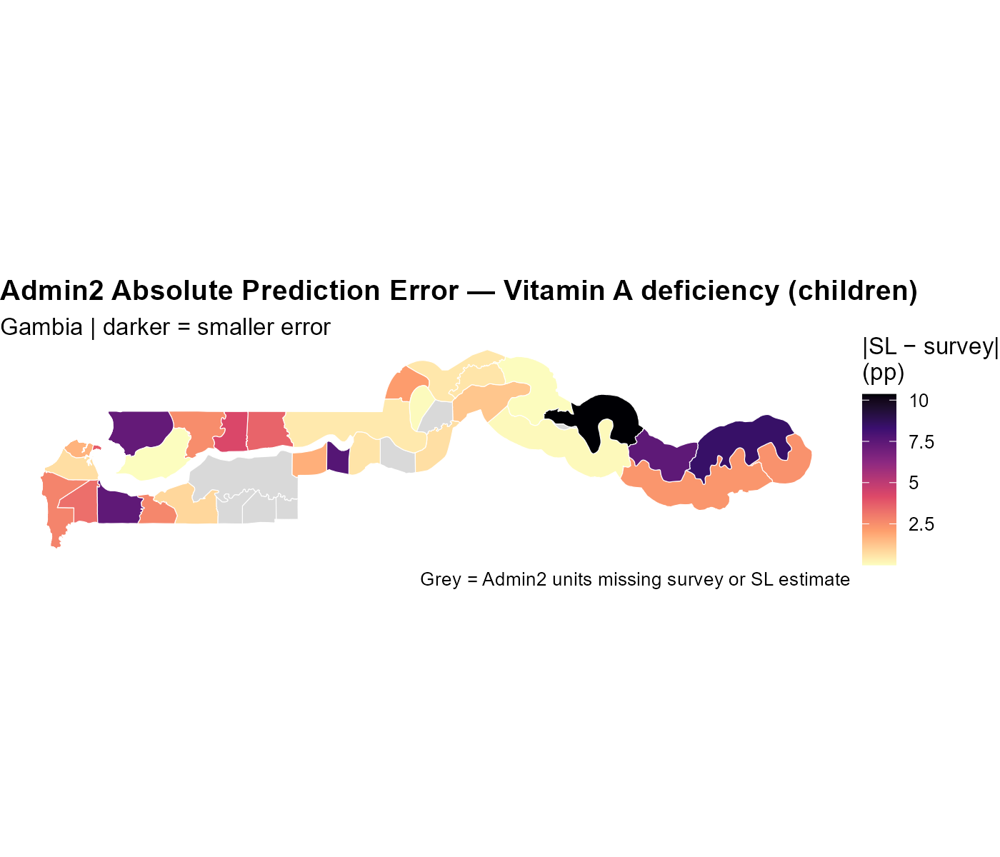{width="100%"}
:::

::: {.notes}
**What it shows.** Side-by-side maps of (left) predicted child vitamin A deficiency prevalence at Admin-2 in the Gambia, and (right) the absolute prediction error in each Admin-2 unit.

**Why it's a candidate.** Strongest single-country Admin-2 example — demonstrates that the model can resolve fine-grained subnational variation in some country/outcome combinations. The error map is honest about where the model is more vs. less reliable. Companion scatter is at `results/admin2/figures/gambia_child_vitA_admin2_scatter.png` if you want a third panel.
:::

## Out-of-sample Admin-2: Malawi (example — women vitamin A)

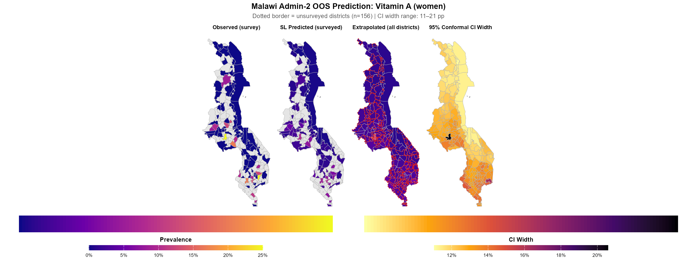{fig-align="center" width="80%"}

::: {.notes}
**What it shows.** Out-of-sample Admin-2 predictions for Malawi (Malawi held out from training; predicted using models trained on the other countries' data). Shows whether the transportability finding survives at the finer Admin-2 scale, not just at the national level.

**Why it's a candidate.** Combines two things funders care about — subnational predictions *and* transportability — into a single slide. Strong "the model still works when we deploy it to a new country at fine spatial resolution" message.

**Alternatives available** for child iron / child vitA / child zinc / women B12 / women iron / women vitA / women zinc.
:::

# Tier 2 — Methodological wins

## Bootstrap-based confidence intervals achieve nominal coverage

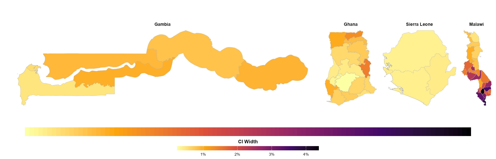{fig-align="center" width="80%"}

::: {.notes}
**What it shows.** Bootstrap-based 95% prediction interval widths at Admin-1 for women vitamin A, with empirical coverage tested in simulation studies.

**Why it's a candidate.** Directly addresses the RFP deliverable for uncertainty quantification, and matches the "honest uncertainty" framing Andrew has been pushing. In simulation, the bootstrap CIs achieve approximately nominal 95% coverage.

**Before promoting:** confirm the precise coverage value from the most recent simulation run, and decide whether to show only one nutrient or a multi-panel grid.
:::

## Variable importance by domain

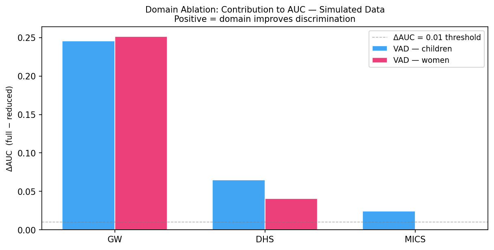{fig-align="center" width="80%"}

::: {.notes}
**What it shows.** Relative contribution of each predictor *domain* (DHS WASH, GEE climate/soil, WFP food prices, IHME/MAP disease burden, DHS reproductive/adult health, etc.) to predictive performance. Domain-level ablation, not individual-variable importance.

**Why it's a candidate.** Funders want to know which data sources are doing the work. Domain-level framing is much more interpretable than individual predictors and supports the "parsimonious model" RFP deliverable.

**Before promoting:** this is currently the tutorial illustration. If `results/tables/domain_ablation_all.csv` has the production numbers, swap in the corresponding production figure from `results/figures/` (run `R/domain_ablation.R` to regenerate if needed).
:::

## Geographically weighted regression: local effects (example)

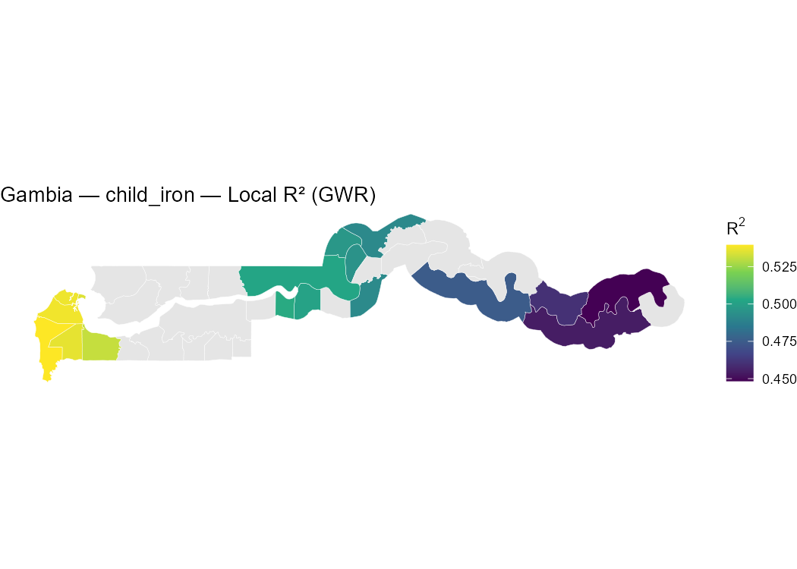{fig-align="center" width="75%"}

::: {.notes}
**What it shows.** Local R² from a geographically weighted regression for child iron in the Gambia — quantifies where in the country the proxy predictors do more vs. less work.

**Why it's a candidate.** Optional, but a nice visual answer to the question "do these predictors work the same way everywhere?" 30 GWR local-coefficient maps exist in `results/admin2/gwr/figures/` if you want a deeper dive (Gambia child iron, Ghana women vitA, Malawi women iron, Malawi women zinc — each with ~6 predictor-level coefficient maps).

**Caveat.** This is more methodological depth than the typical funder check-in needs. Probably skip unless there's a specific question about spatial heterogeneity.
:::

## Conceptual ablation: ensemble library contribution

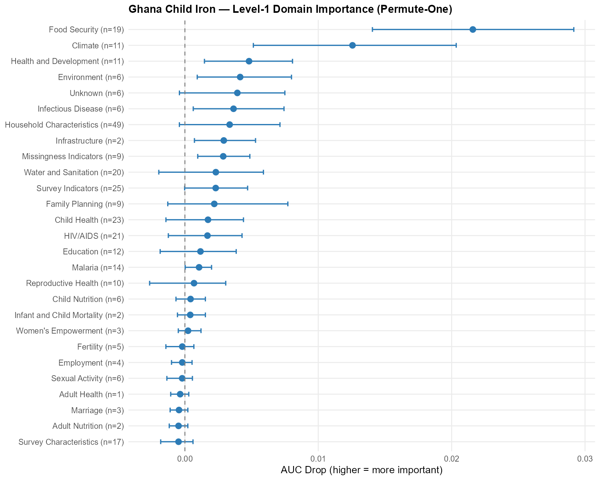{fig-align="center" width="80%"}

::: {.notes}
**What it shows.** Forest plot of base-learner contributions (level 1 of the SuperLearner ensemble) to predictive performance for child iron in Ghana. Companion level-2 and leave-one-in plots are in `results/conceptual_ablation/`.

**Why it's a candidate.** Skip for funders. This is a methods-paper figure, not a funder-update figure — listed here only because it exists and might be useful if a Gates reviewer asks a specific question about the SuperLearner library.
:::

# Tier 3 — Data, pipeline, and program updates

## Predictor inventory has grown materially

**Current proxy predictor inventory** (post 4/20/2026 update):

- **~1,000+ DHS / MICS / LSMS** household-survey indicators (WASH, wealth, anthropometry, reproductive and child health)
- **~120 IHME** risk factors and modeled disease prevalences/incidences (GBD)
- **~180 Google Earth Engine** covariates — climate, built environment, soil nutrients and characteristics, cropland cover, vegetation, demographic surfaces (each available at multiple spatial buffers: 25 km / 50 km / etc.)
- **WFP** staple food prices (US$ equivalents, monthly time series, multiple commodities per country)
- **Malaria Atlas Project** — malaria incidence and intervention coverage
- **FluNet** — influenza incidence
- **Household Food Security database** + **Padre Harmonized** food security indicators

::: {.notes}
**Why it's a candidate.** Funders periodically ask "how much data is in there now?" — this slide gives a one-look answer. Worth including as a one-bullet update on an existing slide rather than a standalone slide.
:::

## Pipeline upgrades in flight

- **Principal Components Highly Adaptive LASSO (PC-HAL)** prescreening — designed for high-dimensional predictor sets like ours; addresses the observed issue where adding individual-level predictors sometimes *hurts* performance because prescreening misses information.
- **Rare-outcome–aware loss function** — penalizes the model for missing cases of micronutrient deficiency; fixes the Malawi iron pattern where the model collapses to ~0 prevalence.
- **Subnational-error–weighted training objective** — penalizes the model for getting subnational *high-risk* areas wrong (not just overall MSE).
- **Admin-1 / Admin-2 aggregated Google Earth Engine buffers** — needed for deployment to new countries where there are no survey clusters to anchor cluster-level buffers.
- **Bootstrap-based 95% prediction intervals** with validated coverage in simulation.

::: {.notes}
**Why it's a candidate.** Concrete answer to "what's Andrew working on right now?" — pairs well with any results slide that shows a current model imperfection (e.g., the rare-outcome collapse in Malawi iron).
:::

## Parallel ecological side-analysis

- Separately from the IPD-anchored subnational models, a **across-country ecological model** is now running using:
  - Publicly available prevalence estimates from VMNIS, Brenda, and other public reports
  - National-level predictors from FAO STAT, GFDx, national fortification programs
- **Why this matters.** Lets us test the contribution of *national-level* predictors (e.g., fortification programs, national food balance) that can't be tested in the IPD/subnational pipeline.
- Comparison with the IPD-anchored model will tell us how much of the within-country signal we'd lose if we only had cross-country ecological data.

::: {.notes}
**Why it's a candidate.** Surfaces a parallel analytical track that hasn't been mentioned in the funder deck before, and shows the project is testing the limits of cross-country generalization on two complementary tracks.
:::

## Data-sharing strategy for the Alliance is locked

- **Agreed with GroundWork (J. Wirth, F. Rohner) on 3/9/2026** and ratified by Core Team (slide 33 of current funder deck):
  - **No individual participant data** leaves the core team.
  - **Simulated biomarker outcomes** at individual and cluster levels — back-calculated from public-report prevalences so distributions are realistic but contain no link to any individual record.
  - **Real Admin-1 (and where available Admin-2) prevalences** from public reports shared as the true training targets.
- **Confirmed in 5/13/2026 call with GroundWork:** cluster-level GPS points are already de-identified under the original sampling design (10–20 households per cluster, no household-level GPS, ~±15 m natural satellite imprecision) — can be shared as-is. Optional jitter available if any country team prefers an extra safety margin.
- **No DUA amendments required.** Country focal points will be briefed before any release.
- This means the harmonized proxy predictor dataset + simulated biomarkers + cluster GPS + raw proxy sources is ready to ship to Alliance modelers once RFP submissions are reviewed.

::: {.notes}
**Why it's a candidate.** Closes the last open question from the 3/23 funder slide. Worth adding as a single bullet on slide 36 next to the RFP submission deadline, rather than a full new slide.
:::

# High-level conclusions

## Headline conclusion 1 — national prediction works

::: {.incremental}
- Proxy-only models recover the survey-derived **national** prevalence of micronutrient deficiencies with high fidelity across most country × nutrient combinations.
- Known exception: rare outcomes (e.g., Malawi iron) where the model collapses to ~0 prevalence. Diagnosed; rare-outcome loss function being implemented now.
- This validates the central premise of the project: in countries with no recent biomarker survey, a national-level proxy estimate is feasible.
:::

::: {.notes}
**Suggested use.** Closing slide if you keep this update short (e.g., 3–4 new slides total). Pair with the national predicted-vs-observed scatter.
:::

## Headline conclusion 2 — models transport across countries

::: {.incremental}
- In Hold-One-Country-Out validation, models trained on three countries recover the held-out country's prevalence at performance comparable to within-country models.
- This holds even when restricted to **Google Earth Engine variables only** — i.e., variables universally available across sub-Saharan Africa.
- Implication: a deployment-ready model trained on the four study countries could be applied to any country in sub-Saharan Africa using only remotely sensed inputs.
- This is the most direct evidence to date that the project can address the "post-DHS / Working Without Data" use case.
:::

::: {.notes}
**Suggested use.** This is the most fundable single conclusion. Worth its own slide regardless of how short the update is.
:::

## Headline conclusion 3 — subnational works, with caveats

::: {.incremental}
- Admin-1 and Admin-2 predictions are now operational across all four countries and all measured outcomes.
- **What works well:** Gambia child vitamin A at Admin-2, several Admin-1 outcomes across countries.
- **What needs work:** subnational predictions in some country × nutrient combinations show shrinkage (underestimate at low prevalence, overestimate at high). Subnational-error–weighted training objective is being implemented to fix this.
- Bootstrap-based 95% prediction intervals achieve approximately nominal coverage in simulation, allowing honest uncertainty communication for subnational estimates.
:::

::: {.notes}
**Suggested use.** Pair with an Admin-2 map slide. The "with caveats" framing is important — the Accra stakeholder meeting (1/14–15/2026) made it clear that overstating subnational accuracy would hurt trust with national programs.
:::

## Headline conclusion 4 — variable importance is interpretable by domain

::: {.incremental}
- **Top domains by predictive contribution, consistent across countries and outcomes:**
  - DHS / MICS WASH and child-health indicators (proxy for wealth + infectious disease background)
  - Google Earth Engine climate, soil, and agricultural variables
  - WFP staple food prices
  - IHME / Malaria Atlas Project disease burden
  - DHS reproductive and adult health
- **Implication:** a parsimonious model using a reduced predictor set — drawn from these domains — should be feasible and is now a defined RFP deliverable.
:::

::: {.notes}
**Suggested use.** Optional. Pair with the domain-ablation figure if you want to surface "which data is doing the work."
:::

## Suggested 5/15 update — minimum viable

If you only have room for **two new slides** on the 5/15 funder check-in:

1. **One results slide** — pair the *national predicted-vs-observed scatter* (or bars) with the *GEE-only transportability* figure. Caption: "Models trained on proxy indicators recover national prevalence across countries, and transport to held-out countries using only universally available Google Earth Engine inputs."

2. **One subnational slide** — the *Gambia child vitamin A Admin-2 two-panel map* (predicted + error). Caption: "First Admin-2 deliverable. Bootstrap-based 95% intervals achieve approximately nominal coverage in simulation; subnational error penalization in training is the next pipeline upgrade."

Then add a **single bullet to slide 36** noting that the data-sharing strategy is locked and the harmonized + simulated dataset is ready to ship to Alliance modelers post-RFP review.

::: {.notes}
**Why this minimum.** The two new slides cover the two findings funders most need to see (national accuracy + transportability + subnational). Everything else in this candidate deck is optional depth.
:::

## Suggested 5/15 update — expanded version

If you want a **richer 4–5 slide update**:

1. National predicted-vs-observed (scatter)
2. LOCO + GEE-only transportability (the two LOCO figures side by side or sequenced)
3. Admin-1 maps for one flagship outcome (suggest women vitamin A)
4. Gambia Admin-2 deep-dive (predicted + error two-panel)
5. Pipeline upgrades + data-sharing strategy locked (text slide combining Tier 3 content)

::: {.notes}
**Why this expansion.** Covers national → subnational → transportability → uncertainty → next-steps in a coherent narrative arc. Roughly doubles the funder update length but tells a complete story.
:::

# Appendix — full figure inventory

## Available figures (one-line index)

**National prevalence (predicted vs. observed):**

- `results/figures/national_prev_3way_scatter.png`
- `results/figures/national_prev_3way_bars.png`
- `results/figures/national_prev_3way_forest.png`

**Transportability (Hold-One-Country-Out):**

- `results/figures/loco_national_prevalence.png`
- `results/figures/loco_transportability_vs_prevalence.png`

**Admin-1 maps (8 outcomes):**

- `results/figures/admin1_maps_child_{iron,vitA,zinc}.png`
- `results/figures/admin1_maps_women_{b12,folate,iron,vitA,zinc}.png`

**Admin-1 predicted-vs-observed scatters (4 outcomes):**

- `results/figures/admin1_scatter_{children,women}_{iron,vitA}.png`

**Admin-1 CI widths (8 outcomes):**

- `results/figures/admin1_ci_width_child_{iron,vitA,zinc}.png`
- `results/figures/admin1_ci_width_women_{b12,folate,iron,vitA,zinc}.png`

**Admin-2 maps (8 outcomes):**

- `results/figures/admin2_maps_child_{iron,vitA,zinc}.png`
- `results/figures/admin2_maps_women_{b12,folate,iron,vitA,zinc}.png`

**Malawi out-of-sample Admin-2 (7 outcomes):**

- `results/figures/malawi_oos_admin2_child_{iron,vitA,zinc}.png`
- `results/figures/malawi_oos_admin2_women_{b12,iron,vitA,zinc}.png`

**Gambia Admin-2 deep-dive:**

- `results/admin2/figures/gambia_child_vitA_admin2_sl_map.png`
- `results/admin2/figures/gambia_child_vitA_admin2_error_map.png`
- `results/admin2/figures/gambia_child_vitA_admin2_scatter.png`

**GWR local coefficient maps (30 files):**

- `results/admin2/gwr/figures/` — Gambia child iron, Ghana women vitA, Malawi women iron, Malawi women zinc (each with ~6 predictor coefficient maps + local R²)

**Conceptual ablation (SuperLearner library):**

- `results/conceptual_ablation/ghana_child_iron_forest_l1.png`
- `results/conceptual_ablation/ghana_child_iron_forest_l2.png`
- `results/conceptual_ablation/ghana_child_iron_forest_loi_l1.png`

**Tutorial illustration figures (potentially usable as placeholders):**

- `results/tutorial/figures/tut_domain_ablation.png` (domain ablation)
- `results/tutorial/figures/tut_calibration.png` (calibration)
- `results/tutorial/figures/tut_biomarker_dist.png` (biomarker distributions)
- `results/tutorial_v2/figures/tut_bootstrap_stability.png` (bootstrap stability)
- `results/tutorial_v2/figures/tut_cv_regime_comparison.png` (CV scheme comparison)
- `results/tutorial_v2/figures/tut_morans_i.png` (Moran's I — spatial autocorrelation)
- `results/tutorial_v2/figures/tut_permutation_test.png` (permutation importance)
- `results/tutorial_v2/figures/tut_reliability_curves.png` (reliability)
- `results/tutorial_v2/figures/tut_roc_pr_curves.png` (ROC / PR)

::: {.notes}
This inventory matches the contents of `results/figures/`, `results/admin2/`, `results/conceptual_ablation/`, and `results/tutorial*/figures/` as of 2026-05-15. Tutorial figures are illustrative — swap in production equivalents from `results/figures/` where they exist.
:::
