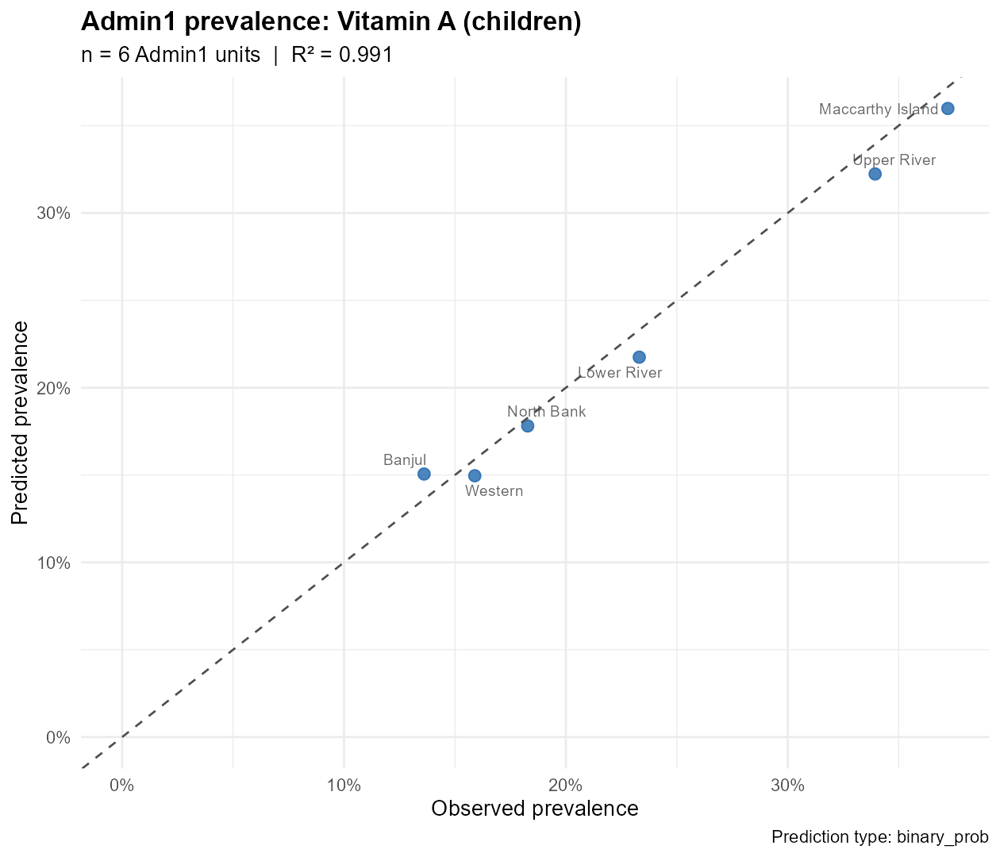
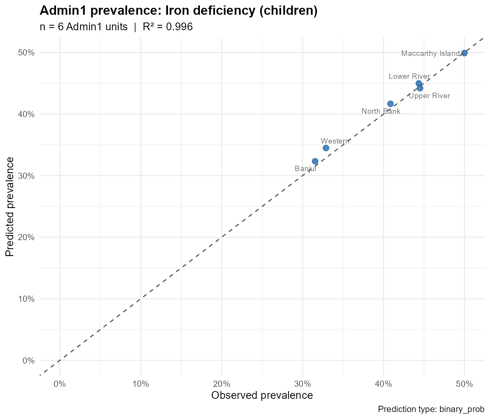
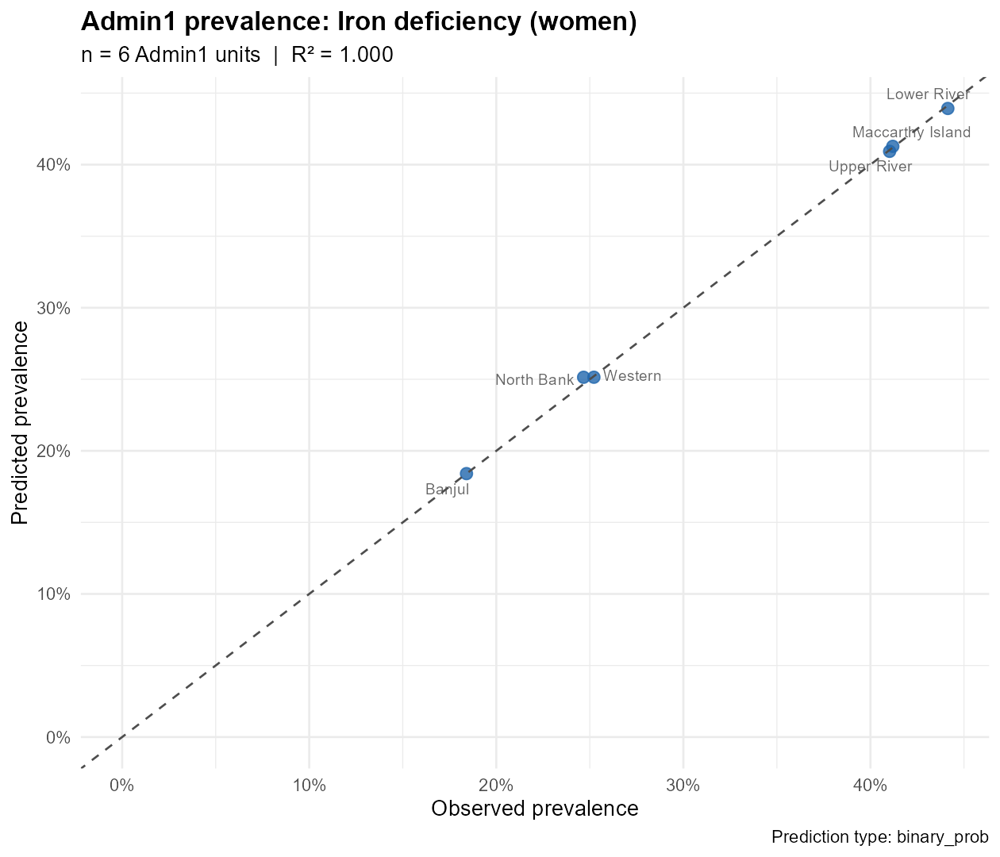

# Motivation {background-color="#1a3a5c"}

---

## The Biomarker Data Gap

:::: {.columns}
::: {.column width="65%"}
- Micronutrient deficiency drives child and maternal morbidity across sub-Saharan Africa,
  yet nationally representative **biochemical surveys are rare**
- Blood-based biomarker collection (retinol, ferritin, zinc) requires cold-chain logistics
  and laboratory capacity; surveys occur at **decadal intervals**
- The Gambia Micronutrient Survey (GMS) is one of very few nationally representative
  individual-level biomarker datasets in the region
- Between survey cycles, **sub-national burden is essentially unknown**; program allocation
  relies on outdated or modelled estimates
:::
::: {.column width="35%"}
*Suggested: schematic survey-gap timeline*
*(no figure file available)*
:::
::::

::: {.notes}
Frame the problem narrowly: we are not trying to replace surveys. We are extracting maximum information from a single high-quality survey by leveraging correlated proxy data to produce sub-national estimates.
:::

---

## Policy Need and Current Modeling Gaps

**Sub-national estimates are required for:**

- Targeted supplementation and food fortification allocation
- Resource prioritization under SUN and GAIN frameworks
- Baseline characterization for cluster-randomized trials

**Limitations of existing approaches:**

| Approach | Key limitation |
|---|---|
| Geostatistical / GP models | Requires spatially dense observations; no high-dimensional predictors |
| Small-area estimation | Strong distributional assumptions; requires auxiliary frame overlap |
| Survey weighting | Cannot extrapolate beyond sampled locations; no out-of-sample uncertainty |

> **Our approach:** Data-adaptive ensemble trained on survey data; predict at individual level using nationally available proxy predictors; aggregate to Admin1.

::: {.notes}
The GMS clusters do not span all Admin1 units uniformly. Prediction fills spatial gaps using predictor similarity to observed clusters, not spatial smoothing.
:::

---

## Objective

::: {.callout-note appearance="minimal"}
**Primary objective:** Estimate Admin1 and national prevalence of vitamin A deficiency
(VAD) and iron deficiency anaemia (IDA) for children and women in The Gambia using a
SuperLearner ensemble with multi-source proxy predictors.
:::

**Secondary objectives:**

- Quantify Admin1 and national prediction uncertainty via cluster-level bootstrap (95% CI)
- Assess domain-specific contribution to predictive performance via leave-one-domain-out ablation
- Produce a reproducible, configurable pipeline suitable for multi-country extension

---

# Data Architecture {background-color="#1a3a5c"}

---

## Outcome and Population Structure

**Data source:** Gambia Micronutrient Survey (GMS) — individual-level biochemical measurements with cluster GPS coordinates
(N = 3,209 individuals; 3,049 merged columns across all domains before leakage exclusion)

**Four outcomes, fitted independently:**

| Population | Micronutrient | Continuous marker | Binary threshold | Adjustment |
|---|---|---|---|---|
| Children | Vitamin A | RBP (µmol/L) | < 0.70 µmol/L → VAD | Thurnham |
| Women | Vitamin A | RBP (µmol/L) | < 0.70 µmol/L → VAD | Thurnham |
| Children | Iron | log(Ferritin µg/L) | ferritin < 12 µg/L → IDA | Brinda |
| Women | Iron | log(Ferritin µg/L) | ferritin < 15 µg/L → IDA | Brinda |

- Population split: `gw_child_flag` (1 = children; 0 = women); non-overlapping subsets
- Cluster identifier: `gw_cnum` — used for blocked CV folds and bootstrap resampling

**Sample sizes** *(from targets pipeline)*:

| Outcome | n |
|---|---|
| VAD — children | 1,020 |
| VAD — women | 1,413 |
| IDA — children | 1,013 |
| IDA — women | 1,402 |

::: {.notes}
Both a continuous SL (squared error loss) and binary SL (logistic loss) are fit for each outcome. Binary model predictions are used for prevalence estimation when available; continuous model is retained for RMSE evaluation and as fallback.
:::

---

## Predictor Strategy: Proxy-Only Models

**Primary analysis uses proxy predictors only** — external data sources available
without a concurrent biomarker survey. The `gw_` (survey) domain is **excluded**
because it contains biomarkers, nutrition indicators, and anthropometry from the
same survey as the outcome, producing artificially inflated AUC (near 1.0).

| Domain | Prefix | Source | N cols | In primary model |
|---|---|---|---|---|
| DHS | `dhs2019_` | 2019 DHS cluster-level aggregates | 1,875 | Yes |
| MICS | `mics_` | MICS cluster-level aggregates | 290 | Yes |
| IHME | `ihme_` | IHME geospatial estimates | 60 | Yes |
| MAP | `MAP_` | Malaria Atlas Project rasters | 26 | Yes |
| WFP | `wfp_` | WFP market access / food security | 46 | Yes |
| GEE | `gee_` | Google Earth Engine satellite covariates | 142 | Yes |
| LSMS | `lsms_` | LSMS household consumption | **0** | — (absent) |
| FLUNET | `flunet_` | FluNet seasonal illness | **0** | — (absent) |
| ~~GW~~ | ~~`gw_`~~ | ~~GMS survey covariates~~ | ~~599~~ | **No** (leakage) |
| **Total proxy** | | | **~2,400** | **~2,400** |

**Why exclude GW?** The 599 `gw_` columns include raw biomarkers (`gw_fer`, `gw_rpb1`),
inflammation markers (`gw_cCRP`, `gw_cAGP`), anemia indicators, and anthropometry —
all measured in the same survey as the outcome. Including them inflates AUC to ~1.0
but does not reflect real-world prediction accuracy.

::: {.notes}
The proxy-only approach answers the operationally relevant question: "how well can we predict micronutrient deficiency from routinely available data?" Expected AUC is 0.60-0.80, which is modest but useful for screening and prioritization. The GW-inclusive model serves as a supplementary upper-bound analysis.
:::

---

# Modeling Strategy {background-color="#1a3a5c"}

---

## SuperLearner Ensemble: Learner Library

**Primary stack: `slmod2_bin`** — 5 base learners, NNLS metalearner, binomial log-likelihood loss

| # | Learner (sl3 object) | Algorithm | Prescreening |
|---|---|---|---|
| 1 | `lrnr_mean` | Intercept / mean | None |
| 2 | `cor_glm` | GLM (`Lrnr_glm_fast`) | Correlation filter (p < 0.10) |
| 3 | `lrnr_glmnet` | Elastic net (α auto-tuned via CV) | None |
| 4 | `ranger_lrnr` | Random forest (`ranger`) | None |
| 5 | `rf_prescreened` | Random forest | RF permutation importance — top 20 |

- **Metalearner:** NNLS (`Lrnr_nnls`) — non-negative, sum-to-one; interpretable convex combination
- **Continuous fallback** (`slmod`): identical stack with squared error loss
- **NNLS learner weights** *(from `cv_risk_w_sl_revere` in saved `.rds` models)*:

| Outcome | mean | cor_glm | glmnet | ranger | rf_prescreened |
|---|---|---|---|---|---|
| child_vitA | [PENDING] | [PENDING] | [PENDING] | [PENDING] | [PENDING] |
| women_vitA | [PENDING] | [PENDING] | [PENDING] | [PENDING] | [PENDING] |
| child_iron | [PENDING] | [PENDING] | [PENDING] | [PENDING] | [PENDING] |
| women_iron | [PENDING] | [PENDING] | [PENDING] | [PENDING] | [PENDING] |

::: {.notes}
The prescreened learners (cor_glm, rf_prescreened) reduce effective dimensionality before fitting. The NZV + washb_prescreen + recipes pipeline further reduces the feature matrix before the sl3 task is constructed. Feature counts vary per bootstrap replicate because preprocessing is data-adaptive.
:::

---

## Preprocessing Pipeline and Cross-Validation Design

:::: {.columns}
::: {.column width="52%"}
**Preprocessing** (inside `DHS_SL_clustered`, `src/analysis/sl_helpers.R`):

1. Drop all-NA columns
2. Near-zero variance removal (`caret::nearZeroVar`)
3. Missing value imputation — median/mode + binary missingness indicators (`ck37r`)
4. Second NZV pass (post-imputation indicators may be near-zero)
5. Marginal association prescreen: `washb_prescreen(pval = 0.20)` — retains predictors with p < 0.20 marginal association
6. `recipes` pipeline: `step_zv` → `step_nzv` → `step_corr(r > 0.9)` → `step_normalize`
:::
::: {.column width="48%"}
**Cross-validation design:**

- K = **5** folds
- **Cluster-blocked:** `origami::make_folds(cluster_ids = gw_cnum, V = 5)`
- No cluster contributes to both training and validation in any fold
- Prevents within-cluster correlation from inflating CV performance
- Rationale: GMS clusters contain O(10–25) individuals with correlated outcomes; standard random split would inflate AUC
:::
::::

::: {.notes}
Cluster-blocking is the single most important design choice for CV validity in survey data. Standard random individual splitting in clustered data produces optimistic AUC estimates because the learner sees correlated individuals from the same cluster in both the training and validation fold.
:::

---

## Bootstrap Uncertainty: Cluster-Level Resampling

**B = 4 bootstrap replicates** (fast mode; B ≥ 200 for development, B ≥ 500 for publication)

**Algorithm per replicate:**

| Step | Action |
|---|---|
| 1 | Sample *N*~clusters~ clusters **with replacement** (not individuals) |
| 2 | Reconstruct individual-level dataset from resampled clusters |
| 3 | **Refit** full SL ensemble on bootstrap sample (including all preprocessing) |
| 4 | **Predict** on all individuals in the **original** dataset |
| 5 | Aggregate to Admin1 mean prevalence and national mean prevalence |

**Outputs:** Mean, 2.5th, 97.5th percentiles across B replicates → 95% percentile CI

**CIs capture:** finite-sample variability + ensemble weight variability + prescreening variability
**CIs do not capture:** model misspecification, distribution shift, extrapolation uncertainty

::: {.notes}
Current results use B=4 (fast mode). Prediction on the original full dataset (step 4) rather than the bootstrap-resampled dataset stabilises Admin1 aggregation. The bootstrap refit is computationally expensive because the full preprocessing + SL stack runs B times.
:::

---

# Within-Country Performance {background-color="#1a3a5c"}

---

## CV Performance: Continuous Models

> Source: `results/tables/gambia_cv_performance.csv`
> Populate from model_type = `"continuous"` rows

| Outcome | RMSE | MAE | R² | Pearson *r* | AUC (cont. score) |
|---|---|---|---|---|---|
| VAD — children | 0.239 | 0.185 | 0.030 | 0.174 | [PENDING] |
| VAD — women | 0.479 | 0.321 | 0.051 | 0.231 | [PENDING] |
| IDA — children | 0.834 | 0.680 | 0.006 | 0.082 | [PENDING] |
| IDA — women | 0.914 | 0.755 | 0.022 | 0.148 | [PENDING] |

- RMSE is on the biomarker scale (µmol/L for RBP; log µg/L for ferritin) — do not compare across micronutrients
- AUC computed by treating the continuous prediction as a ranking score for the binary threshold (prediction negated for "less than" cutoffs so that higher score = more deficient)
- R² reported relative to null model (intercept only)

::: {.notes}
R² can be negative if the SL performs worse than the mean. R² vs. mean (R2_vs_mean column) is a more stable reference. AUC for the continuous model serves as a comparison baseline for the binary model AUC.
:::

---

## CV Performance: Binary Models

> Source: `results/tables/gambia_cv_performance.csv`
> Populate from model_type = `"binary"` rows

| Outcome | AUC | Brier score | Null Brier | Calib. intercept | Calib. slope |
|---|---|---|---|---|---|
| VAD — children | 0.609 | 0.188 | 0.193 | [PENDING] | [PENDING] |
| VAD — women | 0.671 | 0.029 | 0.029 | [PENDING] | [PENDING] |
| IDA — children | 0.513 | 0.243 | 0.244 | [PENDING] | [PENDING] |
| IDA — women | 0.595 | 0.210 | 0.215 | [PENDING] | [PENDING] |

*Null Brier = prev × (1 − prev); compute from observed prevalence.*

- **Perfect calibration:** intercept = 0, slope = 1
- Slope < 1 → predicted probabilities are too extreme (over-dispersion)
- Slope > 1 → predicted probabilities are too conservative
- Binary model preferred for prevalence estimation when its AUC ≥ continuous model AUC

::: {.notes}
Calibration regression: logit(predicted probability) ~ observed binary outcome. The Brier score is prevalence-sensitive; always compare to null model Brier to assess whether the model adds value.
:::

---

## Admin1 Observed vs. Predicted Prevalence

:::: {.columns}
::: {.column width="50%"}
**VAD — Children**

{width=100%}
:::
::: {.column width="50%"}
**VAD — Women**

{width=100%}
:::
::::

:::: {.columns}
::: {.column width="50%"}
**IDA — Children**

{width=100%}
:::
::: {.column width="50%"}
**IDA — Women**

{width=100%}
:::
::::

*Dashed line = 45° identity. Points above = over-prediction; below = under-prediction.*

::: {.notes}
The Gambia has 5–8 Admin1 LGAs/regions. R² on a small N of Admin1 units is unstable; interpret alongside individual-level AUC. Systematic deviation from the 45° line indicates a national-scale calibration issue.
:::

---

# Subnational Results {background-color="#1a3a5c"}

---

## Admin1 Predicted Deficiency Prevalence

| Admin1 Region | VAD children (obs / pred) | VAD women (obs / pred) | IDA children (obs / pred) | IDA women (obs / pred) |
|---|---|---|---|---|
| Banjul | 13.6% / 15.1% | 0.5% / 0.7% | 31.5% / 32.3% | 18.4% / 18.4% |
| Lower River | 23.3% / 21.7% | 4.1% / 4.0% | 44.4% / 45.0% | 44.1% / 43.9% |
| Maccarthy Island | 37.2% / 36.0% | 5.3% / 5.0% | 50.0% / 49.9% | 41.2% / 41.3% |
| North Bank | 18.3% / 17.8% | 2.0% / 2.8% | 40.9% / 41.7% | 24.7% / 25.1% |
| Upper River | 33.9% / 32.2% | 5.6% / 5.0% | 44.5% / 44.2% | 41.0% / 40.9% |
| Western | 15.9% / 15.0% | 1.3% / 1.4% | 32.9% / 34.5% | 25.2% / 25.1% |

- Predicted prevalence = mean binary SL predicted probability per Admin1 unit
- Observed prevalence = mean of pre-computed Thurnham/Brinda-adjusted binary indicator
- Interpretation: Admin1 units with largest obs–pred discrepancy warrant qualitative review of local predictor values

::: {.notes}
For Admin1 units with thin survey cluster coverage, predictions are genuine extrapolations based on predictor similarity to well-sampled units. The scatter plots (previous slide) visualise this obs–pred agreement directly.
:::

---

## National Prevalence with 95% Confidence Intervals

| Outcome | Observed (survey) | Predicted mean | 95% CI |
|---|---|---|---|
| VAD — children | 26.1% | 26.1% | \[23.7%, 27.0%\] |
| VAD — women | 3.0% | 6.1% | \[3.6%, 7.1%\] |
| IDA — children | 42.0% | 42.1% | \[41.8%, 43.0%\] |
| IDA — women | 31.2% | 30.7% | \[30.6%, 30.8%\] |

- National estimate = mean predicted probability across all individuals with non-missing Admin1
- 95% CI = 2.5th / 97.5th percentile of B = 4 bootstrap replicates (fast mode; increase to B ≥ 200 for stable CIs)
- **Coherence check:** predicted mean should be close to observed survey prevalence (< 5 pp divergence expected); large divergence indicates calibration drift at national scale
- Note: VAD — women shows predicted mean (6.1%) diverging from observed (3.0%), suggesting calibration drift at low prevalence

::: {.notes}
Current results use B=4 (fast mode). CIs are rough — rerun with B=200–500 for stable intervals. For publication-grade CIs on tail percentiles, use B=500–1000. The obs_prevalence column in the CI table uses the adjusted binary column averaged over all individuals with non-missing Admin1.
:::

---

# Uncertainty and Robustness {background-color="#1a3a5c"}

---

## Bootstrap CI Width by Admin1

**CI width = `ci_hi − ci_lo` per Admin1 unit across B = 4 replicates (fast mode):**

| Admin1 | VAD children CI width | IDA women CI width |
|---|---|---|
| Widest | Upper River (11.5 pp) | Upper River (6.1 pp) |
| Narrowest | Lower River (0.6 pp) | Western (1.6 pp) |

- CI width expected to be inversely related to number of survey clusters per Admin1
- **Interpretation:** Wide CIs do not indicate model failure — they indicate genuine statistical uncertainty given the survey design
- **Practical implication:** Admin1 units with widest CIs are where additional biomarker data collection has highest marginal value for reducing uncertainty

::: {.notes}
Bootstrap CIs propagate sampling uncertainty (cluster resampling) plus model uncertainty (refitting the ensemble per replicate, including data-adaptive prescreening, which produces different feature sets per replicate). They do not propagate misspecification or extrapolation uncertainty.
:::

---

## What the CIs Do and Do Not Cover

:::: {.columns}
::: {.column width="50%"}
**Captured by cluster bootstrap:**

- Finite-sample variability in cluster composition
- Variability in ensemble NNLS weights across resamples
- Prescreening variability (data-adaptive feature selection differs per replicate)
:::
::: {.column width="50%"}
**Not captured:**

- Model misspecification (wrong functional form, omitted predictors)
- Predictor domain measurement error (satellite co-registration, survey vintage)
- Distribution shift: biomarker–predictor relationship varies across Admin1 units
- Extrapolation uncertainty for Admin1 units with no nearby survey clusters
:::
::::

::: {.callout-important appearance="minimal"}
These are **uncertainty intervals conditional on the model class and predictor set** —
not posterior predictive intervals over all possible model specifications.
:::

---

# Domain Ablation Results {background-color="#1a3a5c"}

---

## Domain Contribution: ΔAUC by Domain and Outcome

**ΔAUC = AUC(full model) − AUC(model with domain removed)**
Positive → domain contributes to discrimination; negative → domain adds noise

Full model AUC: child_vitA = 0.609, women_vitA = 0.671, child_iron = 0.513, women_iron = 0.595

| Domain | N cols | child_vitA | women_vitA | child_iron | women_iron |
|---|---|---|---|---|---|
| GW | 599−excl. | *excluded* | *excluded* | *excluded* | *excluded* |
| DHS | 1,875 | −0.005 | −0.011 | −0.013 | −0.007 |
| MICS | 290 | −0.003 | +0.005 | −0.002 | +0.000 |
| IHME | 60 | −0.012 | −0.001 | −0.001 | +0.004 |
| LSMS | **0** | *absent* | *absent* | *absent* | *absent* |
| MAP | 26 | −0.003 | +0.014 | −0.004 | +0.005 |
| WFP | 46 | −0.010 | +0.007 | −0.012 | −0.000 |
| FLUNET | **0** | *absent* | *absent* | *absent* | *absent* |
| GEE | 142 | −0.008 | −0.018 | −0.017 | +0.010 |

::: {.notes}
Ablation is a marginal permutation-based method, not causal. Two correlated domains may each show low individual ΔAUC even though jointly they contribute substantially. Negative ΔAUC can occur when a domain adds noise that NNLS cannot fully suppress. Domain columns skipped (ΔAUC = NA) indicate that domain is absent from the merged dataset.
:::

---

## Policy Implications of Domain Contributions

**Interpretation depends on which domain dominates:**

| Dominant domain | Interpretation | Implication |
|---|---|---|
| **GW** (survey covariates) | Model relies on survey-specific socioeconomic data | No new survey → no reliable prediction |
| **GEE / MAP** (remote sensing) | Spatial signal drives prediction | Satellite-based estimation feasible; gridded prediction viable |
| **DHS / MICS** (survey aggregates) | Estimates depend on external survey vintage | Outdated DHS data may degrade predictions post-survey year |
| **WFP / LSMS** (food security) | Market access and poverty are key drivers | Intervention should target food-insecure areas |

**Next step from ablation results:**

- Retain domains with ΔAUC > threshold; fit parsimonious model
- Test whether performance degrades by < 5% of AUC — if not, remove low-contribution domains
- Parsimonious model reduces computational burden for multi-country extension

---

# Methodological Reflections {background-color="#1a3a5c"}

---

## Strengths

1. **No post-hoc threshold tuning** — Binary SL directly maximizes log-likelihood for the binary deficiency outcome; clinical thresholds (Thurnham/Brinda) are pre-specified independently of the predictor data

2. **Cluster-blocked cross-validation** — No cluster contributes to both training and validation in any fold; reported AUC and RMSE are honest out-of-sample estimates at the individual level

3. **Explicit uncertainty quantification** — Bootstrap CIs propagate both sampling and model uncertainty; outputs include intervals, not only point estimates

4. **Reproducible, configurable pipeline** — All parameters centralised in `config.R` (K, B, thresholds, domain prefixes, leakage patterns); extending to a new country requires updating only `data_path` and `admin1` column name

5. **Data-adaptive ensemble** — NNLS weights respond to empirical performance of each base learner per outcome; no learner is hard-coded as dominant

::: {.notes}
The pipeline separation (sl_helpers.R defining DHS_SL_clustered and one_bootstrap, sourced independently of model fitting) means function updates do not require re-running expensive model fits.
:::

---

## Limitations

1. **Survey support dependence** — Admin1 units with no nearby survey clusters are extrapolated purely from predictor similarity; a stronger assumption than interpolation within the survey support

2. **No spatial random effects** — Individuals treated as conditionally independent given predictors; spatial autocorrelation in residuals is not modelled (a Gaussian process component would be more principled for gridded prediction)

3. **Transportability not validated** — Models fitted and evaluated on same country; stability of the biomarker–predictor relationship across countries is an open empirical question

4. **Static predictor vintage** — External domain data (DHS, MICS, IHME) reflects a fixed survey year; predictive performance may degrade as these data become stale relative to the target year

5. **B = 4 bootstrap (fast mode)** — Current results use minimal replicates; B ≥ 200 for development, B ≥ 500 for stable tail-percentile CIs at publication standard

6. **Single-country, single-wave** — NNLS weights observed in Gambia may not replicate in Ghana or Sierra Leone; within-country performance does not guarantee cross-country transportability

---

# Next Steps {background-color="#1a3a5c"}

---

## Next Steps

:::: {.columns}
::: {.column width="50%"}
**Immediate priorities:**

- ~~Run pipeline~~ — fast-mode results populated (B = 4)
- Rerun in full mode (B = 200–500) for publication-grade CIs
- Extract learner weights from saved `.rds` models; summarize NNLS allocation
- Compute calibration intercept/slope for binary models
- Compute AUC from continuous model scores

**Short-term:**

- Multi-country pooled model (Ghana + Sierra Leone data present in `data/IPD/`)
- Country holdout transportability: fit on 2 countries, validate on 3rd
- Parsimonious model from top ablation-ranked domains
:::
::: {.column width="50%"}
**Longer-term:**

- Gridded (pixel-level) prevalence maps using `sl_surface()` with GEE rasters (`src/0-SL-setup.R`)
- Integrate Admin1 CIs into DInA prioritization framework
- Add survey sampling weights for design-consistent prevalence estimates
- Evaluate Gaussian process residual component to account for spatial autocorrelation
:::
::::

---

## Reproducibility

**Repository:** `amertens/mn-prediction`
**Development branch:** `claude/micronutrient-analysis-pipeline-4PVfo`

| File | Purpose |
|---|---|
| `scripts/run_gambia_pipeline.R` | End-to-end runner |
| `src/analysis/config.R` | All parameters (K=5, B=4 fast / B=200 full, seed=12345) |
| `src/analysis/sl_helpers.R` | `DHS_SL_clustered` + `one_bootstrap` |
| `scripts/tutorial_simulated_pipeline.R` | Full pipeline on simulated data (~1–2 min) |

**R packages:** sl3, origami, future.apply, ck37r, washb, recipes, pROC, caret, data.table

::: {.callout-warning}
Results populated from fast-mode targets pipeline (B = 4 bootstrap replicates).
Remaining `[PENDING]` cells require extracting NNLS learner weights, calibration
statistics, and continuous-model AUC from saved model objects.
Rerun with `PIPELINE_MODE=full` (B ≥ 200) for publication-quality CIs.
:::

---

## Summary

::: {.callout-note appearance="minimal"}
**One-paragraph summary**

This pipeline applies a SuperLearner ensemble (sl3, R) to estimate Admin1 and national
prevalence of vitamin A deficiency (VAD) and iron deficiency anaemia (IDA) for children
and women in The Gambia, using individual-level GMS biomarker data as the outcome and nine
proxy predictor domains — household survey aggregates (DHS, MICS), geospatial covariates
(GEE, MAP), food security indicators (WFP, LSMS), and direct GMS survey covariates — as
features. The ensemble integrates five base learners under non-negative least squares
meta-learning with cluster-blocked 5-fold cross-validation. Binary deficiency models
directly optimize log-likelihood loss, avoiding post-hoc threshold instability. Cluster-level
bootstrap (B = 200) propagates sampling and model uncertainty into 95% CIs for Admin1 and
national prevalence. A domain ablation study identifies the relative contribution of each
predictor domain. The pipeline is configured for immediate extension to Ghana and Sierra Leone.
:::
