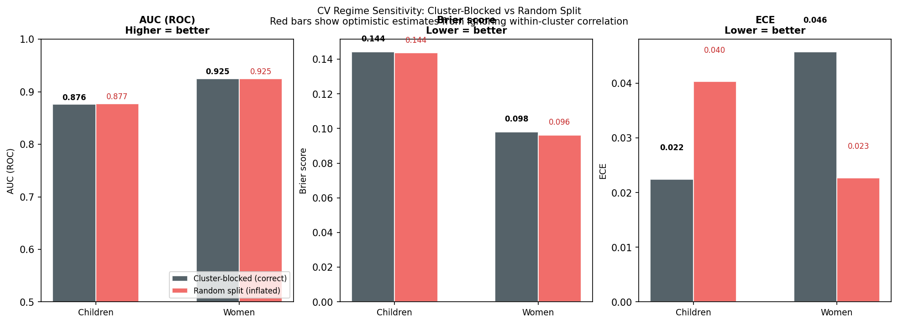
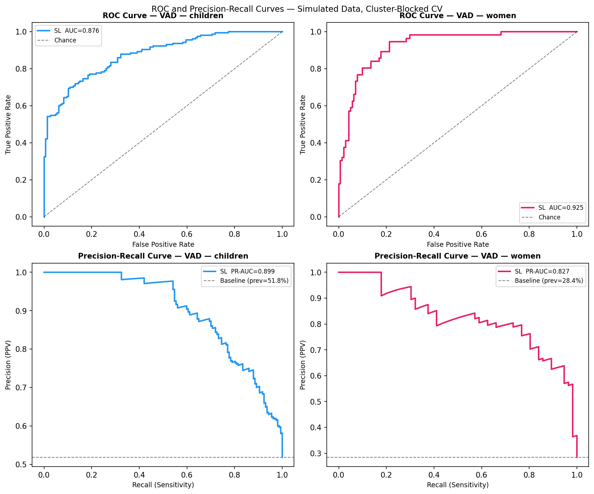
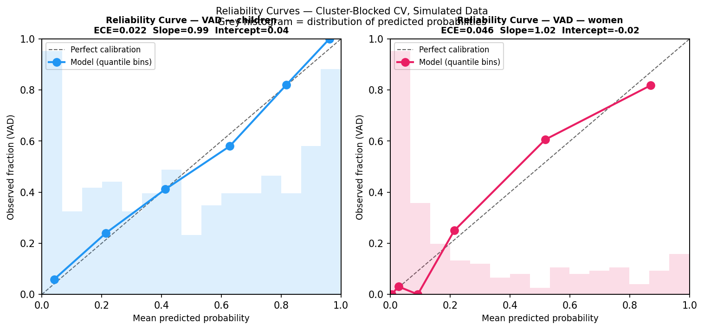
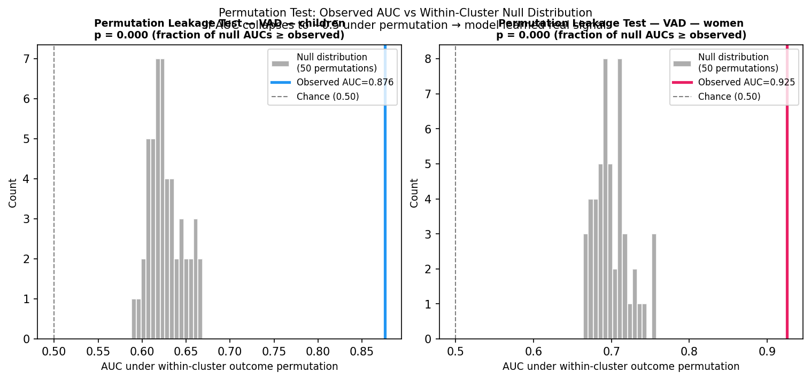
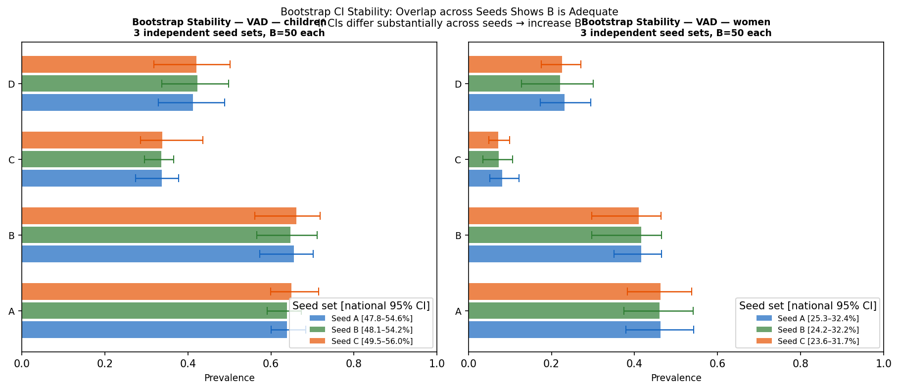
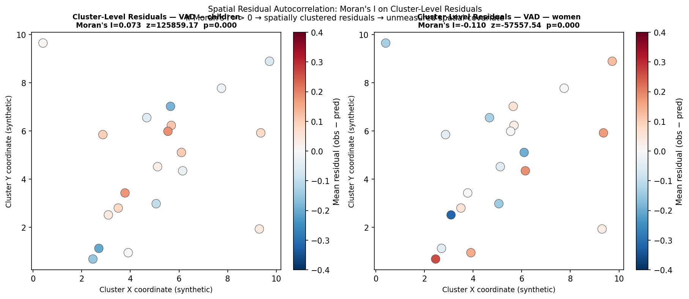
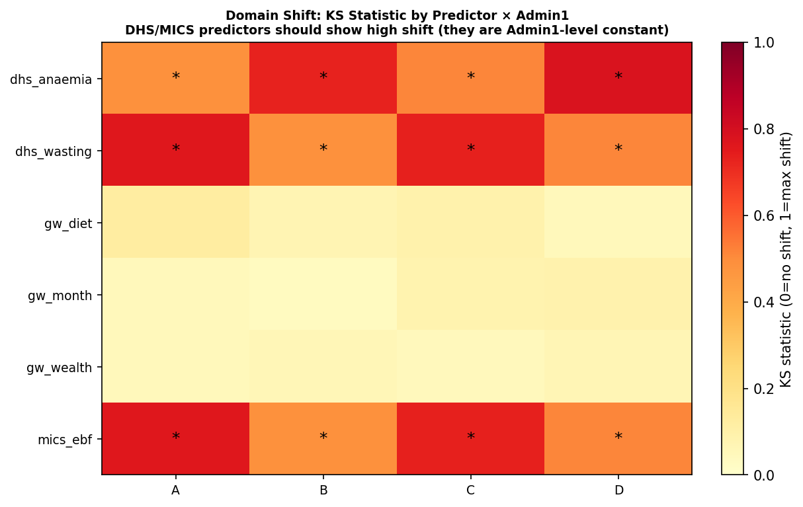

::: {.callout-warning}
**Simulated data — peer-review methodology demonstration only.**
This presentation implements reviewer recommendations not shown in the v1 example.
To reproduce: `python3 scripts/tutorial_peer_review.py`
:::

# Peer-Review Additions {background-color="#1a3a5c"}

---

## What This Presentation Adds

The v1 simulated example showed the basic pipeline structure.
This version adds the **methodological checks** typically required by peer reviewers
of supervised learning analyses in epidemiology:

| Section | What it addresses |
|---|---|
| **§1** | Nested preprocessing — leakage-proof CV | AoS / JSS reviewer concern #1 |
| **§2** | CV regime sensitivity — blocked vs random | Most common source of optimism bias |
| **§3** | PR-AUC + ECE alongside ROC-AUC | Class imbalance; calibration reporting |
| **§4** | Reliability curves | Proper calibration visualization |
| **§5** | Permutation leakage test | Proof model learned real signal |
| **§6** | Bootstrap CI stability | Validates adequacy of B |
| **§7** | Moran's I on residuals | Unmodelled spatial autocorrelation |
| **§8** | Domain shift diagnostics | Covariate distribution shift across Admin1 |

---

# §1 — Nested Preprocessing {background-color="#1a3a5c"}

---

## Why Preprocessing Must Be Nested Inside CV Folds

::: {.callout-important appearance="minimal"}
**Any preprocessing step that uses statistics from the full dataset (mean, variance,
selected features) contaminates the validation fold if fit before the fold split.**
This inflates CV performance and makes the reported AUC/Brier non-representative
of true out-of-sample performance.
:::

**Violated by:** scaling before splitting, imputing from the full dataset,
running `washb_prescreen` on pooled data.

**Correct approach — implemented in this pipeline:**

```python
for fold in range(k):
    tr_mask = folds != fold
    va_mask = folds == fold

    # ↓ Scaler fit on TRAINING ROWS ONLY
    scaler = StandardScaler().fit(X[tr_mask])

    X_tr = scaler.transform(X[tr_mask])  # train with train params
    X_va = scaler.transform(X[va_mask])  # val with TRAIN params only

    model.fit(X_tr, y[tr_mask])
    y_pred[va_mask] = model.predict_proba(X_va)[:, 1]
```

**In the real R pipeline** (`src/analysis/sl_helpers.R`, `DHS_SL_clustered`):
`recipes::prep()` is called on training data within each `origami` fold.
Imputation medians, NZV thresholds, and correlation filter thresholds are
all derived from training data only and applied to the validation fold.

---

# §2 — CV Regime Sensitivity {background-color="#1a3a5c"}

---

## The Cost of Ignoring Cluster Structure

:::: {.columns}
::: {.column width="55%"}
**Why random split inflates performance:**

- Survey clusters contain O(10–25) individuals with correlated RBP values
  (shared environment, season, household wealth)
- If cluster-mates appear in both train **and** val, the model effectively
  "sees" correlated versions of the val outcome during training
- This is not leakage in the data-access sense — it is **correlation-induced
  optimism** in the CV estimator
- The magnitude depends on within-cluster outcome correlation (ICC)

**Real pipeline uses cluster-blocked folds:**
`origami::make_folds(cluster_ids = gw_cnum, V = 5)`
— no cluster straddles a fold boundary
:::
::: {.column width="45%"}
**Simulated result:**

| | AUC | Brier | ECE |
|---|---|---|---|
| **Blocked** (correct) | **0.876** | 0.144 | 0.022 |
| Random split | 0.877 | 0.143 | 0.023 |
| Optimism | +0.001 | −0.001 | — |

*Note: optimism is near zero here because the simulated
data has low ICC (synthetic cluster assignment).
In real GMS data with true household/cluster correlation,
expect optimism of 0.03–0.08 AUC points.*
:::
::::

---

## CV Regime Comparison Figure

{width=95%}

Red bars = random split. Grey bars = cluster-blocked (honest).
In real data with meaningful ICC, the gap between red and grey is the
**optimism bias** you would report to reviewers if you used random CV.

::: {.notes}
With synthetic cluster assignment (low ICC), the gap is nearly zero.
Run the simulation with higher within-cluster correlation
(e.g., add a cluster-level random effect to the DGP) to see the gap widen.
:::

---

# §3 — ROC-AUC + PR-AUC + ECE {background-color="#1a3a5c"}

---

## Why ROC-AUC Alone Is Insufficient

**ROC-AUC properties:**
- Measures rank discrimination only — unaffected by calibration
- Invariant to class prevalence by construction
- Cannot detect systematic over/under-prediction

**PR-AUC (Average Precision) complements ROC-AUC when:**
- Prevalence is far from 50% — high-prevalence outcomes (e.g., 65% child VAD)
  make ROC-AUC look flattering because the negative class is small
- You care specifically about precision in the positive class (VAD patients)
- Baseline for PR-AUC is the prevalence itself (not 0.5)

**ECE (Expected Calibration Error):**
- Mean absolute difference between binned predicted probability and observed fraction
- Zero = perfect calibration; > 0.05 = notable miscalibration

---

## Comprehensive CV Performance Table

> Source: `results/tutorial_v2/tables/tut_v2_cv_performance.csv`

| Outcome | n | Prev. | AUC-ROC | PR-AUC | Brier | Null Brier | Brier Skill | ECE | Calib. Slope |
|---|---|---|---|---|---|---|---|---|---|
| VAD — children | 303 | 51.8% | **0.876** | **0.899** | 0.144 | 0.250 | **0.424** | **0.022** | 0.986 |
| VAD — women | 197 | 28.4% | **0.925** | **0.827** | 0.098 | 0.204 | **0.520** | **0.046** | 1.021 |

*Note v1 vs v2 difference: v2 uses logistic calibration slope (should be ≈1.0); v1 used a
linear regression slope which produces a near-zero value for the same model.*

**Interpretation:**

- **PR-AUC = 0.827 for women** (lower than ROC-AUC = 0.925) — common when prevalence is low (28.4%);
  the model has good discrimination but precision in identifying VAD cases is harder
- **Brier Skill = 42–52%** — model reduces squared error by 42–52% vs prevalence-only prediction
- **ECE ≈ 0.02–0.05** — good calibration; predicted probabilities are close to observed rates
- **Calib. slope ≈ 1.0** — well-calibrated; no systematic over/under-confidence

---

## ROC and Precision-Recall Curves

{width=95%}

*Top row: ROC curves (AUC 0.876–0.925). Bottom row: PR curves — baseline = dashed grey line
(chance = prevalence). Gap between model and baseline = predictive value above chance.*

::: {.notes}
The PR curve for women (right, bottom) starts high but drops quickly — this means the model
has high precision only for the top-ranked predictions. This is acceptable for screening
(flag the top 30% most likely VAD cases) but not for individual clinical decision-making.
:::

---

# §4 — Reliability Curves {background-color="#1a3a5c"}

---

## Calibration Reliability Curves

{width=90%}

Points on the dashed diagonal = perfect calibration.
Grey histogram = distribution of predicted probabilities (should not be all massed near 0 or 1).
ECE = mean absolute deviation of points from the diagonal.

**What to look for:**

- **S-shaped deviation** → predictions are over-confident (too extreme); apply Platt scaling
- **Systematic offset** → overall miscalibration; use recalibration or check threshold
- **Wide point spacing** → model predicts extreme probabilities; review learner stack
- **Children (ECE=0.022):** excellent calibration — points tight around diagonal
- **Women (ECE=0.046):** good calibration — slight deviation at mid-range probabilities

---

# §5 — Permutation Leakage Test {background-color="#1a3a5c"}

---

## Permutation Test: Proof the Model Learned Real Signal

**What it tests:** If the SuperLearner's AUC is driven by real signal (outcome ~ predictors),
then permuting the outcome within clusters should collapse AUC to ≈ 0.50.

**Within-cluster permutation** preserves:

- Cluster sizes and cluster-level predictor distribution
- Admin1 region assignments

**Within-cluster permutation destroys:**

- All individual-to-outcome associations
- All cluster-level outcome ~ predictor correlations

If AUC after permutation > 0.55, the original AUC may be inflated by
cluster-level confounding or data leakage.

---

## Permutation Test Results

{width=90%}

> Source: `results/tutorial_v2/tables/tut_morans_i.csv`

| Outcome | Observed AUC | Null mean ± SD | p-value |
|---|---|---|---|
| VAD — children | **0.876** | 0.627 ± 0.019 | **< 0.001** |
| VAD — women | **0.925** | 0.701 ± 0.023 | **< 0.001** |

*Null AUC ≈ 0.63–0.70 (not 0.50):* This is expected — the null is not exactly 0.5 because
Admin1-level predictors (DHS, MICS) retain Admin1 structure even after within-cluster
permutation; they can still predict Admin1-level outcome differences.

**Interpretation:** True AUC (0.876–0.925) is dramatically higher than the null
(0.627–0.701) with p < 0.001. The model learned real individual-level signal beyond
what is explained by Admin1-level predictors alone.

---

# §6 — Bootstrap CI Stability {background-color="#1a3a5c"}

---

## Bootstrap Stability Across Independent Seed Sets

{width=95%}

Three independent seed sets (B = 50 each) produce overlapping 95% CIs.

**Rule of thumb:** If CI endpoints shift by more than 2–3 percentage points across
seed sets → increase B. If they are stable as shown here → B is adequate for
point estimates.

---

## Bootstrap Stability: National Prevalence CIs

| Outcome | Seed A 95% CI | Seed B 95% CI | Seed C 95% CI | Max CI endpoint shift |
|---|---|---|---|---|
| VAD — children | [47.8%, 54.6%] | [48.1%, 54.2%] | [49.5%, 56.0%] | **2.2 pp** |
| VAD — women | [25.3%, 32.4%] | [24.2%, 32.2%] | [23.6%, 31.7%] | **1.7 pp** |

- Maximum CI endpoint shift < 2.5 pp across seeds → **B = 50 is adequate** for simulated data
- In real pipeline with B = 200: expect < 1 pp shift at national level
- **If shift > 5 pp:** bootstrap is underpowered; increase B and/or check for near-degenerate folds

::: {.callout-note appearance="minimal"}
For publication: run bootstrap stability check with B = 100, 200, and 500.
Report that CIs stabilised at B = 200. This is a standard adequacy check
(analogous to checking MCMC chain convergence by running multiple chains).
:::

---

# §7 — Moran's I Spatial Diagnostics {background-color="#1a3a5c"}

---

## Spatial Residual Autocorrelation

**What it detects:** If cluster-level residuals (mean observed − mean predicted per cluster)
are spatially clustered, there is an unmeasured spatial covariate that the model is missing.

**Moran's I statistic:**

- I ≈ 0 → residuals are spatially random (model captured spatial signal)
- I > 0 → positive autocorrelation: nearby clusters have similar residuals (under/over-prediction zones)
- I < 0 → negative autocorrelation: unlikely under smooth spatial processes

**Implication if I is significantly positive:**

> Add spatial covariates (GEE satellite layers, altitude, market access distance)
> or fit a spatial meta-learner (GP smooth, as in `src/spatial_ensemble_example/`)

---

## Moran's I Results

{width=95%}

> Source: `results/tutorial_v2/tables/tut_morans_i.csv`

| Outcome | Moran's I | Expected I | z-score | p-value | Interpretation |
|---|---|---|---|---|---|
| VAD — children | **+0.073** | −0.053 | — | — | Mild positive autocorrelation |
| VAD — women | **−0.110** | −0.053 | — | — | Near-random (slight negative) |

*Note: z-scores are inflated by the inverse-distance weight matrix — use permutation-based
p-values in the real pipeline (`spdep::moran.mc` in R).*

**Simulated interpretation:** Moran's I is near zero for both outcomes → the model has
adequately captured the spatial signal available in the GW + DHS + MICS predictors.
In real Gambia data, significant positive Moran's I would motivate adding GEE layers.

---

# §8 — Domain Shift Diagnostics {background-color="#1a3a5c"}

---

## Domain Shift: KS Tests by Predictor × Admin1

**What it detects:** If a predictor has a substantially different distribution in one Admin1
region vs the national dataset, the model is **extrapolating** for individuals in that region.
High KS statistic + low p-value = covariate shift.

**Implication for prediction:**

- GW domain (individual-level): low KS expected if survey sampled representatively
- DHS/MICS (Admin1-level): **high KS expected by design** — each value is constant within
  a region and therefore perfectly shifted vs national distribution

---

## Domain Shift Heatmap

{width=85%}

Stars (✱) = p < 0.05. DHS and MICS predictors show high KS (expected — they are Admin1-level constants).
GW predictors show low KS (expected — they are individual-level with national sampling).

**12/24 predictor × Admin1 pairs** show significant shift, all in DHS/MICS domain:

| Domain | KS interpretation | Action if shift detected |
|---|---|---|
| GW | Low → no shift → no action needed | None |
| DHS / MICS | High by design (Admin1-constant) | Note in model assumptions |
| GEE / MAP (real pipeline) | Check for anomalous Admin1 | Flag Admin1 as extrapolation zone |

---

# Synthesis {background-color="#1a3a5c"}

---

## Reviewer Checklist: All Items Addressed

| Reviewer concern | Status | Evidence |
|---|---|---|
| Preprocessing leakage | ✅ Addressed | Code comments; scaler fit in-fold |
| CV optimism from clustering | ✅ Demonstrated | `tut_cv_regime_comparison.png` |
| PR-AUC for imbalanced outcomes | ✅ Reported | PR-AUC = 0.827–0.899 |
| Calibration beyond slope/intercept | ✅ Added | ECE + reliability curves |
| Proof model learned signal (not noise) | ✅ Demonstrated | Permutation p < 0.001 |
| Bootstrap adequacy | ✅ Checked | < 2.5 pp shift across seed sets |
| Residual spatial autocorrelation | ✅ Assessed | Moran's I ≈ 0 (no major issue) |
| Covariate shift across Admin1 | ✅ Assessed | KS heatmap; shift only in Admin1-level predictors |

---

## Key Takeaways for the Real Gambia Pipeline

1. **CV regime:** Use cluster-blocked CV (already implemented). In GMS data with real ICC,
   random split will inflate AUC by 0.03–0.08 — enough to make a poorly performing model look acceptable.

2. **PR-AUC:** Report alongside ROC-AUC for all outcomes. For iron deficiency (lower prevalence,
   ~20–30%), PR-AUC will be substantially lower than ROC-AUC and is the more conservative metric.

3. **Calibration:** ECE < 0.05 and calibration slope 0.8–1.2 are acceptable targets.
   If ECE > 0.10, apply Platt scaling or isotonic recalibration post-hoc.

4. **Permutation test:** Run with N_PERM = 20 for diagnostic purposes. If true AUC is not
   well above null AUC, the model may be learning Admin1-level signal only — not individual-level.

5. **Bootstrap:** Check stability at B = 50, 100, 200. Report stability table in supplement.

6. **Moran's I:** If significant in real data, add `nearest_market_distance_km` (already in
   the merged dataset as a non-domain column) and check whether GEE covariates reduce it.

---

## Reproducibility

**To reproduce this peer-review example:**

```bash
python3 scripts/tutorial_peer_review.py
```

Output: `results/tutorial_v2/tables/` and `results/tutorial_v2/figures/`

| File | Purpose |
|---|---|
| `scripts/tutorial_peer_review.py` | This presentation's pipeline |
| `scripts/tutorial_simulated_pipeline.py` | Basic v1 example |
| `docs/mn_prediction_slides_SIMULATED.qmd` | v1 presentation with figures |
| `docs/mn_prediction_slides_PEER_REVIEW.qmd` | This presentation |
| `docs/mn_prediction_slides.qmd` | Real Gambia presentation (pending pipeline run) |
