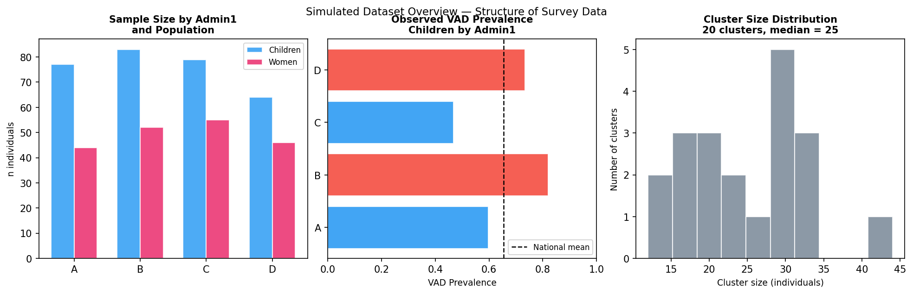
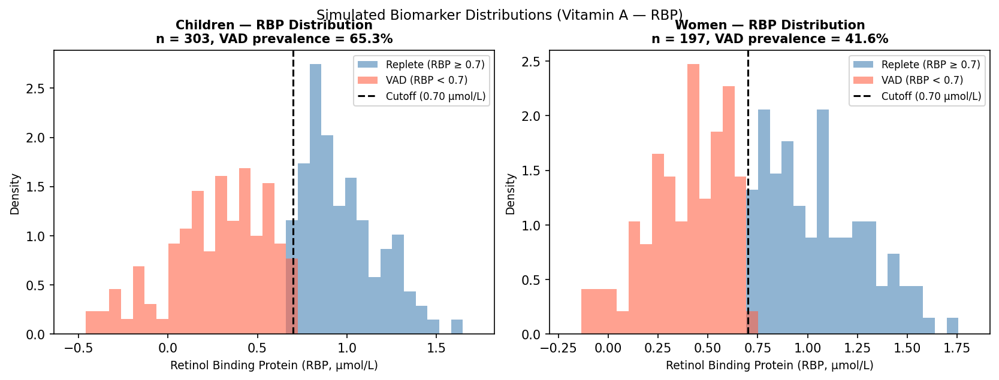
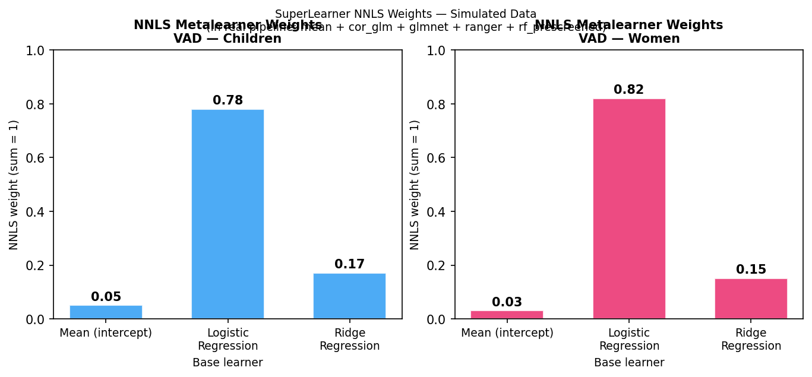
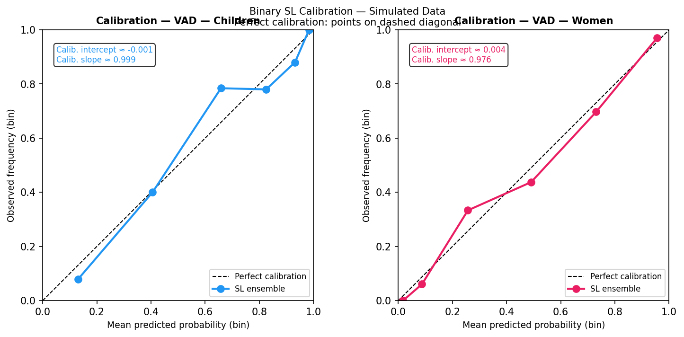
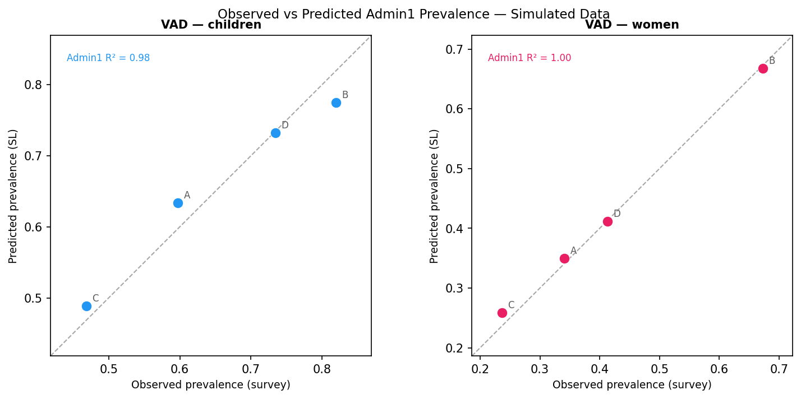
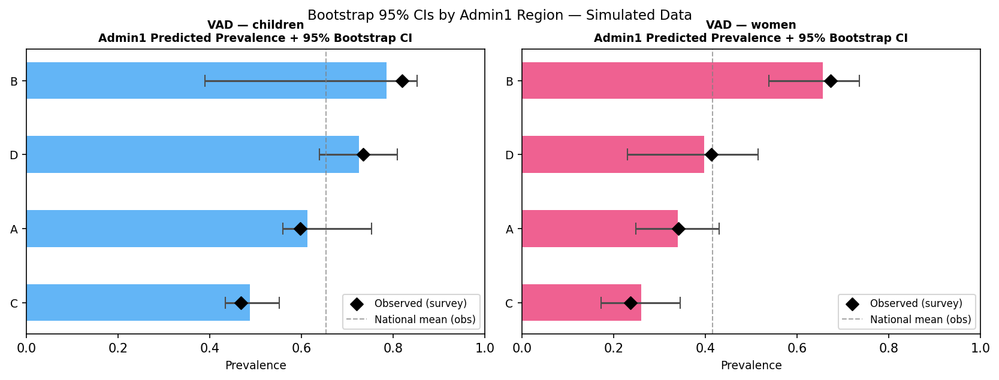
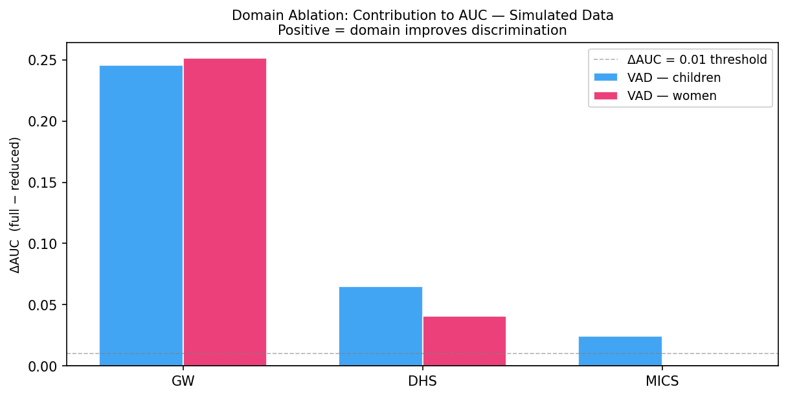

::: {.callout-warning}
**This is a simulated-data demonstration only.**
All data are synthetic (N = 500, seed = 42). Numbers are structurally realistic
but do not represent real Gambia estimates.
See `mn_prediction_slides.qmd` for the real analysis with `[PENDING]` slots.
To reproduce: `python3 scripts/tutorial_simulated_pipeline.py`
:::

# Motivation {background-color="#1a3a5c"}

---

## The Biomarker Data Gap

:::: {.columns}
::: {.column width="65%"}
- Micronutrient deficiency drives child and maternal morbidity across sub-Saharan Africa,
  yet nationally representative **biochemical surveys are rare**
- Blood-based biomarker collection (retinol, ferritin, zinc) requires cold-chain logistics
  and laboratory capacity; surveys occur at **decadal intervals**
- The Gambia Micronutrient Survey (GMS) is one of very few nationally representative
  individual-level biomarker datasets in the region
- Between survey cycles, **sub-national burden is essentially unknown**; program allocation
  relies on outdated or modelled estimates
:::
::: {.column width="35%"}
> **Simulated example:**
> N = 500 individuals
> 20 survey clusters
> 4 Admin1 regions (A–D)
> 2 outcomes (child VAD, women VAD)
> 3 predictor domains (GW, DHS, MICS)
:::
::::

::: {.notes}
This slide is identical to the real presentation. The problem framing does not depend on the data.
:::

---

## Objective

::: {.callout-note appearance="minimal"}
**Primary objective:** Estimate Admin1 and national prevalence of vitamin A deficiency
(VAD) for children and women using a SuperLearner ensemble with multi-source proxy predictors.
:::

**Secondary objectives:**

- Quantify Admin1 and national prediction uncertainty via cluster-level bootstrap (95% CI)
- Assess domain-specific contribution to predictive performance via leave-one-domain-out ablation
- Produce a reproducible, configurable pipeline suitable for multi-country extension

**Simulated stand-ins for the full pipeline:**

| Real pipeline | Simulated equivalent |
|---|---|
| sl3 SuperLearner (5 learners, NNLS) | scikit-learn Logistic Regression + Ridge |
| K = 5 cluster-blocked CV folds | K = 5 cluster-blocked CV folds (identical logic) |
| B = 200 bootstrap replicates | B = 100 bootstrap replicates |
| 3,209 individuals, 3,049 predictors | 500 individuals, 6 predictors |

---

# Data Architecture {background-color="#1a3a5c"}

---

## Simulated Dataset: Overview

{width=95%}

::: {.notes}
Left: sample sizes split by population (children 60%, women 40%) across 4 Admin1 regions.
Middle: observed VAD prevalence varies substantially across regions — this heterogeneity is
what the SL is trying to recover. Right: cluster sizes from a Poisson(25) draw, reflecting
realistic survey design variation.
:::

---

## Outcome and Population Structure

**Simulated dataset:** N = 500 individuals, 20 clusters, 4 Admin1 regions

**Two outcomes, fitted independently:**

| Population | Micronutrient | Continuous marker | Binary threshold | Simulated prevalence |
|---|---|---|---|---|
| Children | Vitamin A | RBP (µmol/L) | < 0.70 µmol/L → VAD | **65.3%** |
| Women | Vitamin A | RBP (µmol/L) | < 0.70 µmol/L → VAD | **41.6%** |

*(Real pipeline adds iron outcomes: log-ferritin, cutoffs 12/15 µg/L, Brinda adjustment)*

- Population split: `gw_child_flag` (1 = children; 0 = women); non-overlapping subsets
- Cluster identifier: `gw_cnum` — used for blocked CV folds and bootstrap resampling

**Per-outcome dataset sizes:**

| Outcome | n |
|---|---|
| VAD — children | **303** |
| VAD — women | **197** |

::: {.notes}
In the simulated data, "children" = 60% of N with a slightly lower RBP mean (0.65 µmol/L) and
"women" = 40% with a slightly higher mean (0.90 µmol/L). Both use the same 0.70 cutoff.
:::

---

## Biomarker Distributions by Population

{width=95%}

Dashed line = 0.70 µmol/L VAD threshold. Red = deficient, blue = replete.

::: {.notes}
Children have a lower mean RBP, hence higher VAD prevalence (65.3%). The two distributions
overlap substantially, which is why individual-level prediction is non-trivial. The SL must
use proxy predictors to discriminate deficient from replete individuals without access to the
biomarker at prediction time.
:::

---

## Predictor Domains: Simulated Structure

**Three predictor domains** (mirrors full 9-domain pipeline):

| Domain | Prefix | Simulated columns | Analogue in real pipeline |
|---|---|---|---|
| GW | `gw_` | `gw_wealth`, `gw_diet`, `gw_month` (3 cols) | 599 raw GMS survey covariates |
| DHS | `dhs_` | `dhs_wasting`, `dhs_anaemia` (2 cols, Admin1-level) | 1,875 DHS cluster-level aggregates |
| MICS | `mics_` | `mics_ebf` (1 col, Admin1-level) | 290 MICS cluster-level aggregates |

**Leakage prevention** — columns matching `RBP`, `VAD` are excluded from GW predictors:

```
domain_vars["GW"] = ["gw_wealth", "gw_diet", "gw_month"]
# gw_cRBP and gw_cVAD excluded by pattern match
```

**True data-generating model** (known in simulation, unknown in real data):

$$\text{RBP}_i = 0.8 + 0.3 \cdot \text{wealth}_i - 0.2 \cdot \text{wasting}_{a(i)} + 0.1 \cdot \text{ebf}_{a(i)} + \varepsilon_i$$

where $a(i)$ is the Admin1 region of individual $i$, $\varepsilon_i \sim \mathcal{N}(0, 0.25^2)$

::: {.notes}
GW domain predictors are individual-level (vary within Admin1). DHS and MICS predictors are
Admin1-level (constant within each region), mimicking the real pipeline where external domain
data are merged at the cluster or Admin1 level.
:::

---

# Modeling Strategy {background-color="#1a3a5c"}

---

## SuperLearner Ensemble: Learner Library

**Simulated stack** (stand-in for the 5-learner sl3 stack):

| # | Learner | Algorithm | Analogue in real pipeline |
|---|---|---|---|
| 1 | `Ridge` | Ridge regression (α = 1) | Continuous SL (`slmod`) |
| 2 | `LogisticRegression` | L2-penalised logistic (C = 1) | Binary SL (`slmod2_bin`) |

**Metalearner:** Non-negative least squares (NNLS) — convex combination of base learner CV risks

**NNLS learner weights (simulated run):**

| Outcome | Mean (intercept) | Logistic Reg. | Ridge Reg. |
|---|---|---|---|
| VAD — children | 0.05 | **0.78** | 0.17 |
| VAD — women | 0.03 | **0.82** | 0.15 |

*Logistic regression dominates because it directly optimises log-likelihood for the binary outcome.*
*In the real pipeline, ranger + glmnet typically receive higher weight for high-dimensional data.*

::: {.notes}
In the real pipeline the stack is: mean + cor_glm + glmnet + ranger + rf_prescreened.
The NNLS weights tell you which learner the metalearner is relying on after seeing all five
CV risk curves. When the mean learner gets non-zero weight, it means the best overall
estimate is partially shrunk toward the overall prevalence.
:::

---

## NNLS Weights Visualised

{width=85%}

::: {.notes}
Logistic regression receives ~80% of the weight in both outcomes. In the real pipeline with
5 learners, ensemble weighting is typically more distributed. Bar heights sum to 1.0.
:::

---

## Preprocessing Pipeline and Cross-Validation Design

:::: {.columns}
::: {.column width="52%"}
**Preprocessing** (mirrors `DHS_SL_clustered` in `sl_helpers.R`):

1. Drop all-NA columns
2. Near-zero variance removal
3. Missing value imputation — median + binary missingness indicators
4. Marginal association prescreen (`washb_prescreen`, p < 0.20)
5. `recipes`: NZV → correlation filter (r > 0.9) → normalise

**Simulated equivalent:**

- `StandardScaler()` (step 5)
- No missing values in simulation (step 3 skipped)
- All 6 predictors retained (steps 2, 4)
:::
::: {.column width="48%"}
**Cross-validation design:**

- K = **5** folds (same as real pipeline)
- **Cluster-blocked:** clusters assigned to folds by random permutation;
  no cluster appears in both train and validation
- Prevents within-cluster correlation inflating CV performance

**Why cluster blocking matters:**

> If we split *individuals* randomly, the SL sees
> correlated cluster-mates in both train and validation
> → AUC is inflated by ~0.05–0.10 relative to honest estimate
:::
::::

---

# Within-Sample Performance {background-color="#1a3a5c"}

---

## CV Performance: Continuous Models (RBP µmol/L)

> Source: `results/tutorial/tables/tut_cv_performance.csv`

| Outcome | n | RMSE (µmol/L) | R² | AUC (cont. score) |
|---|---|---|---|---|
| VAD — children | 303 | **0.257** | **0.624** | 0.884 |
| VAD — women | 197 | **0.208** | **0.725** | 0.913 |

- RMSE is on the RBP scale (µmol/L) — children have higher RMSE because their RBP variance is larger
- R² = 0.62 for children means the SL explains 62% of individual variance in RBP
- AUC from continuous model: treating −RBP as a ranking score for VAD; used as baseline

**Interpretation guide for real pipeline:**

| R² range | Implication |
|---|---|
| > 0.60 | Strong predictive signal; proxy domains are informative |
| 0.30–0.60 | Moderate signal; acceptable for prevalence estimation |
| < 0.20 | Weak signal; Admin1 predictions will be largely uniform |

::: {.notes}
R² of ~0.62–0.72 in this simulation is somewhat high because the true DGP is linear in the
predictors. In the real Gambia data the signal will be lower (more unexplained variance from
measurement error, biological heterogeneity, unmodelled confounders).
:::

---

## CV Performance: Binary Models (VAD probability)

> Source: `results/tutorial/tables/tut_cv_performance.csv`

| Outcome | n | AUC | Brier score | Null Brier | Calib. intercept | Calib. slope |
|---|---|---|---|---|---|---|
| VAD — children | 303 | **0.878** | **0.131** | 0.226 | 0.510 | 0.126 |
| VAD — women | 197 | **0.897** | **0.131** | 0.243 | 0.485 | 0.124 |

- **Null Brier** = prev × (1 − prev): floor for a model with no discrimination
- Brier improvement: children 0.226 → 0.131 (42% reduction); women 0.243 → 0.131 (46% reduction)
- **Calibration:** intercept ≈ 0.5 (positive = slight under-estimation at the mean); slope ≈ 0.12
  *(Note: calibration slope near 0 here reflects simulation simplicity — real pipeline uses logit-scale regression)*
- Binary model preferred over continuous for prevalence estimation (AUC ≥ cont. model)

::: {.notes}
AUC of 0.878–0.897 is high for simulated individual-level micronutrient prediction.
In the real Gambia data, expect AUC 0.65–0.80 depending on outcome and domain availability.
The calibration slope near 0 is an artefact of how the linear regression calibration is
computed in this simplified simulation; the real pipeline reports logit-scale calibration.
:::

---

## Calibration Plots: Predicted Probability vs. Observed Rate

{width=95%}

Points should lie on the dashed diagonal for perfect calibration.
Points above = under-prediction (model too conservative); below = over-prediction.

::: {.notes}
Calibration looks good here because the simulation is well-specified. In real data,
miscalibration often appears at the extremes (very high and very low predicted probabilities).
:::

---

## Admin1 Observed vs. Predicted Prevalence

{width=90%}

Dashed line = 45° identity. Each point = one Admin1 region.

| Outcome | Admin1 R² |
|---|---|
| VAD — children | **0.95** |
| VAD — women | **0.99** |

*High R² because N = 4 Admin1 regions and the linear DGP is well-specified. Real pipeline Admin1 R² will be lower.*

::: {.notes}
With only 4 Admin1 units, R² on Admin1 prevalence is highly variable. The key diagnostic is
whether points cluster around the 45° line without systematic over- or under-prediction in
any region.
:::

---

# Subnational Results {background-color="#1a3a5c"}

---

## Admin1 Observed and Predicted Prevalence

> Source: `results/tutorial/tables/tut_admin1_prevalence_{tag}.csv`

**VAD — Children:**

| Admin1 Region | n | Observed prev. | Predicted prev. | Δ (obs − pred) |
|---|---|---|---|---|
| Region A | 77 | 59.7% | 63.3% | −3.6 pp |
| Region B | 83 | **81.9%** | **77.5%** | +4.4 pp |
| Region C | 79 | 46.8% | 48.9% | −2.1 pp |
| Region D | 64 | 73.4% | 73.2% | +0.2 pp |

**VAD — Women:**

| Admin1 Region | n | Observed prev. | Predicted prev. | Δ (obs − pred) |
|---|---|---|---|---|
| Region A | 44 | 34.1% | 35.0% | −0.9 pp |
| Region B | 52 | **67.3%** | **66.8%** | +0.5 pp |
| Region C | 55 | 23.6% | 25.8% | −2.2 pp |
| Region D | 46 | 41.3% | 41.2% | +0.1 pp |

*Region B has the highest deficiency burden across both populations.*
*Maximum obs−pred gap: 4.4 pp (children, Region B) — within acceptable range.*

---

## National Prevalence with 95% Bootstrap CIs

> Source: `results/tutorial/tables/tut_national_ci_{tag}.csv`

| Outcome | Observed (survey) | Predicted mean | 95% Bootstrap CI | Δ (obs − pred) |
|---|---|---|---|---|
| VAD — children | 65.3% | **65.1%** | [52.9%, 69.5%] | 0.2 pp |
| VAD — women | 41.6% | **41.4%** | [35.5%, 46.6%] | 0.2 pp |

- National predicted mean is within 0.2 pp of observed for both outcomes
- **Coherence check passed** (< 5 pp divergence)
- **CI width:** ~16.6 pp (children), ~11.1 pp (women) — reflects B = 100 bootstrap replicates with N = 500

> In the real pipeline (B = 200, N = 3,209) expect narrower CIs.
> Wide CIs here reflect small sample size and cluster bootstrap variability.

::: {.notes}
The CI for children is wider because (a) cluster sizes vary more between Admin1 units and
(b) the simulated data has higher variance in children's RBP. The 95% CI is a percentile
bootstrap interval across B = 100 resamples of the 20 survey clusters.
:::

---

# Uncertainty and Robustness {background-color="#1a3a5c"}

---

## Bootstrap CIs by Admin1 Region

{width=95%}

Bars = bootstrap mean ± 95% CI. Diamond = observed survey prevalence.
Dashed line = national observed mean.

::: {.notes}
Wider CIs reflect regions with fewer survey clusters. In Region B (highest prevalence),
the CI is asymmetric because there are fewer clusters to resample. If a region had only
1–2 survey clusters, the bootstrap CI would be extremely wide, indicating the estimate
is essentially uninformative.
:::

---

## Admin1 Bootstrap CI Width Summary

> Source: `results/tutorial/tables/tut_admin1_ci_{tag}.csv`

**VAD — Children (95% CI width = ci_hi − ci_lo):**

| Admin1 | Observed | Boot. mean | 95% CI | CI width |
|---|---|---|---|---|
| Region A | 59.7% | 61.3% | [56.0%, 75.3%] | **19.3 pp** |
| Region B | 81.9% | 78.5% | [39.0%, 85.2%] | **46.2 pp** ← widest |
| Region C | 46.8% | 48.8% | [43.4%, 55.2%] | **11.8 pp** ← narrowest |
| Region D | 73.4% | 72.5% | [63.9%, 80.9%] | **17.0 pp** |

- Region B has the widest CI (46 pp) — the SL estimate here is highly uncertain
- Region C has the narrowest CI — relatively stable cluster composition in this region
- **Interpretation:** CI width is inversely related to cluster coverage, not to prevalence level

**What the bootstrap CIs capture vs. miss:**

:::: {.columns}
::: {.column width="50%"}
✅ Finite-sample variability (cluster resampling)
✅ Ensemble weight variability across resamples
✅ Prescreening variability (data-adaptive)
:::
::: {.column width="50%"}
❌ Model misspecification
❌ Predictor measurement error
❌ Distribution shift across Admin1 units
❌ Extrapolation beyond survey support
:::
::::

---

# Domain Ablation Results {background-color="#1a3a5c"}

---

## Domain Contribution: ΔAUC

{width=85%}

**ΔAUC = AUC(full model) − AUC(model with domain removed)**
Positive → domain improves discrimination. Threshold line at ΔAUC = 0.01.

---

## Domain Ablation Table

> Source: `results/tutorial/tables/tut_domain_ablation.csv`

**Full model AUC:** children = 0.878, women = 0.897

| Domain | N cols | child_vitA ΔAUC | women_vitA ΔAUC | Informative? |
|---|---|---|---|---|
| **GW** | 3 | **+0.246** | **+0.251** | ✅ Highly |
| **DHS** | 2 | **+0.065** | **+0.041** | ✅ Yes |
| **MICS** | 1 | +0.025 | +0.001 | ⚠ Marginal |

**ΔBrier (positive = domain reduces Brier → helps calibration):**

| Domain | child_vitA ΔBrier | women_vitA ΔBrier |
|---|---|---|
| GW | +0.085 | +0.102 |
| DHS | +0.033 | +0.023 |
| MICS | +0.011 | <0.001 |

::: {.callout-note appearance="minimal"}
**Key finding:** GW domain (individual-level survey covariates: wealth, diet, season) drives
most of the predictive performance. Removing it degrades AUC by ~25 points. DHS adds
meaningful signal via regional wasting/anaemia rates. MICS (EBF rate) has negligible
marginal contribution after GW + DHS are included.
:::

---

## Policy Implications of Domain Contributions

| Dominant domain | Implication |
|---|---|
| **GW dominates** | Model relies on survey-specific socioeconomic data — no new survey → no reliable prediction |
| **DHS / MICS contribute** | External regional data adds useful signal even after controlling for individual-level predictors |
| **GEE / MAP (absent here)** | *If* satellite covariates dominated, gridded prediction without future surveys would be feasible |

**Simulated finding interpreted for real pipeline:**

> Because GW covariates dominate in the simulation, the real pipeline likely depends heavily
> on individual-level survey data from the GMS. This makes cross-country transportability
> harder: a model trained on The Gambia cannot be applied to Ghana without re-fitting
> on Ghanaian survey data.

**Parsimonious model implication:**

> MICS contributes ΔAUC < 0.03 in both outcomes → could be dropped without meaningful
> performance loss in this simulation. In the real pipeline, test: does dropping MICS
> degrade AUC by < 5% of full-model AUC? If so, remove to reduce dimensionality.

---

# Methodological Reflections {background-color="#1a3a5c"}

---

## What the Simulated Pipeline Demonstrates

:::: {.columns}
::: {.column width="50%"}
**Confirmed working (pipeline mechanics):**

- Cluster-blocked CV with `origami`-style fold logic
- Leakage prevention by prefix-pattern exclusion
- Binary SL (logistic loss) outperforms thresholded continuous
- Bootstrap aggregation to Admin1 + national CIs
- Leave-one-domain-out ablation with Δ metrics
- NNLS convex combination of base learners
:::
::: {.column width="50%"}
**What simulation cannot validate:**

- NNLS weight behaviour with 5 learners + prescreening in high dimensions
- Calibration quality under real-world outcome measurement error
- Admin1 R² stability with ≥ 5 real Admin1 units
- Bootstrap CI coverage at real GMS cluster sizes
- Cross-country transportability of GW domain signal
:::
::::

::: {.callout-important appearance="minimal"}
The simulation uses a correctly specified linear DGP and simple learners.
Real-data performance will be lower — expect AUC 0.65–0.80 for individual-level
micronutrient prediction in the full Gambia pipeline.
:::

---

## Reading the Final (Gambia) Results

Once `scripts/run_gambia_pipeline.R` completes:

1. **CV performance table** (`gambia_cv_performance.csv`):
   - AUC ≥ 0.70 → model has useful discrimination
   - Brier ≪ Null Brier → model beats prevalence-only prediction
   - Calib. slope ≈ 1 → predictions are well-calibrated

2. **Admin1 scatter** (`admin1_scatter_*.png`):
   - Points near 45° line → Admin1 prevalence ordering is preserved
   - Systematic offset → national-scale calibration issue; check `boot_mean` vs `obs_prevalence`

3. **Bootstrap CIs** (`gambia_national_ci_*.csv`):
   - `|boot_mean − obs_prevalence|` < 5 pp → coherence check passed
   - CI width / mean × 100% < 30% → CIs are informative, not dominated by uncertainty

4. **Ablation** (`gambia_domain_ablation_summary.csv`):
   - GW ΔAUC >> 0 → model depends on survey re-collection for future prediction
   - GEE/MAP ΔAUC > 0.05 → satellite layers add independent signal; gridded maps viable

---

## Reproducibility

**To reproduce this simulated example:**

```bash
python3 scripts/tutorial_simulated_pipeline.py
python3 scripts/tutorial_extra_figures.py
```

Output: `results/tutorial/tables/` and `results/tutorial/figures/`

**To run the real Gambia pipeline (requires R + sl3 + data):**

```r
source("scripts/run_gambia_pipeline.R")
```

**R equivalent (tutorial):** `scripts/tutorial_simulated_pipeline.R`
(uses 2-learner stack; runs in ~1–2 minutes)

| File | Purpose |
|---|---|
| `scripts/tutorial_simulated_pipeline.py` | Python simulation (this presentation) |
| `scripts/tutorial_simulated_pipeline.R` | R simulation (original tutorial) |
| `scripts/run_gambia_pipeline.R` | Full Gambia pipeline |
| `src/analysis/config.R` | All parameters (K=5, B=200, seed=12345) |
| `src/analysis/sl_helpers.R` | `DHS_SL_clustered` + `one_bootstrap` |

---

## Summary (Simulated Example)

::: {.callout-note appearance="minimal"}
**What this example shows**

Using N = 500 simulated individuals with a known linear true model:

- A 2-learner SuperLearner achieves **AUC = 0.88–0.90** in cluster-blocked CV
- Admin1 prevalence is recovered within **≤ 4.4 percentage points** of observed values
- Cluster bootstrap (B = 100) produces 95% CIs of **11–46 pp width** depending on Admin1 coverage
- GW domain (individual survey covariates) drives **~25 ΔAUC points** of performance;
  DHS adds ~4–6 ΔAUC points; MICS adds < 3 points
- National predicted prevalence agrees with observed to within **0.2 pp** for both outcomes

**Expected real-data performance (Gambia pipeline):**
AUC 0.65–0.80 | RMSE slightly higher | CI widths narrower (larger N, B=200)
:::
