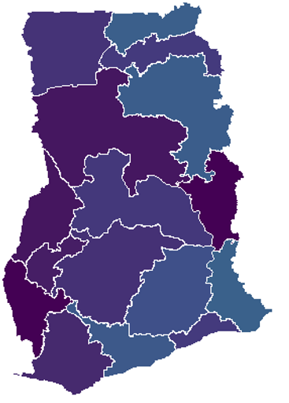
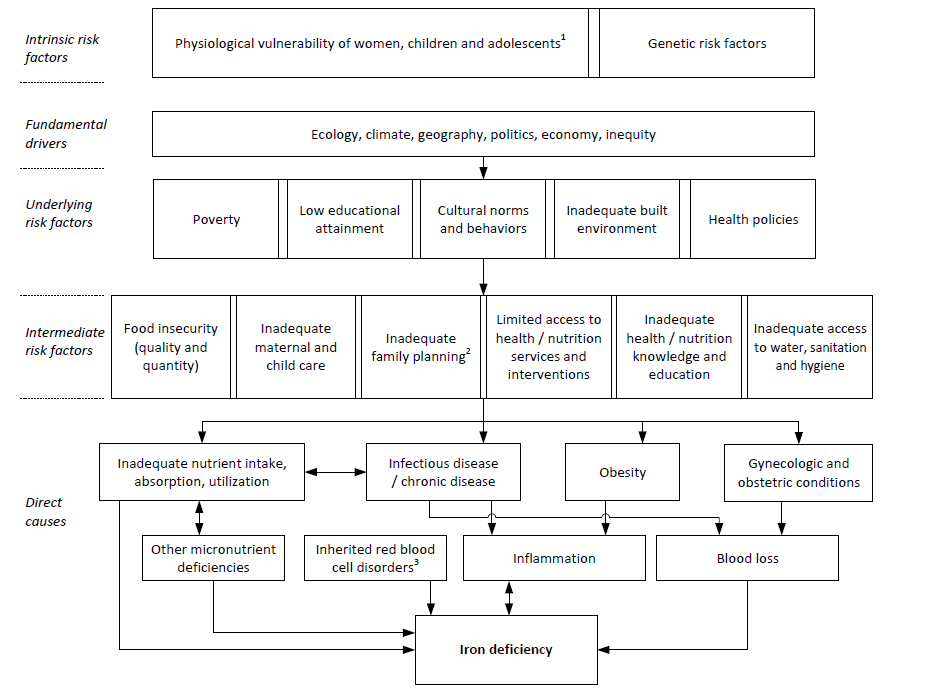
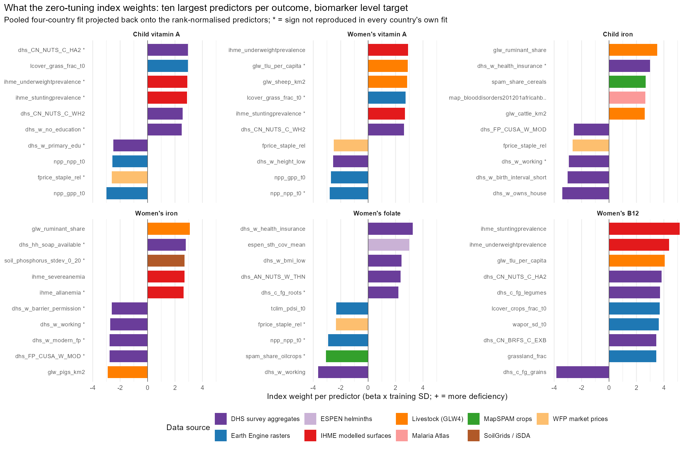

```{r setup}
# Rendering notes: pandoc's PowerPoint writer puts a table or figure on a slide
# of its own and moves any text that follows it to an untitled continuation
# slide, so every table slide here carries its interpretation in the speaker
# notes and in the title. The template's body font is large; bullets are kept
# short and titles to one line. Every number is read from results tables at
# render time (protocol v2, re-run 2026-09-04 08:17).
suppressPackageStartupMessages({library(dplyr); library(knitr); library(ggplot2)})
root <- tryCatch(here::here(), error = function(e) normalizePath(file.path(getwd(), "..", "..")))
P2 <- file.path(root, "results", "tables", "protocol_v2")
rd <- function(...) { f <- file.path(...); if (file.exists(f)) read.csv(f, stringsAsFactors = FALSE, check.names = FALSE) else NULL }
kb <- function(d, digits = 3, ...) knitr::kable(d, format = "pipe", digits = digits, row.names = FALSE, ...)
df <- function(...) data.frame(..., check.names = FALSE, stringsAsFactors = FALSE)
MD <- rd(root, "data", "covariates", "harmonized", "predictors_admin2_shared_metadata.csv")
BM <- rd(P2, "benchmarks_v2_summary.csv")
arm_label <- c(domain_index = "Zero-tuning domain index", spatial_plus_domain = "Spatial smoother + covariates", spatial = "Spatial smoother only",
               domain_enet = "Elastic net, domain PCs", raw_enet = "Elastic net, all 451 columns", region_mean_jk = "Survey: jackknifed regional mean", null_train_mean = "Null: training mean")
```

## Why this project

:::: {.columns}
::: {.column width="55%"}
- Biomarker surveys are rare and costly; programmes need timely intelligence on vitamin and mineral deficiencies (VMD).
- We predict VMD (iron, vitamin A, folate, B12, zinc) from proxies available across sub-Saharan Africa: four biomarker surveys linked to 451 district-level indicators.
:::
::: {.column width="45%"}
{width="4.2in"}
:::
::::

::: {.notes}
Photo credit: Latter-day Saint Charities. GMS 2017 collaborators: University of Ghana, GroundWork, University of Wisconsin-Madison, KEMRI-Wellcome Trust; with UNICEF and Global Affairs Canada.
:::

## What changed since the January deck

- A methods audit found the earlier headline numbers rested on evaluation artefacts: one unreplicated fold draw, a self-inclusive baseline, a dropped country.
- Every result here comes from the corrected protocol: replicated folds, information-matched baselines, permutation nulls, three separately scored questions.
- The estimator of record is a zero-tuning index over domain principal components; the SuperLearner ensemble is kept as a comparison and never beats it.

::: {.notes}
The audit and every corrected figure are documented in docs/findings; TWO_READINGS_2026-09f.md is the current summary and SANDBOX_LOG_2026-09.md records every experiment.
:::

## Goals

:::: {.columns}
::: {.column width="62%"}
- Sub-national deficiency estimates from proxies, validated against biomarker surveys.
- Identify the units at greatest risk; say which product survives validation, a ranking or a level.
- Say what a country without a survey can expect, and what it must measure.
:::
::: {.column width="38%"}
{width="2.1in"}
:::
::::

## Nationally representative survey data

```{r surveys}
kb(df(Survey = c("Ghana 2017 (GMS)", "Sierra Leone 2013", "Malawi 2015-16 (DHS-linked)", "The Gambia 2018 (MICS-linked)"),
  Fieldwork = c("Apr-Jun 2017", "Nov-Dec 2013", "Dec 2015-Feb 2016", "Jan-Apr 2018"),
  `Districts / clusters` = c("75 / 90", "14 / 60", "27 (87 TAs) / 105", "30 / 70"),
  Outcomes = c("iron, vitamin A, folate, B12", "iron, vitamin A, folate, B12", "iron, vitamin A, folate, B12, zinc", "iron, vitamin A")), digits = 0)
```

::: {.notes}
Four population-based surveys with biomarkers: 24 country-outcome cells, 146 districts on a common administrative rung, 323 survey clusters, all with GPS. Fieldwork dates were recovered for every cluster this month (Sierra Leone reconstructed from date of birth plus age in days); they matter because ferritin, retinol and food prices are seasonal. Three surveys ran in the dry season, Malawi in the lean season.
:::

## VMD outcomes modelled

```{r outcomes}
kb(df(Outcome = c("Iron status", "Vitamin A status", "Folate", "Vitamin B12", "Zinc"),
  Population = c("Children 6-59 mo; women 15-49 y", "Children 6-59 mo; women 15-49 y", "Women 15-49 y", "Women 15-49 y", "Children; women"),
  Countries = c("All four", "All four", "Ghana, Sierra Leone, Malawi", "Ghana, Sierra Leone, Malawi", "Malawi only"),
  Biomarker = c("Serum ferritin, BRINDA-adjusted", "Retinol-binding protein, BRINDA-adjusted", "Serum folate", "Serum B12", "Serum zinc"),
  `Uniform cutoff` = c("< 12 / < 15 ug/L", "< 0.70 umol/L", "< 10 nmol/L", "< 150 pmol/L", "IZiNCG, by time of draw")), digits = 0)
```

::: {.notes}
Two targets per cell: the deficiency prevalence, and the district mean of the negated log biomarker level (higher = worse), which carries more signal than the dichotomy and is reported alongside it. Iodine (The Gambia, Sierra Leone) is analysed within country only, on its own slide: a one- or two-country outcome has no cross-border test.
:::

## Conceptual framework for iron deficiency

{width="8.6in"}

::: {.notes}
Adapted from Hess et al., Ann N Y Acad Sci 2023. The framework is unchanged; what the data can and cannot see of it is on the "what travels" slides.
:::

## Data merging process

- Clean and merge the national micronutrient surveys; one uniform outcome definition per nutrient across countries.
- Link gridded layers to districts as zonal means, and now to survey clusters as buffer means.
- Aggregate DHS and MICS indicators to Admin-2.
- Rank-normalise every predictor within country before pooling, so cross-country level offsets cannot pose as signal.
- Collapse the vocabulary to principal components within each of 21 domains; nothing is selected on the outcome.

## Predictor vocabulary by source

```{r sources}
if (!is.null(MD)) {
  s <- MD$source; s <- dplyr::case_when(grepl("^DHS", s) ~ "DHS / MICS indicators", grepl("AlphaEarth", s) ~ "AlphaEarth satellite embedding", grepl("SoilGrids", s) ~ "SoilGrids / iSDA soil", grepl("^GEE", s) ~ "Earth Engine climate, land, built environment",
    grepl("IHME", s) ~ "IHME modelled surfaces", grepl("Malaria Atlas", s) ~ "Malaria Atlas Project", grepl("MapSPAM", s) ~ "MapSPAM crops", grepl("Koppen", s) ~ "Koppen / agro-ecological zones",
    grepl("WFP", s) ~ "WFP market prices", grepl("FAOSTAT", s) ~ "FAOSTAT (national)", TRUE ~ "Other (WorldPop, GHS, RWI, HFID, GFDx)")
  kb(as.data.frame(sort(table(Source = s), decreasing = TRUE)) |> rename(Predictors = Freq), digits = 0)
}
```

::: {.notes}
451 predictors in total. The January deck listed LSMS (275) and FluNet (3) predictors; both are on disk but did not survive the all-country harmonisation, and are candidates to add back (see the "no longer in the pipeline" slide).
:::

## Domains of data covered

```{r domains-table}
if (!is.null(MD)) {
  d <- as.data.frame(sort(table(MD$domain), decreasing = TRUE), stringsAsFactors = FALSE); names(d) <- c("Domain", "n"); d$Domain <- as.character(d$Domain)
  d <- d[d$n >= 2, ]   # the one-column "Malaria" domain is folded into the note
  half <- ceiling(nrow(d) / 2); pad <- function(x, k) c(x, rep("", k - length(x)))
  kb(df(Domain = d$Domain[1:half], Columns = d$n[1:half], `Domain ` = pad(d$Domain[(half + 1):nrow(d)], half), `Columns ` = pad(as.character(d$n[(half + 1):nrow(d)]), half)), digits = 0)
}
```

::: {.notes}
Twenty-one domains, column counts in brackets. The satellite embedding was filed under agriculture until this month and now has a domain of its own.
:::

## Prediction approach, then and now

:::: {.columns}
::: {.column width="50%"}
**January: spatial ensemble learning**

- SuperLearner library, weighted by cross-validated performance.
- Prescreening from thousands of predictors to 10-100 per model.
- Importance by change in MSE.
:::
::: {.column width="50%"}
**Now: the corrected protocol**

- Zero-tuning index: domain PCs weighted by their training-fold rank correlation with the outcome.
- SuperLearner kept as a comparison; never beats the index at 14-87 districts.
:::
::::

::: {.notes}
Capacity is a liability at these sample sizes: the index beats the penalised fit over all 451 columns by up to 0.38 and beats a SuperLearner that contains it under four meta-learner losses (SL-01 to SL-04). The ensemble was also fitted without survey weights or region-blocked folds until this month; both are fixed.
:::

## Three questions, three estimands

```{r estimands}
kb(df(Estimand = c("A. In-fill", "B. Extrapolation", "C. Transport"),
  Question = c("Unsurveyed district in a surveyed region", "Whole unsurveyed region", "Country with no biomarker survey"),
  Folds = c("5-fold by district, 10 draws", "Leave-one-region-out", "Leave-one-country-out"),
  `Matched baseline` = c("Jackknifed regional mean; spatial smoother", "Spatial smoother", "Country-block permutation null")), digits = 0)
```

::: {.notes}
The earlier leaderboard scored transport-style models against an in-fill baseline that read the held-out district's own respondents; that comparison is withdrawn. Counts of positive cells have a fat null when a country's outcomes are correlated (no transport at all still yields 15-16 of 22 positive cells five percent of the time), so the mean rank correlation is the statistic compared with its null.
:::

## A. In-fill: covariates beat the honest baseline

```{r infill}
if (!is.null(BM)) {
  d <- BM |> filter(estimand == "infill", arm %in% names(arm_label)) |> select(target, arm, mean_spearman) |> tidyr::pivot_wider(names_from = target, values_from = mean_spearman) |>
    mutate(Model = arm_label[arm]) |> arrange(desc(level)) |> select(Model, `Biomarker level` = level, Prevalence = prev)
  kb(d)
}
```

::: {.notes}
Mean Spearman over 24 country-outcome cells. Within a surveyed country a covariate-free spatial smoother delivers almost everything the covariates do: the two are within 0.01 on the level target, and covariates fitted to the smoother's residuals add a median of zero. Against the survey's own regional averages made information-symmetric by jackknife, the index is better in 15 of 18 cells. Withdrawn: the "median r 0.058" within-country negative (one unreplicated fold draw) and the 0.516 self-inclusive baseline.
:::

## B. Extrapolation to an unsurveyed region

```{r region}
if (!is.null(BM)) {
  d <- BM |> filter(estimand == "region", arm %in% names(arm_label)) |> select(target, arm, mean_spearman) |> tidyr::pivot_wider(names_from = target, values_from = mean_spearman) |>
    mutate(Model = arm_label[arm]) |> arrange(desc(level)) |> select(Model, `Biomarker level` = level, Prevalence = prev)
  kb(d)
}
```

::: {.notes}
Leaving out a whole region is where a smoother must extrapolate past the edge of its data. The index and the smoother stay close; the null training mean collapses. Ghana (16 regions) and Malawi (27 districts) are the countries where this estimand is well determined; The Gambia (6) and Sierra Leone (4) give one number per region.
:::

## C. Transport: rankings cross borders, levels do not

```{r transport}
a1 <- rd(P2, "admin1_transport.csv"); cs1 <- rd(P2, "climate_soil_admin1.csv"); nd <- rd(P2, "nested_domain_selection.csv"); nc <- rd(P2, "transport_null_calibration.csv")
get <- function(x) if (length(x) && is.finite(x)) x else NA_real_
mrow <- function(x, ...) if (!is.null(x)) get(mean(x$spearman[...], na.rm = TRUE)) else NA_real_
kb(df(Tier = c("District (Admin-2)", "Regional (Admin-1)"),
  `Full index, level` = c(get(BM$mean_spearman[BM$estimand == "country" & BM$arm == "domain_index" & BM$target == "level"]), mrow(a1, a1$arm == "domain_index" & a1$target == "level")),
  `Full index, prev.` = c(get(BM$mean_spearman[BM$estimand == "country" & BM$arm == "domain_index" & BM$target == "prev"]), mrow(a1, a1$arm == "domain_index" & a1$target == "prev")),
  `Climate + soil, level` = c(mrow(nd, nd$arm == "fixed_cs" & nd$target == "level"), mrow(cs1, cs1$set == "climate_soil" & cs1$target == "level")),
  `Climate + soil, prev.` = c(mrow(nd, nd$arm == "fixed_cs" & nd$target == "prev"), mrow(cs1, cs1$set == "climate_soil" & cs1$target == "prev")),
  `Null 95th pct` = c(if (!is.null(nc)) get(nc$null_mean_q95[nc$tier == "admin2"]) else NA, if (!is.null(nc)) get(nc$null_mean_q95[nc$tier == "admin1"]) else NA)), digits = 2)
```

::: {.notes}
Mean rank correlation in a country never used in training, over 22 cells. The climate + soil index is positive in all 22 at district level and 20 of 22 at regional level; the full index in 17 of 22 at both on the concentration (15 and 17 on prevalence). Since RR-10 (2026-09-09) the DHS-derived predictors are cluster-level BYM2 estimates at every district, which cost the full index 0.01 at district level and changed nothing in-country. Absolute levels do not transport: anchoring to the country's own national value halves the level error, anchoring to a published external estimate triples it. Correction to earlier decks: a regional figure of 0.50-0.56 over "12 of 12" cells rested on three countries, because a spelling mismatch in the population file dropped Sierra Leone from every population-joined run; it is withdrawn.
:::

## Where the index's weights come from: nothing beats it in-country, decorrelation helps across borders

```{r weight-sources}
ws <- rd(P2, "weight_sources_summary.csv")
ws_label <- c(domain_index = "Production index (pooled rank correlation)", index_soft1 = "Soft-thresholded weights, |z| < 1 to zero",
              index_soft2 = "Soft-thresholded, |z| < 2 to zero", index_meta = "Replication-weighted (meta-analysis over blocks)",
              index_meta_agree = "Replication-weighted, sign must agree", index_decor = "Decorrelated across domains, then weighted",
              ridge_min = "Ridge, penalty by inner CV", ridge_nested = "Ridge, penalty by nested block CV on rank",
              domain_enet = "Elastic net, lambda.min (the deck's comparator)", enet_1se = "Elastic net, lambda.1se",
              enet_nested = "Elastic net, nested block CV on rank", lasso_min = "Lasso, lambda.min", lasso_1se = "Lasso, lambda.1se",
              lasso_nested = "Lasso, nested block CV on rank", ridge_nested_1se = "Ridge, nested rank CV, one-SE rule",
              enet_nested_1se = "Elastic net, nested rank CV, one-SE rule", lasso_nested_1se = "Lasso, nested rank CV, one-SE rule",
              sparse5 = "Sparse: top 5 predictors, equal weights", sparse10 = "Sparse: top 10, equal weights",
              sparse20 = "Sparse: top 20, equal weights", sparse10w = "Sparse: top 10, index weights")
if (!is.null(ws)) {
  d <- ws |> filter(arm %in% names(ws_label)) |> mutate(k = paste(estimand, target)) |> select(arm, k, mean_spearman) |>
    tidyr::pivot_wider(names_from = k, values_from = mean_spearman) |> mutate(arm = factor(arm, levels = names(ws_label))) |> arrange(arm) |>
    transmute(Weights = ws_label[as.character(arm)], `In-fill level` = `infill level`, `In-fill prev.` = `infill prev`,
              `Region level` = `region level`, `Region prev.` = `region prev`, `Transport level` = `country level`, `Transport prev.` = `country prev`)
  kb(d, digits = 2)
}
```

::: {.notes}
Mean Spearman over the scored cells (18 in-fill and region, 22 transport), the same domain axes, folds and targets for every row: five replicated 5-fold draws in-fill, exhaustive leave-one-region-out, leave-one-country-out. The production index weights each axis by its pooled training-fold rank correlation, which is the infinite-penalty limit of a ridge regression on the axes; the other rows are other points of that family (ridge, elastic net, lasso; penalty by inner CV at lambda.min or lambda.1se, by nested block CV on the rank metric, or that with a one-SE rule) and three other sources of evidence for the weights (soft thresholding, meta-analytic replication across countries, decorrelation across domains), plus the sparse composites. Reading (RR-10 set, cluster-model DHS columns): in-country nothing beats the index and two arms tie it (soft threshold at |z| < 1, decorrelated); every joint fit loses 0.05 (ridge) to 0.06 (elastic net, lasso) and lambda.1se collapses to the null model. Across borders the decorrelated index (+0.026, better in 11 of 22) and the twenty-predictor composite (+0.028, 12 of 22) gain and did so on the RR-09 set too; the soft threshold's RR-09 gain (+0.024, 18 of 22) vanished once the survey columns were smoothed, so it was a property of noisy inputs, not of the estimator. Both survivors were chosen among 21 arms on these 22 cells and are candidates to pre-register for the next country, not a new estimator of record. Replication weighting is only defined across borders (its in-country blocks are regions of five to eight districts). Paired differences by cell: results/tables/protocol_v2/weight_sources_paired.csv; full reading: SANDBOX_LOG_2026-09.md, WS-01 / WS-02.
:::

## What the index weights, by outcome

{width="100%"}

::: {.notes}
The zero-tuning index is linear in the rank-normalised predictors, so its axis weights project back exactly onto the 454 columns (beta per unit rank-normal score; script 57, results/tables/protocol_v2/index_importance_*.csv; figure from script 58). Shown: the ten largest |beta| in the pooled four-country fit on the biomarker level, the fit that would be deployed to a fifth country; bar colour is the predictor's data source; a star marks a predictor whose sign is not reproduced in every country's own independent fit. Shares of the index's variance are exact and small per predictor (1 to 2 percent each: the index spreads its weight); by domain, the satellite embedding, climate and soil carry 30 to 48 percent depending on the outcome, matching the leave-one-domain-out ablation; since DS-01 (cluster-model DHS estimates) the survey aggregates take 0.34 of the index's variance, up from 0.24. The prevalence-target version is results/figures/protocol_v2/index_importance_top10_prev.png.
:::

## What the index weights, across outcomes

```{r importance-patterns}
ip <- rd(P2, "index_importance_patterns.csv")
if (!is.null(ip)) {
  d <- ip |> filter(target == "level", outcomes_in_top20 >= 3) |> arrange(desc(outcomes_in_top20), mean_rank) |> head(12) |>
    transmute(Predictor = column, Domain = domain, `Outcomes (top 20)` = outcomes_in_top20, Signs = signs, `Mean rank` = mean_rank)
  kb(d, digits = 1)
}
```

::: {.notes}
Predictors in the pooled top 20 of three or more of the six outcomes on the level target, with the sign in each. The common pattern is one gradient: districts that are drier and grassier, less productive (lower NPP and GPP), more pastoral (ruminant share, tropical livestock units per head), poorer (less house ownership, fewer women working, less schooling) and more stunted score high on every deficiency; vegetation productivity and market and schooling proxies score low. Livestock density carrying a positive sign for iron and B12 is ecological, not dietary: pastoral zones are the poor, dry zones in these four countries. Outcome-specific signals sit below that gradient: haemoglobin C allele frequency and cattle for iron, modelled anaemia surfaces and malaria for women's iron, helminth coverage and drought index for folate, elevation and coast distance for B12.
:::

## A twenty-predictor composite transports as well as the full index

```{r sparse}
ws <- rd(P2, "weight_sources_summary.csv")
if (!is.null(ws)) {
  lab <- c(domain_index = "Full index (all 454 columns)", sparse20 = "Top 20 predictors, equal weights", sparse10 = "Top 10, equal weights", sparse5 = "Top 5, equal weights")
  d <- ws |> filter(arm %in% names(lab)) |> mutate(k = paste(estimand, target)) |> select(arm, k, mean_spearman) |>
    tidyr::pivot_wider(names_from = k, values_from = mean_spearman) |> mutate(arm = factor(arm, levels = names(lab))) |> arrange(arm) |>
    transmute(Model = lab[as.character(arm)], `In-fill level` = `infill level`, `In-fill prev.` = `infill prev`, `Region level` = `region level`,
              `Region prev.` = `region prev`, `Transport level` = `country level`, `Transport prev.` = `country prev`)
  kb(d, digits = 2)
}
```

::: {.notes}
Mean Spearman over the scored cells (18 in-fill and region, 22 transport), same folds as every other arm. Inside each training fold the index's weights are projected back onto the predictors, the m columns with the largest |weight| are kept, and they are summed with equal weights and the sign of the weight (Dawes' improper linear model), then rescaled like the index; nothing is chosen on held-out districts. Twenty predictors lose 0.02 in-fill and 0.04 under region extrapolation on the level, and beat the full index across borders by 0.03 (12 of 22 cells, positive in 18 of 22 against 17); on the RR-09 set the figures were -0.04, -0.07 and +0.02. Five is too few everywhere; weighting the ten by their index weights instead of equally changes nothing. The composite is a transport and communication tool, not an in-country one: a ministry can compute it from twenty public layers.
:::

## The child iron composite: twenty predictors, equal weights

```{r sparse-members}
it <- rd(P2, "index_importance_top.csv"); md <- rd(file.path(root, "data", "covariates", "harmonized"), "predictors_admin2_shared_metadata.csv")
if (!is.null(it) && !is.null(md)) {
  d <- it |> filter(outcome == "child_iron", target == "level", rank <= 20) |> arrange(rank) |> left_join(md[, c("column", "source")], by = "column") |>
    transmute(rank, p = paste0(column, " (", ifelse(beta > 0, "+", "-"), ")"), src = sub(" [(].*$", "", source))
  kb(data.frame(Predictor = d$p[1:10], Source = d$src[1:10], `Predictor ` = d$p[11:20], `Source ` = d$src[11:20], check.names = FALSE), digits = 0)
}
```

::: {.notes}
The twenty columns the four-country fit would deploy for child iron, in order of weight, with the sign of their contribution (+ = more deficiency). Thirteen of the twenty have the same sign in every country's own independent fit (all twenty did before the DHS columns were re-estimated in DS-01). In the benchmark the membership is re-chosen inside each training fold; this is the version fitted on all four countries. The other five outcomes' composites are in results/tables/protocol_v2/index_importance_top.csv.
:::

## Ghana: survey versus held-out prediction

```{r ghana-maps, fig.width=11, fig.height=5.6, dpi=130}
ok <- FALSE
try({
  suppressPackageStartupMessages(library(sf))
  source(file.path(root, "R", "protocol_v2.R"))
  TG <- read.csv(file.path(P2, "targets_v2.csv"), stringsAsFactors = FALSE)
  S  <- read.csv(file.path(root, "data", "covariates", "harmonized", "predictors_admin2_shared.csv"), check.names = FALSE)
  PREDS <- intersect(MD$column, names(S)); domain_of <- stats::setNames(MD$domain, MD$column)
  B <- readRDS(file.path(root, "dashboard", "data", "admin2_boundaries.rds"))[["ghana"]]
  maps <- list()
  for (on in c("child_vitA", "women_iron")) {
    t <- TG[TG$country == "Ghana" & TG$outcome == on & is.finite(TG$y_prev) & is.finite(TG$n_eff), ]
    m <- dplyr::inner_join(t, S[S$country == "Ghana", c("Admin1", "Admin2", PREDS)], by = c("Admin1", "Admin2"))
    Xr <- prep_predictors_v2(as.matrix(m[, PREDS])); Y <- .v2_logit(m$y_prev); aux <- list(Admin1 = m$Admin1, y_nat = Y)
    pred <- matrix(NA_real_, nrow(m), 10)
    for (r in 1:10) { folds <- make_folds_v2("kfold_district", nrow(m), k = 5, rep_id = r)
      for (f in unique(folds)) { te <- which(folds == f); tr <- which(folds != f); D <- domain_representation_v2(Xr, domain_of, sign_rows = tr)
        pred[te, r] <- ARMS_V2[["domain_index"]](tr, te, Y, NULL, D, aux) } }
    m$pred <- .v2_expit(rowMeans(pred, na.rm = TRUE)); rho <- cor(m$y_prev, m$pred, method = "spearman")
    g <- dplyr::left_join(B, m[, c("Admin1", "Admin2", "y_prev", "pred")], by = c("Admin1", "Admin2"))
    lab <- if (on == "child_vitA") "Child vitamin A deficiency" else "Women's iron deficiency"
    p1 <- "Survey 2017"; p2 <- sprintf("Held-out index prediction (rho = %.2f)", rho)
    long <- rbind(data.frame(g[, c("Admin1", "Admin2")], value = g$y_prev, panel = p1), data.frame(g[, c("Admin1", "Admin2")], value = g$pred, panel = p2))
    long$panel <- factor(long$panel, levels = c(p1, p2))
    maps[[on]] <- ggplot(sf::st_as_sf(long)) + geom_sf(aes(fill = value), colour = "white", linewidth = 0.15) + facet_wrap(~ panel) +
      scale_fill_viridis_c(labels = scales::percent, na.value = "grey92", name = NULL) + labs(title = lab) + theme_void(base_size = 12) + theme(legend.position = "right", plot.title = element_text(face = "bold"))
  }
  print(patchwork::wrap_plots(maps, ncol = 2)); ok <- TRUE
}, silent = TRUE)
if (!ok) cat("Maps could not be rendered in this session; see the dashboard.")
```

::: {.notes}
Districts with survey data only (grey: no survey clusters). Each district's prediction is made with that district held out (5-fold, averaged over ten draws). The model orders districts; the survey's own estimate at a single-cluster district is itself noisy, which is why the ceiling slide matters.
:::

## Targeting: what the ranking is worth

```{r burden}
nt <- rd(P2, "nce_targeting_summary.csv")
if (!is.null(nt)) { d <- nt |> filter(estimand == "infill") |> mutate(Model = c(oracle_ceiling = "Oracle: true worst fifth", arm_label)[arm]) |>
  select(Model, `Burden in worst-ranked fifth` = mean_capture, `Lift vs random` = mean_lift, `Cells with lift > 1` = cells_lift_gt1); kb(d, digits = 2) }
```

::: {.notes}
Directing effort to the fifth of districts the model ranks worst reaches about 24 percent of national deficiency burden, against 19 percent for jackknifed regional survey averages and 20 percent at random. The margin is small per cell (better in 8-11 of 18) and concentrates where regions hold three to five districts. Under transport, burden captured is at chance (lift 1.01): the transported product is an ordering, not a targeting gain.
:::

## What travels: two remotely sensed domains

```{r ablation}
da <- rd(P2, "domain_ablation_loco_summary.csv")
if (!is.null(da)) { d <- da |> filter(target == "level") |> arrange(desc(delta_drop)) |> transmute(Domain = domain, `Loss when dropped` = round(delta_drop, 3), `Domain alone` = round(only, 3)); kb(head(d, 7)) }
```

::: {.notes}
Leave-one-country-out ablation, biomarker level, 22 cells. Climate, soil, the modelled nutrition surfaces, agriculture and livestock density are the load-bearing domains (RR-10; the survey-year malaria block sat among them until the DHS columns were re-estimated in DS-01) (+0.009 to +0.024 each when dropped), with the new livestock layer just behind (+0.007); the survey-derived domains cost nothing to remove, or help. A fixed climate + soil index transports better than the full vocabulary at both tiers (0.37 vs 0.27 at district level; 0.46 vs 0.31 regional). It was found on the same four countries it is scored on, so it enters the next countries as a pre-registered prediction, not a result.
:::

## Which data sources carry transport

```{r sources-ablation}
sa <- rd(P2, "source_ablation_loco_summary.csv")
if (!is.null(sa)) { d <- sa |> filter(target == "level", n_cols >= 4) |> arrange(desc(delta_drop)) |> transmute(Source = source, Columns = n_cols, `Loss when dropped` = round(delta_drop, 3), `Source alone` = round(only, 3)); kb(bind_rows(head(d, 6), tail(d, 1))) } else cat("Source ablation table not available: run scripts/protocol_v2/43_source_ablation_loco.R.")
```

::: {.notes}
The January deck's "which data sources contribute" question, redone under the protocol: drop every column from a source, rebuild the domain PCs, score transport to a held-out country. Soil and Earth Engine layers carry it; dropping the 138 DHS/MICS columns IMPROVES transport (0.27 to 0.33 on the level, 0.18 to 0.24 on prevalence). The January version scored one country's in-sample change in MSE; this one scores transport.
:::

## Each added training country still buys accuracy

```{r curve, fig.width=10, fig.height=4.6, dpi=130}
tc <- rd(P2, "training_country_curve.csv"); tcs <- rd(P2, "training_curve_climate_soil.csv")
if (!is.null(tc) && !is.null(tcs)) {
  d <- bind_rows(tc |> filter(arm == "domain_index") |> mutate(set = "Full vocabulary") |> select(target, set, n_train_countries, spearman),
                 tcs |> filter(set == "climate_soil") |> mutate(set = "Climate + soil") |> select(target, set, n_train_countries, spearman)) |>
    group_by(target, set, n_train_countries) |> summarise(mean_rho = mean(spearman, na.rm = TRUE), lo = quantile(spearman, 0.25, na.rm = TRUE), hi = quantile(spearman, 0.75, na.rm = TRUE), .groups = "drop") |>
    mutate(target = ifelse(target == "level", "Biomarker level", "Prevalence"))
  ggplot(d, aes(n_train_countries, mean_rho, colour = set)) + geom_line(linewidth = 1.1) + geom_point(size = 3) + geom_linerange(aes(ymin = lo, ymax = hi), alpha = 0.45) +
    facet_wrap(~ target) + scale_x_continuous(breaks = 1:3) + labs(x = "Training countries", y = "Transported Spearman (mean, IQR over fits)", colour = NULL) + theme_minimal(base_size = 15) + theme(legend.position = "bottom")
}
```

::: {.notes}
Every subset of training countries, scored on each held-out country. About +0.05 per added country for the full vocabulary, +0.03 to +0.04 for climate + soil from a much higher start; the two-domain index is positive in 98 percent of single-country fits.
:::

## Not an urban-rural map

```{r urban}
ur <- rd(P2, "urbanicity_conditioning.csv")
if (!is.null(ur)) { d <- ur |> filter(target == "level") |> group_by(Tier = ifelse(tier == "admin1", "Regional", "District")) |>
  summarise(`Climate + soil index` = mean(rho_cs, na.rm = TRUE), `Partialling out urbanicity` = mean(partial_cs, na.rm = TRUE), `Urbanicity alone` = mean(rho_urb_only, na.rm = TRUE), `Index vs urbanicity` = median(cor_cs_urb, na.rm = TRUE), .groups = "drop"); kb(d, digits = 2) }
```

::: {.notes}
The replicated associations (legumes, cattle, soil chemistry, night-time temperature, all toward more deficiency) describe where subsistence agriculture is, so the rival explanation was an urbanicity map with extra steps. Urbanicity composite: night lights, population density, built surface, urban land cover, travel time to healthcare. Partialling it out moves the transported correlation by less than 0.02, and urbanicity alone does not transport.
:::

## Indicators that replicate in every country

```{r signal}
f <- file.path(root, "results", "tables", "signal_probes", "p4_admin1_continuous_predictors.csv")
if (file.exists(f)) { d <- read.csv(f, stringsAsFactors = FALSE)
  d <- d[d$sign_agree >= d$k_countries & d$k_countries >= 3 & d$group %in% c("child_vitA", "child_iron", "women_iron", "women_vitA"), ]
  d <- do.call(rbind, lapply(split(d, d$group), function(g) head(g[order(-abs(g$meta_z)), ], 2)))
  lab <- c(child_vitA = "Child vitamin A", child_iron = "Child iron", women_iron = "Women's iron", women_vitA = "Women's vitamin A")
  kb(df(Outcome = lab[d$group], Indicator = d$predictor, `Pooled z` = round(d$meta_z, 1), Direction = ifelse(d$mu > 0, "more deficiency", "less deficiency"), Agree = paste0(d$sign_agree, "/", d$k_countries)), digits = 1) }
```

::: {.notes}
Legume cultivation and cattle ownership track MORE deficiency at district level, the reverse of the household-level dietary relationship: an ecological-fallacy signature. The replicated axis is rural subsistence agro-ecology, useful for deciding where to look, uninformative about what to change. No malaria burden indicator replicates; child wasting tracks women's vitamin A deficiency in all four countries. An earlier version of these slides had the signs inverted.
:::

## How much is attainable: the ceiling, corrected

```{r ceiling}
vc <- rd(P2, "variance_components_ceiling.csv")
if (!is.null(vc)) { d <- vc |> filter(rung == "admin2", target == "prev") |> group_by(Country = country) |>
  summarise(`Single-cluster districts` = scales::percent(mean(share_single_cluster), 1), `Split-half ceiling` = mean(ceiling_within_vc), `Honest ceiling` = mean(ceiling_vc), `Achieved, in-fill` = mean(achieved_spearman, na.rm = TRUE), .groups = "drop"); kb(d, digits = 2) }
```

::: {.notes}
A respondent-in-cluster-in-district-in-region variance model reproduces the split-half ceiling when the cluster is counted as geography, then removes it. One fifth of the published ceiling was cluster effect; the honest ceiling averages 0.44 on prevalence and the model already reaches it in five of 24 cells. Child zinc has no district geography at all: what looked like geography was the cluster, and afternoon blood draws lower serum zinc by 3.5-7 percent without explaining any district difference.
:::

## Survey design: district error, matched sample

```{r anchor}
ar <- rd(P2, "anchor_and_rank_summary.csv")
if (!is.null(ar)) { d <- ar |> filter(rank_from == "prev", set == "climate_soil", fraction %in% c(0.05, 0.15, 0.25, 0.4, 0.6)) |>
  mutate(design = c(A1_anchor_rank = "National anchor + ranking", A2_region_anchor_rank = "Regional anchors + ranking", B_district_survey = "District survey", C_regional_survey = "Regional survey")[design], fraction = scales::percent(fraction, 1)) |>
  select(fraction, design, mae) |> tidyr::pivot_wider(names_from = design, values_from = mae) |> rename(`Share of full sample` = fraction); kb(d, digits = 1) }
```

::: {.notes}
Median district error in percentage points, 22 cells. A national biomarker sample of about five percent of a full survey (50-70 respondents) plus the transported ranking gives district levels a district survey only matches at about 40 percent of the sample. It wins on level error only: a district survey of any size captures more burden, because burden sits in populous districts that surveys measure precisely. Fitted symmetrically on a reduced survey, the model's error degrades in step with the survey's (+3.36 vs +3.33 pp from full to 15 percent): it improves the ordering at any sample size, it does not reduce the sample a survey needs.
:::

## New data tried this month

```{r addons}
kb(df(Block = c("Food prices matched to fieldwork month (WFP)", "Temperature and rainfall matched to fieldwork window", "AlphaEarth embedding as its own domain"),
  `In-fill` = c("+0.005", "+0.001", "0.000"), `Transport` = c("+0.002", "+0.002", "+0.009"),
  Verdict = c("No gain; signs follow the urban gradient", "Strong associations, no fold improves", "Replicated signal, nothing beyond climate + soil")), digits = 0)
```

::: {.notes}
Scored under one harness with the same folds. The vocabulary is saturated: nothing added this month moves in-fill or transport by more than 0.01. Survey timing is a nuisance to adjust for, not a predictor: a covariate defined by when the survey happened cannot rank districts that have not been surveyed. Found in passing and fixed: the existing price columns used 2021 as The Gambia's survey year (fieldwork was January-April 2018), and the satellite embedding had been filed under agriculture; every table was re-run.
:::

## Fitting at the survey cluster, not the district

```{r cluster}
cv <- rd(root, "results", "tables", "cluster_level", "cluster_vs_district.csv")
if (!is.null(cv)) { d <- cv |> filter(set == "transportable", arm == "domain_index") |> group_by(Estimand = ifelse(estimand == "infill", "In-fill", "Region extrapolation"), Target = ifelse(target == "level", "Biomarker level", "Prevalence")) |>
  summarise(`Cluster-fitted, aggregated to districts` = mean(rho_agg, na.rm = TRUE), `District-fitted` = mean(rho_district_v2, na.rm = TRUE), .groups = "drop"); kb(d, digits = 2) }
```

::: {.notes}
323 clusters with GPS; covariates as 2 km (urban) / 5 km (rural) buffer means from rasters on disk; the same three estimands with folds cut by district and region. Cluster-fitted models trail district-fitted ones on every estimand and for transport (climate + soil at district level 0.24 vs 0.37). A precision-weighted index and empirical-Bayes shrinkage of cluster outcomes recover a third to a half of the gap, never all of it: on this vocabulary the 2-5 km covariates are not better predictors than district means. The cluster track is a sensitivity analysis until its vocabulary is matched layer for layer.
:::

## National-level track (BRINDA / VMNIS)

```{r national}
ne <- rd(root, "results", "tables", "national_estimates_all.csv")
if (!is.null(ne)) { d <- ne |> filter(model_type == "binary", outcome %in% c("child_vitA", "women_vitA", "child_iron", "women_iron")) |> group_by(Outcome = outcome) |>
  summarise(Countries = dplyr::n(), `Observed (mean)` = mean(obs_prev), `Predicted (mean)` = mean(pred_prev), `Mean abs. error (pp)` = 100 * mean(abs_diff), .groups = "drop"); kb(d, digits = 2) }
```

::: {.notes}
The January deck's national-level track (WHO VMNIS and BRINDA outcomes, FAOSTAT and policy predictors, 12-63 percent improvement over null) lives in a separate sub-pipeline last run in April 2026. It is not part of the current protocol and has not been re-audited; the table is its last output for the four survey countries. Worth re-running under the corrected protocol: it is the only track with time series and fortification policy indicators.
:::

## Risk classes: how often the model gets the WHO band right

```{r riskcat}
rc <- rd(P2, "risk_category_accuracy_summary.csv")
if (!is.null(rc)) { lab <- c(domain_index = "Zero-tuning index, in-fill", spatial_plus_domain = "Smoother + covariates, in-fill", spatial = "Spatial smoother, in-fill", region_mean_jk = "Jackknifed regional mean, in-fill",
    transport_anchored_full = "Transport, full index + national anchor", transport_anchored_climate_soil = "Transport, climate + soil + national anchor")
  d <- rc |> filter(scheme == "who_vitA", arm %in% names(lab)) |> mutate(Model = lab[arm]) |> arrange(estimand, desc(exact_admin2)) |>
    transmute(Model, `Exact, district` = scales::percent(exact_admin2, 1), `Within one, district` = scales::percent(within1_admin2, 1), `Exact, region` = scales::percent(exact_admin1, 1), `Within one, region` = scales::percent(within1_admin1, 1)); kb(d, digits = 0) }
```

::: {.notes}
Vitamin A, WHO 2009 public-health bands (under 2 percent none, 2-10 mild, 10-20 moderate, 20 or more severe), mean share of units over the vitamin A cells, out-of-fold predictions averaged over ten draws. The January deck's child vitamin A cell was 44 / 75 percent exact / within-one at Admin-2 for the full model and 31 / 49 for proxies only, from the old leaderboard. Transport rows use the held-out country's own national prevalence as the anchor (AR-01 design), the only honest way to put a transported ranking on the prevalence scale. For iron and the other outcomes only the 20 percent threshold has a WHO source; the two-class accuracies are in results/tables/protocol_v2/risk_category_accuracy_summary.csv (scheme who20).
:::

## LSMS and FluNet, added back and scored

```{r lsms}
li <- rd(P2, "addon_lsms_flunet_infill.csv")
if (!is.null(li)) { d <- li |> filter(country == "Ghana", target == "level", set %in% c("base", "plus", "addon_only")) |> group_by(outcome, set) |> summarise(rho = median(spearman, na.rm = TRUE), .groups = "drop") |>
    tidyr::pivot_wider(names_from = set, values_from = rho) |> transmute(Outcome = c(child_vitA = "Child vitamin A", women_vitA = "Women's vitamin A", child_iron = "Child iron", women_iron = "Women's iron", women_folate = "Women's folate", women_b12 = "Women's B12")[outcome], `Base vocabulary` = base, `Base + LSMS` = plus, `LSMS alone` = addon_only); kb(d, digits = 2) }
```

::: {.notes}
Ghana only, in-fill, biomarker level, median Spearman over ten draws. LSMS exists for Ghana alone (GLSS7): 134 region-level household expenditure and asset means, broadcast to districts through the 16-to-10 region crosswalk, so the block varies only across ten regions. It does not improve any Ghana cell beyond noise (level: within 0.02 of base in five of six, +0.02 for B12; prevalence: +0.05 for B12, otherwise no change) and cannot be scored across borders. FluNet reports for Ghana and Sierra Leone only and is a national weekly count, constant within a country; it was built (survey-year specimens, share positive, influenza A share) and contributes nothing by construction. Both are candidates only if collected sub-nationally in the next countries.
:::

## Individual-level models: survey variables versus proxies

```{r individual, fig.width=10, fig.height=4.6, dpi=130}
il <- rd(P2, "individual_level_models.csv")
if (!is.null(il) && nrow(il)) { lab <- c(child_vitA = "Child vitamin A", women_vitA = "Women's vitamin A", child_iron = "Child iron", women_iron = "Women's iron", women_folate = "Women's folate", women_b12 = "Women's B12")
  d <- il |> mutate(Outcome = lab[outcome], set = factor(c(survey_only = "Survey variables only", proxies_only = "District proxies only", both = "Both")[set], levels = c("Survey variables only", "District proxies only", "Both")))
  ggplot(d, aes(x = 100 * brier_skill, y = Outcome, colour = set)) + geom_vline(xintercept = 0, linetype = 2, colour = "grey50") + geom_point(size = 3, position = position_dodge(width = 0.5)) +
    facet_wrap(~ country, nrow = 1) + labs(x = "Brier skill over the national prevalence (%)", y = NULL, colour = NULL) + theme_minimal(base_size = 14) + theme(legend.position = "bottom")
} else cat("Individual-level table not yet available (scripts/protocol_v2/46_individual_level_models.R).")
```

::: {.notes}
Person-level SuperLearner (mean, elastic net, random forest; survey weights; inner folds blocked by district), outer 5-fold by district so no district's respondents are split across training and test. Survey variables: up to 80 respondent columns with 70 percent coverage after removing biomarkers, adjustments, ids, weights, dates and locations. Proxies: the district's domain principal components joined to each respondent. Under these folds person-level skill is small: over 19 cells the mean AUC is 0.51 for survey variables, 0.50 for proxies and 0.53 for both, with Brier skill of 0.01 to 0.02. The exception is iron: Ghana child iron (AUC 0.76, Brier skill 0.14) and Malawi child and women's iron (AUC 0.75-0.78, Brier skill 0.10-0.13), all from survey variables, with proxies adding nothing. Vitamin A, folate and B12 show no person-level skill anywhere. The January figure (Brier skill 20-60 percent) came from folds not blocked by district and a survey set that included biomarker-adjacent variables; neither survives here. Survey variables beat proxies in 8 of 19 cells and both together beat survey variables in 12 of 19. Malawi's cells use the clean respondent file and the survey's own outcome definitions (folate and B12 are not in that file). AUC and precision-recall gain are in results/tables/protocol_v2/individual_level_models.csv. This remains a sensitivity analysis: aggregating a person-level classifier biases area means.
:::

## Iodine, within country

```{r iodine}
io <- rd(P2, "iodine_in_country.csv")
if (!is.null(io)) { d <- io |> filter(analysis == "protocol") |> mutate(cell = paste0(ifelse(country == "Gambia", "Gambia ", "Sierra Leone "), ifelse(target == "p_low", "UIC < 100", "median UIC"), ", ", ifelse(estimand == "infill", "in-fill", "region")),
    Model = c(null_train_mean = "Null", region_mean_jk = "Jackknifed regional mean", spatial = "Spatial smoother", domain_index = "Zero-tuning index", spatial_plus_domain = "Smoother + covariates")[arm]) |>
    select(Model, cell, spearman) |> tidyr::pivot_wider(names_from = cell, values_from = spearman) |> mutate(across(-Model, ~ ifelse(is.finite(.x), sprintf("%.2f", .x), "-"))); kb(d, digits = 2) }
```

::: {.notes}
Urinary iodine is measured in The Gambia (continuous, 1,285 women, with household salt iodine in ppm) and in Sierra Leone (six WHO categories, 571 non-lactating women); it left the modelling outcomes because a one- or two-country outcome has no leave-one-country-out test. Targets: district prevalence of UIC below 100 micrograms per litre and, for The Gambia, the district median UIC. In-fill needs at least 15 districts, so it runs for The Gambia (30) only; leave-one-region-out runs in both. The descriptive that matters for a programme, whether district salt iodisation tracks district iodine status, is in results/tables/protocol_v2/iodine_in_country.csv (rows analysis = descriptive).
:::

## January analyses now outside the pipeline (1)

```{r dropped1}
kb(df(`January slide` = c("Individual-level proxy vs survey-only models (Brier skill, AUC, PR gain)", "National-level VMNIS / BRINDA predictions", "Iodine (Sierra Leone)", "Risk-category accuracy (none / mild / moderate / severe)"),
  Status = c("Sensitivity layer; re-run today under district-blocked folds", "Separate sub-pipeline, last run April 2026", "Re-run today within country (Gambia, Sierra Leone)", "Re-run today under the protocol, WHO bands"),
  `Where` = c("Slide: individual-level models", "Slide: national-level track; not re-audited", "Slide: iodine, within country", "Slide: risk classes")), digits = 0)
```

::: {.notes}
The individual-level SuperLearner remains a sensitivity analysis because shrinking a noisy individual classifier biases area means; it is retained and labelled in the dashboard.
:::

## January analyses now outside the pipeline (2)

```{r dropped2}
kb(df(`January slide` = c("LSMS (275) and FluNet (3) predictors", "Data-source importance by change in MSE", "Admin-1 women's iron maps, predicted vs survey", "Prescreened SuperLearner as the model"),
  Status = c("Re-added today: LSMS is Ghana-only and region-level, FluNet national; neither adds skill", "Replaced by domain ablation; source ablation added back", "Replaced by district maps with held-out predictions", "Kept as comparison; never beats the zero-tuning index"),
  `Where` = c("Slide: LSMS and FluNet", "Slide: which data sources carry transport", "Slide: Ghana maps", "Slide: prediction approach")), digits = 0)
```

## Conclusions

- Within a surveyed country, geography does most of the work: covariates beat the survey's own averages made honest, a smoother delivers almost as much.
- Across borders, rankings transport and levels do not: about 0.3 at both tiers, 0.37 and 0.46 from climate and soil alone.
- One national estimate puts levels on the ranking, matching a district survey eight times the sample on level error.
- The deliverable is a ranked district priority list plus a level calibration that needs one national number.

## Next steps and open questions

:::: {.columns}
::: {.column width="50%"}
**Next**

- Score the seven pre-registered predictions on the next countries.
- Re-run the national track under the corrected protocol.
- Model-assisted cluster allocation for survey design.
:::
::: {.column width="50%"}
**Open**

- What rank correlation is good enough to act on?
- Which national number is the cheapest honest anchor?
- Without new biomarker surveys, what benchmarks the models?
:::
::::

::: {.notes}
Sources: docs/findings/TWO_READINGS_2026-09f.md (current abstracts), SANDBOX_LOG_2026-09.md (every experiment), PREREGISTRATION_NEW_COUNTRIES_2026-09.md, CLUSTER_LEVEL_DESIGN_2026-09.md. Nothing in this deck is quoted from a table older than 4 September 2026.
:::
