```{r setup}
# MNF 2026 joint talk, VERSION 2 (27 September 2026). The current version,
# MNF15-talk-2026-09.qmd, is untouched; this file is the restructure proposed in
# docs/slides/MNF15-talk-outline-2026-09-27.md:
#   - 15 minutes, "plan for 13" (S. Hess, 18 Sep check-in), so about 1,470 spoken
#     words and 11 slides plus a two-step build of Sonja's framework
#   - problem, approach, three uses (with a survey / without one / the next survey),
#     limits, asks; the payoff is no longer at slide 13
#   - one accuracy scale (the dashboard's match score, 0 = guessing, 1 = perfect)
#   - the accuracy fixes of the 27 Sep critique (section 1A of the outline)
# Figures: scripts/policy_deck/25_mnf15_v2_ghana_heldout.R (per-district held-out
# predictions), 26_mnf15_v2_figures.R (results/figures/mnf15_v2/), 27_mnf15_v2_framework.py
# (Sonja's framework with coverage badges). Concept slides: MNF15-talk-2026-09-v2.concept.yaml.
# Render: bash scripts/render_deck.sh docs/slides/MNF15-talk-2026-09-v2.qmd --forum --no-label \
#         --text 18,15 --concept docs/slides/MNF15-talk-2026-09-v2.concept.yaml
# Speaker notes are the script: speaker, seconds, words, the text, then backup material.
suppressPackageStartupMessages({library(dplyr); library(knitr)})
root <- tryCatch(here::here(), error = function(e) normalizePath(file.path(getwd(), "..", "..")))
```

## A national survey measures regions. Programmes act on districts.

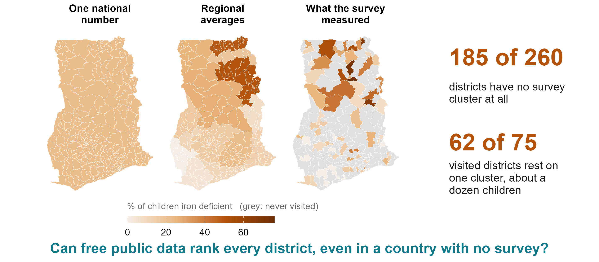{width="9.4in"}

::: {.notes}
SONJA, about 60 seconds (127 words).

You have just heard why national micronutrient surveys matter, so I won't repeat it. Our question is how to get more out of each one.

Suppose you had to choose ten districts in Ghana for an iron programme tomorrow. Ghana's 2017 survey did exactly what it was designed to do: a good national number and good regional numbers. But Ghana has 260 districts. The survey reached 75. The other 185 have no measurement of their own; today they get their region's average. And 62 of the 75 it reached rest on a single cluster, about a dozen children.

So we asked: can public data that already exist for every district, for free, rank them? And could the same model help a country with no survey at all?

Backup, if asked: The opening sentence assumes the survey talks come first; drop it if the order changes. 62 of 75 single-cluster districts, median 12.5 children tested in each (targets_v2.csv, Ghana child iron). Sonja's introduction slide is folded in here: her objective is the question at the foot of the slide.
:::

## We started from what causes deficiency

::: {.notes}
SONJA, about 15 seconds (29 words).

We did not start from satellites. We started from a workshop of nutritionists, epidemiologists and data scientists, and from what causes deficiency. This is our conceptual framework for iron.

Backup, if asked: Hess et al., Ann N Y Acad Sci 2023, adapted. Click to the next slide for the coverage badges.
:::

## We started from what causes deficiency, not from what data exist

::: {.notes}
SONJA, about 60 seconds (125 words).

Then we went box by box and asked: is there a public, district-level measure of this? Green means yes: climate and ecology from satellites; poverty, schooling, water and sanitation, and infant feeding from household surveys; malaria and worms from disease atlases. Amber means only a national figure or a modelled surface, such as health policy or inflammation. Grey means nothing public reaches it: cultural norms, absorption.

So the predictors are not a fishing expedition. They are the parts of this framework that public data happen to cover, and the model can only see those parts.

To learn from, we had four national biomarker surveys: The Gambia, Ghana, Sierra Leone and Malawi, 206 districts where blood was drawn. They exist because these teams collected them. Andrew.

Backup, if asked: The badges follow the 19 September coverage slide where it had the box. DRAFT calls for Sonja to confirm: genetic risk (Malaria Atlas sickle-cell and G6PD surfaces), built environment (built-up area, night lights, housing), family planning (DHS fertility and reproductive health), obesity (IHME overweight, DHS adult BMI), health and nutrition knowledge (amber: schooling yes, nutrition knowledge no), other micronutrient deficiencies (amber: modelled anaemia, national fortification).
:::

## Learn where blood was drawn, apply everywhere, test on what it never saw

::: {.notes}
ANDREW, about 70 seconds (152 words).

Thank you, Sonja. The method in one picture. On the left, the 206 districts where blood was drawn. In the middle, 575 public layers we assembled for every district in the four countries: climate and soil, crops and livestock, malaria, food prices, household surveys. None of it had to be bought.

The model learns which combination of layers tracks deficiency where we have blood, and applies it everywhere. We tried fourteen machine-learning methods, including random forests, boosting and ensembles. With 14 to 87 districts per country, none did meaningfully better than a simple weighted index with nothing tuned, so that is what we use.

Every number I show you comes from hiding data and predicting it: one district in five, a whole region, a whole country. And we compare against what a programme uses today, the regional average. The score runs from zero, guessing, to one, a perfect match with the survey.

Backup, if asked: 14 alternatives on identical folds, 1,304 fits; nothing beat the index by more than 0.03 on any estimand (SL-06). The index: rank every layer within its country, reduce each family of layers to principal components, weight each component by how well it tracked deficiency in the training districts, add up. The in-country fit uses the 383 layers that are open or public-survey; the cross-border fit uses the layers common to all four countries. The match score is the Spearman correlation between the model's district order and the survey's.
:::

## With a survey: all 260 of Ghana's districts ranked

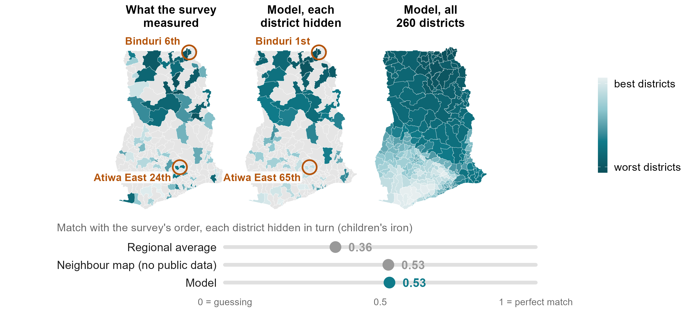{width="9.4in"}

::: {.notes}
ANDREW, about 65 seconds (139 words).

Ghana, children's iron. Left: what the survey measured in the 75 districts it reached. Middle: the model's prediction for each of those districts with that district's blood results hidden. Right: the model applied to all 260.

Take Binduri, in Upper East. The survey measured it 6th worst of 75. Its regional average puts it 12th. The model, which never saw Binduri's results, puts it first. And we are wrong in places: Atiwa East, which the survey put 24th, we put 65th.

Overall the model scores 0.53 here, against 0.36 for the regional average. But I want to be straight with you: a map built only from neighbouring districts, with no public data at all, also scores 0.53. Inside a surveyed country, geography does most of the work. So why bother? Because most countries have no survey to borrow from.

Backup, if asked: Ranks among the 75 surveyed districts on average iron status, 1 = worst; five-fold, ten draws, reproducing benchmarks_v2_cells.csv exactly (model 0.529, regional average 0.356, neighbour map 0.526). Per-district ranks: results/tables/policy_deck/v2_ghana_infill_child_iron_level.csv. Binduri rests on two survey clusters, Atiwa East on one, so the survey's own ranks are noisy too. On the share deficient rather than average status, the model ties the regional average for this outcome (0.50 against 0.50). Averaged over all 18 combinations scored inside a country: model 0.40, neighbour map 0.39, regional average 0.31.
:::

## Without any Ghanaian blood samples, the model ranks Ghana just as well

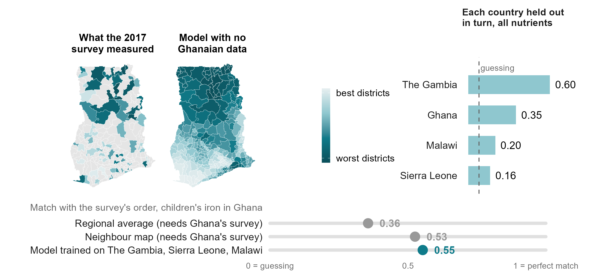{width="9.4in"}

::: {.notes}
ANDREW, about 70 seconds (152 words).

So here is the harder test, run where we can check the answer. We removed Ghana's survey entirely. The model learned only from The Gambia, Sierra Leone and Malawi, and never saw a Ghanaian blood sample. It still scores 0.55 for children's iron: as well as the neighbour map that needed Ghana's own survey.

Ghana's children's iron is one of our better cases, and I don't want to oversell it. Holding out each country in turn, averaged over nutrients, we get 0.60 for The Gambia, 0.35 for Ghana, 0.20 for Malawi and 0.16 for Sierra Leone, where guessing stays below 0.08. In practical terms: when the model puts a district in the worst third of a country it has never seen, it is right about half the time, against a third by guessing. That is a shortlist, not a measurement. But it is a shortlist for a country that today has nothing.

Backup, if asked: 0.554 reproduces the committed transport cell exactly (scripts/policy_deck/25_mnf15_v2_ghana_heldout.R). The right-hand map applies the same fit to all 260 districts; on the 75 surveyed ones it agrees with the scored fit at 0.998. Country means are over all 22 transported nutrient-country combinations (mean 0.30); the 95th percentile of the country-block null is 0.08. Worst-third calls land 52 per cent of the time against 33 by chance; of the five worst named, 62 per cent.
:::

## No survey at all? A first map, checked in six countries it never saw

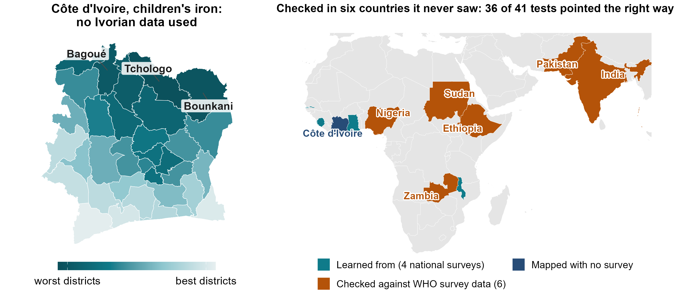{width="9.4in"}

::: {.notes}
ANDREW, about 70 seconds (156 words).

Most countries in this region have no recent biomarker survey. Côte d'Ivoire is one. Trained on our four countries, the model ranks its 33 districts for children's iron. The northern savanna comes out worst: Tchologo, Bounkani, Bagoué.

Can you trust a map like this? We looked for surveys the model had never seen. The WHO micronutrients database holds regional results from national surveys in Zambia, Ethiopia, Sudan and Nigeria, and in Pakistan and India. None were used to build the model. In 36 of 41 tests its ranking of their regions pointed the right way, scoring 0.33 to 0.40, no worse than inside our own four countries. Iron pointed the right way in every one of the six. And Côte d'Ivoire's own 2007 survey ranks its nine zones for vitamin B12 almost exactly as the model does.

These are regions, not districts, and the checks are published summaries. But they are data we did not touch.

Backup, if asked: XV-01/02 (22 September): climate and soil index, admin-1. Africa, average status 0.40, 12 of 12 positive; prevalence 0.33, 17 of 21; off the continent, prevalence 0.39, 7 of 8; country-block nulls 0.18 to 0.23. Not the pre-registered test, which needs a new country's own microdata at district level. Côte d'Ivoire 2007 B12: Spearman 0.95 over nine zones, centroid crosswalk. The WFP and MIMI vitamin A map for Côte d'Ivoire agrees at 0.50 over 33 districts and survives latitude adjustment.
:::

## Some deficiencies can be mapped from public data; others cannot yet

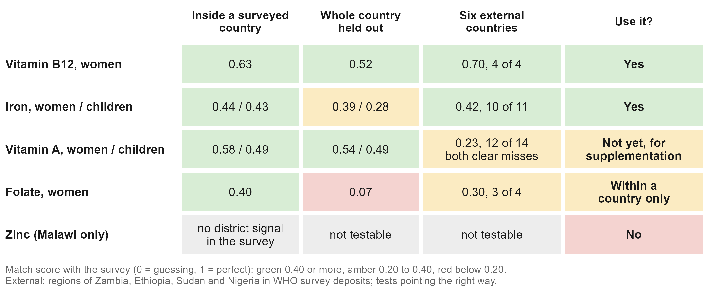{width="9.4in"}

::: {.notes}
ANDREW, about 55 seconds (119 words).

Not every deficiency can be mapped this way. Vitamin B12 maps best, inside a country and across borders, probably because it follows animal-source foods. Iron works and held up externally. Vitamin A ranked well inside our four countries but was the weakest in the external check, so for vitamin A supplementation we would not lean on it yet. Folate ranks districts within a country but not across borders, most likely because the surveys measured it with different assays. And zinc, measured only in Malawi, cannot be mapped by district: the survey's own district zinc numbers carry no signal. None of this follows how common a deficiency is. Folate and zinc are the commonest in our data, and the hardest.

Backup, if asked: External by nutrient, African deposits: B12 0.70 (4 of 4 tests positive), iron 0.42 (10 of 11), folate 0.30 (3 of 4), vitamin A 0.23 (12 of 14; the two clear misses, Zambia children and Ethiopia women at -0.43, are both vitamin A). Vitamin A is the strongest outcome in India and Pakistan. In Ghana children's vitamin A the regional average beats the model (0.41 against 0.28). Folate: immunoassay in Ghana and Sierra Leone, microbiologic assay in Malawi; a constant offset would not change a ranking, so the likelier story is that the two assays and cut-offs do not measure the same thing. Folate did transport to Ethiopia in the external check (0.87 on prevalence, one cell).
:::

## Making the next survey count for more

::: {.notes}
ANDREW, about 70 seconds (159 words).

The third use matters most right now, with survey budgets under pressure: making each survey go further.

First, how districts are sampled. Across our four surveys, three districts in four rest on a single cluster. Against numbers that noisy, even a perfect model would score only about 0.55. Two clusters per district lifts that ceiling to about 0.66, three to 0.73, for our maps and for the survey's own district estimates. If district estimates matter, put two or three clusters in a district.

Second, what to do before a full survey. A small national sample, about forty blood draws per nutrient, is enough to anchor the ranking; district planning figures then typically land within about ten percentage points.

Third, where to look first. The ranking tells a survey or a programme which unsurveyed districts to confirm first, and the dashboard's planning tab lets you try a design.

None of this replaces a survey. It helps each one reach further.

Backup, if asked: The staircase is projected from these surveys' own variance structure (0.539, 0.663, 0.731), not from an experiment. Sierra Leone has the most clusters per district (4.3) and the weakest results: 14 districts of half a million people is the wrong unit, not the wrong design. Anchor: a 5 per cent national sample, 24 to 71 respondents (median about 42), gives a median district error of 9.3 points; a regional survey of the same size 11.7. Survey planner (SP-01, 27 September): visiting half the districts keeps about 90 per cent of the ranking accuracy; model-guided choice is about equal to random choice (0.362 against 0.357) and both beat population-weighted choice (0.312); with design weights the national estimate stays unbiased. The model does not let you field a smaller survey: shrink the sample and its error degrades faster than the survey's.
:::

## What the model can and cannot do for you

::: {.notes}
ANDREW, about 75 seconds (162 words).

So what can you use it for? Use it to put districts in order: who to reach first, how to sequence a roll-out, which unsurveyed districts to check first. That is where it beats what programmes use today.

Use it together with survey data for anything that needs a number. The ranking has no level of its own. Anchored to a survey, it gives planning prevalences with honest, wide bands. And if the goal is to reach the most deficient people rather than the highest rates, multiply by population: in Ghana, simply going to the most populous fifth of districts reaches almost half of the deficient children.

Don't use it to replace a survey, to judge whether a programme worked, or to decide what to change. The model says where deficiency is, not why.

All of this is in a public dashboard: every district in the four countries and Côte d'Ivoire, with one-page country briefs. The QR code is on the screen.

Backup, if asked: Bands: split conformal on out-of-fold residuals (CP-01, 27 September), 90 per cent, leave-one-out coverage 0.90 to 0.93 in every cell; median half-width 26 points, iron 30 to 37, much of it the survey's own single-cluster noise. Targeting: the model's worst fifth by rate holds 21.9 per cent of the deficient people, the regional averages' 20.3, a random fifth about 20, a perfect map 47.5; the most populous fifth of Ghana's districts holds 46 per cent for children's iron. Programme evaluation: one point in time, and only three district-level programme columns in the headline set. Why weights are not causes: in Malawi the anaemia and malaria surfaces carry weight in the wrong direction for B12 because they mark the fish-eating lakeshore (see the short oral).
:::

## What we found, and what we ask

::: {.notes}
ANDREW, about 55 seconds (125 words).

Three things to take home. Free public data carry real information about micronutrient deficiency, much of it in climate and soil, measured everywhere, every year. That information ranks districts better than regional averages, and it works in countries the model has never seen. And the limit today is surveys, not data: on average, each survey we added improved the ranking for the countries held out.

So three asks. If your country has a micronutrient survey, recent, planned or sitting in a drawer, share it with the pool. If you are planning one, let's design it together. And tell us how accurate a district ranking needs to be before you would use it.

Modelling extends a survey's reach. It does not replace the survey. Thank you.

Backup, if asked: Pooling curve: 0.20 with one training survey, 0.26 with two, 0.30 with three; the gain so far is in The Gambia and Ghana as held-out countries, not yet in Malawi or Sierra Leone. Eleven new predictor blocks were scored this year and none moved the median by more than 0.01. Two candidate models were written down on 3 September 2026, so a fifth survey is a real test. Optional fourth line for Sonja: next, with the MIMI and GBD teams, we will compare our predictors framework by framework.
:::

# Appendix

## Questions we expect, and where the answers are

| Question | Slide | Question | Slide |
|:---|:---:|:---|:---:|
| Isn't this just geography? | 15, 16 | What drives the model? | 22 to 24 |
| How do I get a prevalence? | 17 | What does the map's shading mean? | 25, 26 |
| Why not machine learning? | 18 | Which deficiencies can be mapped? | 27 |
| What limits the accuracy? | 19 | Does targeting reach more people? | 28 |
| Will it work in my country? | 20, 21 | Accuracy in district pairs | 29 |
| More surveys, better maps? | 31, 32 | Côte d'Ivoire checks | 33, 34 |
| What does the data cost? | 35 | The predictors and the method | 36, 37 |
| A whole country held out | 38 | District by district | 39, 40 |
| The dashboard | 42 | Numbers we withdrew | 43 |

::: {.notes}
Backup index. In PowerPoint's slide show, type the slide number and press Enter to jump to it.
:::

## Is it just geography? The DHS-style geostatistical model

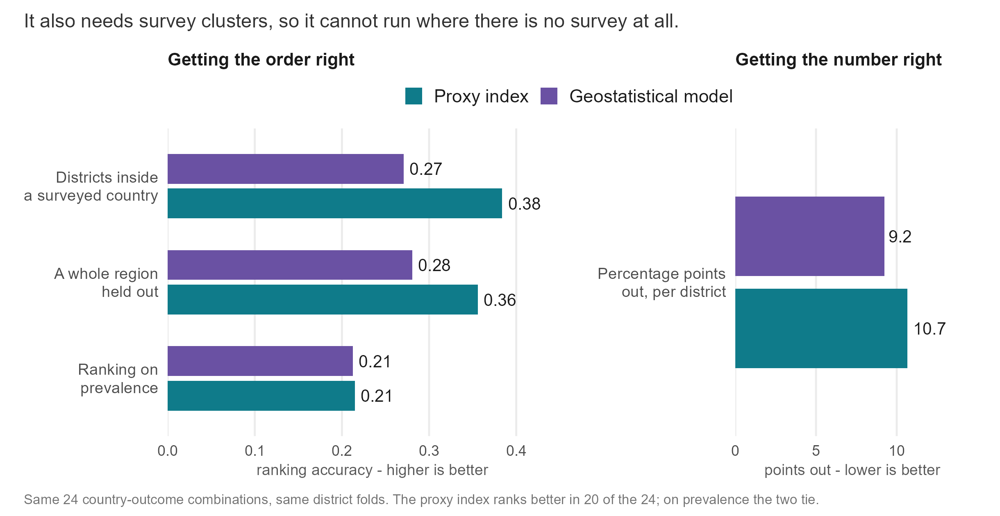{width="9.0in"}

::: {.notes}
Inside a surveyed country, geography does most of the work, and we say so on slide 6: the covariate-free neighbour map scores 0.39 against the model's 0.40 over 18 combinations. The DHS Program's model-based geostatistics (INLA-SPDE spatial field plus covariates, fitted at the survey clusters) ranks worse on the same folds (0.27 against 0.38) but estimates levels better (9.2 against 10.7 points of error), because it shrinks uncertain districts toward a level. It needs measured clusters inside the country, so it has no answer for a country with no survey. The Côte d'Ivoire vitamin A ranking correlates 0.73 with latitude, yet its agreement with the independent WFP and MIMI map survives adjusting for latitude (0.495 to 0.479). Not yet computed: a latitude-only ranking under country hold-out.
:::

## Holding out a whole region

{width="9.2in"}

::: {.notes}
Leave-one-region-out, where a spatial smoother has to extrapolate past the edge of its data. The index scores 0.39 on average status against 0.38 for the smoother; the penalised fits collapse. Ghana and Malawi are where this estimand is well determined.
:::

## How do I get a prevalence, not a rank?

{width="9.2in"}

::: {.notes}
Four ways to get district numbers, costed in units of survey sample. A national sample at 5 per cent of a full survey, with the transported ranking spread across districts, gives a median district error of about 9 to 10 points; a district-representative survey needs a quarter to two-fifths of a full sample to match it. A regional survey at 10 to 15 per cent does the same job on level, and the anchored design loses to a district survey on burden captured at every size. The dashboard's planning prevalences carry calibrated 90 per cent bands (CP-01, 27 September): leave-one-out coverage 0.90 to 0.93, median half-width 26 points. Predicting a national level from world indicators (69 countries) missed Sierra Leone by 29 points and Malawi by 22, which is why the anchor has to be measured.
:::

## What we compared the model against

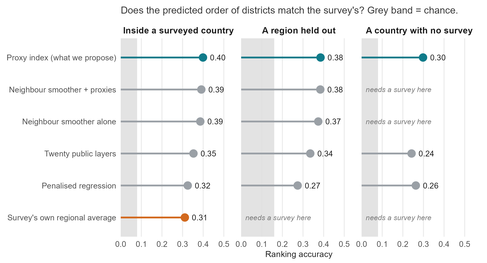{width="9.2in"}

::: {.notes}
Every method on the same held-out folds, match score on average status. Inside a surveyed country: the index 0.40, the neighbour smoother with proxies 0.39, the neighbour smoother alone 0.39, a twenty-layer composite 0.36, penalised regression 0.33, the regional average 0.31. A region held out: 0.39, 0.38, 0.38, 0.34 and 0.26. A country with no survey: the index 0.30, the twenty-layer composite 0.23, penalised regression 0.27; the smoothers and the regional average need a survey and cannot run. This is the main talk's point in one figure: with a survey, geography does most of the work; without one, only the proxies can rank.

Separately (SL-06), fourteen algorithms on identical folds, 1,304 fits, including random forests, boosting and four SuperLearner ensembles: nothing beat the index by more than 0.03 on any estimand. With 14 to 87 districts per country, anything that tunes a parameter shrinks toward the average: a sample-size finding, not a claim about machine learning. "Nothing is tuned inside a fit" is not "nothing was chosen on these data": the estimator and the domain sets were chosen while looking at these four countries, which is why the fifth survey is pre-registered.
:::

## The survey itself sets the ceiling

{width="8.6in"}

::: {.notes}
Across the four surveys, three districts in four rest on a single cluster; in Ghana and Malawi more than eight in ten. With one cluster per district, a model that knew each district's true prevalence exactly would still only score about 0.54 against the survey's own district numbers; two clusters 0.66, three 0.73. Projected from these surveys' own variance structure. Sierra Leone has the most clusters per district (4.3) and the weakest results, because 14 units of half a million people is the wrong unit, not the wrong design.
:::

## Will it work in my country?

{width="9.2in"}

::: {.notes}
Measurable combinations only, as plotted: The Gambia 0.62 inside the country and 0.60 held out entirely; Ghana 0.44 and 0.35; Malawi 0.43 and 0.17; Sierra Leone 0.21 held out (two measurable combinations) and not scoreable inside with 14 districts. Slide 7 averages over all 22 transported combinations instead, which gives Malawi 0.20 and Sierra Leone 0.16. The ordering follows what each survey could resolve: The Gambia put 2.3 clusters in a district, Ghana and Malawi 1.2. Ghana is the best teacher: trained on Ghana alone the model ranks The Gambia at 0.61, because Ghana spans the widest environmental gradient.
:::

## Where the ranking works, nutrient by nutrient and country by country

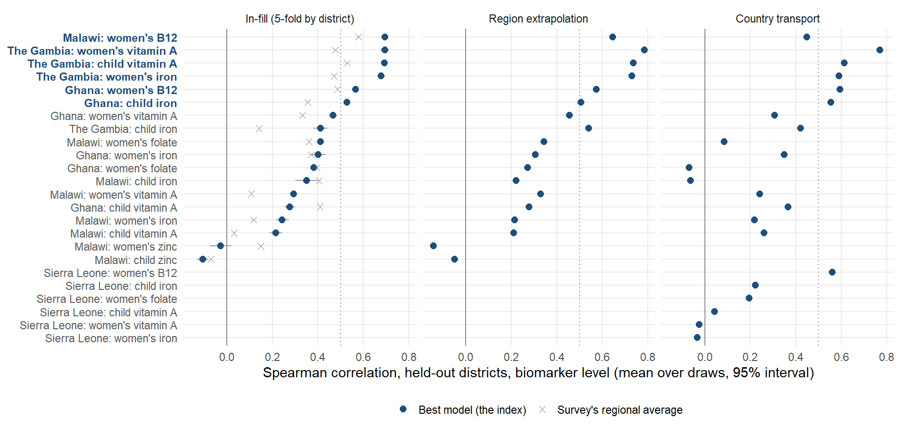{width="9.4in"}

::: {.notes}
Every nutrient-country combination on one axis. The filled point is the model, the cross the survey's own regional average, the bar the spread over the ten fold draws. Six of the eighteen scored combinations clear 0.5 and average 0.64; the rest average 0.28. Where the regional average wins: Ghana children's vitamin A, Ghana women's folate, Malawi children's iron.
:::

## What the model leans on, women's outcomes

{width="9.4in"}

::: {.notes}
Climate, soil and a satellite summary of what a district looks like carry just under half the weight whichever nutrient you take. What each nutrient adds is what a nutritionist would recognise: B12 leans on infant feeding with meat and fish, iron and folate on modelled anaemia, vitamin A on schooling and household wealth. District-level associations, not causes. The satellite summary is Google's AlphaEarth embedding: a year of imagery compressed into 64 numbers.
:::

## What the model leans on, all six outcomes

{width="9.4in"}

::: {.notes}
The six-panel version, children's outcomes included. Children's iron leans on the farming system: cereal-dominant cropping, ruminants and cattle mark worse iron status; root crops and market-integrated prices mark better.
:::

## Malawi: the model finds place-markers, not mechanisms

{width="9.0in"}

::: {.notes}
Malawi women's B12 is the best-predicted combination in the study, 0.70 within the country. The modelled anaemia surface carries weight in the wrong direction: districts with more anaemia have better B12 status (rho -0.40), because anaemia and malaria are highest along the lakeshore, where households eat fish (rho -0.48). The model found a marker for a place, not a mechanism. This is why the weights must never be read as a list of things to change.
:::

## How firmly each Côte d'Ivoire district is placed

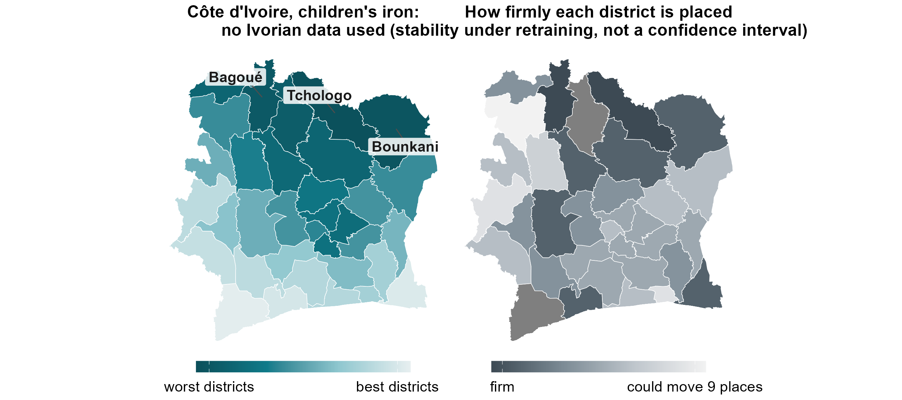{width="9.4in"}

::: {.notes}
Right: the width of each district's 90 per cent rank interval over 400 bootstrap refits of the training districts. Dark = firm, light = could move up to nine places. This is stability under retraining, not a confidence interval: holding out each surveyed country, the survey's rank falls inside the nominal 90 per cent interval only 38 per cent of the time. The calibrated statement is a class probability: worst-third calls land 52 per cent of the time against 33 by chance.
:::

## What the uncertainty on the maps does and does not mean

{width="9.2in"}

::: {.notes}
Two registers, never mixed. Stability: rank ranges from resampling refits, labelled as stability; they cover a held-out survey's rank 38 per cent of the time (16 to 70 per cent across combinations). Calibrated: out-of-fold worst-fifth probabilities, and since 27 September conformal 90 per cent bands on every planning prevalence, checked by leave-one-out to cover the survey's own district value 90 to 93 per cent of the time. The resampling bands they replaced covered 8 per cent, which is why they were replaced.
:::

## Which deficiencies can be mapped at district level at all?

{width="9.2in"}

::: {.notes}
The screen applied before any model is fitted: keep a combination if national prevalence is at least 2 per cent and the survey's own district estimates carry district-level signal. Eight of 24 fail. The screen uses only prevalence and the survey's resolution, never the model's score, and every threshold pair from 2 to 10 per cent and 0 to 0.40 gives the same answer.
:::

## Does targeting reach more deficient people?

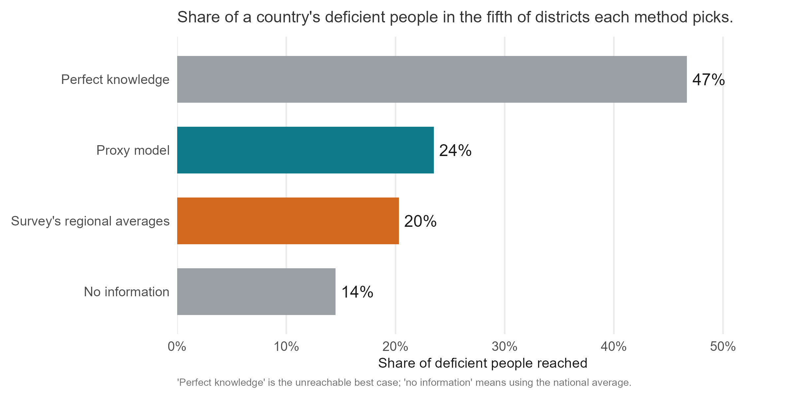{width="9.0in"}

::: {.notes}
A programme reaching the fifth of districts the model ranks worst reaches 21.9 per cent of the deficient people; the survey's regional averages 20.3; a random fifth about 20; a perfect map 47.5. In Ghana children's iron, the most populous fifth of districts reaches 46 per cent. Rank by predicted rate times population, and read ours as the rate.
:::

## The same comparison in district pairs

{width="9.2in"}

::: {.notes}
The previous version's accuracy slide. Share of district pairs put in the survey's order, pooled over 18 combinations, each district hidden: coin 50, regional average 56, neighbour map 59, model 60, the six best combinations 70. Pooled over two situations, which is why the main talk now splits them.
:::

## Accuracy by nutrient, against what the survey can show

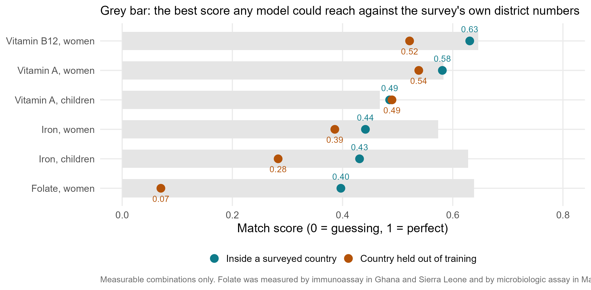{width="9.2in"}

::: {.notes}
B12 0.63 in-country and 0.52 transported; vitamin A 0.58 and 0.54 (women), 0.49 and 0.49 (children); iron 0.44 and 0.39 (women), 0.43 and 0.28 (children); folate 0.40 and 0.07. The grey bar is the ceiling any model could reach against these surveys' district numbers.
:::

## Every survey added, on average

{width="8.8in"}

::: {.notes}
With one training survey a country held out ranks at 0.20, with two 0.26, with three 0.30. The gain so far is in The Gambia and Ghana as held-out countries; Malawi and Sierra Leone have not improved. Part of what holds the curve down is the surveys themselves: four surveys in four years by four teams, with national levels that differ several-fold.
:::

## Does each survey added help the others?

{width="9.2in"}

::: {.notes}
Every subset of training countries scored on each held-out country: about +0.05 per country added, monotone across all four specifications, not flattened at three; the gain is in The Gambia and Ghana.
:::

## The 2007 Côte d'Ivoire survey and the transported B12 ranking

{width="8.6in"}

::: {.notes}
WHO holds the 2007 national nutrition survey's women's B12 deficiency for nine survey zones, 49 per cent in the north to nearly zero in Abidjan. The transported B12 ranking, never shown an Ivorian blood sample, puts them in almost the same order: Spearman -0.95 between measured deficiency and the model's mean district rank. Nineteen years old, zones not administrative units (districts assigned by centroid), nine points.
:::

## Côte d'Ivoire: two independently chosen models agree

{width="8.8in"}

::: {.notes}
The two pre-registered candidates, climate and soil alone and a five-domain set, agree at Spearman 0.88 to 0.97 over 33 districts and share 83 per cent of their worst fifth. The WFP and MIMI vitamin A map (a household budget survey model) ranks the same northern belt worst: 0.50 over 33 districts, surviving latitude adjustment. Against that modelled dietary-inadequacy map iron does not corroborate; against the WHO biomarker deposits of four other African countries (XV-01) iron pointed the right way in 10 of 11 tests. Dietary inadequacy is not deficiency, so the two checks measure different things.
:::

## The data that travel across a border are the free ones

{width="9.0in"}

::: {.notes}
Leave-one-country-out ranking by what a ministry must do to obtain the data: openly downloadable layers 0.32 (19 of 22 combinations positive), adding public household-survey microdata 0.30, adding DHS microdata 0.28, chance 0.08. Caveat from the 18 September check-in: MICS microdata sit behind a registration much like DHS, so the middle tier is better read as "survey microdata behind a free registration".
:::

## Where the predictors come from

::: {.notes}
575 district-level predictors from 28 public sources in eight groups, linked to 554 districts in four countries. Of these, 383 (open or public-survey) feed the headline in-country fit.
:::

## How the model is built and how it is tested

::: {.notes}
The previous version's methods slide, kept for anyone who asks for the steps.
:::

## Holding out a whole country

{width="9.2in"}

::: {.notes}
Trained on three countries and applied to the fourth: 0.30 at district level over 22 combinations, positive in 18, against a country-block null whose 95th percentile is 0.08. The bottom panel is why levels do not travel: national mean biomarker concentrations differ several-fold between the surveys, so what crosses a border is the order of districts, not a prevalence.
:::

## Does the model track the survey, district by district?

{width="9.2in"}

::: {.notes}
Each district's survey estimate against its held-out prediction. The cloud is tilted but not on the line: the model ranks, and compresses the range. Hollow points are single-cluster districts; much of the vertical scatter is the survey's noise. The largest circles, the districts with the most respondents, sit closest to the line.
:::

## How reliable is the survey's own district map?

{width="9.2in"}

::: {.notes}
Hatched districts hold a single survey cluster. The number under each title is how well a perfect predictor of the true district value could correlate with this map: roughly 0.5 to 0.7. That is the bar, not 1.0.
:::

## The twenty layers behind children's iron

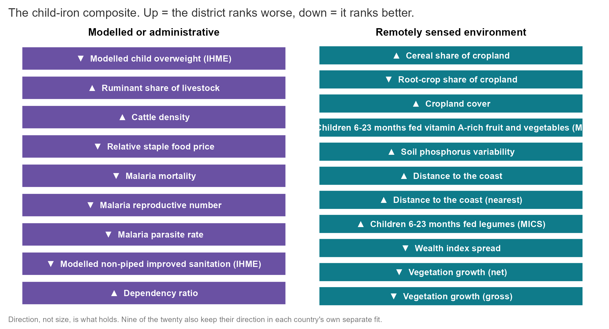{width="9.0in"}

::: {.notes}
The twenty largest back-projected weights for children's iron in the pooled four-country fit, about a fifth of the index; all twenty keep their direction in every leave-one-country-out fit. Cereal-dominant cropping, ruminant and cattle density, cropland and distance from the coast rank a district worse; root crops, higher plant productivity, relatively expensive staples and modelled overweight rank it better.
:::

## The live dashboard

{width="9.4in"}

::: {.notes}
amertens.shinyapps.io/micronutrient-burden, rebuilt 27 September 2026: every district of the four countries and Côte d'Ivoire, with four views per district (priority ranking, planning prevalence anchored to the national survey, WHO severity class, people affected), calibrated uncertainty, the external check, a survey planner and one-page country briefs.
:::

## Numbers we withdrew

| Claim made earlier this year | What the audit found |
|:---|:---|
| Regional transport, "12 of 12 at 0.50 to 0.56" | A fold-assignment bug: 0.28 over all 22 combinations |
| "26 per cent more burden captured" | 2 points: 21.9 against 20.3 per cent |
| "Two-thirds of attainable accuracy" | Moves from 48 to 83 per cent with the ceiling chosen |
| A covariate-free baseline at 0.516 that beat us | Not jackknifed; withdrawn in our favour |
| The twelve-learner SuperLearner as "the model" | Lost to an untuned index at these sample sizes |

::: {.notes}
An internal audit re-examined every headline claim this year. Withdrawn: regional transport of "12 of 12 combinations at 0.50 to 0.56" (a fold-assignment bug; the correct figure over 22 combinations is 0.28); "26 per cent more burden captured than regional averages" (the honest margin is 2 points, 21.9 against 20.3); "two-thirds of attainable accuracy" (the ratio moves from 48 to 83 per cent depending on the ceiling and target). Withdrawn in our own favour: a covariate-free baseline at 0.516 that had not been jackknifed. Retired: presenting the twelve-learner SuperLearner as the model.
:::

## Person-level models: a coin toss on proxies alone

{width="9.2in"}

::: {.notes}
The January approach, kept as a sensitivity analysis: a person-level ensemble under district-blocked folds has a mean AUC of 0.50 on district proxies, 0.52 on the survey's own respondent variables and 0.53 on both. Aggregating a person-level classifier also biases area means, which is why the area-level model is the headline.
:::
