```{r setup}
# MNF 2026 joint talk, VERSION 3 (27 September 2026). v1 = MNF15-talk-2026-09.qmd and
# v2 = MNF15-talk-2026-09-v2.qmd are untouched. v3 applies Andrew's review of v2 and the
# independent review (docs/slides/MNF15-talk-review-2026-09-27.md):
#   - titles are plain descriptions or the questions a policymaker would ask
#   - Sonja's own introduction slide restored (her text), then the Ghana maps
#   - "national survey measures regions / programmes act on districts" replaced: fortification
#     is national, delivery and reach are district by district
#   - the index is named: Domain-PC index (principal components within each predictor domain,
#     weighted by their correlation with deficiency; not PC-HAL, not lasso)
#   - one accuracy language: share of district pairs put in the survey's order (50% = coin toss),
#     with 95% intervals on the per-nutrient figure; correlations stay in the notes
#   - the ceiling on matching terms (average status), per nutrient
#   - overclaims flagged by the review corrected (external-check counts, "just as well",
#     "better than regional averages in countries it never saw", the clusters rule)
# Figures: scripts/policy_deck/28 (per-cell pairs), 26 with FIG_VER=v3, 01 and 03 with
# FIG_OUT=results/figures/mnf15_v3 INDEX_LABEL="Domain-PC index" ADD_SL=1, 27 (framework badges).
# Render: bash scripts/render_deck.sh docs/slides/MNF15-talk-2026-09-v3.qmd --forum --no-label \
#         --text 18,15 --concept docs/slides/MNF15-talk-2026-09-v3.concept.yaml
suppressPackageStartupMessages({library(dplyr); library(knitr)})
root <- tryCatch(here::here(), error = function(e) normalizePath(file.path(getwd(), "..", "..")))
```

## Introduction and study objectives

- Information on the prevalence of vitamin and mineral deficiencies (VMD) is limited
- In an inter-institutional, multi-disciplinary workshop we brainstormed potential approaches, and relevant data domains and data sources
- Developed conceptual frameworks to guide targeted machine learning

**Objectives**

- To explore whether machine learning can help fill the data gap in VMD prevalence with proxy variables using targeted machine learning

::: {.notes}
SONJA, about 30 seconds (70 words, a suggestion; the slide is Sonja's own).

Information on how common vitamin and mineral deficiencies are is limited, and almost never available below the region. So we brought together nutritionists, epidemiologists and data scientists in a workshop to ask which approaches and which data could help, and we built conceptual frameworks to guide the analysis. Our objective was to see whether machine learning, guided by those frameworks, can use proxy data to help fill that gap.

Backup, if asked: One wording flag for Sonja to decide: statisticians at a Berkeley-affiliated talk will hear "targeted machine learning" as TMLE, a specific estimation method we do not use. "Machine learning guided by conceptual frameworks" says what we mean.
:::

## What can a national survey tell us about districts?

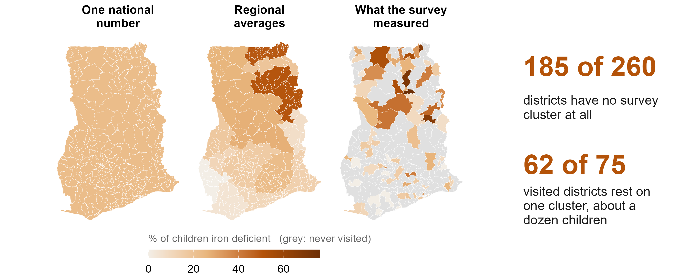{width="9.4in"}

::: {.notes}
SONJA, about 50 seconds (112 words).

Here is the gap, in Ghana. The 2017 survey did exactly what it was designed to do: a good national number and good regional numbers. For fortification, which is set nationally, that is the right number. But delivery happens district by district: supplementation, the reach of fortified foods, where the next survey goes. Ghana has 260 districts. The survey reached 75; the other 185 have no measurement of their own. And 62 of the 75 rest on a single cluster, about a dozen children. So which districts are being left behind? The survey cannot say, and it was never designed to.

Backup, if asked: Mandatory wheat flour and oil fortification and salt iodisation are national (Nyumuah et al., Food Nutr Bull 2012). Coverage of fortified foods is consistently lower among poor and rural households (Aaron et al., J Nutr 2017, eight countries). Ghana's girls' iron-folate programme began in four regions in 2017. District health directorates deliver nutrition services, and district assemblies fund health by local priority. 62 of 75 single-cluster districts, median 12.5 children tested in each (targets_v2.csv).
:::

## Conceptual framework of iron deficiency

::: {.notes}
SONJA, about 15 seconds (29 words).

We did not start from satellites. We started from what causes deficiency. This is our conceptual framework for iron, adapted from our 2023 paper.

Backup, if asked: Hess et al., Ann N Y Acad Sci 2023, adapted. Click to the next slide for the coverage badges.
:::

## Which of these causes can public data measure?

::: {.notes}
SONJA, about 55 seconds (122 words).

We went box by box and asked: is there a public, district-level measure of this? Green means yes: climate and ecology from satellites; poverty, schooling, water and sanitation, and infant feeding from household surveys; malaria and worms from disease atlases. Amber means only a national figure or a modelled surface, such as health policy or inflammation. Grey means nothing public reaches it: cultural norms, absorption.

So the predictors are not a fishing expedition. They are the parts of this framework that public data happen to cover. To learn from, we had four national biomarker surveys: The Gambia, Ghana, Sierra Leone and Malawi, 206 districts where blood was drawn. They exist because these teams collected them, and we thank them. Andrew.

Backup, if asked: DRAFT badge calls for Sonja to confirm: genetic risk (Malaria Atlas sickle-cell and G6PD surfaces), built environment (built-up area, night lights, housing), family planning (DHS fertility and reproductive health), obesity (IHME overweight, DHS adult BMI), health and nutrition knowledge (amber), other micronutrient deficiencies (amber).
:::

## How does the model work, and how was it tested?

::: {.notes}
ANDREW, about 70 seconds (157 words).

Thank you, Sonja. On the left, the 206 districts where blood was drawn. In the middle, 575 public layers we assembled for every district: climate and soil, crops and livestock, malaria, food prices, household surveys. None of it had to be bought.

The model is what we call a Domain-PC index. Within each family of layers we take principal components, weight each one by how strongly it tracks deficiency where blood was drawn, and add them up. Nothing is tuned. We also tried fourteen machine-learning methods, including random forests, boosting and a full SuperLearner ensemble. With 14 to 87 districts per country, none did better.

Every number I show you comes from hiding data and predicting it: one district in five, a whole region, a whole country. And we score it simply: out of every pair of districts, how often do we put the worse one first? A coin toss gets half.

Backup, if asked: Domain-PC index: within each of 24 predictor domains, principal components to 80 per cent of the variance; each component weighted by the Fisher z of its rank correlation with the outcome in the training districts; summed and rescaled. Equivalent to ridge regression at maximum shrinkage; no fitted coefficient and no tuning parameter. Not PC-HAL, which was one of the fourteen alternatives. The full SuperLearner (12 learners, NNLS-weighted) scored 0.38 inside a country and 0.28 across borders, against 0.39 and 0.28 for the index in the same run. The in-country fit uses the 383 open or public-survey layers. Pairs metric: share of district pairs ordered as the survey orders them; the notes quote the matching Spearman correlation where it helps.
:::

## What does the model rely on?

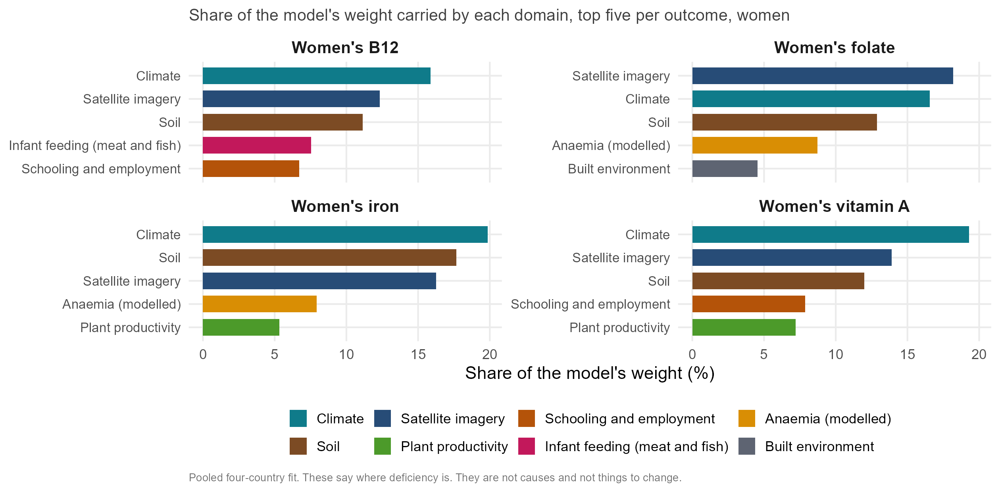{width="9.4in"}

::: {.notes}
ANDREW, about 40 seconds (78 words).

For every nutrient, the same three families carry about half the weight: climate, soil, and a satellite summary of land cover, all measured everywhere, every year. That is why the model can travel. Then each nutrient adds something a nutritionist would recognise: B12 leans on infants eating meat or fish, iron and folate on modelled anaemia, vitamin A on schooling and household wealth. These say where deficiency is, not why. My short oral goes further.

Backup, if asked: Women's outcomes shown; the children's panels are in the appendix. The satellite summary is Google's AlphaEarth embedding: a year of imagery compressed into 64 numbers. In Malawi the anaemia and malaria surfaces carry weight in the wrong direction for B12 because they mark the fish-eating lakeshore: a place-marker, not a mechanism.
:::

## How well does it fill in Ghana's unsurveyed districts?

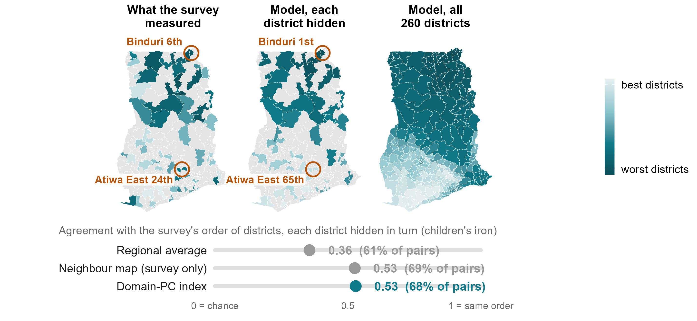{width="9.4in"}

::: {.notes}
ANDREW, about 60 seconds (131 words).

Ghana, children's iron. Left: what the survey measured in the 75 districts it reached. Middle: the model's prediction for each district with that district's blood results hidden. Right: the model applied to all 260.

Take Binduri, in Upper East. The survey measured it 6th worst of 75. Its regional average puts it 12th. The model, which never saw Binduri's results, puts it first. And we are wrong in places: Atiwa East, 24th in the survey, we put 65th.

Overall the model puts 68 of every 100 district pairs in the survey's order; the regional average 61. But a map built only from neighbouring districts' survey results does as well, 69. Inside a surveyed country, geography does most of the work. Public data earn their keep where there is no survey.

Backup, if asked: Correlations: model 0.53, neighbour map 0.53, regional average 0.36 (benchmarks_v2_cells.csv, reproduced exactly). The regional average is each district's own region averaged over the OTHER surveyed districts in that region, never the district itself (arm_region_mean_jk). A national mean that leaves out the district's own region would reverse the order (26 per cent of pairs right, below a coin toss), so it is not a fair comparator. Binduri rests on two survey clusters, Atiwa East on one. On the share deficient rather than average status, the model ties the regional average for this outcome.
:::

## Can it rank Ghana's districts without Ghana's survey?

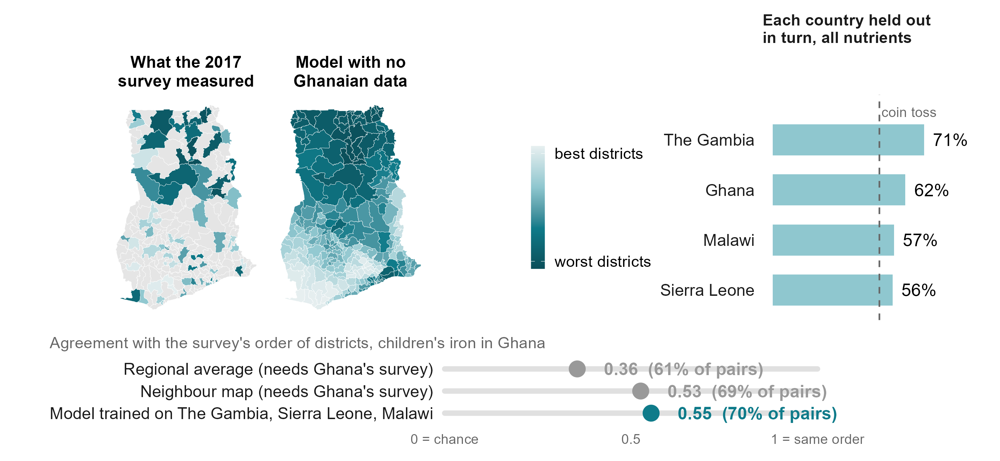{width="9.4in"}

::: {.notes}
ANDREW, about 60 seconds (131 words).

So we ran the test where we can check the answer. We removed Ghana's survey entirely. The model learned only from The Gambia, Sierra Leone and Malawi, and never saw a Ghanaian blood sample. It still puts 70 of every 100 pairs of Ghana's districts in the survey's order for children's iron, as well as the neighbour map that needed Ghana's own survey.

This is one of our better cases. Holding out each country in turn, across all its nutrients: 71 per cent for The Gambia, 62 for Ghana, 57 for Malawi, 56 for Sierra Leone. In practical terms: when the model puts a district in the worst third of a country it has never seen, it is right about half the time, against a third by chance. A shortlist, not a measurement.

Backup, if asked: Correlation 0.554, reproducing the committed transport cell exactly; mean over all 22 transported combinations 0.30 (62 per cent of pairs). The right-hand map applies the same fit to all 260 districts. Worst-third calls land 52 per cent of the time against 33 by chance; of the five worst named, 62 per cent.
:::

## What about countries with no survey?

{width="9.4in"}

::: {.notes}
ANDREW, about 65 seconds (145 words).

Most countries in this region have no recent biomarker survey. Côte d'Ivoire is one. Trained on our four countries, the climate-and-soil version of the model ranks its 33 districts for children's iron. The northern savanna comes out worst.

Can you trust a map like this? The WHO micronutrients database holds regional results from national surveys in Zambia, Ethiopia, Sudan and Nigeria, and in Pakistan and India. None were used to build the model. In Africa its ranking of their regions pointed the right way in all 12 tests of average status and 17 of 21 tests of prevalence; in South Asia, 7 of 8. That is higher than the same regional test inside our own four countries. And Côte d'Ivoire's own 2007 survey ranks its nine zones for vitamin B12 almost exactly as the model does. Regions, not districts, but data we did not touch.

Backup, if asked: XV-01/02: climate-and-soil index at admin-1; Africa average status 0.40 (country-block null 0.20), prevalence 0.33; off the continent 0.39; internal test at the same tier 0.28 and 0.27. Average-status and prevalence tests of one outcome are counted separately, as in the findings note. Iron points the right way on average in all six countries (13 of 14 iron cells). Not the pre-registered test, which needs a new country's own microdata at district level. The dashboard's start tile quotes 0.38 for a new country: that is this climate-and-soil model; 0.30 is the full index. Côte d'Ivoire 2007 B12: Spearman 0.95 over nine zones.
:::

## How well does it rank districts, nutrient by nutrient?

{width="9.4in"}

::: {.notes}
ANDREW, about 60 seconds (134 words).

Here is every nutrient and country, with a 95 per cent interval. Left, inside a surveyed country; right, a whole country held out. B12 is the most mappable: about 70 of every 100 pairs right, at home and across borders, probably because it follows animal-source foods. Vitamin A works well in The Gambia and Ghana but was the weakest in the external check, so we would not use it for supplementation decisions yet. Iron works in most places, not all: across borders, Malawi's children are no better than a coin. Folate works inside a country but not across borders, most likely because the surveys measured it differently. And zinc cannot be mapped at all: the survey itself shows no difference between districts.

Backup, if asked: Measurable combinations only (16 of 24). Intervals: percentile bootstrap over districts; in-country intervals clear 50 per cent in 13 of 14, held out in 10 of 16. Averages: 67 per cent inside a country (regional average 62), 62 per cent held out. Orange diamonds: the survey's own regional average, which needs the survey. Folate: immunoassay in Ghana and Sierra Leone, microbiologic assay in Malawi. External, African deposits: B12 0.70 (4 of 4 tests), iron 0.42 (10 of 11), folate 0.30 (3 of 4), vitamin A 0.23 (12 of 14; both clear misses are vitamin A). Pakistan's B12 is a miss.
:::

## How can it help plan the next survey?

::: {.notes}
ANDREW, about 65 seconds (150 words).

The third use: making the next survey count. First, how close can any model get? The survey's own district numbers are noisy, because most rest on one community of about a dozen children. So even a perfect model could agree with them only up to the grey bars, about 0.6 to 0.8, not 1. Ours reaches 0.4 to 0.6. There is room left, but part of the limit is the survey, not the model. More communities per district would raise that limit, though at a fixed budget that means fewer districts.

Second, alongside any survey, a small national sample, about forty blood draws per nutrient, can anchor the ranking; district figures then typically land within about ten points.

Third, the ranking tells a survey or a programme which unsurveyed districts to check first, and the dashboard's planning tab lets you try a design.

Backup, if asked: Grey bars: the variance-components ceiling for average status, per nutrient, averaged over measurable combinations (variance_components_ceiling.csv): B12 0.77, folate 0.74, vitamin A 0.71, iron 0.61; teal: the model's in-country score. How the ceiling is known: how much two communities in the same district disagree tells us how noisy one community's result is. Earlier slides compared prevalence ceilings with average-status scores and so overstated how close we are. Sierra Leone has the most clusters per district (4.3) and the weakest results: 14 districts of half a million people is the wrong unit. Anchor: 5 per cent national sample (24 to 71 respondents), median district error 9.3 points. SP-01: model-guided district choice is about equal to random; both beat population-weighted choice.
:::

## What can it be used for, and what not?

::: {.notes}
ANDREW, about 60 seconds (137 words).

So what can you use it for? To put districts in order: who to reach first, how to sequence a roll-out, which unsurveyed districts to check first. That includes finding districts where deficiency stays high despite national fortification: candidates for supplementation or biofortification, or for checking whether fortified foods reach them.

With survey data, it gives a rough district prevalence: usually within about ten points, sometimes thirty off. And to reach the most deficient people rather than the highest rates, multiply by population: in Ghana, simply going to the most populous fifth of districts reaches almost half of the deficient children.

It cannot replace a survey, judge whether a programme worked, or tell you why a district is deficient.

All of this is in a public dashboard, with one-page country briefs. The QR code is on the screen.

Backup, if asked: Bands: split conformal, 90 per cent, leave-one-out coverage 0.90 to 0.93; median half-width 26 points, iron 30 to 37 (CP-01). Median absolute error about 10 points. Targeting: the model's worst fifth by rate holds 21.9 per cent of the deficient people, regional averages 20.3, a random fifth about 20, a perfect map 47.5. The model maps deficiency, not fortified-food coverage: it can flag where deficiency persists, not why.
:::

## Conclusions and next steps

::: {.notes}
ANDREW, about 55 seconds (124 words).

Three things to take home. Free public data carry real signal about micronutrient deficiency, much of it in climate and soil, measured everywhere, every year. Inside a surveyed country, the model ranks districts better than regional averages; in a country with no survey, it ranks them about as well as a survey's own regional averages do. And the limit is surveys: on average, each survey we added improved the ranking for the countries held out.

So three asks. If your country has a micronutrient survey, recent, planned or in a drawer, share it with the pool. If you are planning one, let's design it together. And tell us how accurate a district ranking must be before you would use it.

Modelling extends a survey's reach. It does not replace the survey. Thank you.

Backup, if asked: 0.30 held out (22 combinations) against 0.31 for the regional average inside a surveyed country (18). Pooling curve: 0.20 with one training survey, 0.26 with two, 0.30 with three; the gain so far is in The Gambia and Ghana, not yet Malawi or Sierra Leone. Two candidate models were written down on 3 September 2026, so a fifth survey is a real test. Optional line for Sonja: next, with MIMI and GBD, we compare predictors framework by framework.
:::

# Appendix

## Questions we expect, and where the answers are

| Question | Slide | Question | Slide |
|:---|:---:|:---|:---:|
| Isn't this just geography? | 17, 18 | What drives the model? | 24, 25 |
| How do I get district prevalence? | 19 | What does the map's shading mean? | 26, 27 |
| Why not machine learning? | 20 | Which deficiencies can be mapped? | 23, 28, 31 |
| Would more survey communities help? | 21 | Does targeting reach more people? | 29 |
| Will it work in my country? | 22 | Accuracy pooled over nutrients | 30 |
| More surveys, better maps? | 32, 33 | Côte d'Ivoire checks | 34, 35 |
| What does the data cost? | 36 | The predictors and the method | 37, 38 |
| A whole country held out | 39 | District by district | 40, 41 |
| The dashboard | 43 | Numbers we withdrew | 44 |

::: {.notes}
Backup index. In PowerPoint's slide show, type the slide number and press Enter to jump to it.
:::

## Is it just geography? Comparison with DHS-style geostatistics

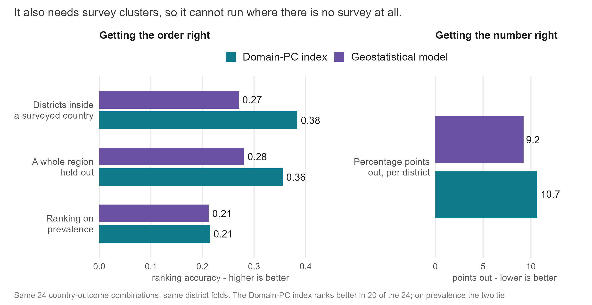{width="9.0in"}

::: {.notes}
Inside a surveyed country, geography does most of the work, and slide 8 says so: the neighbour map ties the model. The DHS Program's model-based geostatistics (a spatial field plus covariates, fitted at the survey clusters) ranks worse on the same folds (0.27 against 0.38) but estimates levels better (9.2 against 10.7 points of error), because it shrinks uncertain districts toward a level. It needs measured clusters inside the country, so it has no answer for a country with no survey. The Côte d'Ivoire vitamin A ranking correlates 0.73 with latitude, yet its agreement with the independent WFP and MIMI map survives adjusting for latitude (0.495 to 0.479). Not yet computed: a latitude-only ranking under country hold-out.
:::

## What happens when a whole region is held out?

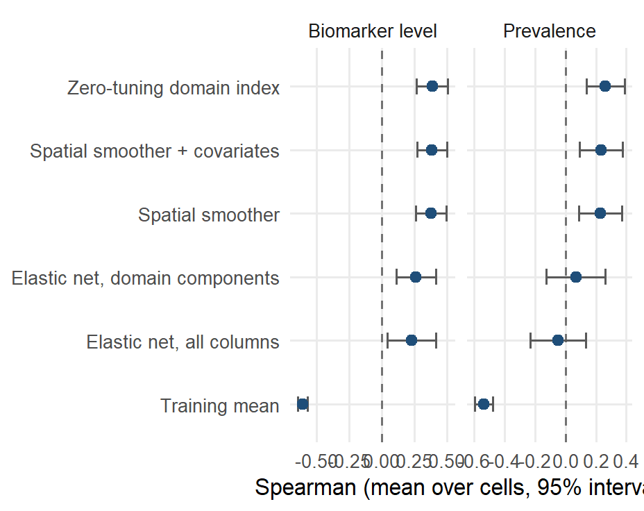{width="9.2in"}

::: {.notes}
Leave-one-region-out, where a spatial smoother has to extrapolate past the edge of its data. The Domain-PC index scores 0.39 on average status against 0.38 for the smoother; penalised fits collapse.
:::

## What is the cheapest way to get district numbers?

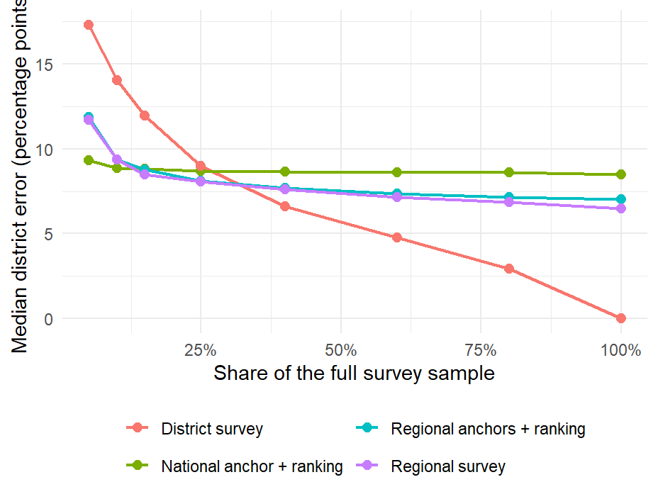{width="9.2in"}

::: {.notes}
How to read it: the horizontal axis is how big a survey you can afford, as a share of a full national survey. The vertical axis is how far each design's district prevalences land from the full survey's own district figures, in percentage points (typical district). Red: a smaller survey that measures each district directly; it reaches zero at 100 per cent only because it then is the full survey. Green: measure one national number with a small sample and let the model spread districts around it; about 9 points off at any size, because the ranking's error dominates. At 5 per cent of a survey (about 40 blood draws per nutrient) that beats a small district survey (17 points off). Purple and teal: a regional survey, or regional anchors plus the ranking, land in between. From about a quarter of a full survey upward, measuring districts directly wins. A cheap first pass when there is no survey, not a substitute for one. Calibrated 90 per cent bands on the dashboard: median half-width 26 points (CP-01). Predicting a national level from world indicators missed Sierra Leone by 29 points and Malawi by 22, which is why the anchor has to be measured.
:::

## How does it compare with other methods, including machine learning?

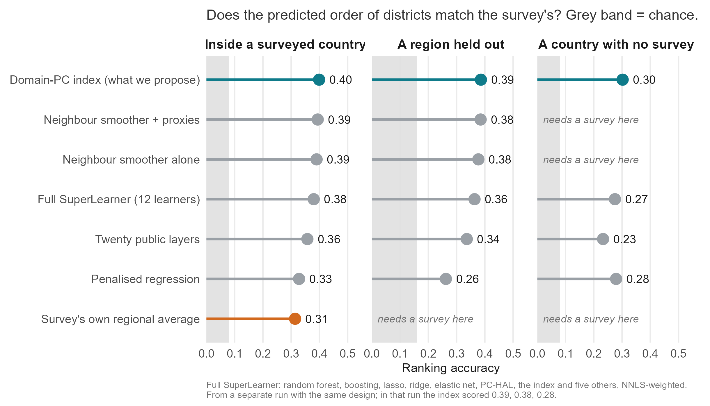{width="9.2in"}

::: {.notes}
Every method on the same held-out folds, agreement on average status (Spearman). Inside a surveyed country: the Domain-PC index 0.40, neighbour smoother with proxies 0.39, neighbour smoother alone 0.39, the full SuperLearner 0.38, a twenty-layer composite 0.36, penalised regression 0.33, the regional average 0.31. A region held out: 0.39, 0.38, 0.38, 0.36, 0.34, 0.26. A country with no survey: index 0.30, SuperLearner 0.27, twenty layers 0.23, penalised regression 0.28; the smoothers and the regional average need a survey. The full SuperLearner (random forest, boosting, lasso, ridge, elastic net, PC-HAL, the index and five others, NNLS-weighted) comes from a separate run with the same design, in which the index scored 0.39, 0.38 and 0.28; the ensemble is 0.01 to 0.02 below the index in each column. With 14 to 87 districts per country, anything that tunes shrinks toward the average: a sample-size finding, not a claim about machine learning. The estimator and the domain sets were chosen while looking at these four countries, which is why the fifth survey is pre-registered.
:::

## How much would more survey communities per district help?

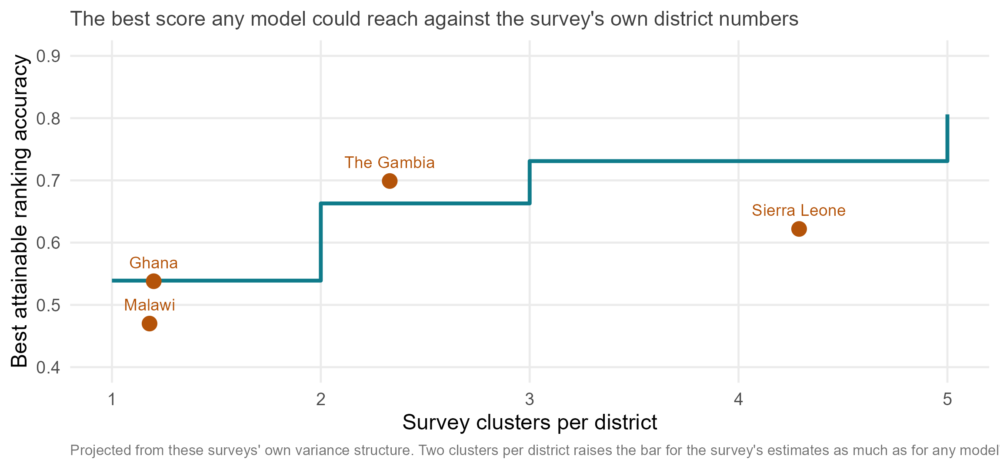{width="8.6in"}

::: {.notes}
Plain version: the survey's number for a district is a reading from one community of about a dozen children. Two readings from the same district disagree, and that disagreement tells us how noisy one reading is. From it we can work out the best any model could ever score against the survey. With one community per district that ceiling is about 0.54 on the share deficient; two communities 0.66; three 0.73 (projected from these surveys' own variance structure). At a fixed budget, more communities per district means fewer districts. Sierra Leone has the most clusters per district (4.3) and the weakest results, because 14 districts of half a million people is the wrong unit, not the wrong design.
:::

## Will it work in my country?

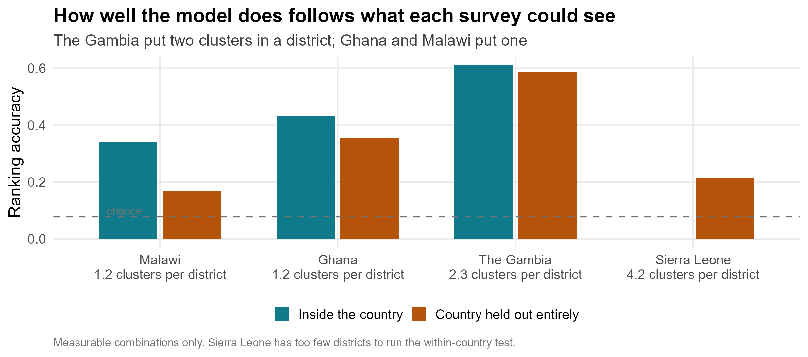{width="9.2in"}

::: {.notes}
Measurable combinations only, as plotted (Spearman): The Gambia 0.62 inside the country and 0.60 held out; Ghana 0.44 and 0.35; Malawi 0.43 and 0.17; Sierra Leone 0.21 held out and not scoreable inside. Slide 9 averages pairs over all 22 transported combinations instead. The ordering follows what each survey could resolve: The Gambia put 2.3 clusters in a district, Ghana and Malawi 1.2. Ghana is the best teacher: trained on Ghana alone the model ranks The Gambia at 0.61.
:::

## Which deficiencies can it map? Summary table

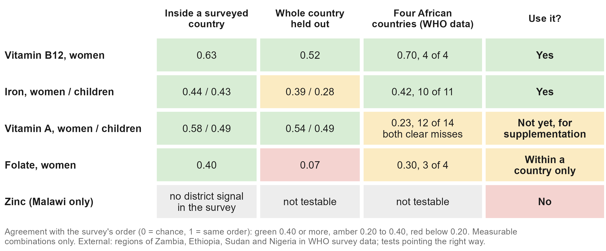{width="9.4in"}

::: {.notes}
The v2 main-body table, corrected: the external column is the four African countries' WHO data only (Pakistan's B12 is a miss, so B12 is 4 of 5 across all six), and the held-out column is measurable combinations only (vitamin A there is mostly The Gambia and Ghana).
:::

## What does the model rely on, for all six outcomes?

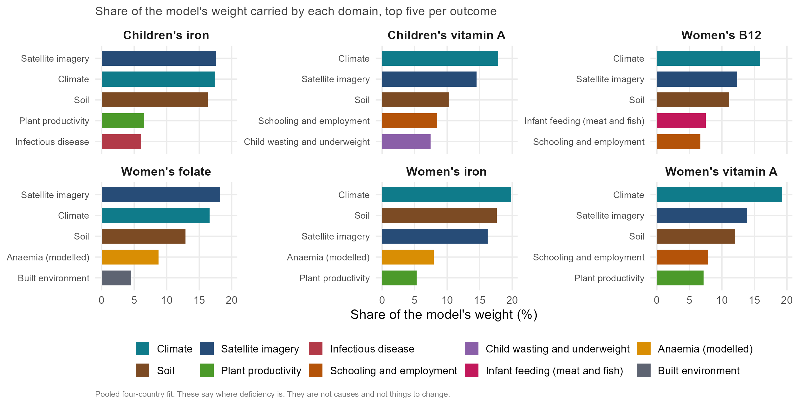{width="9.4in"}

::: {.notes}
Children's iron leans on the farming system: cereal-dominant cropping, ruminants and cattle mark worse iron status; root crops and market-integrated prices mark better.
:::

## Malawi: why the weights are not causes

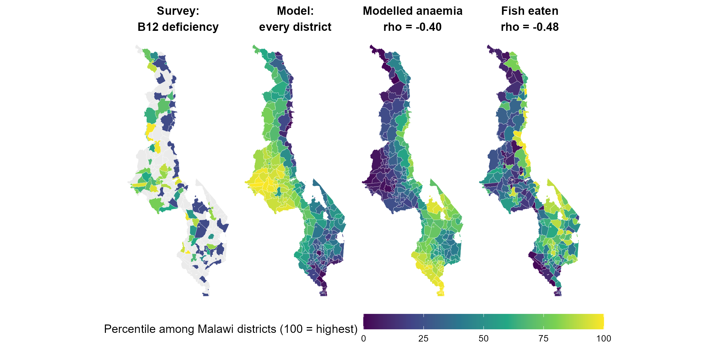{width="9.0in"}

::: {.notes}
Malawi women's B12 is the best-predicted combination in the study. The modelled anaemia surface carries weight in the wrong direction: districts with more anaemia have better B12 status (rho -0.40), because anaemia and malaria are highest along the lakeshore, where households eat fish (rho -0.48). The model found a marker for a place, not a mechanism.
:::

## How firmly is each Côte d'Ivoire district placed?

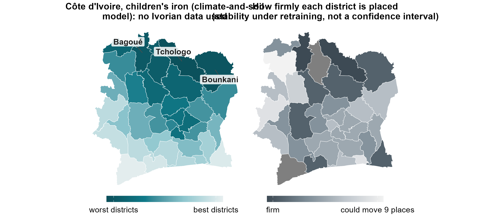{width="9.4in"}

::: {.notes}
Right: the width of each district's 90 per cent rank interval over 400 refits of the training districts. Dark = firm. Stability under retraining, not a confidence interval: holding out each surveyed country, the survey's rank falls inside the nominal 90 per cent interval only 38 per cent of the time.
:::

## What do the uncertainty ranges mean?

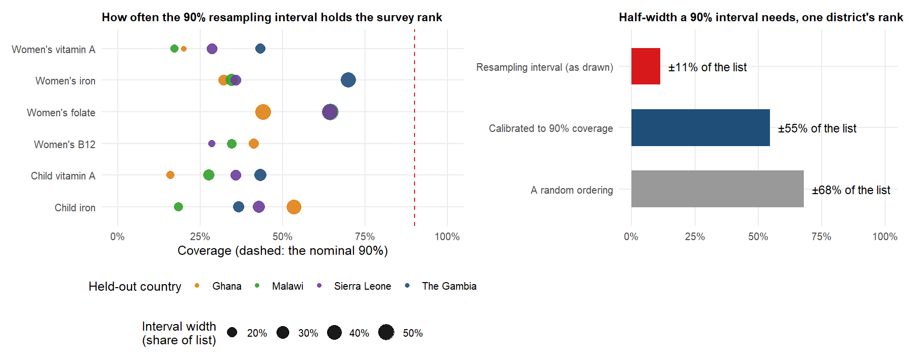{width="9.2in"}

::: {.notes}
Two registers, never mixed. Stability: rank ranges from refits, which cover a held-out survey's rank 38 per cent of the time. Checked: conformal 90 per cent bands on every planning prevalence on the dashboard, which contain the survey's own district value 90 to 93 per cent of the time.
:::

## Which deficiencies can be mapped at district level at all?

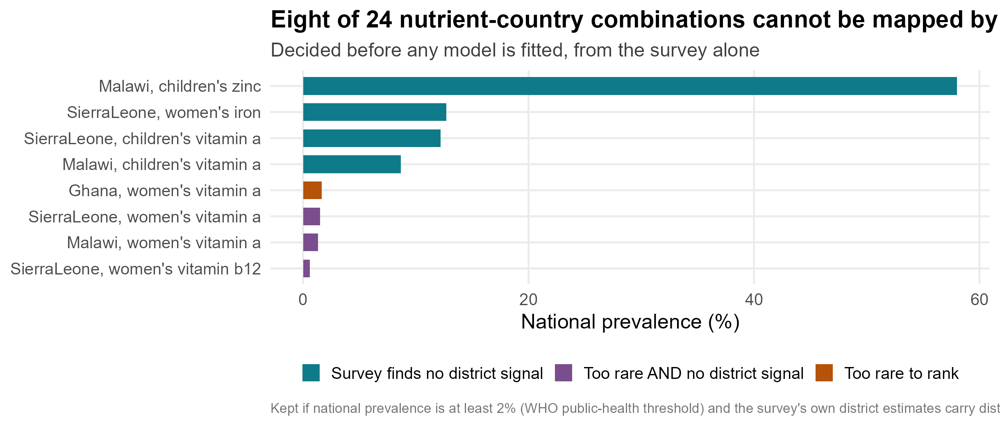{width="9.2in"}

::: {.notes}
The screen applied before any model is fitted: keep a combination if national prevalence is at least 2 per cent and the survey's own district estimates show real differences between districts. Eight of 24 fail. Why common deficiencies can still fail: mapping needs contrast, not prevalence. Zinc in Malawi is common everywhere (58 and 63 per cent), but the survey finds no reliable difference between districts: for children's zinc the district share of the variance is zero; communities differ, but not in a way that lines up by district, and the zinc cut-offs depend on the time of day and fasting at the blood draw, so part of the community difference may be when a team visited. Sierra Leone's children's vitamin A and women's iron: with only 14 very large districts, the survey's district differences are indistinguishable from sampling noise. If the survey cannot tell districts apart, no model can rank them. The screen uses only prevalence and the survey's resolution, never the model's score.
:::

## Does targeting reach more deficient people?

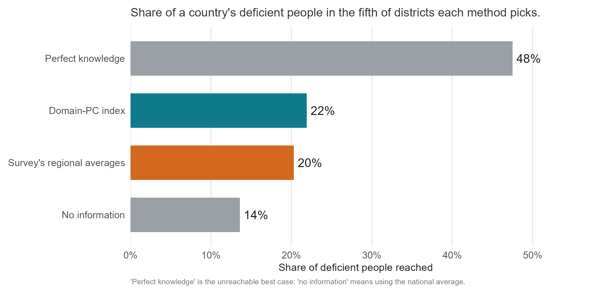{width="9.0in"}

::: {.notes}
A programme reaching the fifth of districts the model ranks worst reaches 21.9 per cent of the deficient people; the survey's regional averages 20.3; a random fifth about 20; a perfect map 47.5. In Ghana children's iron, the most populous fifth reaches 46 per cent. Rank by predicted rate times population.
:::

## Accuracy pooled over all nutrients, in district pairs

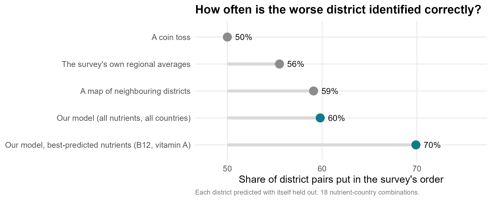{width="9.2in"}

::: {.notes}
v1's accuracy slide: pooled over 18 combinations, each district hidden. The regional average here is each district's own region averaged over the other surveyed districts in that region (the district itself left out). It is what a programme would know for a district the survey missed. A national mean excluding the district's own region is not a fair alternative: it reverses the order (26 per cent of pairs right, correlation -0.62), because districts in high-deficiency regions are assigned the healthier rest of the country. The fair "no information" comparator is a coin toss (50 per cent), which a single national figure also gives.
:::

## Accuracy by nutrient, against the best possible

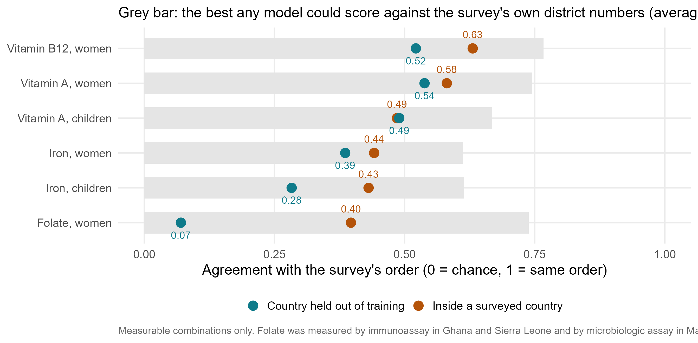{width="9.2in"}

::: {.notes}
Ceilings on the same target as the scores (average status). Earlier versions set prevalence ceilings against average-status scores, which made the model look closer to the ceiling than it is.
:::

## Does each added survey help?

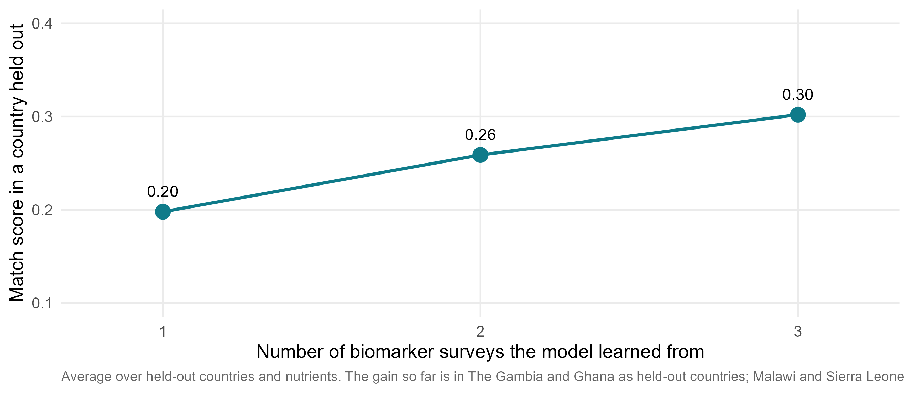{width="8.8in"}

::: {.notes}
0.20 with one training survey, 0.26 with two, 0.30 with three, on average; the gain so far is in The Gambia and Ghana as held-out countries; Malawi and Sierra Leone have not improved.
:::

## Every combination of training countries

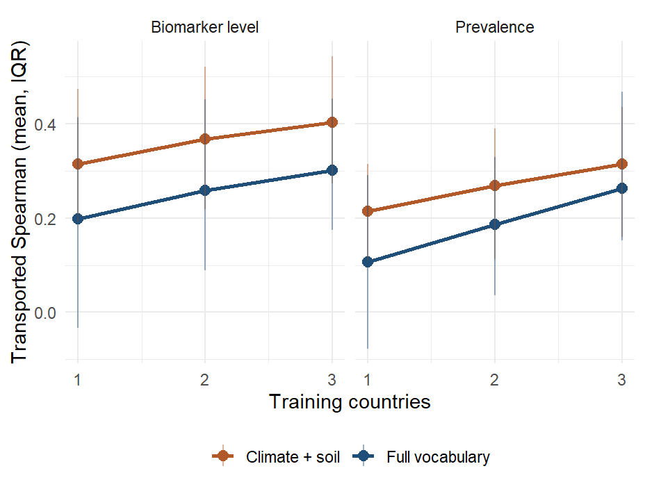{width="9.2in"}

::: {.notes}
Every subset of training countries scored on each held-out country: about +0.05 per country added, not flattened at three; the gain is in The Gambia and Ghana.
:::

## The 2007 Côte d'Ivoire survey and the B12 ranking

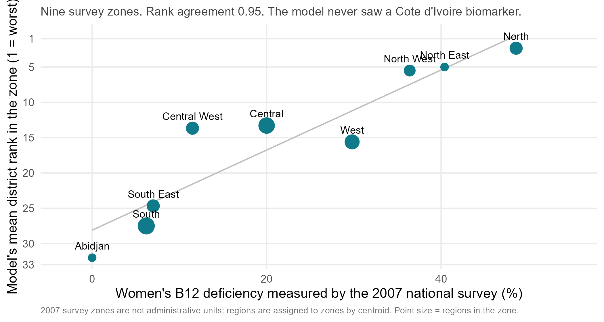{width="8.6in"}

::: {.notes}
Women's B12 deficiency in nine 2007 survey zones against the transported B12 ranking: Spearman -0.95 between measured deficiency and the model's mean district rank. Nineteen years old, zones not administrative units, nine points, and a steep north-south gradient: no latitude-only comparison yet.
:::

## Côte d'Ivoire: do two model versions agree?

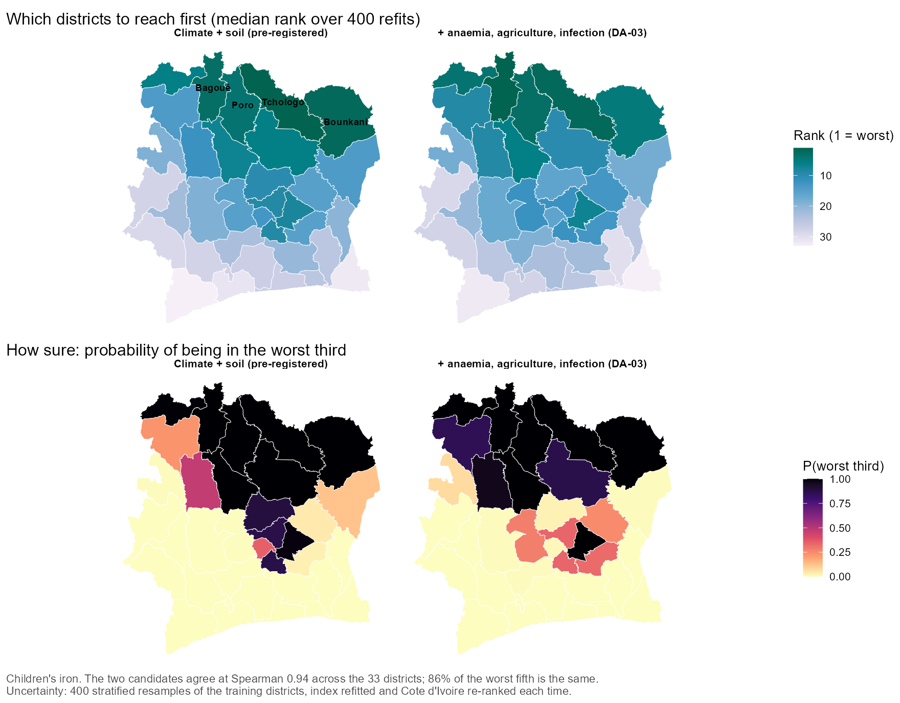{width="8.8in"}

::: {.notes}
The two pre-registered candidates agree at Spearman 0.88 to 0.97 and share 83 per cent of their worst fifth. The WFP and MIMI vitamin A map ranks the same northern belt worst (0.50, surviving latitude adjustment). Against that dietary-inadequacy map iron does not corroborate; against WHO biomarker data from four other African countries, iron points the right way in 10 of 11 tests.
:::

## Which data travel across a border?

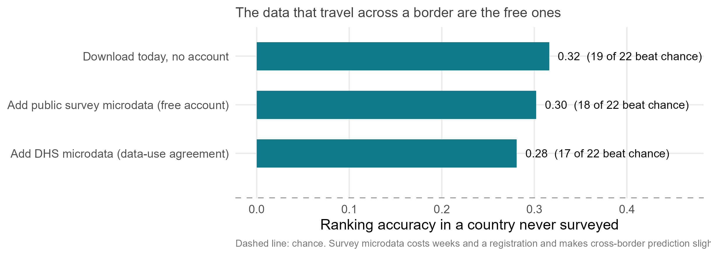{width="9.0in"}

::: {.notes}
Openly downloadable layers 0.32 held out; adding survey microdata behind a free registration 0.30; adding DHS microdata 0.28; chance 0.08. MICS microdata sit behind a registration much like DHS.
:::

## Where the predictors come from

::: {.notes}
575 district-level predictors from 28 public sources in eight groups; 383 (open or public-survey) feed the headline in-country fit.
:::

## How the model is built and tested, step by step

::: {.notes}
v1's methods slide, kept for anyone who asks for the steps.
:::

## What happens when a whole country is held out?

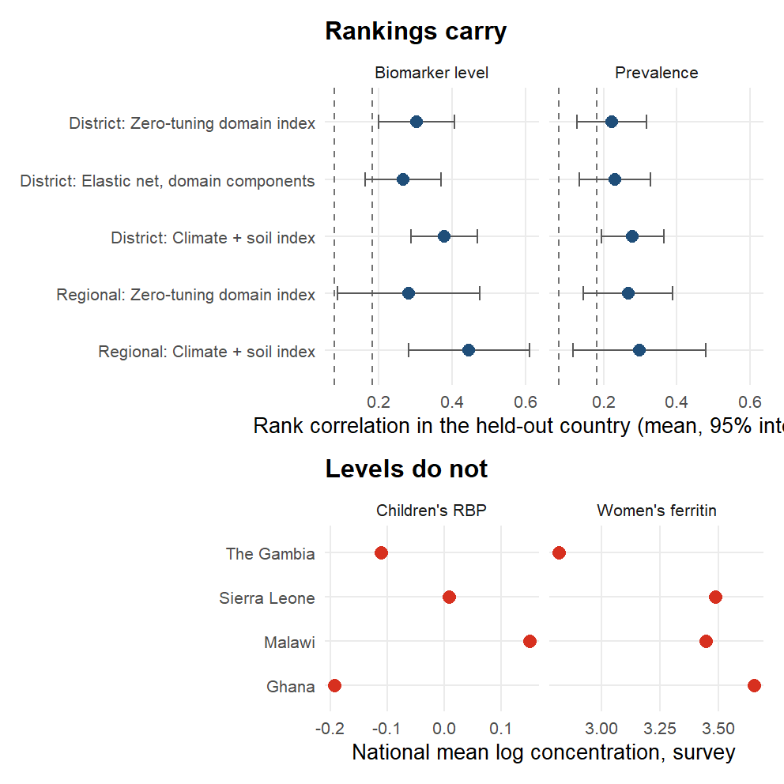{width="9.2in"}

::: {.notes}
Trained on three countries, applied to the fourth: 0.30 over 22 combinations, positive in 18, against a null 95th percentile of 0.08. National mean biomarker concentrations differ several-fold between surveys, so what crosses a border is the order of districts, not a prevalence.
:::

## Does the model track the survey, district by district?

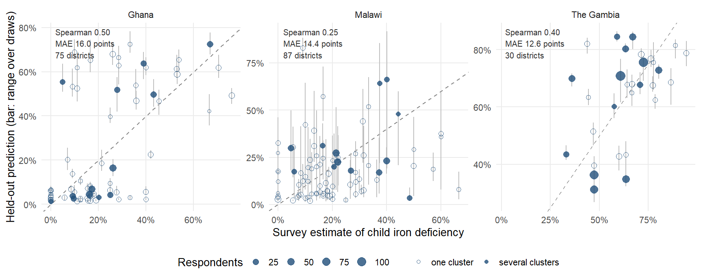{width="9.2in"}

::: {.notes}
The cloud is tilted but not on the line: the model ranks, and compresses the range. Hollow points are single-cluster districts; much of the vertical scatter is the survey's noise.
:::

## How reliable is the survey's own district map?

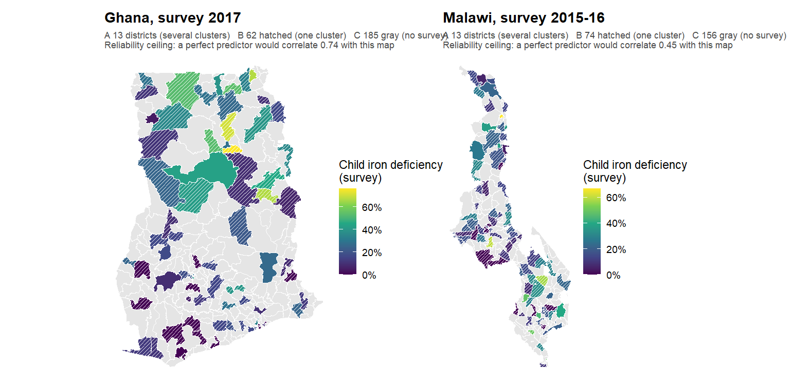{width="9.2in"}

::: {.notes}
Hatched districts hold a single survey cluster. The number under each title is how well a perfect predictor of the true district value could correlate with this map: roughly 0.5 to 0.7.
:::

## The twenty layers behind children's iron

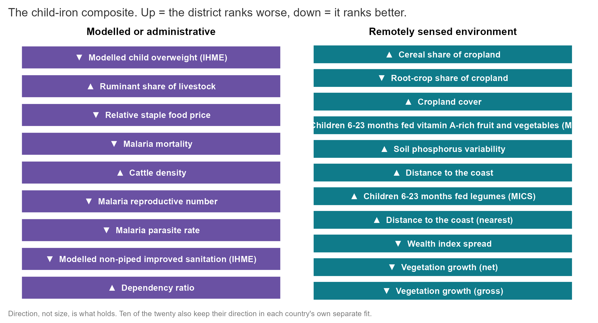{width="9.0in"}

::: {.notes}
The twenty largest back-projected weights for children's iron in the pooled four-country fit; all keep their direction in every leave-one-country-out fit.
:::

## The live dashboard

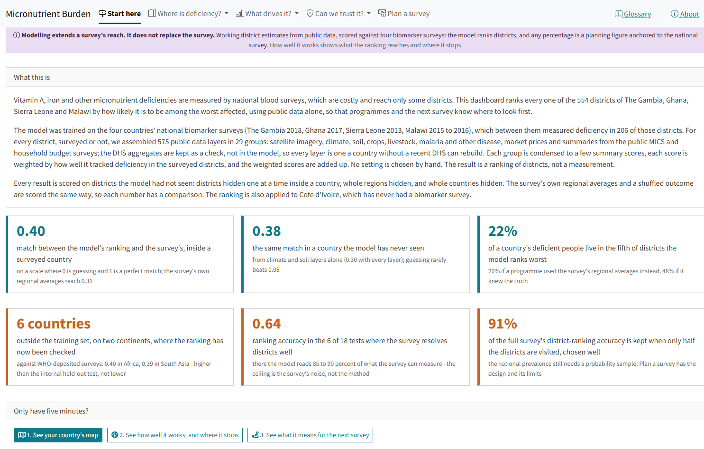{width="9.4in"}

::: {.notes}
amertens.shinyapps.io/micronutrient-burden: every district of the four countries and Côte d'Ivoire, planning prevalence with calibrated bands, WHO severity class, people affected, the external check, a survey planner and country briefs. Its "new country" tile (0.38) is the climate-and-soil model; the talk's 0.30 is the full index.
:::

## Numbers we withdrew

| Claim made earlier this year | What the audit found |
|:---|:---|
| Regional transport, "12 of 12 at 0.50 to 0.56" | A fold-assignment bug: 0.28 over all 22 combinations |
| "26 per cent more burden captured" | 2 points: 21.9 against 20.3 per cent |
| "Two-thirds of attainable accuracy" | Moves from 48 to 83 per cent with the ceiling chosen |
| A covariate-free baseline at 0.516 that beat us | Not jackknifed; withdrawn in our favour |
| The twelve-learner SuperLearner as "the model" | Lost to an untuned index at these sample sizes |

::: {.notes}
An internal audit re-examined every headline claim this year; these did not survive.
:::

## Person-level models: a coin toss on proxies alone

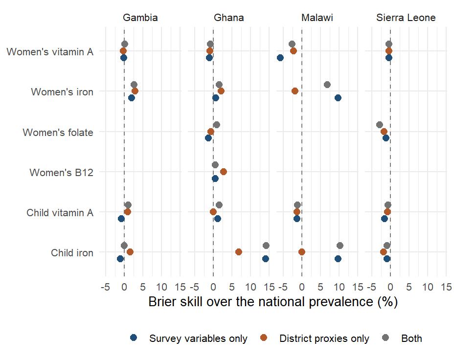{width="9.2in"}

::: {.notes}
A person-level ensemble under district-blocked folds has a mean AUC of 0.50 on district proxies. Aggregating a person-level classifier also biases area means, which is why the area-level model is the headline.
:::
