```{r setup}
# MNF 2026 joint talk, VERSION 4 (27 September 2026). v1, v2 and v3 are untouched.
# v4 = v3's titles and wording, re-cut to Andrew's reorder of v2 and his comments on it
# (docs/slides/MNF15-talk-2026-09-anm_reorder.pptx, his file; read, never written):
#   - Sonja's text and the Ghana gap map on one introduction slide; her own framework slide
#   - predictors and the step-by-step method promoted; a slide on why a simple model wins
#   - the coverage slide redrawn with filled boxes, "available" split into intrinsically
#     ecological and district averages standing in for individuals; genetic risk and
#     inherited red cell disorders downgraded to partly (modelled 2012 allele frequencies);
#     28 Sep review: genetic risk and nutrition knowledge to grey, the fundamental drivers and
#     infectious / chronic boxes split in two fills (DHS-only boxes keep their fill)
#   - Ghana: a better worked example, no neighbour-map row, the held-out paradox explained
#   - region hold-out in the main body, wide, both targets named, SuperLearner added
#   - accuracy by nutrient in pairs, with the ceiling as one line on that slide (the ceiling
#     slide is gone); domains for children's iron in two countries and the four-country
#     model, plus that model's top ten layers in plain words
#   - nutrient table wording; conclusions reframed around places with no survey and new
#     surveys; the survey-planning slide to the appendix
#   - appendix: targeting on the 16 mappable combinations, measurability relabelled,
#     Cote d'Ivoire B12 as predicted prevalences with its maps
#   - updated versions of the January 2026 Ghana deck's best slides (comments on
#     docs/slides/MN-proxy-january-Ghana-presentation-best slides.pptx): surveys and years,
#     cross-validation on a map, national prevalence, skill over the national average,
#     data sources, most important and missing domains, the B12 policy metrics, outcomes table
#   - an outline slide after the introduction and a recap as the last main slide
# Figures: scripts/policy_deck/26 (FIG_VER=v4), 29, 30, 31 -> results/figures/mnf15_v4/.
# Render: bash scripts/render_deck.sh docs/slides/MNF15-talk-2026-09-v4.qmd --forum --no-label \
#         --text 18,12 --concept docs/slides/MNF15-talk-2026-09-v4.concept.yaml
suppressPackageStartupMessages({library(dplyr); library(knitr)})
```

## Introduction and study objectives

::: {.notes}
SONJA, about 50 seconds (116 words).

Information on how common vitamin and mineral deficiencies are is limited. The map shows how limited, for sub-Saharan Africa: 17 of 47 countries have no national survey of micronutrient biomarkers on record, and only 10 have one from 2015 or later; for zinc, five. And where a survey exists, it gives national and regional numbers, while supplementation, the reach of fortified foods and the next survey are planned district by district. So we brought together nutritionists, epidemiologists and data scientists to ask which approaches and data could help, and built conceptual frameworks to guide the analysis. Our objective: to see whether machine learning can help fill the gap, using aggregated proxy variables.

Backup, if asked: map and bars from the WHO VMNIS Micronutrients Database (export of 25 February 2025), nationally representative surveys measuring ferritin, retinol or RBP, zinc, folate or vitamin B12 (scripts/policy_deck/33_mnf15_v4_vmnis_coverage.R); surveys not yet deposited are not shown, and all four of our surveys are in it. Worldwide, in low- and middle-income countries over 1988 to 2018: vitamin A data in 77 countries, iron 53, folate 24, zinc 21, B12 7; about 21 surveys in 2015 to 2019, 15 per cent of these countries (Brown, Moore, Hess et al., Am J Clin Nutr 2021, CC BY 4.0). The global estimate of 56 per cent of young children and 69 per cent of women with at least one deficiency rests on 24 surveys in 22 countries (Stevens et al., Lancet Glob Health 2022). Fortification is set nationally (Nyumuah et al., Food Nutr Bull 2012); coverage of fortified foods is lower among poor and rural households (Aaron et al., J Nutr 2017). Wording flag for Sonja: the third bullet still says "targeted machine learning", which statisticians may hear as TMLE.
:::

## What we will tell you

::: {.notes}
SONJA, about 25 seconds (62 words).

Here is what we will tell you. First, free public data carry real information about micronutrient deficiency. Second, a simple model does best, because there are few places to learn from. Third, it ranks districts no survey reached, and we checked that against data it never saw. Fourth, it works for some nutrients more than others. And fifth, it extends surveys; it does not replace them.
:::

## Conceptual framework of iron deficiency

::: {.notes}
SONJA, about 20 seconds (42 words).

We did not start from satellites. We started from what causes deficiency. This is our conceptual framework for iron, adapted from our 2023 paper: intrinsic risk, the fundamental drivers, underlying and intermediate risk factors, and the direct causes of iron deficiency.

Backup, if asked: Hess et al., Ann N Y Acad Sci 2023, adapted.
:::

## Which of these causes can public data measure?

::: {.notes}
SONJA, about 65 seconds (135 words).

So we went back to the framework, box by box, and asked: is there a public, district-level measure? Dark green: yes, and the data describe the place itself: climate, ecology, built-up land. Light green: yes, as a district average standing in for individuals: poverty, schooling, water and sanitation, infection. Amber: only a national figure, a modelled surface, or part of the box: politics and inequity, chronic disease, inflammation, blood loss. Grey: nothing public: cultural norms, genetic risk, nutrition knowledge.

One caution. Everything here is a district average. Even the direct causes are measured indirectly, as ecological data, never for the person whose blood was drawn. So these layers mark where deficiency is likely; they cannot explain any one person's status. Andrew.

Backup, if asked: Inherited red blood cell disorders: the only layers are the Malaria Atlas 2012 modelled allele-frequency surfaces (sickle haemoglobin, haemoglobin C, G6PD deficiency), so amber, not green; population gene frequencies, not anyone's genotype, filed with infection because they largely follow historical malaria, and about 1 per cent of the four-country model's weight. Genetic risk beyond these (for example variants affecting iron absorption): nothing public, so grey. Fundamental drivers: climate, ecology and geography are measured everywhere; politics is conflict events only (ACLED), economy district wealth averages, and inequity one layer, the spread of relative wealth within the district, so that half is amber. Chronic disease: nothing beyond HIV. Health and nutrition knowledge: the only layers are schooling and literacy, already counted under education, so grey. Family planning, obstetric history, pregnancy and women's BMI come from DHS: public, so coloured, though the headline model leaves DHS out. Food insecurity: IPC phase, food consumption score and coping index each cover two or three of the countries, none of them Ghana, which has household food spending and market prices. Blood loss: hookworm and schistosomiasis prevalence from WHO ESPEN, nothing on menstrual or obstetric loss. Inflammation: infection burden only, no CRP or AGP. Calls still marked draft for Sonja: built environment, family planning, obesity, health and nutrition knowledge, other micronutrient deficiencies (scripts/policy_deck/30_mnf15_v4_framework_drawn.py).
:::

## Which surveys does the model predict to?

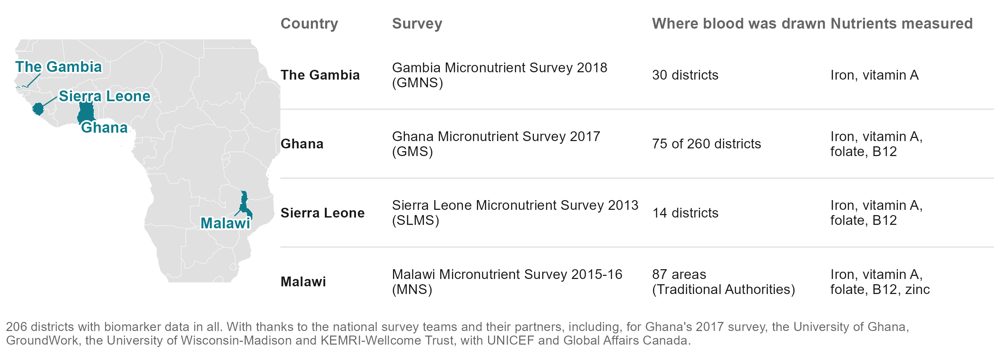{width="9.6in"}

::: {.notes}
SONJA, about 25 seconds (57 words).

The model learns from four national micronutrient surveys: The Gambia 2018, Ghana 2017, Sierra Leone 2013 and Malawi 2015 to 16. Together, 206 districts where blood was drawn. These data exist because these teams collected them, and some of them are in the room today. Thank you.

Backup, if asked: outcome definitions, adjustments and cut-offs are in the appendix. Sierra Leone's child file holds only anaemic children (532 of 654 assayed). Malawi's areas are Traditional Authorities.
:::

## How does the model work, and how was it tested?

::: {.notes}
ANDREW, about 55 seconds (126 words).

Thank you, Sonja. Here is the whole study in four steps. One: four national biomarker surveys, 206 districts where blood was drawn. Two: the 575 public layers, for every district. Three: machine learning. We compared fourteen methods, from random forests and boosting to a SuperLearner ensemble that combines them, and a very simple one won; we call it the Domain-PC index. Four: a ranking of every district, and with a survey's national figure a prevalence, including districts no survey reached and countries with no survey at all.

Every number I show comes from hiding data and predicting it: a district, a region, a whole country. And we score it simply: out of every pair of districts, how often do we put the worse one first? A coin toss gets half.

Backup, if asked: 14 alternatives on identical folds, 1,304 fits (SL-06). The in-country fit uses the 383 open or public-survey layers; the cross-border fit uses the layers common to all four countries. Pairs metric: share of district pairs ordered as the survey orders them; correlations are in the notes where they help.
:::

## How the model is built and tested, step by step

::: {.notes}
ANDREW, about 40 seconds (92 words).

The index in four steps. Every layer becomes a rank within its own country, so a difference in level between surveys cannot pose as signal. Each family of layers, climate, soil and so on, is summarised by its principal components, computed without looking at deficiency. Each component is weighted by how strongly it tracked deficiency where blood was drawn. Add up, rescale, and nothing is tuned. On the right, the three tests, each compared with what you would otherwise have: the region's average, a map of neighbouring districts, or chance.

Backup, if asked: Within each of 24 domains, principal components to 80 per cent of the variance; each weighted by the Fisher z of its rank correlation with the outcome in the training districts. Equivalent to ridge regression at maximum shrinkage. Not PC-HAL, which was one of the fourteen alternatives.
:::

## How was it tested?

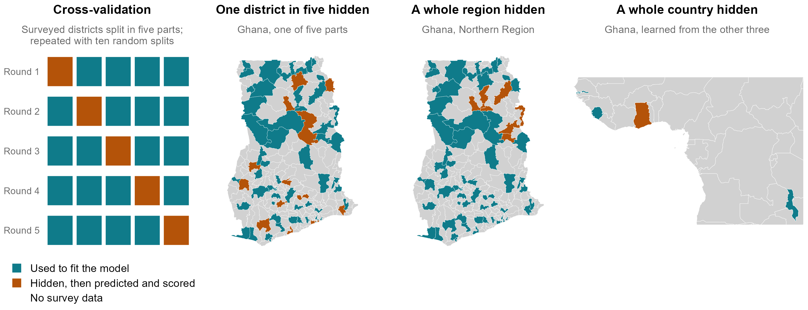{width="9.6in"}

::: {.notes}
ANDREW, about 40 seconds (92 words).

Here is what hiding data looks like. On the left, cross-validation: we split the surveyed districts into five parts, fit the model on four, predict the fifth, and rotate until every district has been predicted without its own data; then we repeat with ten random splits. Next, the same with a whole region hidden, here Ghana's Northern Region. And a whole country: Ghana predicted from the other three countries. Every score in this talk is on the orange districts, data the model never saw.

Backup, if asked: folds are cut at the district or above, never through a district's respondents; component weights and every other choice are learned inside the training folds. The middle map is the benchmark's first fold draw (make_folds_v2, rep 1).
:::

## Why not a more complex machine-learning model?

::: {.notes}
ANDREW, about 50 seconds (108 words).

The obvious question for the machine-learning people here: why such a simple model? Cross-validation answers it. We hide districts, fit on the rest, and score only on the hidden ones, with the same folds for every method. This is a big-data project in predictors, 575 layers, but a small-data project in places: 14 to 87 districts per country, each measured in about one community. With that few places, anything that tunes itself chases noise. The untuned index was the best, or within a whisker of the best, in every test, and the SuperLearner ensemble, which combines twelve methods, did no better. Parsimony wins.

Backup, if asked: Average status, SL-06 run (same folds for every learner). One district in five hidden: index 0.39, SuperLearner 0.38, random forest 0.38, boosting 0.37, elastic net 0.32, lasso 0.29. A region hidden: 0.38, 0.36, 0.39, 0.40, 0.23, 0.21. A country hidden: 0.28, 0.27, 0.25, 0.20, 0.29, 0.31. Forest and boosting edge the index by 0.01 to 0.02 when a region is hidden, lasso by 0.03 across borders, all well inside the intervals. On the share deficient the index leads inside a country (0.27 against at most 0.24 for these methods) and with a region hidden (0.27 against at most 0.23); across borders the ensemble is marginally ahead (0.20 against 0.19). A sample-size finding, not a claim about machine learning in general.
:::

## But can proxy models recover national-level prevalence estimates?

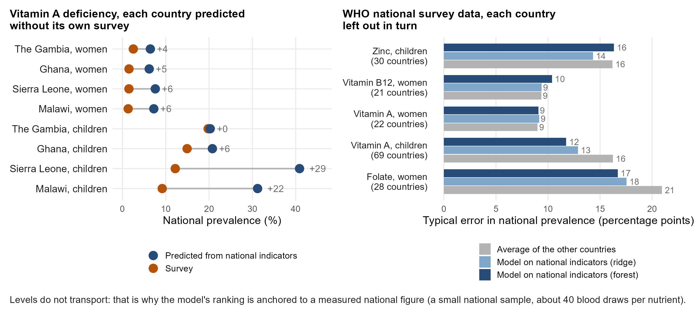{width="9.6in"}

::: {.notes}
ANDREW, about 45 seconds (112 words).

A question from our January meeting: can proxy models give a national prevalence? Inside a surveyed country the survey already gives it. Without the country's survey, not reliably. On the left, vitamin A deficiency predicted for each of our countries from national indicators, with that country's survey left out: close for The Gambia and Ghana, but 28 points too high for Sierra Leone and 15 for Malawi. On the right, WHO's national survey data from 20 to 70 countries: leaving each country out, the typical error is 9 to 18 points, and the model clearly beats the average of the other countries only for children's vitamin A and for folate. Levels do not travel between surveys; district order does. So we measure the national level with a small sample, and use the model for the order.

Backup, if asked: national track, WHO VMNIS national survey panel with World Bank indicators; the model is a SuperLearner over mean, ridge, lasso, elastic net and random forest, folds grouped by country, at the corrected survey years (national_vmnis_loco_sl.csv, national_levels_sl.csv; scripts/covariates/19b, figure script 35). A random forest alone does slightly better on children's vitamin A (12.0 against 12.9 points); for zinc and B12 no model beats the other-country average, and for women's vitamin A the best (ridge) beats it by 0.4 points. Only vitamin A has national panels matching our four surveys. The January version compared national predictions made inside each country, which match by construction. Why levels do not travel: assays, cut-offs, inflammation adjustment and RBP-to-retinol calibration differ between surveys (ferritin levels differ several-fold).
:::

## What about subnational prevalence estimates?

{width="9.4in"}

::: {.notes}
ANDREW, about 55 seconds (119 words).

Subnationally, the model works district by district. Here is Ghana, children's iron, as the order of districts; the level comes from the survey's national figure. Left: what the survey measured in the 75 districts it reached. Middle: the model's prediction for each of those districts with that district's own blood results hidden. Right: the model for all 260 districts.

Take Central Gonja, in Savannah region. The survey found it 13th worst of 75. Its regional average would put it 51st, middle of the pack. The model, which never saw its results, puts it 21st. And Prestea-Huni Valley, in the south-west: the survey found it among the best, 73rd; its regional average says 39th; the model says 69th. Overall, the model puts 68 of every 100 district pairs in the survey's order; the regional average, 61.

Backup, if asked: Correlations 0.53 against 0.36, reproducing benchmarks_v2_cells.csv. The regional average is the district's own region averaged over the OTHER surveyed districts there (the district itself left out); a national mean that leaves out the district's own region reverses the order (26 per cent of pairs, correlation -0.62), so it is not a fair comparator. The model is wrong in places too: its median district is 13 places from the survey's rank, the regional average's 18; the largest miss is Atiwa East (24th in the survey, 65th in the model). A map built from the survey's own neighbouring districts does about as well here (69 of 100 pairs, 0.53), but it needs the survey: averaged over all 18 in-country combinations the index scores 0.40 and the neighbour map 0.39; with a whole region hidden 0.38 and 0.38 on average status, 0.29 and 0.24 on the share deficient. Central Gonja rests on two survey clusters, Prestea-Huni Valley on one.
:::

## Can it rank Ghana's districts without Ghana's survey?

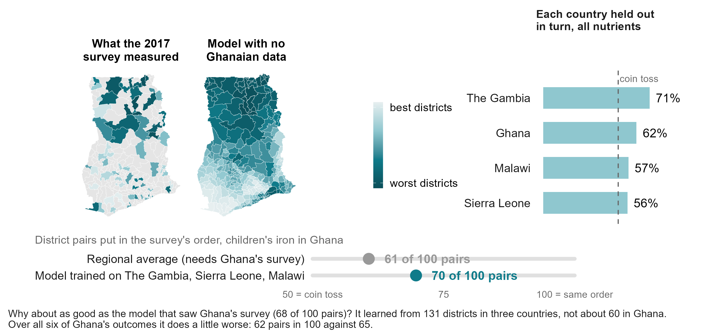{width="9.4in"}

::: {.notes}
ANDREW, about 60 seconds (134 words).

Now the test that matters for most of this region: we removed Ghana's survey entirely. The model learned only from The Gambia, Sierra Leone and Malawi. It still puts 70 of every 100 pairs of Ghana's districts in the survey's order for children's iron. This is one of our better cases.

Why no worse than the model that saw Ghana's own survey? Because it learned from 131 districts in three countries, instead of about 60 in Ghana. Across all six of Ghana's outcomes it does a little worse, 62 against 65. Holding each country out in turn: 71 for The Gambia, 62 for Ghana, 57 for Malawi, 56 for Sierra Leone. When it puts a district in the worst third of a country it has never seen, it is right about half the time, against a third by chance. A shortlist, not a measurement.

Backup, if asked: Correlation 0.554 held out against 0.529 in-country for this outcome, well within each other's intervals (in-country 95 per cent interval 62 to 75 per cent of pairs). The in-country score is the average over ten draws of five folds, each fold trained on 60 Ghanaian districts; the held-out score is one fit on the three other countries. Ghana held out does better than Ghana in-country for children's iron, children's vitamin A and B12, worse for women's vitamin A, iron and folate. Worst-third calls land 52 per cent of the time against 33 by chance; of the five worst named, 62 per cent.
:::

## What happens when a whole region is held out?

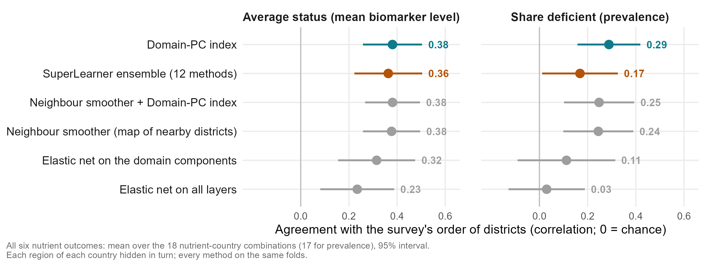{width="9.6in"}

::: {.notes}
ANDREW, about 40 seconds (71 words).

In between the two: a whole region the survey never reached, which is the hardest case for a map built from neighbouring districts, because it has to extrapolate. On average status, the index holds up and is level with that neighbour map. On the share deficient it is the best method. The SuperLearner ensemble is no better, and penalised regression on all the layers falls away. All six nutrient outcomes, averaged.

Backup, if asked: SL-06 run, every arm on the same folds, 18 nutrient-country combinations (17 on the share deficient, where one lacks the all-layer elastic net). The benchmark table gives the index 0.39 on average status in this estimand; this run 0.38. Ghana and Malawi are where this estimand is well determined; The Gambia and Sierra Leone give one number per region.
:::

## How well does it rank districts, nutrient by nutrient?

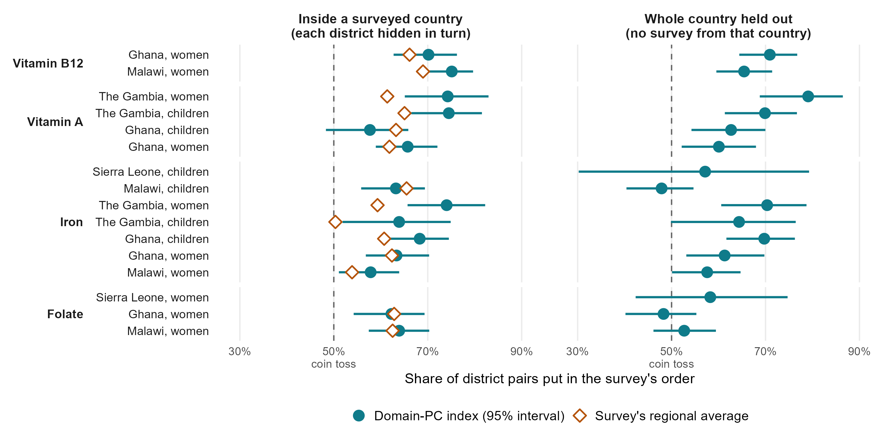{width="9.4in"}

::: {.notes}
ANDREW, about 50 seconds (112 words).

Here is every nutrient and country, with a 95 per cent interval. Left, inside a surveyed country; right, a whole country held out. B12 is the most mappable: about 70 of every 100 pairs right, at home and across borders, probably because it follows animal-source foods. Vitamin A works well in The Gambia and Ghana but was the weakest in the external check, so we would not rely on it for vitamin A yet. Iron works in most places, not all: across borders, Malawi's children are no better than a coin. Folate works inside a country but not across borders, most likely because the surveys measured it differently.

Backup, if asked: Measurable combinations only (16 of 24; zinc fails the screen). Intervals: percentile bootstrap over districts; in-country intervals clear 50 per cent in 13 of 14, held out in 10 of 16. Averages: 67 per cent inside a country (regional average 62), 62 per cent held out. Orange diamonds: the survey's own regional average, which needs the survey. Folate: immunoassay in Ghana and Sierra Leone, microbiologic assay in Malawi.
:::

## Accuracy by nutrient, against the best possible

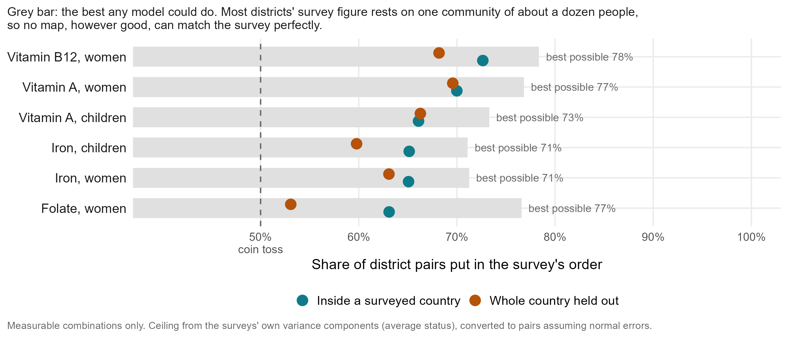{width="9.4in"}

::: {.notes}
ANDREW, about 35 seconds (70 words).

How close is this to the best possible? The survey's own district figures are noisy: most rest on one community of about a dozen people. So even a perfect model could agree with them only up to the grey bars, about 71 to 78 pairs in 100. Inside a country we reach 63 to 73. There is room left, but much of the remaining gap is the survey, not the model.

Backup, if asked: How the ceiling is known: how much two communities in the same district disagree tells us how noisy one community's result is (variance components, variance_components_ceiling.csv, average status). As correlations: B12 0.77, folate 0.74, vitamin A 0.71, iron 0.61, against the model's 0.63, 0.40, 0.53 and 0.44. Converted to pairs with 1/2 + arcsin(r)/pi, which assumes normal errors. More communities per district would raise the ceiling, at the price of fewer districts (appendix, planning slide).
:::

## How do proxy models compare with the survey's own information?

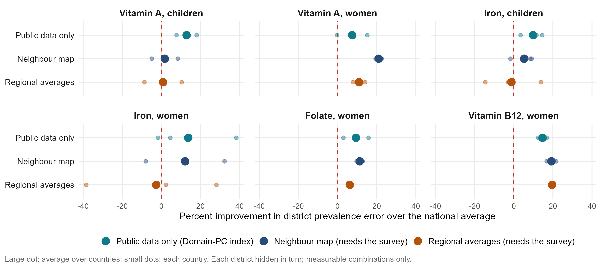{width="9.6in"}

::: {.notes}
ANDREW, about 40 seconds (90 words).

An updated version of a January slide, now for district prevalence. How much closer to the survey's own district figures do we get than by giving every district the national average? Public data alone improve on it by about 11 per cent on average: as much as a map of neighbouring districts built from the survey, and more than the survey's regional averages, at 5 per cent. The regional averages lose to the national figure for iron. For B12, the survey's own neighbours and regions do better still.

Backup, if asked: 1 minus the district prevalence error (mean absolute error) of each method over that of the national average without the district, each district hidden in turn (benchmarks_v2_cells.csv, prevalence target, calibrated index). Means over 14 measurable in-country combinations: public data 11.4 per cent, neighbour map 11.4, regional averages 4.6. The January slide scored person-level models with individual survey predictors; with district proxies alone a person-level model is a coin toss (appendix).
:::

## What does the model rely on?

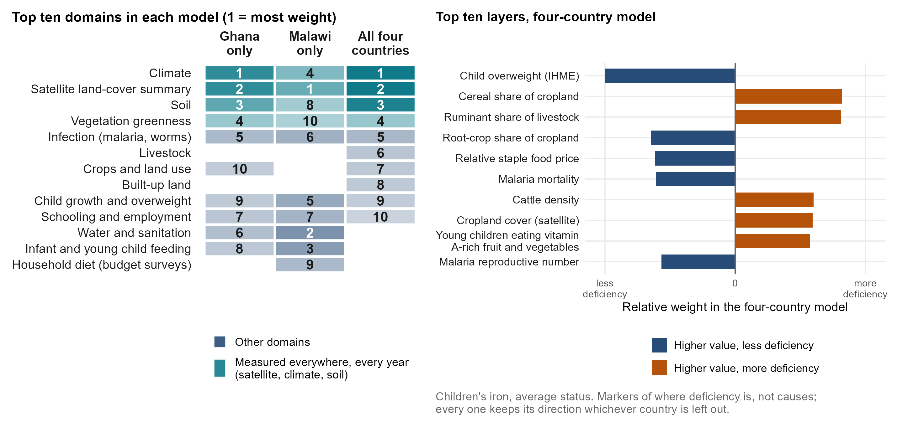{width="9.4in"}

::: {.notes}
ANDREW, about 50 seconds (113 words).

What does it rely on? Children's iron again. On the left, the top ten families of layers in three models: Ghana's alone, Malawi's alone, and the four-country model we use for a new country. All three lean on climate, satellite land cover and soil, measured everywhere, every year, which is why the model can travel. Beyond those, each country adds its own: in Malawi, water and sanitation and infant feeding. On the right, the four-country model's top ten layers. The farming system stands out: cereal-dominant cropping, ruminants and cattle mark more iron deficiency; root crops mark less. These are markers of where deficiency is, not causes.

Backup, if asked: Weight shares from index_importance_domains.csv (level target); layers from index_importance_columns.csv, pooled fit, ranked by standardised weight, and every one keeps its sign in all four leave-one-country-out fits. Malaria marks LESS iron deficiency here, most likely because inflammation raises ferritin even after adjustment: a feature of the biomarker, not protection. Child overweight marking less deficiency is a marker of richer, more urban districts. The Malawi B12 lakeshore example is in the appendix.
:::

## What can we learn about the consistently most important predictor domains?

::: {.notes}
ANDREW, about 50 seconds (110 words).

What have we learned about which families of data matter? Three are measured everywhere and matter for every nutrient. Climate: on its own it ranks a country held out better than all the layers together. Soil: nearly as well. And satellite land cover and greenness. Then some markers matter for particular nutrients: the farming system for iron, infection, malaria and worms, and for B12, how often young children eat meat or fish. Take all of these as markers of where deficiency is. They are consistent with the biology, but the model does not show causes. Reproductive health, which our January slide listed, does not make the list.

Backup, if asked: leave-one-domain-out and one-domain-only fits under country hold-out (domain_ablation_loco_summary.csv, average status): climate alone 0.335, soil alone 0.327, all layers 0.302; removing anaemia costs 0.020, crops and land use 0.012, infection 0.010, livestock 0.009. Farming-system directions from the four-country children's iron model. Fertility and reproductive health are not among the top domains in any model.
:::

## What about countries with no survey?

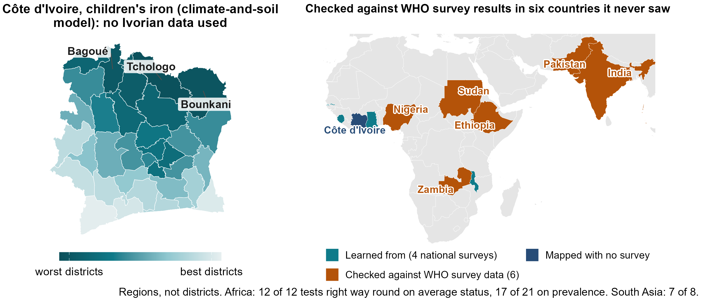{width="9.4in"}

::: {.notes}
ANDREW, about 60 seconds (135 words).

Most countries in this region have no recent biomarker survey. Côte d'Ivoire is one. Trained on our four countries, the climate-and-soil version of the model ranks its 33 districts for children's iron. The northern savanna comes out worst.

Can you trust a map like this? The WHO micronutrients database holds regional results from national surveys in Zambia, Ethiopia, Sudan and Nigeria, and in Pakistan and India. None were used to build the model. In Africa its ranking of their regions pointed the right way in all 12 tests of average status and 17 of 21 tests of prevalence; in South Asia, 7 of 8. And Côte d'Ivoire's own 2007 survey ranks its nine zones for vitamin B12 almost exactly as the model does. Regions, not districts, but data we did not touch.

Backup, if asked: XV-01/02: climate-and-soil index at admin-1; Africa average status 0.40 (country-block null 0.20), prevalence 0.33; off the continent 0.39; the same regional test inside our four countries 0.28 and 0.27. Iron points the right way on average in all six countries (13 of 14 iron cells). Not the pre-registered test, which needs a new country's own microdata at district level. Côte d'Ivoire 2007 B12: Spearman 0.95 over nine zones; predicted prevalences in the appendix.
:::

## Which deficiencies can it map?

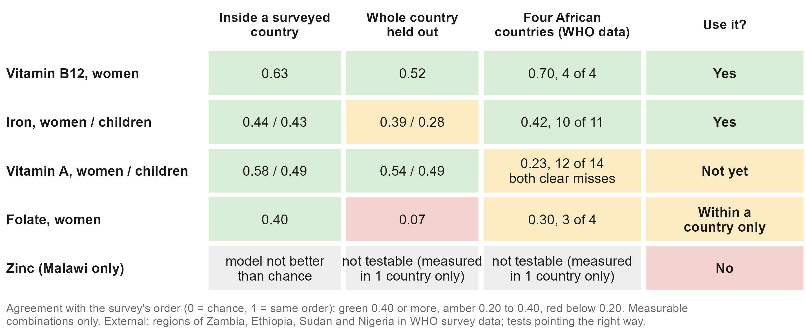{width="9.4in"}

::: {.notes}
ANDREW, about 40 seconds (88 words).

Putting it together. B12 and iron can be mapped from public data: inside a country, across borders, and in the external check. Vitamin A ranks well inside our countries but was the weakest externally, so not yet. Folate works only within a country. Zinc, measured only in Malawi, cannot be mapped: the model is no better than chance, because the survey itself shows no real difference between districts. How common a deficiency is does not decide this: folate and zinc are the commonest in our data, and the hardest.

Backup, if asked: External by nutrient, African deposits: B12 0.70 (4 of 4 tests), iron 0.42 (10 of 11), folate 0.30 (3 of 4), vitamin A 0.23 (12 of 14; the two clear misses, Zambia children and Ethiopia women at -0.43, are both vitamin A). Vitamin A is the strongest outcome in India and Pakistan. Malawi zinc in-country: children -0.11, women -0.03 (benchmarks_v2_cells.csv). The table's numbers are correlations (0 = chance); the external column is the four African countries' WHO data only.
:::

## What does this mean for policy? The vitamin B12 model

::: {.notes}
ANDREW, about 45 seconds (98 words).

What does this mean for a programme? Take our best model, women's B12. It puts 70 to 75 of every 100 district pairs in the survey's order, and 65 to 71 with the country's own survey removed. The fifth of districts it ranks worst hold 40 to 46 per cent of deficient women: about twice a random choice. Its district prevalences are typically within about 6 points of the survey's. And in the WHO survey data from Zambia, Ethiopia and Nigeria it pointed the right way in all four checks, as it did for Côte d'Ivoire's 2007 survey zones.

Backup, if asked: pairs from v3_percell_pairs.csv (Ghana 70 in-country, 71 held out; Malawi 75 and 65; Sierra Leone 71 held out, 14 districts). Worst fifth (nce_targeting_metrics.csv): Ghana 46 per cent (regional averages 45, perfect 65), Malawi 40 (regional 27, perfect 59). Prevalence error, each district hidden (conformal_prev_cells.csv): Ghana 6.6 points, Malawi 5.5; 90 per cent bands 21 and 27 points either side, coverage 0.91. External B12 (xv_transport.csv): Zambia average status 0.80, Zambia 0.75, Nigeria 0.71, Ethiopia 0.54 on prevalence; Pakistan's B12 is a miss (-0.26).
:::

## Conclusions

::: {.notes}
ANDREW, about 55 seconds (121 words).

So what can this model show? Where there is no survey: a first ranking of districts from free public data, checked against surveys it never saw; a shortlist of where to look first; and more reliably for B12 and iron than for the other nutrients. Alongside a new survey: it fills in the districts the survey did not reach, and orders them better than regional averages; with even a small national sample it gives a rough district prevalence, usually within about ten points; and it helps choose where to sample. It does not replace a survey, judge whether a programme worked, or say why a district is deficient. Everything is in a public dashboard; the QR code is on the screen.

Backup, if asked: Prevalence bands: split conformal, 90 per cent, leave-one-out coverage 0.90 to 0.93; median half-width 26 points, iron 30 to 37 (CP-01); median absolute error about 10 points. Anchor: a 5 per cent national sample (24 to 71 respondents) gives a median district error of 9.3 points. The model maps deficiency, not fortified-food coverage.
:::

## What have we learned, and what comes next?

::: {.notes}
ANDREW, about 50 seconds (112 words). The updated version of the full talk's closing slide; keep this or "Conclusions", or merge the two.

What have we learned? Public data can rank a country's districts by deficiency: inside a surveyed country, about two pairs in three in the survey's order, better than the survey's own regional averages. In a country with no survey it still ranks, less well, and it held up against surveys it never saw; a level needs one measured national number. Where the survey can see districts, we are close to the best any model could do. And the uncertainty we show has been checked. What comes next: more surveys in the pool, because each one so far has helped, and a fifth survey that is a real test.

Backup, if asked: pairs 67 against 62 per cent inside a country (14 measurable combinations), 62 held out (22); B12 73 against a ceiling of about 78; calibrated bands hold the survey's own value 90 to 93 per cent of the time (CP-01), while rank ranges hold it 38 per cent and are stability only. Pooling curve 0.20, 0.26, 0.30 on average, the gain so far in The Gambia and Ghana. Two candidate models were written down on 3 September 2026. Changes from the full-talk version: "every survey improves every other country's map" and "the curve has not flattened" were overclaims (review, 27 Sep); "0.38 from climate and soil" is the model chosen on the same 22 cells.
:::

## Next steps

::: {.notes}
ANDREW, about 30 seconds (70 words).

Three asks. If your country has a micronutrient survey, recent, planned or in a drawer, share it with the pool: on average, each survey we added improved the ranking for the countries held out. If you are planning one, let's design it together. And tell us how accurate a district ranking must be before you would use it. Modelling extends a survey's reach. It does not replace the survey.

Backup, if asked: Pooling curve: 0.20 with one training survey, 0.26 with two, 0.30 with three; the gain so far is in The Gambia and Ghana, not yet Malawi or Sierra Leone. Two candidate models were written down on 3 September 2026, so a fifth survey is a real test. Optional line for Sonja: next, with MIMI and GBD, we compare predictors framework by framework.
:::

## What we told you

::: {.notes}
ANDREW, about 35 seconds (80 words).

To close, what we told you. Free public data carry real signal about micronutrient deficiency. A simple model does best, because there are few places to learn from. It ranks districts no survey reached, and held up against surveys it never saw. It works best for B12 and iron, not yet for vitamin A, and not at all for zinc. And it extends surveys; it does not replace them. The dashboard is on the QR code. Thank you.
:::

# Appendix

## Is it just geography? Comparison with DHS-style geostatistics

{width="9.0in"}

::: {.notes}
Inside a surveyed country, geography does much of the work: a map of neighbouring districts ties the index. The DHS Program's model-based geostatistics (a spatial field plus covariates, fitted at the survey clusters) ranks worse on the same folds (0.27 against 0.38) but estimates levels better (9.2 against 10.7 points of error), because it shrinks uncertain districts toward a level. It needs measured clusters inside the country, so it has no answer for a country with no survey. The Côte d'Ivoire vitamin A ranking correlates 0.73 with latitude, yet its agreement with the independent WFP and MIMI map survives adjusting for latitude (0.495 to 0.479).
:::

## What is the cheapest way to get district numbers?

{width="9.2in"}

::: {.notes}
How to read it: the horizontal axis is how big a survey you can afford, as a share of a full national survey. The vertical axis is how far each design's district prevalences land from the full survey's own district figures, in percentage points (typical district). Red: a smaller survey that measures each district directly; it reaches zero at 100 per cent only because it then is the full survey. Green: measure one national number with a small sample and let the model spread districts around it; about 9 points off at any size, because the ranking's error dominates. At 5 per cent of a survey (about 40 blood draws per nutrient) that beats a small district survey (17 points off). From about a quarter of a full survey upward, measuring districts directly wins. A cheap first pass when there is no survey, not a substitute for one.
:::

## How can it help plan the next survey?

::: {.notes}
Moved to the appendix in v4. How close can any model get: the survey's own district numbers are noisy, because most rest on one community of about a dozen children, so even a perfect model could agree with them only up to the grey bars (average status, as correlations: B12 0.77, folate 0.74, vitamin A 0.71, iron 0.61; the model 0.63, 0.40, 0.53, 0.44). More communities per district would raise that limit, though at a fixed budget that means fewer districts. Sierra Leone has the most clusters per district (4.3) and the weakest results: 14 districts of half a million people is the wrong unit. Anchor: 5 per cent national sample (24 to 71 respondents), median district error 9.3 points. SP-01: model-guided district choice is about equal to random; both beat population-weighted choice.
:::

## How does it compare with other methods, including machine learning?

{width="9.2in"}

::: {.notes}
Every method on the same held-out folds, agreement on average status (Spearman). Inside a surveyed country: the Domain-PC index 0.40, neighbour smoother with proxies 0.39, neighbour smoother alone 0.39, the full SuperLearner 0.38, a twenty-layer composite 0.36, penalised regression 0.33, the regional average 0.31. A region held out: 0.39, 0.38, 0.38, 0.36, 0.34, 0.26. A country with no survey: index 0.30, SuperLearner 0.27, twenty layers 0.23, penalised regression 0.28; the smoothers and the regional average need a survey. The SuperLearner row comes from the SL-06 run with the same design, in which the index scored 0.39, 0.38 and 0.28. The estimator and the domain sets were chosen while looking at these four countries, which is why the fifth survey is pre-registered.
:::

## Which data sources contribute most to model prediction performance?

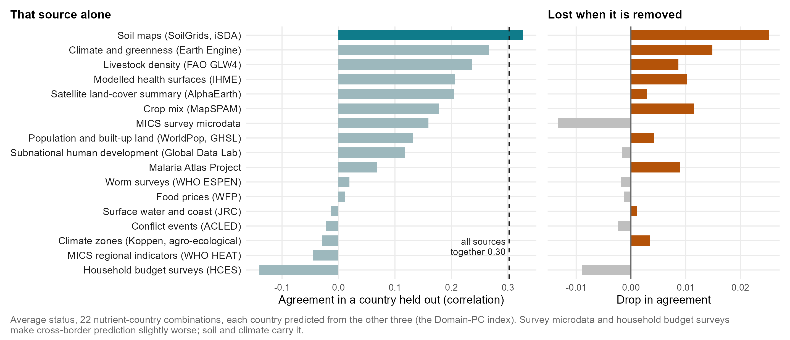{width="9.6in"}

::: {.notes}
Updated from the January slide (which scored drops in error for women's B12 and iron in Ghana). Now each country is predicted from the other three, averaged over 22 nutrient-country combinations: left, the ranking with one source alone; right, how much it drops when that source is removed. Soil maps alone (0.33) beat all sources together (0.30); climate and greenness from Earth Engine, crop mix, IHME health surfaces, livestock and the Malaria Atlas each cost accuracy when removed. MICS survey microdata and household budget surveys make cross-border prediction slightly worse (source_ablation_loco_summary.csv). DHS microdata are not in the cross-border set.
:::

## What can we learn about missing predictor domains?

::: {.notes}
Updated from the January slide. Evidence: leave-one-domain-out under country hold-out (domain_ablation_loco_summary.csv, average status, all layers 0.302). Removing fortification and supplementation changes nothing (0.000); food prices -0.001; conflict -0.002; child anthropometry +0.001; immunisation +0.003. Removing schooling and employment IMPROVES the held-out ranking by 0.013, water and sanitation by 0.010, household budget surveys by 0.009, infant feeding by 0.006: they help inside a country (schooling for vitamin A) but do not travel. Likely reasons: overlap with climate, soil and infection; national-only figures with no district contrast; different survey years, questions and designs between countries.
:::

## What does the model rely on, for each women's outcome?

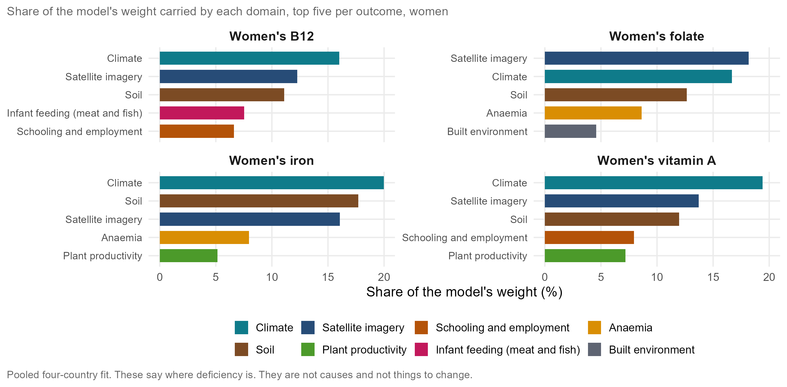{width="9.4in"}

::: {.notes}
For every women's nutrient the same three families carry about half the weight: climate, soil, and a satellite summary of land cover. Then each nutrient adds something a nutritionist would recognise: B12 leans on infants eating meat or fish, iron and folate on anaemia, vitamin A on schooling and household wealth. These say where deficiency is, not why. The satellite summary is Google's AlphaEarth embedding: a year of imagery compressed into 64 numbers.
:::

## Malawi: why the weights are not causes

{width="9.0in"}

::: {.notes}
Malawi women's B12 is the best-predicted combination in the study. The modelled anaemia surface carries weight in the wrong direction: districts with more anaemia have better B12 status (rho -0.40), because anaemia and malaria are highest along the lakeshore, where households eat fish (rho -0.48). The model found a marker for a place, not a mechanism.
:::

## Which outcomes and cut-offs does the analysis use?

| Outcome | Population | Countries | Biomarker and adjustment | Cut-off |
|:---|:---|:---|:---|:---|
| Iron deficiency | Children under 5; women 15-49 | All four | Ferritin, adjusted for inflammation (BRINDA or Thurnham factors, following each survey) | Under 12 µg/L (children), 15 µg/L (women) |
| Vitamin A deficiency (low RBP) | Children under 5; women 15-49 | All four | Retinol-binding protein, BRINDA-adjusted, converted to retinol with each survey's calibration | Under 0.70 µmol/L |
| Folate deficiency | Women 15-49 | Ghana, Sierra Leone, Malawi | Serum folate: immunoassay (Ghana, Sierra Leone), microbiologic assay (Malawi) | Under 10 nmol/L |
| B12 deficiency | Women 15-49 | Ghana, Sierra Leone, Malawi | Serum B12 (Ghana: a subsample) | Under 150 pmol/L (Malawi 148) |
| Zinc deficiency | Children under 5; women 15-49 | Malawi | Serum zinc, by time of blood draw | Children 65 (morning) or 57 (afternoon) µg/dL; women 66 or 59 |
| Selenium, iodine | Children and women; women | Malawi, within-country only | Plasma selenium; urinary iodine | 84.6 µg/L; 100 µg/L |

::: {.notes}
Verified against R/config.R, R/data_prep.R and docs/survey_report_reconciliation.md on 27 September. Corrections to the January slide: iron is not BRINDA everywhere (Ghana and Sierra Leone use Thurnham factors); women's vitamin A is BRINDA-adjusted like children's; folate and B12 are also measured in Malawi; iodine is configured for Malawi women (The Gambia and Sierra Leone were a separate within-country test); log scale is the modelling target, not an adjustment. Sierra Leone's child file holds only anaemic children (532 of 654 assayed). IMPORTANT caveat for Andrew: the results in this talk come from the modelling targets built on 8 September (retinol-equivalent vitamin A rule); the 15 September corrections (vitamin A on the RBP < 0.70 rule, non-pregnant women and children 6-59 months only, Sierra Leone women's iron on Thurnham, Malawi repeated Traditional Authority names, Malawi zinc on the survey's own flag) are not yet propagated to the result tables.
:::

## How firmly is each Côte d'Ivoire district placed?

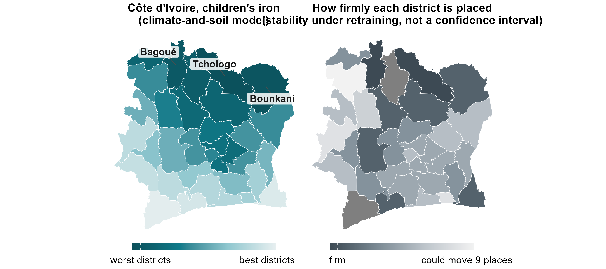{width="9.4in"}

::: {.notes}
Right: the width of each district's 90 per cent rank interval over 400 refits of the training districts. Dark = firm. Stability under retraining, not a confidence interval: holding out each surveyed country, the survey's rank falls inside the nominal 90 per cent interval only 38 per cent of the time.
:::

## Which deficiencies can be mapped at district level at all?

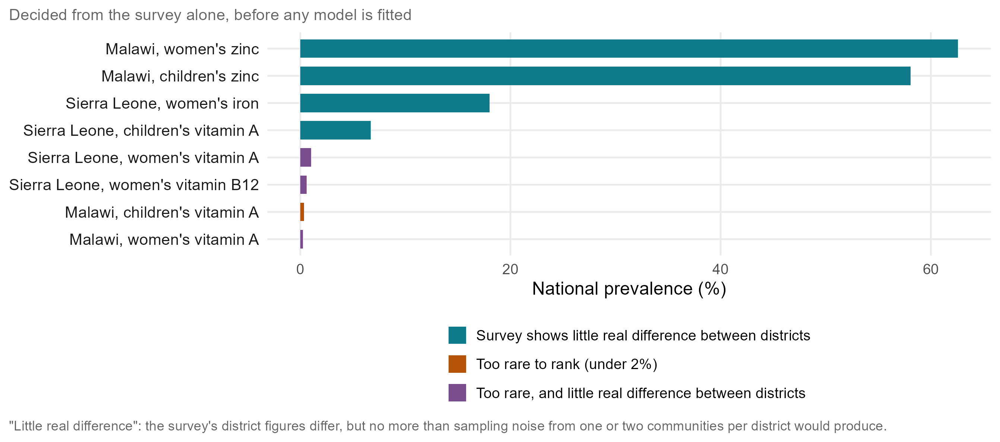{width="9.2in"}

::: {.notes}
The screen applied before any model is fitted: keep a combination if national prevalence is at least 2 per cent and the survey's own district figures show real differences between districts. Eight of 24 fail. "Little real difference" is not too much variation: the survey's district figures do differ, but no more than the sampling noise of one or two communities per district would produce, so the real between-district share is small or zero. For children's zinc in Malawi the district share of the variance is zero: communities differ, but not in a way that lines up by district, and the zinc cut-offs depend on the time of day and fasting at the blood draw. Sierra Leone's children's vitamin A and women's iron: with only 14 very large districts, the survey's district differences are indistinguishable from sampling noise. Common is not the same as mappable: mapping needs contrast.
:::

## Does targeting reach more deficient people?

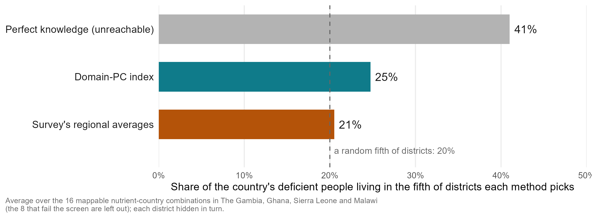{width="9.0in"}

::: {.notes}
Not one country or outcome: the average over the 16 mappable nutrient-country combinations in all four countries, the 8 that fail the screen left out. A programme reaching the fifth of districts the model ranks worst reaches 24.8 per cent of the deficient people; the survey's regional averages 20.5; a random fifth 20 by definition; a perfect map 41.0. Over all 24 combinations, as in earlier versions: 21.9, 20.3 and 47.5. In Ghana children's iron, simply taking the most populous fifth of districts reaches 46 per cent: to reach the most people, rank by predicted rate times population.
:::

## Accuracy pooled over all nutrients, in district pairs

{width="9.2in"}

::: {.notes}
Pooled over 18 combinations, each district hidden. The regional average here is each district's own region averaged over the other surveyed districts in that region (the district itself left out): what a programme would know for a district the survey missed. A national mean excluding the district's own region is not a fair alternative: it reverses the order (26 per cent of pairs right, correlation -0.62), because districts in high-deficiency regions are assigned the healthier rest of the country. The fair "no information" comparator is a coin toss (50 per cent), which a single national figure also gives.
:::

## Every combination of training countries

{width="9.2in"}

::: {.notes}
Every subset of training countries scored on each held-out country: about +0.05 per country added, not flattened at three; the gain is in The Gambia and Ghana.
:::

## The 2007 Côte d'Ivoire survey and the B12 prediction

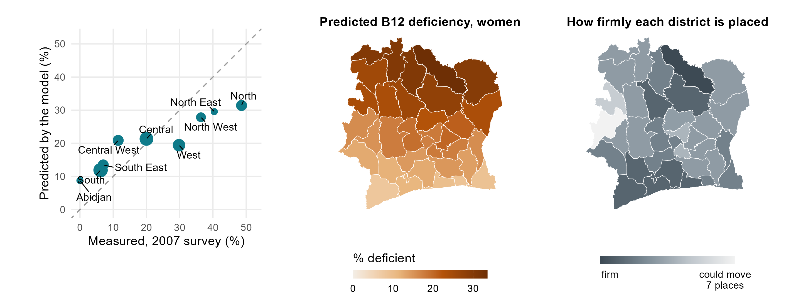{width="9.4in"}

::: {.notes}
Left: women's B12 deficiency in the nine zones of the 2007 national survey against the model's predicted prevalence, averaged over the districts in each zone (dashed line: perfect agreement). The ranking is transported from the four surveyed countries with no Ivorian biomarker; the level is anchored to the survey's national 18.1 per cent, the design the talk recommends (a small national sample plus the ranking): predicted = expit(logit(0.181) + 0.33 x 1.48 x z), z the standardised climate-and-soil B12 index, 0.33 how well that ranking held up for B12 when each training country was held out, 1.48 the between-district spread (logit) in the training surveys. The order matches almost exactly (0.95 over nine zones); the spread is compressed, 9 to 31 per cent predicted against 0 to 49 measured, mean error 8.7 points, as expected from a shrunken ranking. Middle: the district map. Right: how firmly each district is placed over 400 refits (stability, not a confidence interval). Caveats: 2007, zones are not administrative units (centroid crosswalk), nine points, a steep north-south gradient. Table: results/tables/policy_deck/v4_civ_b12_anchored.csv.
:::

## What happens when a whole country is held out?

{width="9.2in"}

::: {.notes}
Trained on three countries, applied to the fourth: 0.30 over 22 combinations, positive in 18, against a null 95th percentile of 0.08. National mean biomarker concentrations differ several-fold between surveys, so what crosses a border is the order of districts, not a prevalence.
:::

## Does the model track the survey, district by district?

{width="9.2in"}

::: {.notes}
The cloud is tilted but not on the line: the model ranks, and compresses the range. Hollow points are single-cluster districts; much of the vertical scatter is the survey's noise.
:::

## The live dashboard

{width="9.4in"}

::: {.notes}
amertens.shinyapps.io/micronutrient-burden: every district of the four countries and Côte d'Ivoire, planning prevalence with calibrated bands, WHO severity class, people affected, the external check, a survey planner and country briefs. Its "new country" tile (0.38) is the climate-and-soil model; the talk's 0.30 is the full index.
:::

## Person-level models: a coin toss on proxies alone

{width="9.2in"}

::: {.notes}
A person-level ensemble under district-blocked folds has a mean AUC of 0.50 on district proxies. Aggregating a person-level classifier also biases area means, which is why the area-level model is the headline.
:::
