```{r setup}
# MNF 2026 joint talk, VERSION 6 (28 September 2026). v1 to v5 are untouched.
# v6 = v5 in the 15-minute order Andrew asked for (motivation, data assembly, methods,
# national prevalence, district prevalence, ranking, out of country, variable importance,
# policy and next steps, conclusions), about 13 minutes spoken; three slides to the
# appendix, two pairs merged; the survey's regional average scored fairly (script 39).
# Render: python scripts/policy_deck/40_build_v6_source.py; bash scripts/render_deck.sh
#   docs/slides/MNF15-talk-2026-09-v6.qmd --forum --no-label --text 18,12
#   --concept docs/slides/MNF15-talk-2026-09-v6.concept.yaml; python scripts/policy_deck/41_merge_v6_slides.py
suppressPackageStartupMessages({library(dplyr); library(knitr)})
```

## Introduction and study objectives

::: {.notes}
SONJA, about 40 seconds (92 words).

Information on how common vitamin and mineral deficiencies are is limited. The map shows how limited for sub-Saharan Africa: 17 of 47 countries have no national biomarker survey on record, and only 10 have one from 2015 or later. A survey gives national and regional numbers, while programmes are planned district by district. So we brought together nutritionists, epidemiologists and data scientists to ask which approaches and data could help. Our objectives: to see whether machine learning on aggregated proxy data can estimate deficiency prevalence, nationally and by district, and find the districts at greatest risk.

Backup, if asked: map and bars from the WHO VMNIS Micronutrients Database (export of 25 February 2025), nationally representative surveys measuring ferritin, retinol or RBP, zinc, folate or vitamin B12 (scripts/policy_deck/33_mnf15_v4_vmnis_coverage.R); surveys not yet deposited are not shown, and all four of our surveys are in it. For zinc, only five countries have a survey from 2015 or later. Worldwide, in low- and middle-income countries over 1988 to 2018: vitamin A data in 77 countries, iron 53, folate 24, zinc 21, B12 7 (Brown, Moore, Hess et al., Am J Clin Nutr 2021, CC BY 4.0). The global estimate of 56 per cent of young children and 69 per cent of women with at least one deficiency rests on 24 surveys in 22 countries (Stevens et al., Lancet Glob Health 2022). Fortification is set nationally (Nyumuah et al., Food Nutr Bull 2012); coverage of fortified foods is lower among poor and rural households (Aaron et al., J Nutr 2017). Why model at all: by the conventional survey bands for the coefficient of variation, 86 per cent of the 1,350 direct district prevalence estimates in our four surveys have a CV above 33.3 per cent and 5 per cent are under 16.6 per cent (median CV: Ghana 100 per cent, Malawi 96) (explore/out/19_cv_bands.csv). Two guards: these are the survey's own direct district figures, not the model's, so this says modelling is needed, not that the model's outputs are unreliable; and CV (standard error over prevalence) penalises rare outcomes by construction, so the estimates that pass are simply the high-prevalence ones.
:::

## Talk outline

::: {.notes}
SONJA, about 20 seconds (50 words).

We'll try to answer five questions. Can public data tell us how common a deficiency is, nationally or by district? Can they rank a country's districts? Does that work where there has never been a survey? Which data matter? And how could programmes and survey planners use it?
:::

## Conceptual framework of iron deficiency

::: {.notes}
SONJA, about 20 seconds (42 words).

We did not start from satellites. We started from what causes deficiency. This is our conceptual framework for iron, adapted from our 2023 paper: intrinsic risk, the fundamental drivers, underlying and intermediate risk factors, and the direct causes of iron deficiency.

Backup, if asked: Hess et al., Ann N Y Acad Sci 2023, adapted.
:::

## Which of these causes can public data measure?

::: {.notes}
SONJA, about 45 seconds (98 words).

So we went back to the framework, box by box, and asked: is there a public, district-level measure? Dark green: yes, and the data describe the place itself: climate, ecology, built-up land. Light green: yes, as a district average standing in for individuals: poverty, schooling, water and sanitation, infection. Amber: only a national figure, a modelled surface, or part of the box. Grey: nothing public. Everything here is a district average, never the person whose blood was drawn. So these layers mark where deficiency is likely; they cannot explain any one person's status.

Backup, if asked: Inherited red blood cell disorders: the only layers are the Malaria Atlas 2012 modelled allele-frequency surfaces (sickle haemoglobin, haemoglobin C, G6PD deficiency), so amber, not green; population gene frequencies, not anyone's genotype, filed with infection because they largely follow historical malaria, and about 1 per cent of the four-country model's weight. Genetic risk beyond these (for example variants affecting iron absorption): nothing public, so grey. Fundamental drivers: climate, ecology and geography are measured everywhere; politics is conflict events only (ACLED), economy district wealth averages, and inequity one layer, the spread of relative wealth within the district, so that half is amber. Chronic disease: nothing beyond HIV. Health and nutrition knowledge: the only layers are schooling and literacy, already counted under education, so grey. Family planning, obstetric history, pregnancy and women's BMI come from DHS: public, so coloured, though the headline model leaves DHS out. Food insecurity: IPC phase, food consumption score and coping index each cover two or three of the countries, none of them Ghana, which has household food spending and market prices. Blood loss: hookworm and schistosomiasis prevalence from WHO ESPEN, nothing on menstrual or obstetric loss. Inflammation: infection burden only, no CRP or AGP. Calls still marked draft for Sonja: built environment, family planning, obesity, health and nutrition knowledge, other micronutrient deficiencies (scripts/policy_deck/30_mnf15_v4_framework_drawn.py).
:::

## Which surveys did we use to train the models?

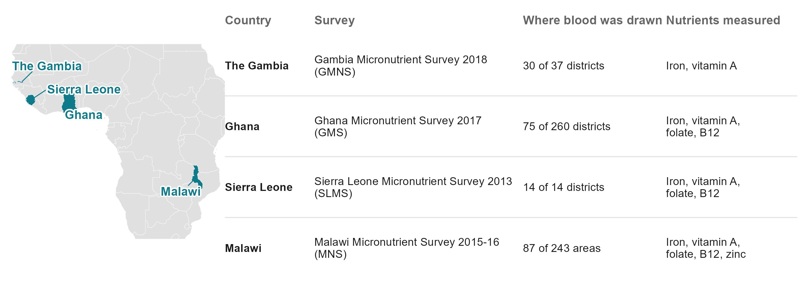{width="9.6in"}

::: {.notes}
SONJA, about 25 seconds (58 words).

The models learn from four national micronutrient surveys: The Gambia 2018, Ghana 2017, Sierra Leone 2013 and Malawi 2015 to 16. Together, 206 districts where blood was drawn: 30 of The Gambia's 37 districts, 75 of Ghana's 260, all 14 of Sierra Leone's, and 87 of Malawi's 243 areas. These data exist because these teams collected them. Thank you.

Backup, if asked: outcome definitions, adjustments and cut-offs are in the appendix. Sierra Leone's child file holds only anaemic children (532 of 654 assayed). Malawi's areas are Traditional Authorities. Ghana's survey reached 90 clusters in its 75 districts. Survey partners for Ghana's 2017 survey: University of Ghana, GroundWork, University of Wisconsin-Madison, KEMRI-Wellcome Trust, with UNICEF and Global Affairs Canada.
:::

## How do we get honest estimates of model performance?

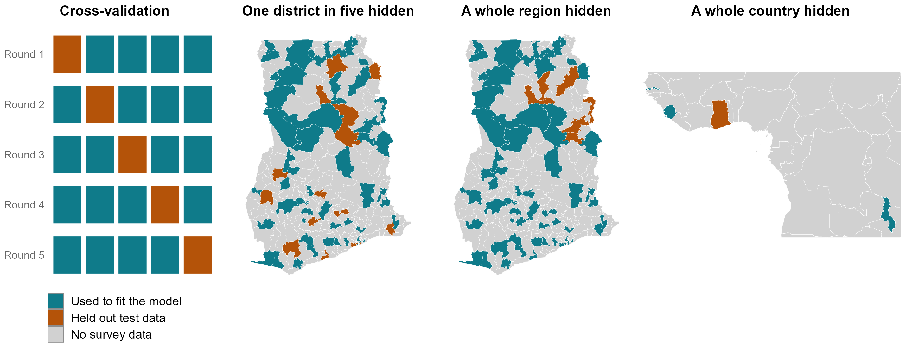{width="9.6in"}

::: {.notes}
ANDREW, about 40 seconds (90 words).

Thank you, Sonja. Every number I show comes from data the model never saw. On the left, cross-validation: we split the surveyed districts into five parts, fit on four, predict the fifth, and rotate until every district has been predicted without its own data; then we repeat with ten random splits. Next, the same with a whole region held out. And a whole country: Ghana predicted from the other three countries. Every score is on the orange districts, the held-out test data.

Backup, if asked: folds are cut at the district or above, never through a district's respondents; component weights and every other choice are learned inside the training folds. District folds are random, not grouped in space; the region hold-out is the spatially grouped test. The middle map is the benchmark's first fold draw (make_folds_v2, rep 1).
:::

## Why not a more complex machine-learning model?

::: {.notes}
ANDREW, about 45 seconds (100 words).

The obvious question for the machine-learning people here: why such a simple model? This is a big-data project in predictors, 575 layers, but a small-data project in places: 14 to 87 districts per country, each measured in about one community. We compared 14 methods on the same held-out districts, including random forests, boosting and a SuperLearner ensemble that combines twelve. None did more than slightly better on average across nutrients, and none was better everywhere. So we use the simplest one, a weighted sum of principal components, with nothing tuned.

Backup, if asked: average status, the post-fix SuperLearner runs of 28 September (predictors rank-normalised within country, the production default; one district in five and a region from the NS-01 runs, a country from its own run), every method on the same folds. One district in five hidden: index 0.39, SuperLearner 0.37, random forest 0.38, boosting 0.37, elastic net 0.32, lasso 0.32. A region hidden: 0.39, 0.37, 0.41, 0.39, 0.28, 0.25. A country hidden: 0.28, 0.28, 0.24, 0.19, 0.29, 0.29. Per outcome the winner changes; folate is the index's worst case (0.27 behind the best method with the country hidden). On the share deficient the index leads in all three: 0.30 against at most 0.25 inside a country, 0.28 against at most 0.24 with a region hidden, 0.17 against at most 0.16 with the country hidden. A sample-size finding, not a claim about machine learning in general.
:::

## But can proxy models recover national-level prevalence estimates?

{width="9.6in"}

::: {.notes}
ANDREW, about 45 seconds (105 words).

A question from our January meeting: can proxy models give a national prevalence? Inside a surveyed country the survey already gives it. Without the country's survey, not reliably. On the left, every outcome we can test, each of our countries predicted from national indicators with its own survey left out: close for some, but 28 points too high for Sierra Leone's children's vitamin A, 38 too low for its women's folate, 34 too low for Malawi's zinc. On the right, WHO's national survey data from 21 to 69 countries: the model beats the average of the other countries only for children's vitamin A and folate. Levels do not travel between surveys; district order does.

Backup, if asked: national track: WHO VMNIS national survey panel with World Bank indicators; a SuperLearner over mean, ridge, lasso, elastic net and random forest, folds grouped by country (national_vmnis_loco_sl.csv, _pred.csv, national_levels_sl.csv; scripts/covariates/19b; figure script 37). Left panel: vitamin A at each survey's year against the survey's own national figure; folate, B12 and zinc against the country's own VMNIS row. Median miss 7 points, largest 38. Iron has no national panel. The January version compared national predictions made inside each country, which match by construction. Why levels do not travel: assays, cut-offs, inflammation adjustment and RBP-to-retinol calibration differ between surveys (ferritin levels differ several-fold).
:::

## How well does it rank districts, nutrient by nutrient?

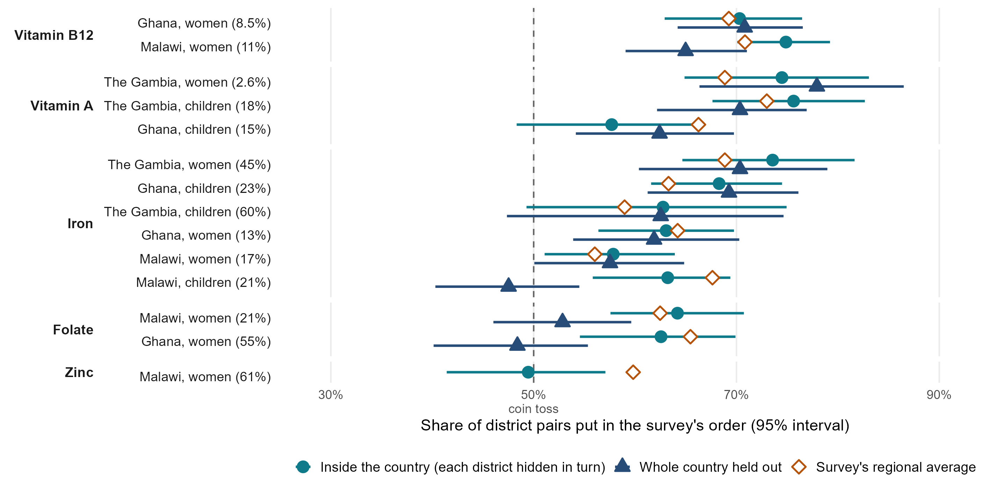{width="9.6in"}

::: {.notes}
ANDREW, about 50 seconds (125 words).

Here is every nutrient and country, with a 95 per cent interval, and the national prevalence in brackets. Circles: inside a surveyed country. Triangles: the whole country held out. Diamonds: the survey's own regional figures, which inside a country do about as well as the model. B12 is the most mappable: about 70 of every 100 pairs right, at home and across borders, probably because it follows animal-source foods. Vitamin A works well in The Gambia, less in Ghana. Iron works in most places, not all: across borders, Malawi's children are no better than a coin. Folate works inside a country but not across borders, most likely because the surveys measured it differently. Zinc, measured only in Malawi, is no better than a coin.

Backup, if asked: measurable combinations only; Sierra Leone is not shown (14 districts leave too few to train on inside the country). In-country intervals clear 50 per cent in 11 of 14; held out in 9 of 15 (all measurable with a held-out test). Averages over the 14 shown: 66 per cent inside a country (65.6), 63 held out (the 13 with a held-out test), the survey's regional figures 65 (65.3; model ahead in 9 of 14). Diamonds: every district in a region gets the figure of the region's other surveyed districts, so two districts in the same region count as a coin toss (scripts/policy_deck/39_fair_regional_pairs.py). The earlier scoring, each district left out of its own region's figure, gave 61 because it reverses two surveyed districts of the same region by construction. The regional figures need the survey; the model does not. On the 17 per cent of pairs the survey clearly separates (difference larger than 1.96 standard errors), the model gets 81.0 in 100, the regional figures 80.5, the neighbour map 81.5: every method does better on easy pairs (SEP-01, sep01_summary.csv). After the fixes Ghana's women's vitamin A dropped out (prevalence 1.6 per cent, under the 2 per cent screen) and, with the post-fix variance components, so did Malawi's children's vitamin A (ceiling 0.15, under the 0.30 screen); Malawi's women's zinc came in (ceiling 0.37) and has no held-out test, zinc being measured in one country only. Folate: immunoassay in Ghana and Sierra Leone, microbiologic assay in Malawi.
:::

## Which districts should a programme go to first?

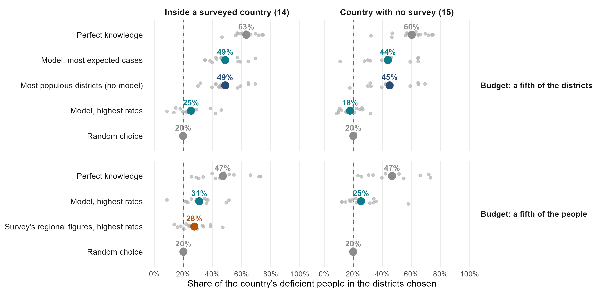{width="10.4in"}

::: {.notes}
ANDREW, about 45 seconds (101 words).

Which districts should a programme go to first? It depends on the budget. Top half: a budget of districts. Ranking by the model's rates reaches only a quarter of the deficient people; simply taking the most populous fifth reaches almost half, and the model adds nothing to that. Bottom half: a budget per person, say supplements. Covering a fifth of the people in the model's highest-rate districts reaches 31 per cent of the deficient inside a surveyed country, and 25 in a country with no survey, against 20 at random.

Backup, if asked: the same result as the budget rows of the previous slide, as a figure; keep one of the two slides. TC-01 (scripts/protocol_v2/74, tc01_targeting_by_cases_summary.csv), post-fix measurable combinations (14 in-country, 15 held out). Budget of districts: most populous 49 and 45 per cent, model expected cases 49 and 44, model rate 25 and 18, perfect 63 and 60. Budget of people: model rate 31 and 25, the survey's regional figures 28 (in-country only), perfect 47 and 47, random 20. Grey dots: each combination.
:::

## Where do the young children live?

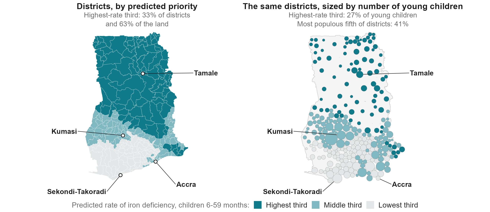{width="10.4in"}

::: {.notes}
ANDREW, about 35 seconds (84 words).

Why does going where the people are win when the budget is a number of districts? Here is Ghana. On the left, the model's highest-rate third of districts: most of the north, 63 per cent of the land. On the right, the same districts sized by the number of young children. That third holds 27 per cent of them; the 52 most populous districts hold 41 per cent. Choose districts by population when you fund districts; rank by rate when you fund per person.

Backup, if asked: Ghana, children's iron: the in-country model fitted on the 75 surveyed districts and applied to all 260 (prevalence target; Spearman 0.95 against the average-status map in the appendix); children aged 6-59 months from admin2_population.rds; circles laid out so they do not overlap (script 48, ghana_child_iron_priority_all_districts.csv). Across the 14 in-country combinations, measured against survey prevalence in surveyed districts, a fifth of districts chosen by population reaches 49 per cent of deficient people and by the model's rate 25; per person, the model's rate reaches 31 per cent with a fifth of the people (TC-01). Do not quote case shares computed from the model's own predicted rates: they overstate the spread between districts (the highest-rate fifth would seem to hold 43 per cent of expected deficient children), the same level problem as on the national slide.
:::

## Can it rank Ghana's districts without Ghana's survey?

{width="9.4in"}

::: {.notes}
ANDREW, about 50 seconds (112 words).

Now the test that matters for most of this region: we removed Ghana's survey entirely. The model learned only from The Gambia, Sierra Leone and Malawi. On the left, the survey's ranking of districts for children's iron; next to it, the model's, with no Ghanaian data at all. It puts 69 of every 100 pairs of Ghana's districts in the survey's order. This is one of our better cases. On the right, each country held out in turn, all nutrients: 70 for The Gambia, 62 for Ghana, 57 for Malawi, 56 for Sierra Leone. A shortlist, not a measurement.

Backup, if asked: correlation 0.54 held out against 0.53 in-country for this outcome, within each other's intervals. Why about as good as the model that saw Ghana's survey: it learned from 131 districts in three countries instead of about 60 in Ghana; over all six of Ghana's outcomes it does a little worse, 62 pairs in 100 against 65. The survey's own regional figures, which need the survey, put 63 in 100 in order (scored as a planner would use them; 61 the older way, which under-rates them). Ghana held out does better than Ghana in-country for children's iron, children's vitamin A and B12, worse for women's vitamin A, iron and folate.
:::

## What about countries with no survey?

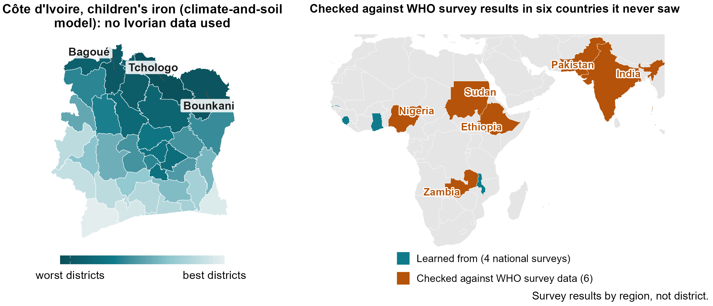{width="9.4in"}

::: {.notes}
ANDREW, about 55 seconds (120 words).

Most countries in this region have no recent biomarker survey. Côte d'Ivoire is one. Trained on our four countries, the climate-and-soil version of the model ranks its 33 districts for children's iron; the northern savanna comes out worst. Can you trust a map like this? WHO's micronutrients database holds regional results from national surveys in Zambia, Ethiopia, Sudan, Nigeria, Pakistan and India. None were used to build the model. In Africa its ranking of their regions pointed the right way in all 12 tests of average status and 18 of 21 tests of prevalence; in South Asia, 7 of 8. And Côte d'Ivoire's own 2007 survey ranks its nine zones for B12 almost exactly as the model does.

Backup, if asked: XV-01/02, rerun on the fixed targets: climate-and-soil index at admin-1; Africa average status 0.40 (country-block null 0.20), prevalence 0.34; off the continent 0.38. Iron points the right way in all 14 iron tests across the six countries (weakest Ethiopia, 0.01). Regions, not districts; not the pre-registered test, which needs a new country's own microdata at district level. Côte d'Ivoire 2007 B12: Spearman 0.95 over nine zones. The Côte d'Ivoire map is post-fix (ranking rebuilt 28 September, 05:07); the survey fixes barely moved it (rank agreement 0.999 with the 8 September map; the same seven worst districts, led by Tchologo, Bounkani and Bagoué).
:::

## Is Côte d'Ivoire like the places we learned from?

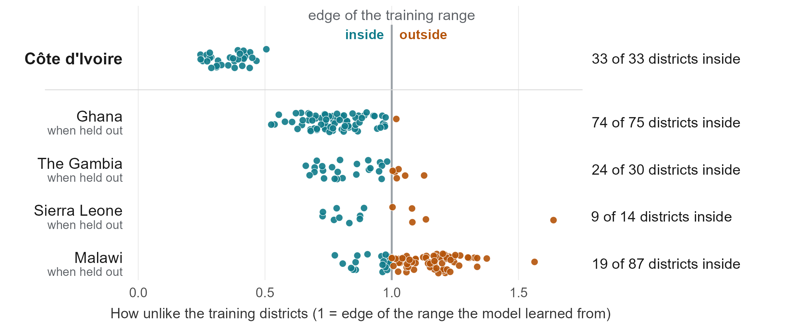{width="10.4in"}

::: {.notes}
ANDREW, about 35 seconds (86 words).

Can we trust a map of a country with no survey? One check we can make: is it like the places the model learned from? Each dot is a district, placed by how far its climate and soil are from the nearest surveyed district; the line is the edge of what the model has seen. Every Ivorian district sits well inside. This checks the inputs, not the accuracy: Malawi is mostly outside and Sierra Leone mostly inside, yet the model orders their districts about equally well.

Backup, if asked: area of applicability (Meyer and Pebesma 2021): unweighted dissimilarity on the 94 climate and soil columns the Côte d'Ivoire model uses, pooled raw values standardised on the training districts, threshold from country-blocked cross-validation (CAST's rule: Q3 + 1.5 IQR, capped at the maximum), computed in base R (script 47, civ_applicability.csv). Côte d'Ivoire 33 of 33 inside (the furthest, Abidjan, at 0.51 of the edge). Each surveyed country held out: Ghana 74 of 75, The Gambia 24 of 30, Sierra Leone 9 of 14, Malawi 19 of 87 (8 under the older boxplot rule; half of Malawi's districts are 1.14 of the edge or beyond). Pairs in the survey's order with the country held out: Ghana 62, The Gambia 70, Sierra Leone 56, Malawi 57. It is not a probability of being right, and four countries cannot calibrate it against accuracy.
:::

## What variables drive model predictions

::: {.notes}
ANDREW, about 60 seconds (135 words).

What does the model rely on? On the right, children's iron: the top ten families of layers in Ghana's model, Malawi's, and the four-country model we use for a new country, and that model's top ten layers. The strongest evidence is what happens when we take a family of layers away: without climate, or without soil, the ranking of a country the model has never seen gets worse, in all four countries, and climate alone does about as well as all 575 layers. Climate, soil and a satellite imagery summary are also in the top five of almost every model we fitted. B12 has markers of its own: meat and fish in children's diets, and household wealth. The iron and vitamin A maps mostly mark the same poorer districts: swap their weights and the rankings barely change. These are markers of where deficiency is, not causes.

Backup, if asked: post-fix importance and ablation tables (index_importance_domains.csv, index_importance_columns.csv, domain_ablation_loco_summary.csv). Pooled weight shares, mean over six outcomes: climate 18 per cent, satellite embedding 16, soil 13, greenness 6; climate + soil + satellite + greenness 45 to 59 per cent by outcome. Country held out: climate alone 0.33, soil alone 0.33, all layers 0.30; removing climate or soil costs 0.03, anaemia 0.02, crops and livestock about 0.01 each. Layers in the top 20 of four outcomes, same sign every time: malaria mortality, child overweight, relative staple price, plant productivity (less deficiency), grassland cover (more). Malaria marks LESS deficiency for iron and vitamin A, most likely because inflammation raises ferritin and lowers RBP differently from deficiency: a feature of the biomarkers. Schooling, water and sanitation, household diets and infant feeding help inside a country but make cross-border ranking slightly worse. Fertility and reproductive health are in no top list. Drop-a-domain test (domain_ablation_loco.csv, average status, 22 cross-country combinations): dropping climate costs 0.030 (The Gambia 0.030, Ghana 0.014, Malawi 0.030, Sierra Leone 0.045), soil 0.029 (0.043, 0.014, 0.023, 0.040); climate alone minus all layers +0.028 (better in 3 of 4 countries), soil alone +0.029 (2 of 4). The satellite embedding carries weight but adds almost nothing across borders: dropping it costs 0.002, and alone it scores 0.10 lower. Top five by weight: all 22 cross-country and all 6 pooled models, and 21 of 24 single-country models (not Malawi children's iron, Malawi women's zinc or Sierra Leone women's B12). Weight shares largely follow how many layers a family has (climate, soil and the embedding are 44 per cent of the model's 383 columns and get 47 per cent of the weight), so weight alone is not evidence of importance; the drop-a-domain test is. Nutrient specificity (NX-01, nx01_summary.csv): with the country held out, each outcome scored with another nutrient's weights. B12's own weights beat every other nutrient's in Ghana and Malawi (own 0.60 and 0.44, best other 0.54 and 0.31), not in Sierra Leone; iron is specific in 2 of 8 combinations, vitamin A in 0 of 8, folate in 1 of 3; one generic index over all outcomes scores 0.29 against 0.30 for each outcome's own. Children's iron figure: weight shares from index_importance_domains.csv (level target), layers from index_importance_columns.csv, pooled fit; every layer keeps its sign in all four leave-one-country-out fits. The full findings slide is in the appendix.
:::

## Which deficiencies can it map?

::: {.notes}
ANDREW, about 45 seconds (104 words).

Putting it together. B12 and iron can be ranked from public data: inside a country, across borders, and in the external check. Vitamin A ranks well inside our countries but was the weakest externally, so not yet. Folate works only within a country. Zinc cannot be mapped: the survey itself shows no real difference between districts. One caution, in the line at the bottom: only the B12 map is its own. Rank iron districts with the vitamin A weights and you do about as well, because both maps mark the same poorer districts.

Backup, if asked: external by nutrient, African deposits, post-fix: B12 0.66 (4 of 4 tests), iron 0.44 (11 of 11), folate 0.28 (3 of 4), vitamin A 0.24 (12 of 14; both clear misses are vitamin A). Vitamin A is the strongest outcome in India and Pakistan. The table's numbers are correlations (0 = chance); measurable combinations only. Nutrient specificity (NX-01): with the country held out, B12's own weights beat every other nutrient's in 2 of 3 countries; iron 2 of 8, vitamin A 0 of 8, folate 1 of 3; the iron indices rank vitamin A districts at least as well as vitamin A's own (0.39 and 0.34 against 0.33). Zinc: nested variance components put Malawi children's zinc at district share 0.000 and cluster share 0.172, the largest cluster share in the study (explore/out/22_zinc_variance_components.csv): the survey's zinc differences sit between communities, not districts.
:::

## What does this mean for policy? The vitamin B12 model

::: {.notes}
ANDREW, about 50 seconds (118 words).

What does this mean for a programme? Take our best model, women's B12. It puts 70 to 75 of every 100 district pairs in the survey's order of average B12 level, and 65 to 71 with the country's own survey removed. Inside a surveyed country, the fifth of districts it ranks worst hold 39 to 46 per cent of deficient women: about twice a random choice. Across borders the ranking of average level holds, but the share deficient does not, so there it needs a survey to anchor it. Its district prevalences are typically about 9 points from the survey's, about as close as the survey's own regional figures. And in WHO survey data from Zambia, Ethiopia and Nigeria it pointed the right way in all four checks.

Backup, if asked: pairs on average B12 level (v3_percell_pairs.csv, post-fix): Ghana 70 in-country, 71 held out; Malawi 75 and 65 (Sierra Leone 71 held out, but its B12 prevalence, 0.6 per cent, is under the 2 per cent screen). Worst fifth, inside a surveyed country (nce_targeting_metrics.csv, post-fix): Ghana 46 per cent (regional figures 45, perfect 65), Malawi 39 (27, 65). With the country's own survey removed the worst fifth holds 12 per cent (Ghana) and 11 (Malawi) of deficient women, less than a random fifth, and its districts are less deficient than average (Ghana 4.9 against 7.8 per cent): on the share deficient B12 transports at 0.24 and 0.22, against 0.60 and 0.44 on average level. Prevalence error, each district hidden, population-weighted, model calibrated for level (benchmarks_v2_cells.csv, post-fix): Ghana 9.3 points (regional figures 9.1), Malawi 9.1 (8.9). The 90 per cent bands were rerun on 28 September (median half-width 23 points over all combinations), but script 66 still anchors on a national-estimates file that predates the survey fixes (Malawi B12 anchor 2.3 against 10.9 per cent), so no band is quoted. B12 is the one nutrient whose map is its own: its weights beat every other nutrient's in Ghana and Malawi (NX-01). External B12, post-fix: 4 of 4 in Africa (mean 0.66); Côte d'Ivoire's nine 2007 survey zones in almost the same order (0.95); Pakistan's B12 is a miss.
:::

## Next steps

::: {.notes}
ANDREW, about 30 seconds (70 words).

Three asks. If your country has a micronutrient survey, recent, planned or in a drawer, share it with the pool: on average, each survey we added improved the ranking for the countries held out. If you are planning one, let's design it together. And tell us how accurate a district ranking must be before you would use it. Modelling extends a survey's reach. It does not replace the survey.

Backup, if asked: Pooling curve: 0.20 with one training survey, 0.26 with two, 0.30 with three; the gain so far is in The Gambia and Ghana, not yet Malawi or Sierra Leone. Two candidate models were written down on 3 September 2026, so a fifth survey is a real test. Other surveys help a country with no survey, not a surveyed one: adding the other countries' weights to a surveyed country's own made its ranking slightly worse (BO-01: -0.02, better in 8 of 18). Optional line for Sonja: next, with MIMI and GBD, we compare predictors framework by framework.
:::

## Conclusions

::: {.notes}
ANDREW, about 60 seconds (138 words).

To answer our five questions. Can public data tell us how common a deficiency is? Not on their own: without a survey, national estimates missed by up to 38 points, and district levels need the survey's national figure. Can they rank a country's districts? Yes, modestly: two pairs in three in the survey's order, about as well as the survey's own regional figures. In a country with no survey? Mostly: six pairs in ten, and the right direction in 37 of 41 checks in six more countries. Which data? Climate and soil carry the cross-border ranking; and only B12 has a map of its own. And for programmes: with a budget per person, rank by the model; with a budget in districts, start with the most populous. It does not replace a survey. Everything is on the dashboard; the QR code is on the screen.

Backup, if asked: national levels without the country's survey: median miss 7 points, largest 38 (national_levels_sl.csv, national_vmnis_loco_sl_pred.csv). Pairs, post-fix, 14 in-country combinations: model 66, survey's regional figures 65 (scored fairly; model ahead in 9 of 14); held out 62 over 15. External (WHO VMNIS regions): Africa 12 of 12 positive at level (0.40), prevalence 18 of 21 (0.34), South Asia 7 of 8. Nutrient specificity: NX-01. Targeting (TC-01): a fifth of the people covered in the model's highest-rate districts reaches 31 per cent of the deficient inside a surveyed country (regional figures 28, random 20, perfect 47) and 25 with no survey; with a budget of a fifth of the districts, the most populous reach 49 and 45 per cent, and the model's expected cases add nothing. District levels in a new country: the model's ranking adds nothing to the national figure (LV-02). About half of the district prevalence error is the survey's own sampling noise (NZ-01).
:::

# Appendix

## How does the model work, and how was it tested?

::: {.notes}
ANDREW, about 55 seconds (126 words).

Thank you, Sonja. Here is the whole study in four steps. One: four national biomarker surveys, 206 districts where blood was drawn. Two: the 575 public layers, for every district. Three: machine learning. We compared fourteen methods, from random forests and boosting to a SuperLearner ensemble that combines them, and a very simple one won; we call it the Domain-PC index. Four: a ranking of every district, and with a survey's national figure a prevalence, including districts no survey reached and countries with no survey at all.

Every number I show comes from hiding data and predicting it: a district, a region, a whole country. And we score it simply: out of every pair of districts, how often do we put the worse one first? A coin toss gets half.

Backup, if asked: 14 alternatives on identical folds, 1,304 fits (SL-06). The in-country fit uses the 383 open or public-survey layers; the cross-border fit uses the layers common to all four countries. Pairs metric: share of district pairs ordered as the survey orders them; correlations are in the notes where they help.
:::

## How well does it rank districts inside a surveyed country?

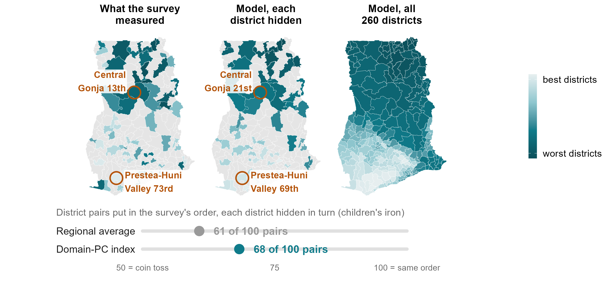{width="9.4in"}

::: {.notes}
Ghana, children's iron, each district's own blood results hidden in turn. Left: what the survey measured in the 75 districts it reached; middle: the model's held-out prediction; right: the model for all 260 districts. Central Gonja: 13th worst in the survey, 51st by its regional average, 21st by the model. Prestea-Huni Valley: 73rd in the survey, 39th by its regional average, 69th by the model. Overall 68 of 100 pairs in the survey's order against 61 for the regional average as drawn (correlations 0.53 and 0.36). The ruler scores the regional average with each district left out of its own region's figure, which reverses two surveyed districts of the same region; scored as a planner would use it (every district in a region given the same figure), it is 63 (scripts/policy_deck/39).

Honest caveats: on the share deficient rather than average status, the model ties the regional average here (0.50 each), and a map of neighbouring districts built from the survey does as well as the model (69 of 100 pairs); inside a surveyed country, geography does much of the work. The model is wrong in places: its median district is 13 places from the survey's rank, the regional average's 18; the largest miss is Atiwa East (24th in the survey, 65th in the model). The regional average is the district's own region averaged over the other surveyed districts there (the district itself left out).
:::

## What happens when a whole region is held out?

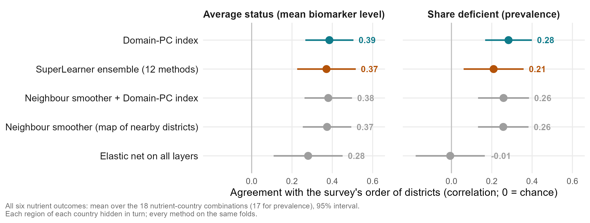{width="9.6in"}

::: {.notes}
ANDREW, about 40 seconds (71 words).

In between the two: a whole region the survey never reached, which is the hardest case for a map built from neighbouring districts, because it has to extrapolate. On average status, the index holds up and is level with that neighbour map. On the share deficient it is the best method. The SuperLearner ensemble is no better, and penalised regression on all the layers falls away. All six nutrient outcomes, averaged.

Backup, if asked: the post-fix SuperLearner run of 28 September (NS-01, rank-normalised predictors), every method on the same folds, 18 nutrient-country combinations. Average status: index 0.39, neighbour map plus index 0.38, neighbour map 0.37, SuperLearner 0.37, elastic net on all layers 0.28. Share deficient: 0.28, 0.26, 0.26, 0.21, -0.01. The elastic net on the domain components is not in this run and is no longer shown. Ghana and Malawi are where this estimand is well determined; The Gambia and Sierra Leone give one number per region.
:::

## How much ranking accuracy is lost without the country's own survey?

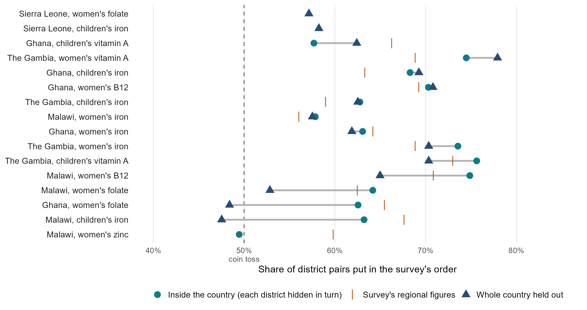{width="10.2in"}

::: {.notes}
Each measurable combination: district pairs in the survey's order inside the country (each district hidden in turn, circle) and with the whole country held out (triangle), with the survey's regional figures scored fairly (tick). Over the 14 with an in-country test: 66 inside, the survey's regional figures 65; held out 63 over the 13 with both tests (62 over all 15); held out as good or better in 4 of 13 (Ghana children's vitamin A and iron, The Gambia women's vitamin A, Ghana B12). The large losses are Malawi children's iron and folate in Ghana and Malawi. Sierra Leone has no in-country test (14 districts); zinc, measured only in Malawi, has no held-out test. Borrowing the other countries' weights inside a surveyed country did not help (BO-01). Script: scripts/policy_deck/43.
:::

## Accuracy by nutrient, against the best possible

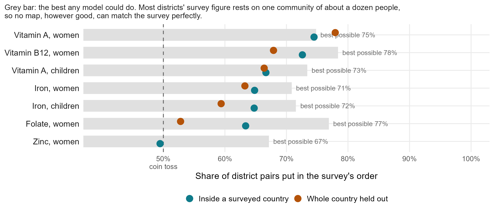{width="9.4in"}

::: {.notes}
ANDREW, about 35 seconds (70 words).

How close is this to the best possible? The survey's own district figures are noisy: most rest on one community of about a dozen people. So even a perfect model could agree with them only up to the grey bars, about 71 to 78 pairs in 100. Inside a country we reach 63 to 75. There is room left, but much of the remaining gap is the survey, not the model.

Backup, if asked: How the ceiling is known: how much two communities in the same district disagree tells us how noisy one community's result is (variance components, variance_components_ceiling.csv, average status, the cluster-adjusted ceiling_vc column). As correlations: B12 0.77, folate 0.75, vitamin A 0.68, iron 0.61, against the model's 0.63, 0.40, 0.56 and 0.43. Converted to pairs with 1/2 + arcsin(r)/pi, which assumes normal errors. Zinc (Malawi women) is the exception and is plotted below the others: ceiling 67 pairs in 100, model 50. Its district signal is small: 37 per cent of its split-half ceiling (0.81) is community-level rather than district-level variation, leaving 0.51 (cluster_share_of_ceiling); for Malawi children's zinc, nested variance components put the district share at 0.000 and the cluster share at 0.172, the largest cluster share in the study (explore/out/22_zinc_variance_components.csv). Why average status rather than the share deficient: dichotomising at the clinical cut-off makes the survey's own district figures less reliable. District split-half reliability (explore/out/16_reliability_all.csv; the continuous level, r_full_respondent, Spearman, against the binary prevalence, r_full_prev, Pearson) falls by 0.20 on average when the value is dichotomised, and the continuous level is the more reliable in 25 of 27 combinations. The cost is worst for rare deficiencies: Sierra Leone women's B12, at 0.5 per cent prevalence, loses 1.15. More communities per district would raise the ceiling, at the price of fewer districts (appendix, planning slide).
:::

## How do proxy models compare with the survey's own information?

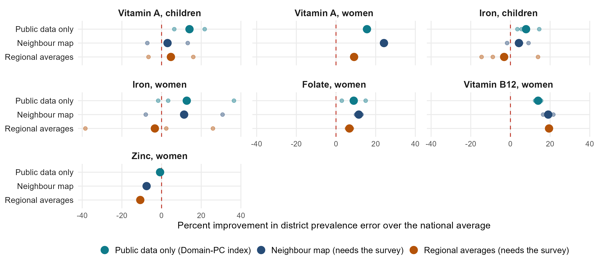{width="9.6in"}

::: {.notes}
ANDREW, about 40 seconds (90 words).

An updated version of a January slide, now for district prevalence. How much closer to the survey's own district figures do we get than by giving every district the national average? Public data alone improve on it by about 11 per cent on average: as much as a map of neighbouring districts built from the survey (9 per cent), and more than the survey's regional averages, at 3 per cent. The regional averages lose to the national figure for iron. For B12, the survey's own neighbours and regions do better still.

Backup, if asked: 1 minus the district prevalence error (mean absolute error) of each method over that of the national average without the district, each district hidden in turn (benchmarks_v2_cells.csv, prevalence target, calibrated index). Means over the 14 measurable in-country combinations (post-fix measurability screen of 28 September, which swapped Malawi children's vitamin A for Malawi women's zinc): public data 10.8 per cent, neighbour map 9.3, regional averages 2.9. The same statistic on average status (mean absolute error of the log-scale level): public data 14.5 per cent, neighbour map 14.3, regional averages 6.7. The slide stays on prevalence because percentage points are what the audience uses, although the share deficient is the less reliable target (split-half reliability 0.20 lower on average; accuracy-by-nutrient slide). The January slide scored person-level models with individual survey predictors; with district proxies alone a person-level model is a coin toss (appendix).
:::

## Is it just geography? Comparison with DHS-style geostatistics

{width="9.0in"}

::: {.notes}
Inside a surveyed country, geography does much of the work: a map of neighbouring districts ties the index. The DHS Program's model-based geostatistics (a spatial field plus covariates, fitted at the survey clusters) ranks worse on the same folds (0.27 against 0.38) but estimates levels better (9.2 against 10.7 points of error), because it shrinks uncertain districts toward a level. It needs measured clusters inside the country, so it has no answer for a country with no survey. The Côte d'Ivoire vitamin A ranking correlates 0.73 with latitude, yet its agreement with the independent WFP and MIMI map survives adjusting for latitude (0.495 to 0.479). Pre-fix: this comparison rests on the 8-9 September cluster targets, before the survey fixes; a post-fix rerun needs 4 to 6 hours of geostatistical fits.
:::

## How can it help plan the next survey?

::: {.notes}
Moved to the appendix in v4. How close can any model get: the survey's own district numbers are noisy, because most rest on one community of about a dozen children, so even a perfect model could agree with them only up to the grey bars (average status, as correlations: B12 0.77, folate 0.75, vitamin A 0.68, iron 0.61; the model 0.63, 0.40, 0.56, 0.43; zinc, Malawi women only, 0.51 against -0.01). More communities per district would raise that limit, though at a fixed budget that means fewer districts. Sierra Leone has the most clusters per district (4.3) and the weakest results: 14 districts of half a million people is the wrong unit. Anchor: 5 per cent national sample (24 to 71 respondents), median district error 9.6 points post-fix, no better than the national figure alone (LV-02). SP-01: model-guided district choice is about equal to random; both beat population-weighted choice.
:::

## How does it compare with other methods, including machine learning?

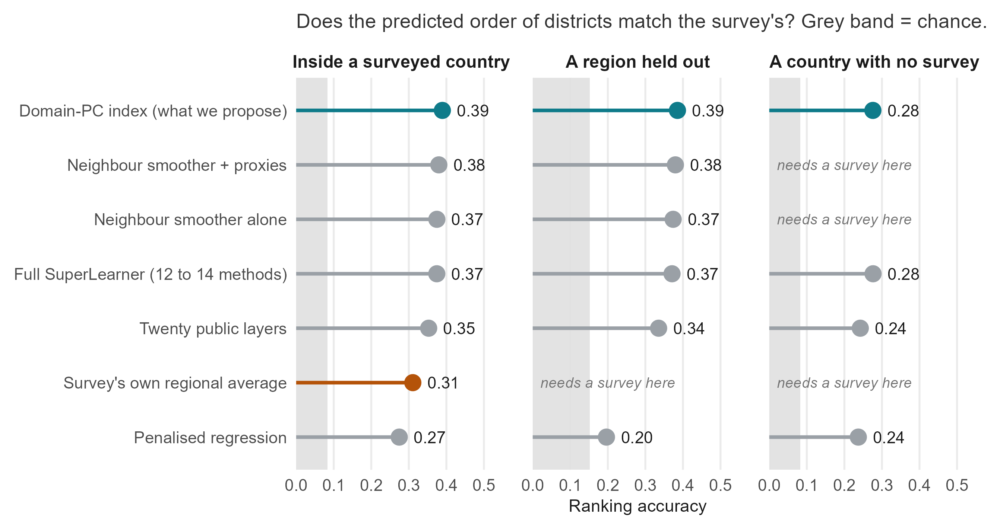{width="9.2in"}

::: {.notes}
Every method on the same held-out folds, agreement on average status (Spearman). Post-fix. Inside a surveyed country: the Domain-PC index 0.39, neighbour smoother with proxies 0.38, neighbour smoother alone 0.37, the full SuperLearner 0.37, a twenty-layer composite 0.35, penalised regression 0.27, the regional average 0.31. A region held out: 0.39, 0.38, 0.37, 0.37, 0.34, 0.20. A country with no survey: index 0.28, SuperLearner 0.28, twenty layers 0.24, penalised regression 0.24; the smoothers and the regional average need a survey. The index, SuperLearner, smoothers and penalised regression come from the 28 September SuperLearner runs on the same folds (the penalised regression there is survey-weighted; the benchmark version scores 0.33, 0.27 and 0.26); the regional average and the twenty layers come from separate runs, in which the index scored 0.40, 0.39 and 0.30. The ensemble trails the index by 0.015 inside a country (better in 6 of 18), 0.014 with a region hidden (9 of 18) and 0.015 across borders (5 of 21) (a6_model_comparison_values.csv). The estimator and the domain sets were chosen while looking at these four countries, which is why the fifth survey is pre-registered.
:::

## Which data sources contribute most to model prediction performance?

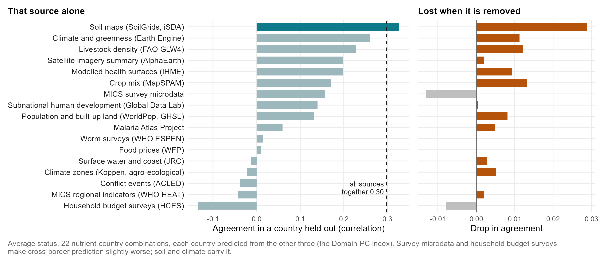{width="9.6in"}

::: {.notes}
Updated from the January slide (which scored drops in error for women's B12 and iron in Ghana). Now each country is predicted from the other three, averaged over 22 nutrient-country combinations: left, the ranking with one source alone; right, how much it drops when that source is removed. Soil maps alone (0.33) beat all sources together (0.30); climate and greenness from Earth Engine, crop mix, IHME health surfaces, livestock and the Malaria Atlas each cost accuracy when removed. MICS survey microdata and household budget surveys make cross-border prediction slightly worse (source_ablation_loco_summary.csv). DHS microdata are not in the cross-border set.
:::

## What can we learn about the consistently most important predictor domains?

::: {.notes}
The findings behind the variable-importance slide, across every model we fitted (post-fix).

Backup, if asked: post-fix importance and ablation tables (index_importance_domains.csv, index_importance_columns.csv, domain_ablation_loco_summary.csv). Pooled weight shares, mean over six outcomes: climate 18 per cent, satellite embedding 16, soil 13, greenness 6; climate + soil + satellite + greenness 45 to 59 per cent by outcome. Country held out: climate alone 0.33, soil alone 0.33, all layers 0.30; removing climate or soil costs 0.03, anaemia 0.02, crops and livestock about 0.01 each. Layers in the top 20 of four outcomes, same sign every time: malaria mortality, child overweight, relative staple price, plant productivity (less deficiency), grassland cover (more). Malaria marks LESS deficiency for iron and vitamin A, most likely because inflammation raises ferritin and lowers RBP differently from deficiency: a feature of the biomarkers. Schooling, water and sanitation, household diets and infant feeding help inside a country but make cross-border ranking slightly worse. Fertility and reproductive health are in no top list. Drop-a-domain test (domain_ablation_loco.csv, average status, 22 cross-country combinations): dropping climate costs 0.030 (The Gambia 0.030, Ghana 0.014, Malawi 0.030, Sierra Leone 0.045), soil 0.029 (0.043, 0.014, 0.023, 0.040); climate alone minus all layers +0.028 (better in 3 of 4 countries), soil alone +0.029 (2 of 4). The satellite embedding carries weight but adds almost nothing across borders: dropping it costs 0.002, and alone it scores 0.10 lower. Top five by weight: all 22 cross-country and all 6 pooled models, and 21 of 24 single-country models (not Malawi children's iron, Malawi women's zinc or Sierra Leone women's B12). Weight shares largely follow how many layers a family has (climate, soil and the embedding are 44 per cent of the model's 383 columns and get 47 per cent of the weight), so weight alone is not evidence of importance; the drop-a-domain test is.
:::

## What can we learn about unused predictor domains?

::: {.notes}
Updated from the January slide. Evidence: leave-one-domain-out under country hold-out (domain_ablation_loco_summary.csv, average status, all layers 0.302). Removing fortification and supplementation changes nothing (0.000); food prices -0.001; conflict -0.002; child anthropometry +0.001; immunisation +0.003. Removing schooling and employment IMPROVES the held-out ranking by 0.013, water and sanitation by 0.010, household budget surveys by 0.009, infant feeding by 0.006: they help inside a country (schooling for vitamin A) but do not travel. Likely reasons: overlap with climate, soil and infection; national-only figures with no district contrast; different survey years, questions and designs between countries.
:::

## Which outcomes and cut-offs does the analysis use?

| Outcome | Population | Countries | Biomarker and adjustment | Cut-off |
|:---|:---|:---|:---|:---|
| Iron deficiency | Children 6-59 months; non-pregnant women 15-49 | All four | Ferritin, adjusted for inflammation (BRINDA or Thurnham factors, following each survey) | Under 12 µg/L (children), 15 µg/L (women) |
| Vitamin A deficiency (low RBP) | Children 6-59 months; non-pregnant women 15-49 | All four | Retinol-binding protein, BRINDA-adjusted | RBP under 0.70 µmol/L |
| Folate deficiency | Non-pregnant women 15-49 | Ghana, Sierra Leone, Malawi | Serum folate: immunoassay (Ghana, Sierra Leone), microbiologic assay (Malawi) | Under 10 nmol/L |
| B12 deficiency | Non-pregnant women 15-49 | Ghana, Sierra Leone, Malawi | Serum B12 (Ghana: a subsample) | Under 150 pmol/L (Malawi 148) |
| Zinc deficiency | Children 6-59 months; non-pregnant women 15-49 | Malawi | Serum zinc, by time of blood draw | Children 65 (morning) or 57 (afternoon) µg/dL; women 66 or 59 |
| Selenium, iodine | Children and women; women | Malawi, within-country only | Plasma selenium; urinary iodine | 84.6 µg/L; 100 µg/L |

::: {.notes}
Verified against R/config.R, R/data_prep.R and docs/survey_report_reconciliation.md on 27 September. Corrections to the January slide: iron is not BRINDA everywhere (Ghana and Sierra Leone use Thurnham factors); women's vitamin A is BRINDA-adjusted like children's; folate and B12 are also measured in Malawi; iodine is configured for Malawi women (The Gambia and Sierra Leone were a separate within-country test); log scale is the modelling target, not an adjustment. Sierra Leone's child file holds only anaemic children (532 of 654 assayed). The main-body results in this deck use the targets rebuilt on 27 September with these corrections (vitamin A on the RBP < 0.70 rule, non-pregnant women and children 6-59 months only, Sierra Leone women's iron on Thurnham, Malawi repeated Traditional Authority names, Malawi zinc on the survey's own flag); appendix figures copied from the full talk are from the 8 September build.
:::

## Does targeting reach more deficient people?

{width="10.4in"}

::: {.notes}
Share of a country's deficient people in the districts chosen, under two budget rules (TC-01, scripts/protocol_v2/74; design written down before the run; script 12's units and folds, reproduced exactly). Grey dots: each measurable combination; large dots: the mean.

Budget of districts (a fifth of them): the most populous districts reach 49 per cent inside a surveyed country and 45 with no survey; the model's expected cases (rate times population) 49 and 44, no gain; ranking by the model's rate 25 and 18. Budget of people (a fifth of the target population): the model's highest-rate districts reach 31 per cent inside a surveyed country (the survey's regional figures 28, random 20, perfect 47) and 25 with no survey (above 20 in 9 of 15). So rank by rate when the budget is per person, by population when it is a number of districts. In a new country the anchored rate is often flat, because the training countries' own cross-border ranking was at or below zero for B12 and several iron combinations. Findings note: docs/findings/TC-01_TARGETING_BY_CASES_2026-09-28.md.
:::

## Accuracy pooled over all nutrients, in district pairs

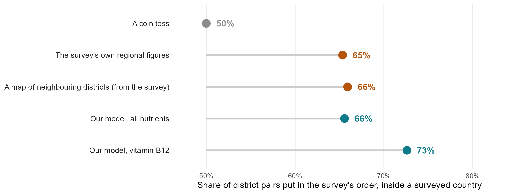{width="10.0in"}

::: {.notes}
Inside a surveyed country, each district hidden, the 14 measurable combinations (post-fix): the model puts 65.6 of 100 district pairs in the survey's order; a map of neighbouring districts built from the survey 65.9; the survey's own regional figures 65.3 (scored fairly: every district in a region gets the figure of the region's other surveyed districts); a coin 50. The model for B12 alone: 73 (Ghana 70, Malawi 75). On the 17 per cent of pairs the survey clearly separates: model 81.0, neighbour map 81.5, regional figures 80.5 (SEP-01). Inside a surveyed country geography does much of the work; the model's advantage is in a country with no survey, where the regional figures and the neighbour map do not exist. Replaces the full talk's odds ruler (pre-fix: 56, 59, 60, 70).
:::

## Every combination of training countries

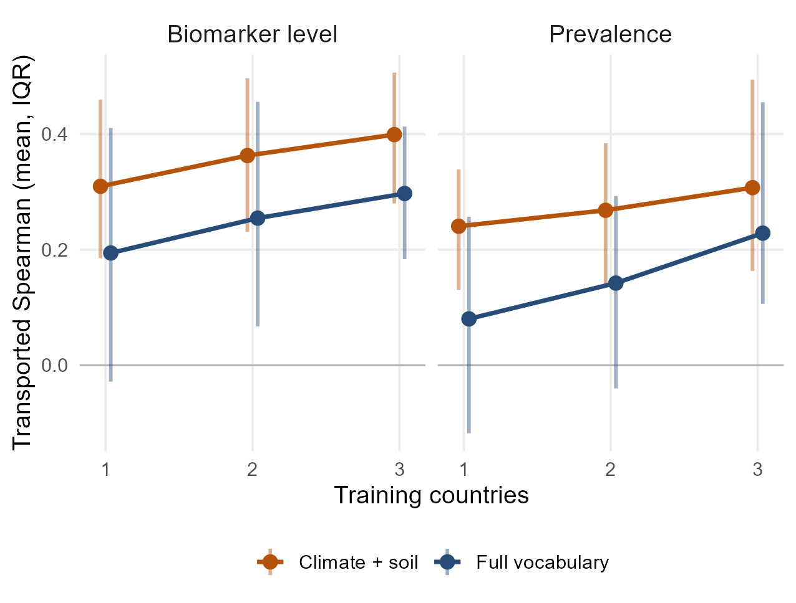{width="6.8in"}

::: {.notes}
Every subset of training countries scored on each held-out country: about +0.05 per country added, not flattened at three; the gain is in The Gambia and Ghana. Post-fix (training_curve_climate_soil.csv, 28 Sep): average status, climate and soil 0.31, 0.36 and 0.40 with one, two and three training countries, the full set 0.19, 0.25 and 0.30; prevalence 0.24, 0.27, 0.31 and 0.08, 0.14, 0.23. The Gambia 0.38 to 0.59 and Ghana 0.30 to 0.39; Malawi and Sierra Leone flat. Over all 22 combinations, 7 of them not measurable; on the measurable ones the full set gives 0.23, 0.31 and 0.40.
:::

## Does the model track the survey, district by district?

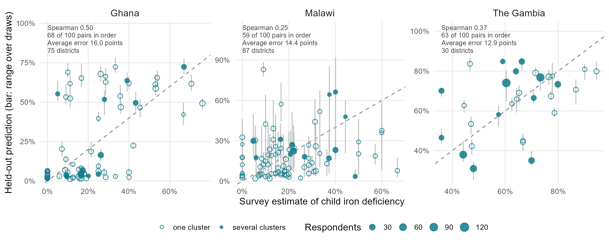{width="10.0in"}

::: {.notes}
The cloud is tilted but not on the line: the model ranks, but its spread is as wide as the survey's or wider, so levels are off. Hollow points are single-cluster districts; much of the vertical scatter is the survey's noise. Post-fix (viz/oof_child_iron.csv, 28 Sep), children's iron: Ghana 0.50 and 16.0 points average error, Malawi 0.25 and 14.4, The Gambia 0.37 and 12.9; 68, 59 and 63 of 100 district pairs in order.
:::

## The 2007 Côte d'Ivoire survey and the B12 prediction

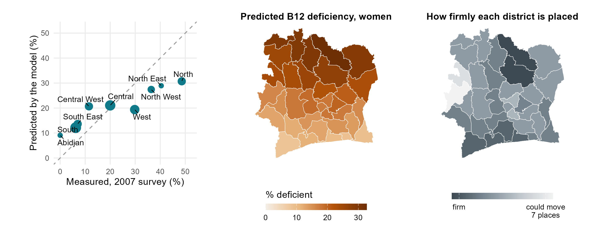{width="9.4in"}

::: {.notes}
Left: women's B12 deficiency in the nine zones of the 2007 national survey against the model's predicted prevalence, averaged over the districts in each zone (dashed line: perfect agreement). The ranking is transported from the four surveyed countries with no Ivorian biomarker; the level is anchored to the survey's national 18.1 per cent, the design the talk recommends (a small national sample plus the ranking): predicted = expit(logit(0.181) + 0.32 x 1.48 x z), z the standardised climate-and-soil B12 index, 0.32 how well that ranking held up for B12 when each training country was held out, 1.48 the between-district spread (logit) in the training surveys. The order matches almost exactly (0.95 over nine zones); the spread is compressed, 9 to 31 per cent predicted against 0 to 49 measured, mean error 9.0 points, as expected from a shrunken ranking. Middle: the district map. Right: how firmly each district is placed over 400 refits (stability, not a confidence interval). Caveats: 2007, zones are not administrative units (centroid crosswalk), nine points, a steep north-south gradient. Table: results/tables/policy_deck/v4_civ_b12_anchored.csv.
:::

## The live dashboard

{width="9.4in"}

::: {.notes}
amertens.shinyapps.io/micronutrient-burden: every district of the four countries and Côte d'Ivoire, planning prevalence with calibrated bands, WHO severity class, people affected, the external check, a survey planner and country briefs. Its "new country" tile (0.38) is the climate-and-soil model; the talk's 0.30 is the full index.
:::

