```{r setup}
# MNF 2026 talk, 12 main slides for a 15-20 minute joint session (Sonja opens,
# Andrew presents the results). Built to ANM's decisions of 18 September 2026 in
# docs/slides/MNF15-talk-outline-ANM.docx:
#   - 12 slides, not 8 ("I will cut from there, and we technically have 20 minutes")
#   - title matches the submitted abstract
#   - slide 3 just lists the four surveys
#   - Cote d'Ivoire framed as an example of the many countries without a recent estimate
#   - the odds-ruler version of the accuracy slide (versions B and C dropped 18 Sep)
#   - the decision table combined with one worked district
#   - accuracy compared across outcomes and countries, and the variable-importance story
#   - talking points live in the speaker notes
# Revised 18 Sep after the check-in with S. Hess: Sonja opens with an intro slide and
# the iron conceptual framework, so this deck starts at the framework-coverage slide;
# predictors slide simplified to eight groups; accuracy stratified by women/children;
# domains slide women-only; Cote d'Ivoire checked against the 2007 survey's regional
# B12; decisions table reworded; conclusions shortened and made less pessimistic.
# Figures: scripts/policy_deck/20_mnf15_figures.R, 02_figure_ghana_map.R, 05_civ_map.R.
# Five slides (title logos, predictor groups, methods, decisions checklist, conclusions) are
# drawn in place from MNF15-talk-2026-09.concept.yaml; here they are a title plus notes.
# 19 Sep: speaker notes are the spoken script (speaker, seconds, words, then the text, then
# backup material for questions); the same script is in docs/slides/MNF15-talk-script-2026-09-19.docx.
# Slide order 2-4 is Sonja's block (surveys measure, four surveys, [her framework], coverage),
# then one handoff to Andrew at the Ghana map.
# Render: bash scripts/render_deck.sh docs/slides/MNF15-talk-2026-09.qmd --forum --no-label \n#         --text 18,15 --concept docs/slides/MNF15-talk-2026-09.concept.yaml
suppressPackageStartupMessages({library(dplyr); library(knitr)})
root <- tryCatch(here::here(), error = function(e) normalizePath(file.path(getwd(), "..", "..")))
P2 <- file.path(root, "results", "tables", "protocol_v2")
rd <- function(...) { f <- file.path(...); if (file.exists(f)) read.csv(f, stringsAsFactors = FALSE, check.names = FALSE) else NULL }
kb <- function(d, ...) knitr::kable(d, format = "pipe", row.names = FALSE, ...)
df <- function(...) data.frame(..., check.names = FALSE, stringsAsFactors = FALSE)
FIG <- "../../results/figures/mnf15"
FIGP <- "../../results/figures/policy_deck"
```

## What national biomarker surveys can measure

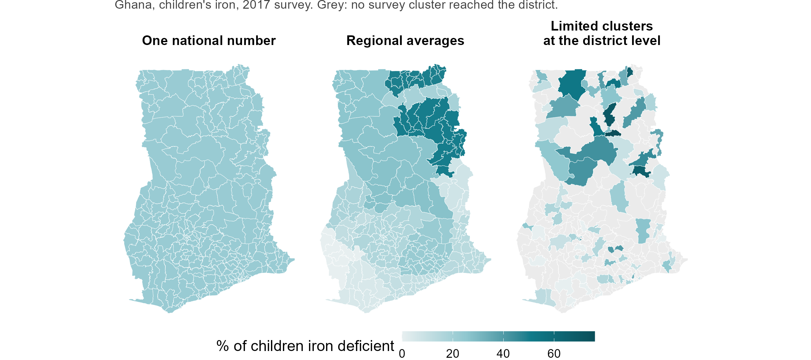{width="9.4in"}

::: {.notes}
SONJA, about 60 seconds (127 words).

A national micronutrient survey happens about once a decade, and it is designed to report regions, not districts. Ghana's 2017 survey did exactly what it was designed to do. It put 90 clusters into 75 of Ghana's 260 districts, and it reports its regions well. But the decisions are not regional. Somebody has to decide which districts get the next round of supplementation, which are screened first, where the next survey team goes. Today an unsurveyed district gets its region's average. In Ghana that is 185 districts out of 260 with no measurement of their own. And in 62 of the 75 districts the survey did reach, the district's number rests on a single cluster, about a dozen children. That is the gap this project is about.
:::

## Model training on four national biomarker surveys

:::: {.columns}
::: {.column width="80%"}
```{r surveys}
# "How measured" is read off metadata/assay_sources.csv: ferritin and RBP are the
# SAME sandwich ELISA (Erhardt kit, VitMin Laboratory) in all four surveys, which
# is why iron and vitamin A transport; folate is Roche immunoassay in Ghana and
# Sierra Leone but a microbiologic assay in Malawi, which is why folate does not.
kb(df(
  Survey = c("The Gambia 2018 — 30 districts, 70 clusters",
             "Ghana 2017 — 75 of 260 districts, 90 clusters",
             "Sierra Leone 2013 — 14 districts, 60 clusters",
             "Malawi 2015-16 — 87 TAs, 103 clusters"),
  Nutrients = c("Iron, vitamin A",
                "Iron, vitamin A, folate, B12",
                "Iron, vitamin A, folate, B12",
                "Iron, vitamin A, folate, B12, zinc"),
  `How measured` = c(
    "Ferritin, RBP by ELISA",
    "Ferritin, RBP by ELISA; folate, B12 by Roche",
    "Ferritin, RBP by ELISA; folate, B12 by Roche",
    "Ferritin, RBP by ELISA; folate microbiologic; zinc")))
```
:::
::: {.column width="20%"}
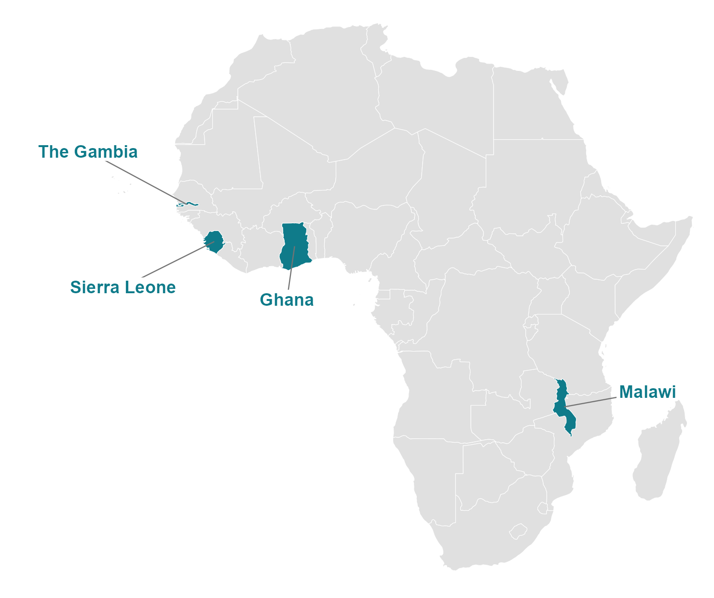
:::
::::

::: {.notes}
SONJA, about 50 seconds (149 words).

These are the four surveys we learned from, and the teams who ran them: The Gambia in 2018, Ghana in 2017, Sierra Leone in 2013, and Malawi in 2015 and 16. Between them, 206 districts, 323 survey clusters and 24 nutrient-country combinations. Iron and vitamin A were measured the same way everywhere, ferritin and retinol-binding protein by ELISA. Folate and B12 were measured by Roche immunoassay in Ghana and Sierra Leone, and in Malawi folate by a microbiologic assay, which will matter later. What a district is differs too: thirty in The Gambia, 75 of Ghana's 260, 14 in Sierra Leone, and in Malawi 87 Traditional Authorities. This is the only ground truth of this kind for this question on the continent, and it exists because these teams collected it. Ghana is our worked example today, partly because the Ghana team is in the room and can check us.

Backup, if asked: Sonja's own conceptual-framework slide for iron deficiency comes next, before the coverage slide.
:::

## Which causes of deficiency do public data reach?

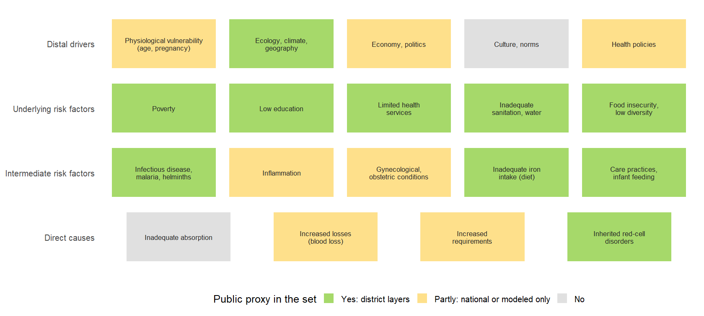{width="9.4in"}

::: {.notes}
SONJA, about 45 seconds (132 words).

This is the same framework, with each box coloured by whether we could find a public, district-level proxy for it. Green: we have district layers. Ecology and climate from satellites; poverty, schooling, water and sanitation from household surveys; infectious disease from the malaria and helminth atlases; diet and infant feeding from the public surveys. Yellow: only a national figure or a modelled surface. Health policy, inflammation, physiological vulnerability. Grey: nothing public reaches it. Culture and norms, absorption. Two things to take from this. The predictors are not a fishing expedition; they are the pathways in this framework that public data happen to cover. And the model can only see the green and yellow boxes. What it misses is what no satellite sees. Andrew will show you what the model makes of them.
:::

## Proxy models to predict deficiencies where data is missing

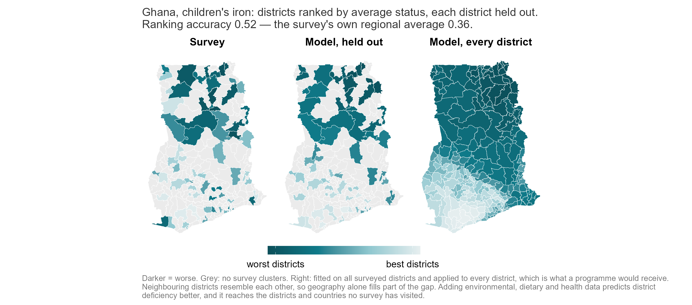{width="9.3in"}

::: {.notes}
ANDREW, about 90 seconds (223 words).

Thank you, Sonja. Here is the whole talk in one picture. Ghana, children's iron. On the left, what the survey measured in the 75 districts it reached. In the middle, what the model predicts for each of those districts when that district is hidden from it. On the right, the model applied to all 260 districts, including the 185 no survey cluster ever reached. Neighbouring districts resemble each other, so geography alone fills part of the gap; the middle panel adds environmental, dietary and health data to it. Ranking accuracy in the middle panel is 0.52, against 0.36 for the survey's own regional averages, where zero is chance and one is perfect. Take one district. Binduri, in Upper East. Interpolating from its region ranks it 12th worst of the 75. Our model, which never saw Binduri's blood results, ranks it 1st. The survey measured it 6th. A programme working from the regional average sends its first team somewhere else. We are also wrong in places. Atiwa East, in the Eastern Region: the survey measured it 24th worst, and we put it 56th. I will tell you in two minutes how often that happens. One caution on the word measured: most of these districts rest on a single survey cluster, so the survey's own district number is itself a noisy estimate. Binduri has two.

Backup, if asked: Ranks are among the 75 surveyed districts on the biomarker level, 1 = worst; per-district ranks in results/figures/policy_deck/fig7_ghana_district_ranks_child_iron_level.csv. Talensi, Upper East: interpolation 9th, model 2nd, survey 12th.
:::

## Where the predictors come from

::: {.notes}
ANDREW, about 45 seconds (113 words).

Five hundred and seventy-five measurements for every district, from 28 public sources, in eight groups. The largest is climate and satellite imagery: thirty-year rainfall and temperature normals, greenness, and a satellite summary of what a district looks like. Then household surveys summarised to districts; disease and immunisation maps; food prices and diet; nutrition status; soil chemistry; crops and livestock; settlement and population. None of it required a new blood sample and none of it had to be bought. And the layers that travel across a border are the free ones: the data you can download this afternoon rank a new country's districts slightly better than the same model with household survey microdata added.

Backup, if asked: If asked for numbers: openly downloadable layers alone rank a new country's districts at 0.32; adding public survey microdata gives 0.30; adding DHS microdata 0.28. Three sources need a free account, one a data-use agreement. Eleven new predictor blocks were scored this year and none moved the answer by more than 0.01.
:::

## How the model is built and how it is tested

::: {.notes}
ANDREW, about 60 seconds (158 words).

One methods slide. On the left, four steps, and none of them looks at a held-out district. Rank every layer within its country, so a level difference between surveys cannot act as signal. Summarise each family of layers into a few scores. Weight each score by how well it tracked deficiency where blood was actually drawn. Add them up. Nothing is tuned, so there is no parameter that can be fitted to the district we are trying to predict. On the right, every number in this talk comes from hiding something and predicting it. One district in five, ten times over. Then a whole region. Then a whole country. And we do not compare against zero. We compare against the number a programme officer has on her desk today: her district's regional average, computed without her district. The numbers you are about to see are lower than they could be made to look, and that is the point.

Backup, if asked: If asked why the model is so simple: fourteen alternatives on identical folds (random forests, boosting, penalised regressions, four ensembles); nothing beat it by more than 0.03. With 14 to 87 districts per country, anything that tunes a parameter shrinks toward the average. A sample-size finding, not a claim about machine learning. If asked about leakage: every hold-out is by district, region or whole country, and every choice about the predictors is made inside the training data.
:::

## How accurate is it?

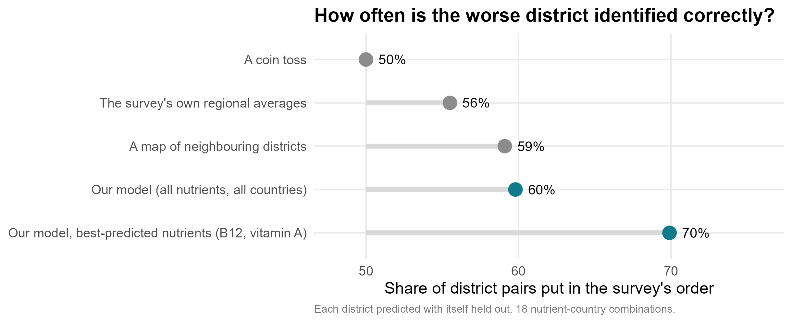{width="9.2in"}

::: {.notes}
ANDREW, about 75 seconds (194 words).

Take any two districts in a surveyed country and ask which is worse off. A coin gets it right five times in ten. The regional average a programme uses today gets five and a half. A map built only from neighbouring districts, with no satellite data at all, gets nearly six. Our model, across all nutrients and all four countries, gets six. For the nutrients it predicts best, B12 and vitamin A, seven. Two things to say about this. First, remember what the survey's own district number is. Most districts rest on one cluster, about a dozen children. The survey was designed to report regions, so right here means agreeing with a noisy district estimate, and no method can score near a hundred against it. Second, inside a surveyed country, geography gets you most of the way, because deficiency follows a smooth north-to-south gradient in all four countries. So the fair reading is: within a country, a modest improvement on interpolation and a clear one on the regional average. Where the public layers earn their keep is a country with no survey, where there is nothing to interpolate from. I will come to that.

Backup, if asked: Exact figures on the ruler: coin 50, regional average 56, neighbouring-district map 59, our model 60, best-predicted nutrients 70 per cent of district pairs in the survey's order. Each district predicted with itself held out; 18 measurable nutrient-country combinations.
:::

## Accuracy varies by micronutrient deficiency, not prevalence

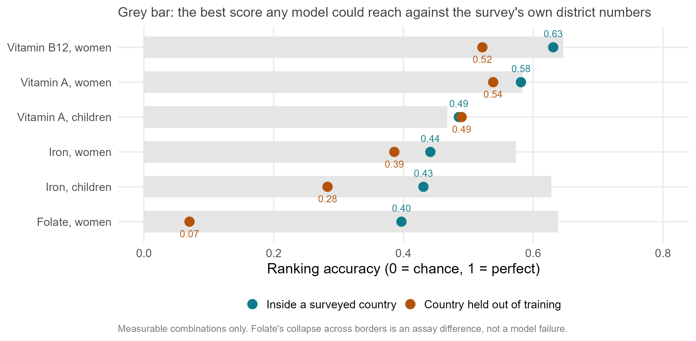{width="9.2in"}

::: {.notes}
ANDREW, about 80 seconds (218 words).

This is the slide I would most like you to take away, because it says something about micronutrient surveys and not only about our model. Women and children are separate models, so they are shown separately. Teal is a district held out inside a surveyed country; orange is a whole country held out of training, fitted on three countries and scored on the fourth. Vitamin B12 and vitamin A map best, in women and in children. Iron is in the middle. Folate ranks districts well inside a country and collapses when we cross a border. Zinc we cannot map at all, and it is not on the slide, because the surveys' own district zinc numbers carry no signal to recover. Notice this has nothing to do with prevalence: folate and zinc are the two commonest deficiencies in our data, and the two we handle worst. Folate's collapse is not a modelling failure. Malawi's folate was measured with a microbiologic assay and the others with an immunoassay, which reads systematically lower. What fails to cross the border is the measurement, not the geography. That is a harmonisation problem, and this room can fix it. The grey bars are the ceiling any model could reach against these surveys' district numbers. For B12 and vitamin A we are essentially at it.

Backup, if asked: Numbers: B12 0.63 in-country, 0.52 transported; vitamin A 0.53 and 0.51; iron 0.44 and 0.33; folate 0.40 and 0.07. Measurable combinations only: national prevalence at least 2 per cent and a reliability ceiling of at least 0.30.
:::

## Most important domains of proxy predictors

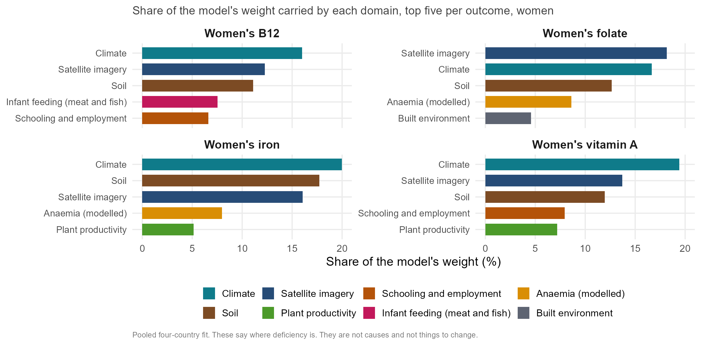{width="9.4in"}

::: {.notes}
ANDREW, about 70 seconds (176 words).

Women's outcomes, to keep it readable; the children's panels are in the appendix and tell the same story. The top three bars are the same in every panel: climate, soil, and a satellite summary of what a district looks like. Together they carry just under half the weight, whichever nutrient you take. What each nutrient adds below them is what a nutritionist would recognise. B12, the nutrient you get almost only from animal-source food, leans on infant feeding: districts where more infants are fed meat or fish, almost certainly a proxy for the women's own diet. And B12 is our best-predicted outcome. Iron and folate lean on modelled anaemia, their clinical consequence. Vitamin A leans on schooling and household wealth. One warning. These are district-level associations, not causes. In Malawi the anaemia and malaria layers carry weight in the wrong direction for B12, because they mark the fish-eating lakeshore. The model finds a place-marker and cannot tell it from a mechanism. These tell you where to look. They are not a list of things to change.

Backup, if asked: The satellite summary is Google's AlphaEarth: a year of imagery compressed into 64 numbers, not interpretable one by one but a strong description of land cover. Children's iron adds an agro-pastoral gradient (cereal cropping, livestock). Malawi: rho between B12 deficiency and modelled anaemia is -0.40, and with fish eaten -0.48.
:::

## Transporting predictions to a country with no data

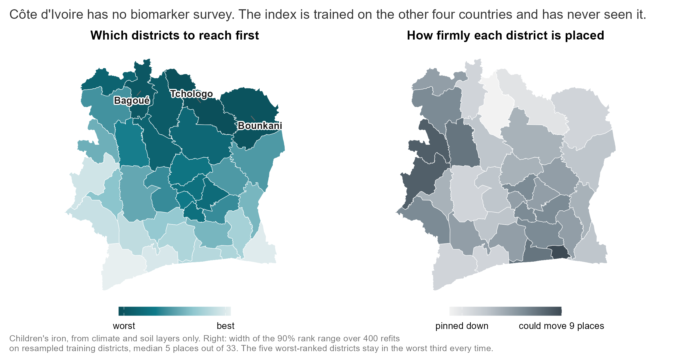{width="9.2in"}

::: {.notes}
ANDREW, about 60 seconds (150 words).

Most countries in this region have no recent biomarker survey at all. Cote d'Ivoire is our worked example of that situation: all the public layers, no survey. Trained on the four surveyed countries, the model ranks its 33 districts. The northern savanna belt comes out worst: Tchologo, Bounkani, Bagoue, Poro. Two independently specified versions of the model agree with each other at about 0.9 and share most of their worst fifth, so this is not a knife-edge. How much should you trust it? With a whole country held out, a district we call worst-third really is in the worst third about half the time, against a third by chance. The shading on the right is easy to misread. Dark means the model does not change its mind when we retrain it on different districts. It does not mean we have verified that district against anything. For that, the next slide.

Backup, if asked: Two candidates agree at 0.88 to 0.97 and share 83 per cent of their worst fifth. Worst-third calls land 52 per cent of the time against 33 by chance; of the five worst named, 62 per cent land. The WFP and MIMI vitamin A map for Cote d'Ivoire, built from a household budget survey, puts the same northern belt worst (rank agreement about 0.5 over 33 districts, survives adjusting for latitude).
:::

## The 2007 Côte d'Ivoire survey agrees with the transported ranking

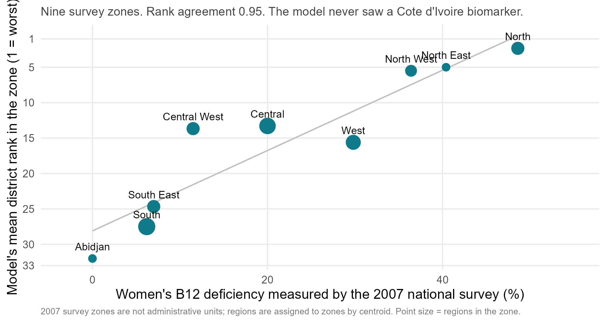{width="8.6in"}

::: {.notes}
ANDREW, about 45 seconds (135 words).

Cote d'Ivoire did run a national nutrition survey, in 2007, and WHO holds its results by region. It reported women's B12 deficiency in nine survey zones, from 49 per cent in the north to nearly zero in Abidjan. We had never looked at it. Our transported B12 ranking, built on the other four countries and never shown a Cote d'Ivoire blood sample, puts those zones in almost the same order: rank agreement 0.95 across the nine. Three caveats. The survey is nineteen years old. Its zones are survey regions, not administrative units, so we assigned our 33 districts to them by their centres. And it is nine points. But it is the first check of the transported model against real blood data in a country it never trained on, and it points the same way.

Backup, if asked: Spearman -0.95 between the zone's measured B12 deficiency and the model's mean district rank (1 = worst). The one swap is West and Central. Script: scripts/policy_deck/24_civ_2007_survey_check.R.
:::

## What type of decisions can this model support?

::: {.notes}
ANDREW, about 65 seconds (177 words).

This is the slide to photograph. Four yeses and two partlys. Yes to anything that needs an order: which districts to reach first, where the next survey samples, how to sequence a roll-out. The model gives a ranked list of every district, and the ranking is the thing that works. Yes to a district prevalence inside a surveyed country: the ranking plus the survey gives it. Partly to a district prevalence where there is no survey. The ranking has no level of its own. Measure one national number, about five per cent of a survey's sample, hang the ranking on it, and district figures land within about ten points. That anchor has to be measured, not modelled. And partly to targeting an intervention: the model picks the most-affected districts better than an untargeted allocation, so a targeted programme likely reaches more deficient people. Likely, because burden also sits where the people are, so rank by rate times population. Binduri is the whole product in one district: 12th by interpolation, 1st by the model, 6th by the survey.

Backup, if asked: Anchor: a national sample of about 5 per cent of a survey, roughly forty blood draws for one nutrient, gives district figures within 9 to 10 points; the same 5 per cent spent on a regional survey gives about 12. Predicting a national level from world indicators across 69 countries missed Sierra Leone by 29 points and Malawi by 22. Not tested: whether a programme worked; one point in time cannot show change.
:::

## Every survey added improves every other country's map

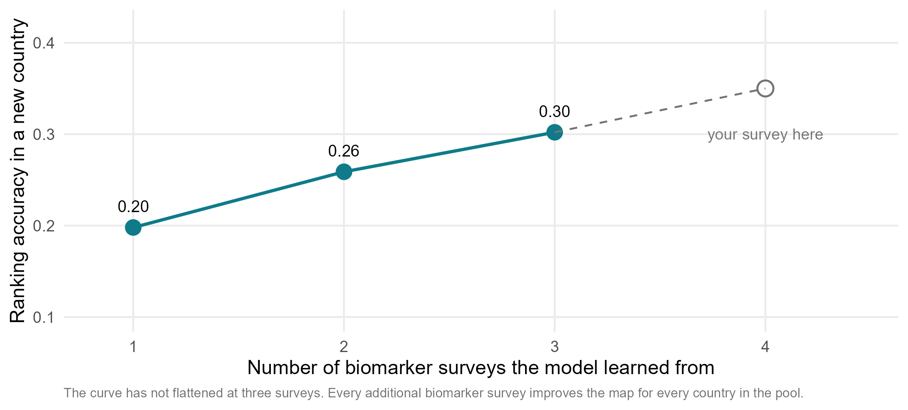{width="8.6in"}

::: {.notes}
ANDREW, about 60 seconds (169 words).

What actually limits this? Not the satellite data. We added eleven new blocks of predictors this year and not one moved the answer by more than a hundredth. It is the number of biomarker surveys we can learn from. With one survey, a country we have never seen gets a ranking of 0.20. With three, 0.30. The line has not flattened. And it matters which country. Trained on Ghana alone, we rank The Gambia's districts at 0.61, because Ghana spans the whole gradient from the Sahel to the forest. A training country that contains the whole range teaches the whole range, and we can check whether a candidate country extends that range from free satellite data, before a single blood sample is drawn. So the ask is simple. If your country has a micronutrient survey, recent, planned, or sitting in a drawer, put it in the pool. It improves the map of every other country in it, and yours gets a ranking for the districts your survey never reached.

Backup, if asked: Part of what holds the curve down is the surveys, not the model: four surveys in four years by four teams, with national levels that differ several-fold. Four or five countries surveyed on one protocol at the same time would let us fit on four and predict the fifth much better. Two candidate models are written down in advance, dated 3 September 2026, so the fifth survey is a real test.
:::

## Conclusions and next steps

::: {.notes}
ANDREW, about 50 seconds (130 words).

Three findings. Public data carry real information about deficiency, and most of it is in the environmental and climate layers that are measured everywhere, every year. That information ranks districts better than the regional averages a programme uses today, at home and across a border. And every survey we add improves every map: the limit is surveys, not predictors. Next, we want to use the models to make surveys count for more: which districts to sample, where to place clusters, how to fill the gaps. Add surveys to the pool, and test the model on a fifth country before anyone acts on it. And compare our predictor story with the MIMI and GBD models, framework by framework. Modelling extends a survey's reach. It does not replace the survey. Thank you.

Backup, if asked: A question to hand the room if there is time: how accurate does a district ranking have to be before you would use it? We can say what we get; only programmes can say what is good enough.
:::

# Appendix

## Most districts rest on a single survey cluster

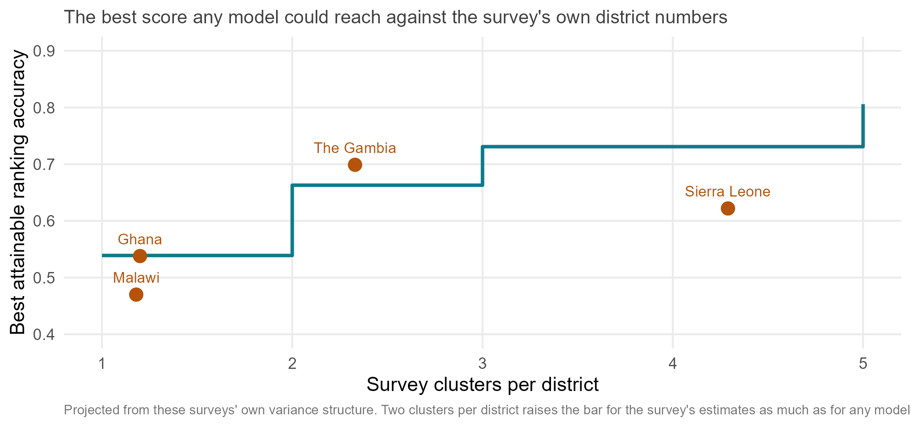{width="8.6in"}

::: {.notes}
Moved out of the main body on 18 September. Across the four surveys, three districts in four rest on a single cluster; in Ghana and Malawi it is more than eight in ten. With one cluster per district, a model that knew each district's true prevalence exactly would still only score about 0.54 against the survey's own district numbers. Two clusters takes that to 0.66, three to 0.73.

Projected from these surveys' own variance structure, not from an experiment in which anyone reallocated a survey budget. Sierra Leone has the most clusters per district (4.3) and the weakest results, because 14 units of half a million people is the wrong unit, not the wrong design.
:::

## Predictor groups, with country coverage

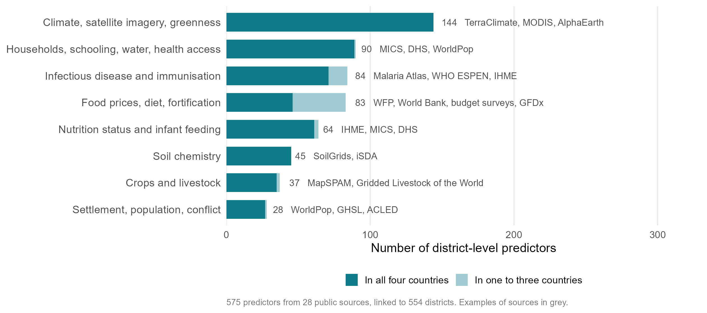{width="9.6in"}

::: {.notes}
The bar-chart version of the predictor slide, kept for the count split: 518 of the 575 predictors exist in all four countries and can serve a model for a new one; the other 57 are in one to three countries and are used only inside those.
:::

## Most important domains, all six outcomes

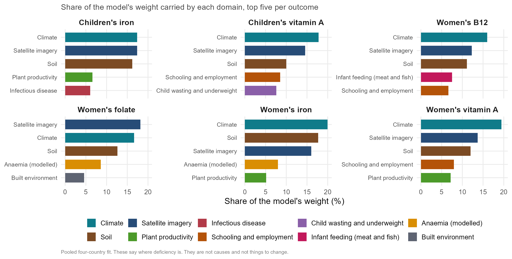{width="9.4in"}

::: {.notes}
The six-panel version of the domains slide, children's outcomes included. Same reading: three shared environmental blocks, then a nutrient-specific second signal. Children's iron leans on the farming system: cereal-dominant cropping, ruminants and cattle mark worse iron status; root crops and market-integrated prices mark better.
:::

## Every source and every domain

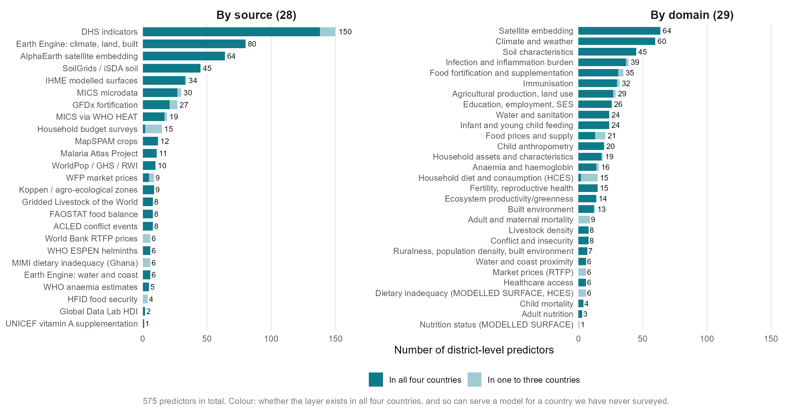{width="9.6in"}

::: {.notes}
The full inventory behind the eight-group slide: 28 sources and 29 domains, coloured by whether the layer exists in all four countries and so can serve a model for a country we have never surveyed.
:::

## Which deficiencies can be mapped at district level at all?

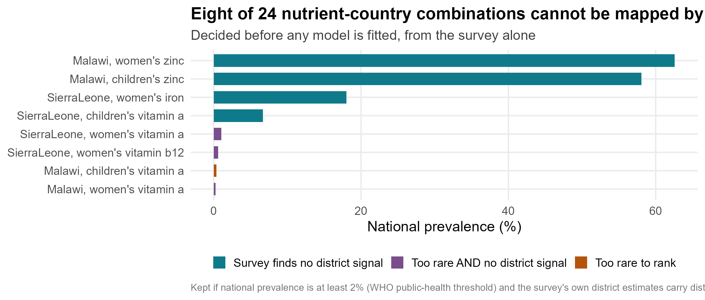{width="9.2in"}

::: {.notes}
The screen applied before any model is fitted: keep a nutrient-country combination if national prevalence is at least 2 per cent (WHO's own public-health threshold) and the survey's own district estimates carry district-level signal. Eight of 24 fail. Four are too rare to rank (Malawi child and women's vitamin A at 0.4 and 0.2 per cent, Sierra Leone women's B12 and vitamin A); four have no district signal in the survey itself (both Malawi zinc combinations, Sierra Leone child vitamin A and women's iron).

Every accuracy number in the talk is over the 16 that pass. The answer to "isn't that cherry-picking": the screen uses only prevalence and the survey's own resolution, never the model's score, and every threshold pair from 2 to 10 per cent and 0 to 0.40 gives the same answer, 0.46 to 0.50. Ghana child vitamin A passes the screen and we lose on it.
:::

## Accuracy by country, and what each survey could see

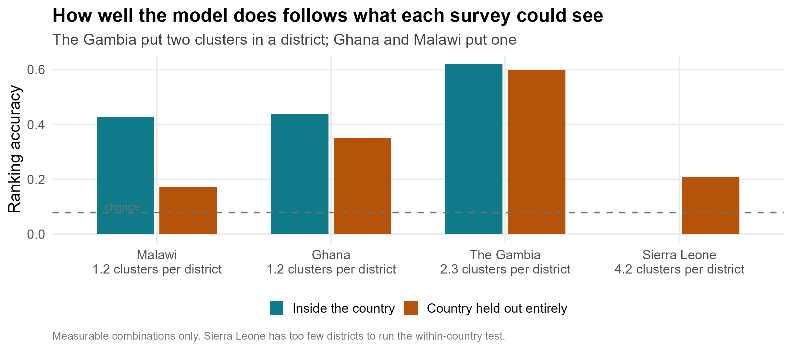{width="9.2in"}

::: {.notes}
The answer to "will it work in my country". The Gambia 0.62 inside the country and 0.60 held out entirely; Ghana 0.44 and 0.35; Malawi 0.43 and 0.20; Sierra Leone 0.16 held out and not scoreable inside, with 14 districts.

The ordering follows what each survey could resolve, not the country. The Gambia put 2.3 clusters in a district, Ghana and Malawi 1.2. Ghana is the best teacher — trained on Ghana alone we rank The Gambia at 0.61 — because its 260 districts span the widest environmental gradient in the panel.
:::

## The data that travel across a border are the free ones

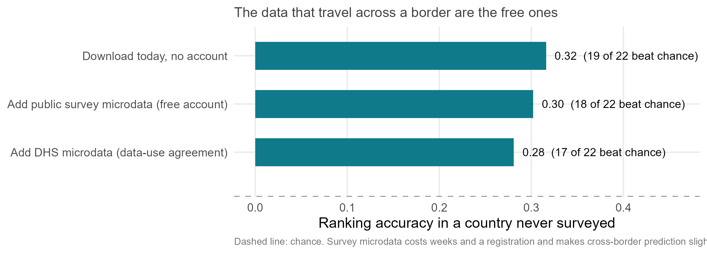{width="9.0in"}

::: {.notes}
Leave-one-country-out ranking accuracy by what a ministry must actually do to obtain the data. Openly downloadable layers, no account: 0.32, positive in 19 of 22 combinations. Add public household-survey microdata behind a free registration: 0.30. Add DHS microdata under a data-use agreement: 0.28. Chance is 0.08.

The blocks that cost weeks of work and a registration each add one thousandth inside a country, 0.400 with DHS against 0.399 without, and make cross-border prediction slightly worse. Eleven candidate predictor blocks were scored this year and none moved the answer by more than 0.01 at the median. The vocabulary is saturated; more countries, not more layers, is the lever.
:::

## Malawi: the model finds place-markers, not mechanisms

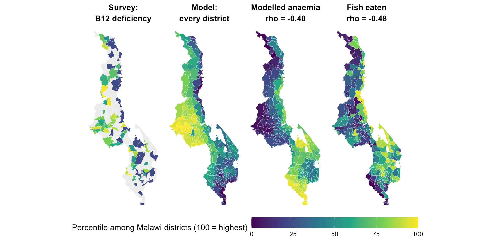{width="9.0in"}

::: {.notes}
Malawi women's B12 is the best-predicted combination in the study, 0.70 held out within the country. In it, the modelled anaemia surface carries weight in the wrong direction: districts with more anaemia have better B12 status, rho -0.40.

The maps say why. Anaemia and malaria are highest along the lakeshore and in the south, and that is where households eat fish, rho -0.48, the main dietary B12 source in Malawi. The model found a marker for a place, not a mechanism, and it cannot tell the two apart. This is why the weights must never be read as a list of things to change, and why the cross-border models lean on climate and soil rather than on health surfaces.
:::

## What we compared the model against

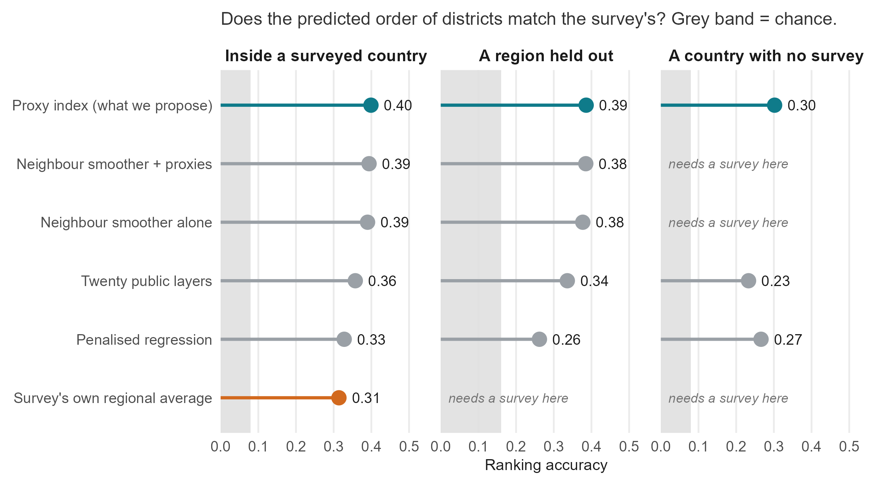{width="9.2in"}

::: {.notes}
Fourteen candidate algorithms on identical held-out folds, 1,304 fits: the untuned index 0.294, a rank-loss ensemble 0.285, random forest 0.265, a squared-error ensemble 0.246, principal-component HAL 0.215, elastic net 0.189, on prevalence over 17 combinations. Nothing beat the index by more than 0.03 on any estimand.

Two honest points. A covariate-free spatial smoother scores 0.390 in-fill against the index's 0.399, and it wins in Ghana: inside a surveyed country geography gets you most of the way, and the covariates earn their keep across borders where no smoother can be fitted. And "nothing is tuned inside a fit" is not the same as "nothing was chosen on these data" — the estimator, the predictor representation and the domain sets were all selected while looking at these four countries, which is why the fifth survey is pre-registered.
:::

## How much of the burden does the worst-ranked fifth reach?

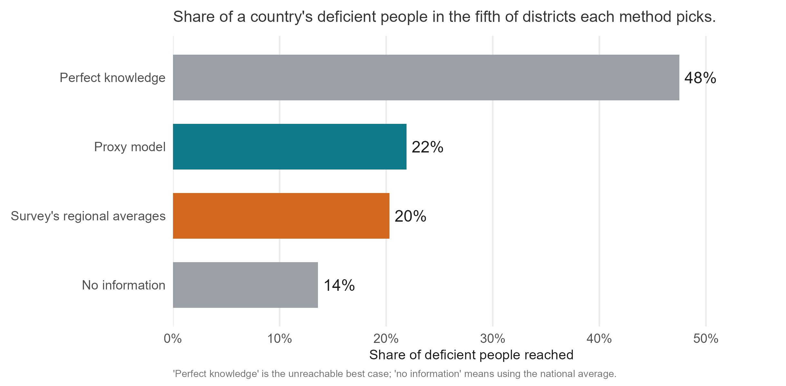{width="9.0in"}

::: {.notes}
The evidence behind the "no" on counting cases. A programme reaching the fifth of districts the model ranks worst reaches 21.9 per cent of the deficient people; the survey's own regional averages 20.3; a random fifth about 20; a perfect map 47.5.

In Ghana children's iron specifically, going to the most populous fifth of districts reaches 46 per cent. Burden sits where the people are. The instruction that follows: rank by predicted rate times population, using the population map a country already has, and read ours as the rate.
:::

## The geostatistical comparator: better levels, worse ranking

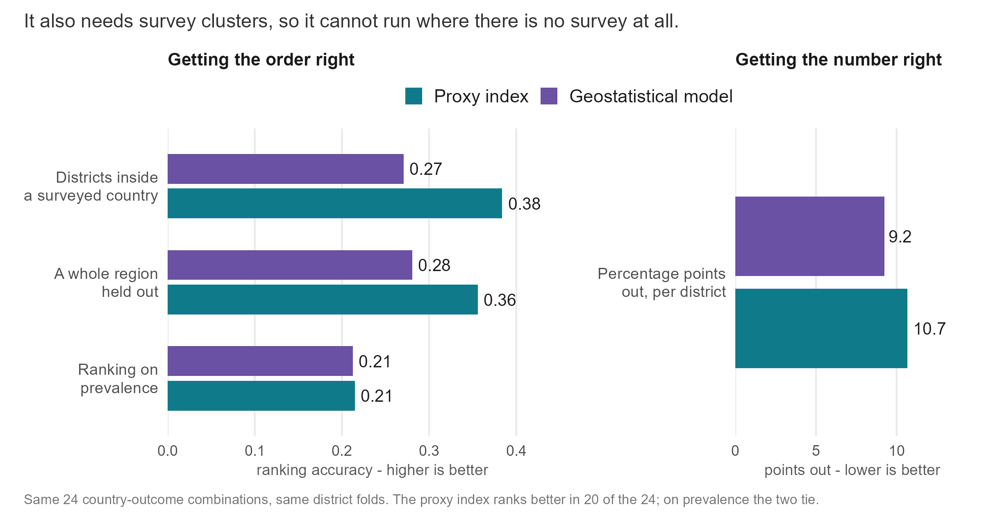{width="9.0in"}

::: {.notes}
The DHS Program's model-based geostatistics, an INLA-SPDE spatial field plus covariates fitted at the survey clusters, scored on the same district folds. It ranks worse, 0.27 against 0.38 for the index, with the index better in 20 of 24 combinations, and it estimates levels better, 9.2 against 10.7 percentage points of absolute error, because it estimates a level and shrinks uncertain districts toward it.

The two are complementary, and the honest division of labour is: if you want an order where no survey exists, use ours; if you want a calibrated prevalence where a survey does exist, use theirs. The geostatistical method needs measured clusters inside the country it predicts, so it has no cross-country estimand at all.
:::

## The twenty layers behind children's iron

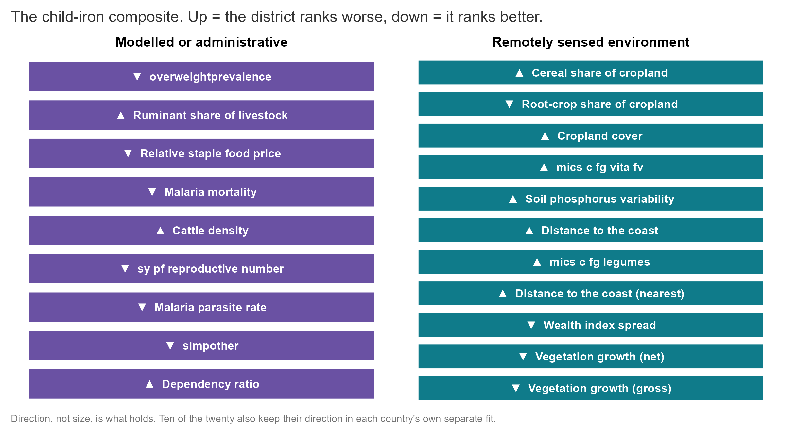{width="9.0in"}

::: {.notes}
The index is linear in the rank-normalised predictors, so every column has an exact back-projected weight. These are the twenty largest for children's iron in the pooled four-country fit; together they hold about a fifth of the index, and the rest is spread over the other 350 columns, which is how a weighted sum of many weak signals is meant to behave.

Cereal-dominant cropping, ruminant and cattle density, cropland and distance from the coast rank a district worse; root crops, higher plant productivity, relatively expensive staples and modelled overweight rank it better. All twenty keep their direction in every leave-one-country-out fit. None requires a new blood sample, and a twenty-layer equal-weight composite scores about the same as the full index for a new country.
:::

## Cote d'Ivoire: two independently chosen models agree

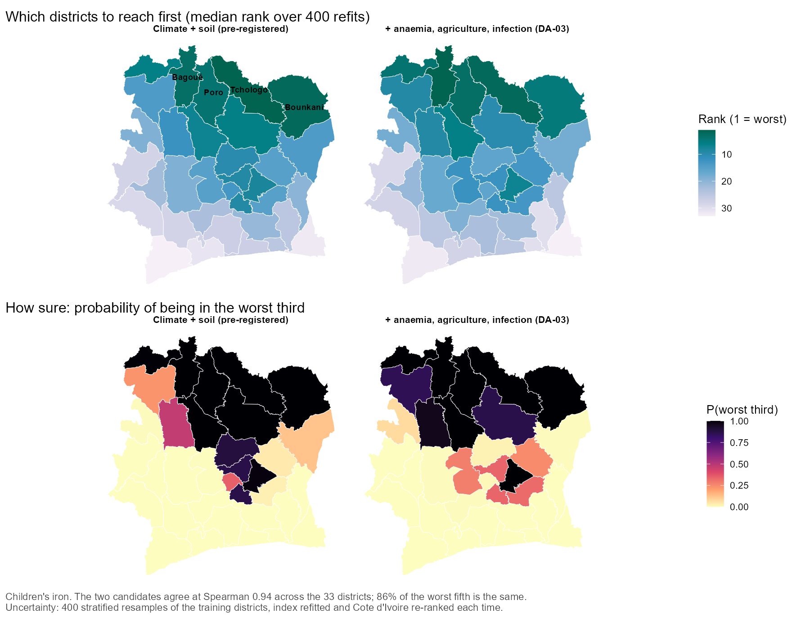{width="8.8in"}

::: {.notes}
The two pre-registered candidate models, climate and soil alone and a five-domain set adding the anaemia surfaces, agriculture and infection, applied to Cote d'Ivoire's 33 districts. They agree at Spearman 0.88 to 0.97 and share 83 per cent of their worst fifth, so the ranking is not a knife-edge property of one specification.

The one external check that exists: the WFP and MIMI vitamin A map published this year, built from a household budget survey with no connection to this work, ranks the same northern belt worst. Spearman 0.50 over all 33 districts, q = 0.043 in a pre-specified family of ten tests, 0.48 after adjusting for latitude. For iron there is no independent map, and where iron can be checked it does not corroborate.
:::

## What the uncertainty on the maps does and does not mean

::: {.notes}
Have this ready; there is no figure, it is a spoken answer.

The shading on every ranking map comes from refitting the model on resampled training districts. It measures stability: whether the ranking would move if we had learned from a different set of districts. It is not a confidence interval for the truth.

We checked. Holding out each surveyed country in turn, the survey's own rank falls inside our nominal 90 per cent rank interval only 38 per cent of the time, 16 to 70 per cent across combinations. An honestly calibrated 90 per cent interval for a single district's rank would be about 55 per cent of the list either side, against 68 per cent for a random ordering.

So we do not report an interval on a rank. We report the probability of a class, which is calibrated and checkable: a district we place in the worst third of a country we have never surveyed is in the survey's worst third 52 per cent of the time, against 33 by chance; a district in our worst five, 62 per cent of the time.
:::

## Numbers we withdrew

::: {.notes}
Have this ready. An internal audit re-examined every headline claim this year and several did not survive, in both directions.

Withdrawn: regional transport of "12 of 12 combinations at 0.50 to 0.56", which was a fold-assignment bug; the correct figure over all 22 combinations is 0.28. Withdrawn: "26 per cent more burden captured than regional averages"; the honest margin is 2 percentage points, 21.9 against 20.3. Withdrawn: "two-thirds of attainable accuracy"; the ceiling was a diagnostic rather than a bound, and the ratio moves from 48 to 83 per cent depending on which ceiling and which target you pick. Withdrawn in our own favour: a covariate-free baseline at 0.516 that beat us, which turned out not to have been jackknifed.

Also retired: presenting the twelve-learner SuperLearner ensemble as the model. It lost to an untuned index at these sample sizes, and saying otherwise would misdescribe what we fit.
:::

## Where the ranking works, nutrient by nutrient and country by country

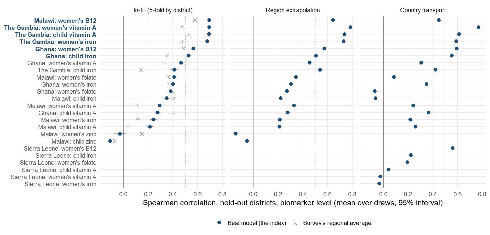{width="9.4in"}

::: {.notes}
Every nutrient-country combination on one axis. The filled point is the model, the cross is the survey's own regional average, and the bar is the spread over the ten fold draws. Six of the eighteen scored combinations clear 0.5 and average 0.64; the rest average 0.28.

Sierra Leone has no row here: with 14 districts a five-fold split leaves eleven to train on, below the twelve the protocol requires, so it is scored only under region and country hold-out.
:::

## Accuracy against how common the deficiency is

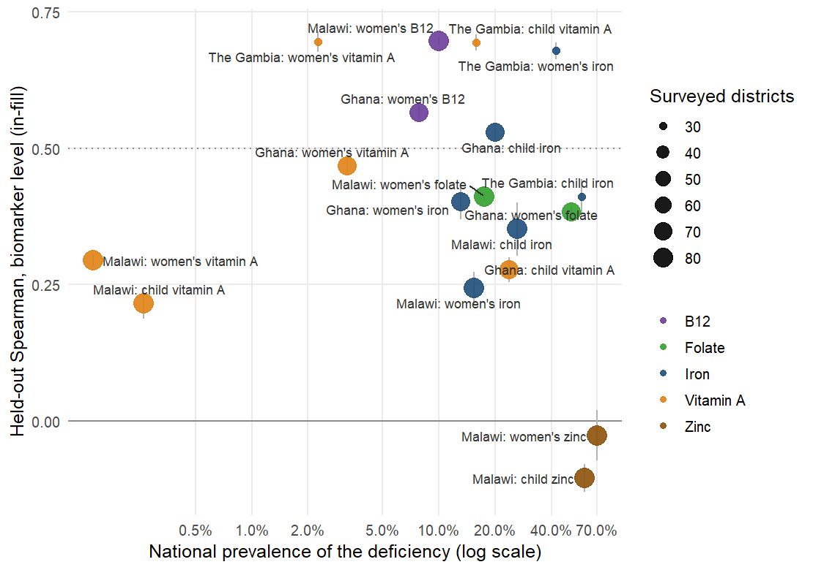{width="9.2in"}

::: {.notes}
Each point is one nutrient in one country. Rarity bites at the extreme: below about 1 per cent the survey finds a handful of deficient respondents per district and its district estimates are mostly zero, so no predictor can recover an order. Above that, the spread is about the survey more than the nutrient.
:::

## Holding out a whole region

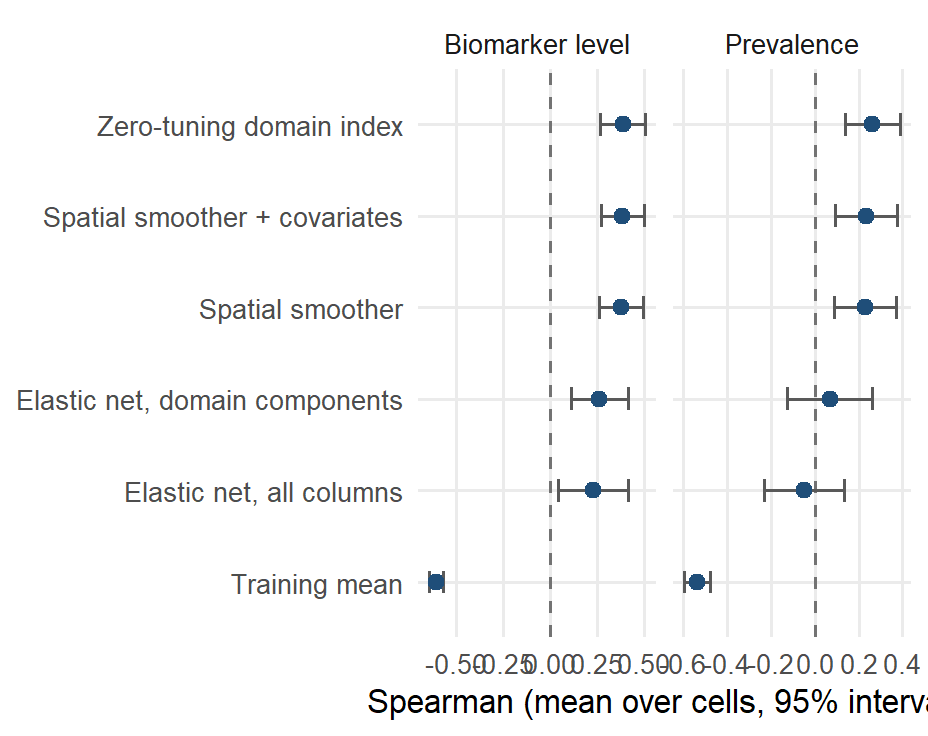{width="9.2in"}

::: {.notes}
Leave-one-region-out, where a spatial smoother has to extrapolate past the edge of its data. The index scores 0.39 on the biomarker level against 0.38 for the smoother; the penalised fits collapse. Ghana and Malawi are the countries where this estimand is well determined.
:::

## Holding out a whole country

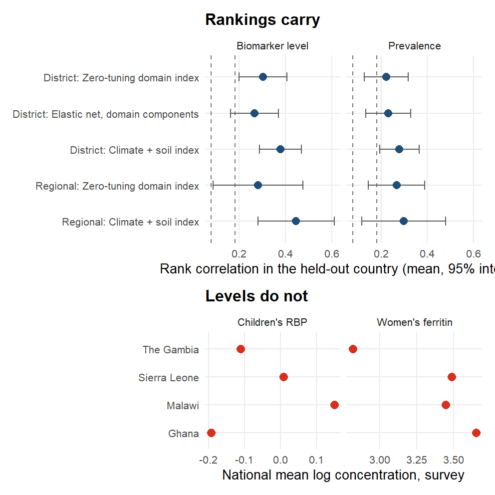{width="9.2in"}

::: {.notes}
Trained on three countries and applied to the fourth. The full vocabulary scores 0.30 at district level, positive in 18 of 22 combinations, against a country-block permutation null whose 95th percentile is 0.08.

The bottom panel is why levels do not travel: the surveys' national mean biomarker concentrations differ several-fold, so a transported prevalence would be wrong before it started. What crosses a border is the order of districts.
:::

## Can the transported model be improved by adding domains?

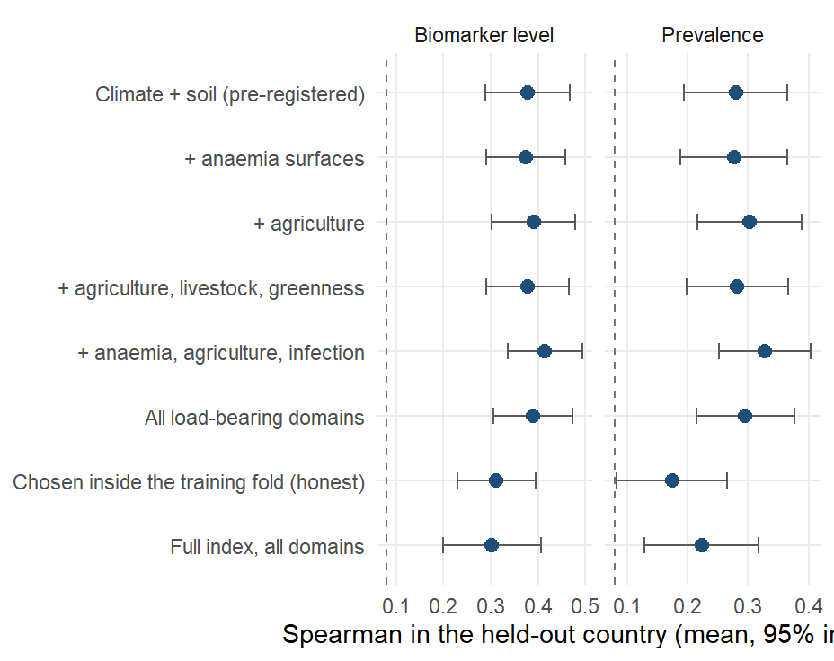{width="9.2in"}

::: {.notes}
Climate and soil alone transport at 0.38, better than the full 383-column vocabulary at 0.30. Adding the anaemia surfaces, agriculture and infection reaches 0.41.

The honest caveat, and the reason 0.30 is the number quoted in the main body: both sets were chosen on the same 22 combinations they are scored on. Honest nested selection inside the training fold gives 0.31, no better than the full index. Both are pre-registered as candidates for the fifth survey rather than reported as findings.
:::

## Ghana, four ways of looking at one outcome

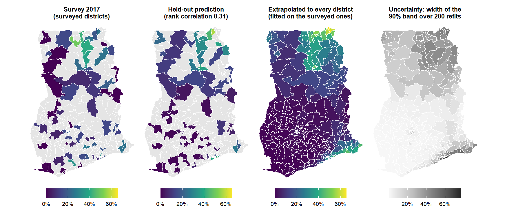{width="9.4in"}

::: {.notes}
Women's iron in Ghana. What the survey measured; what the model predicts with each district held out; the model applied to every district including the unsurveyed ones; and how much each district's prediction moves when the training districts are resampled.

The fourth panel measures stability under resampling, not distance from the truth.
:::

## Malawi, the same four views

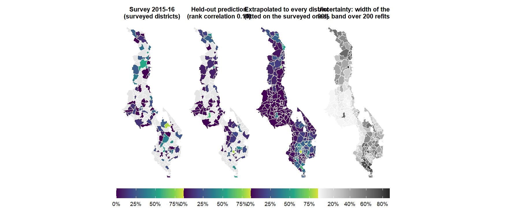{width="9.4in"}

::: {.notes}
Women's iron in Malawi. Note that Malawi's units are Traditional Authorities inside 27 districts, which is one reason its accuracy is lower: many proxy layers resolve to the district, not below it.
:::

## How reliable is the survey's own district map?

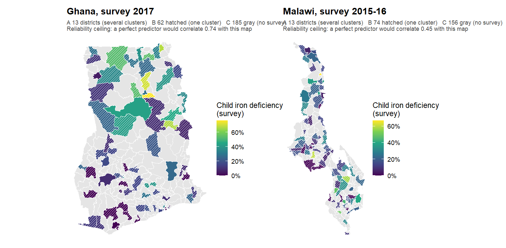{width="9.2in"}

::: {.notes}
Before judging the model, look at what it is judged against. Hatched districts hold a single survey cluster, so their value is one community's respondents. The number under each title is how well a perfect predictor of the true district value could correlate with this map: roughly 0.5 to 0.7. That is the bar, not 1.0.
:::

## Does the model track the survey, district by district?

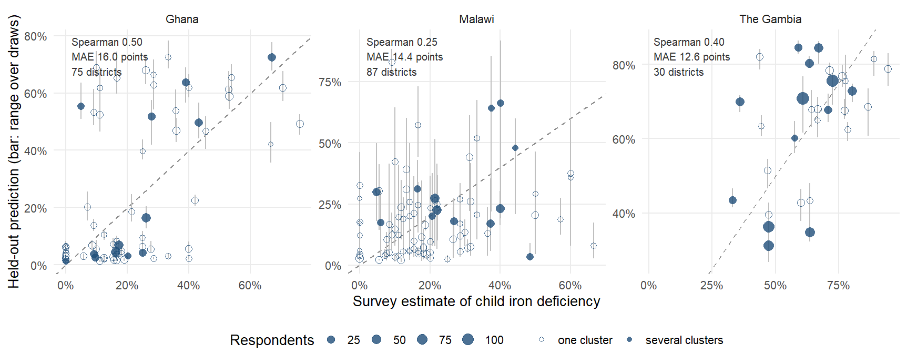{width="9.2in"}

::: {.notes}
Each district's survey estimate against its held-out prediction. Three things to read. The cloud is tilted but not on the line: the model ranks, and compresses the range, because it is rescaled to the training spread. Hollow points are single-cluster districts, and much of the vertical scatter around them is the survey's noise rather than the model's. The largest circles, the districts with the most respondents, sit closest to the line.
:::

## Does it match the survey at the regional level?

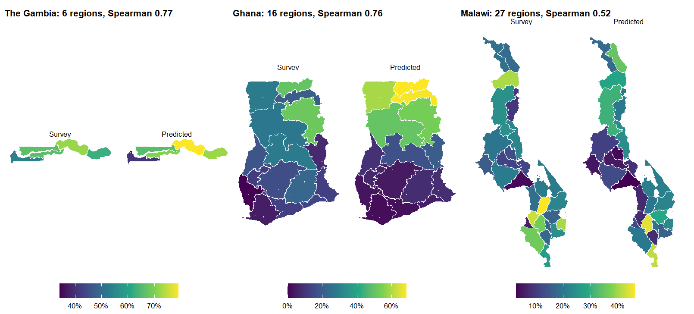{width="9.2in"}

::: {.notes}
The same held-out district predictions and the survey, both aggregated to regions. This is the resolution the surveys were designed to be read at, and the comparison a ministry statistician makes first. The regional pattern is recovered in each country.
:::

## How likely is a district to be above the 20 per cent line?

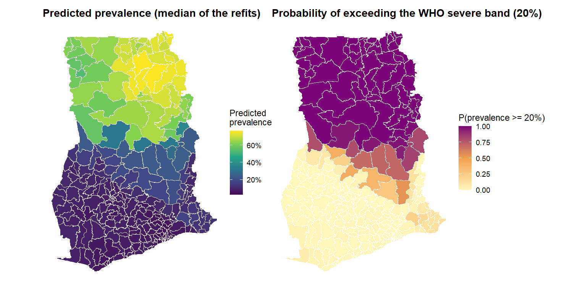{width="9.2in"}

::: {.notes}
Not "what is the prevalence" but "how likely is it to be above the line a programme acts on". Ghana, child vitamin A, refitted on 200 resamples of the training districts: 63 districts are above the line in at least 80 per cent of refits, 186 below it in at least 80 per cent, and 11 are undecided.

The level here comes from Ghana's own survey. For a country with no survey the level would come from the national anchor and the map would read as a planning figure.
:::

## What the rank intervals promise, and what they do not

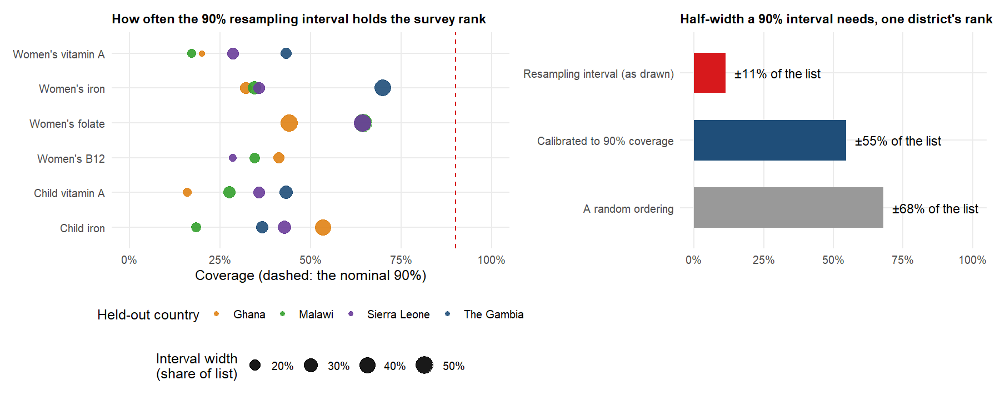{width="9.2in"}

::: {.notes}
The calibration check behind the "stability, not truth" caveat. Holding each surveyed country out, the survey's rank falls inside the nominal 90 per cent interval 38 per cent of the time, 16 to 70 per cent across combinations. An honestly calibrated 90 per cent interval would be 55 per cent of the list either side, against 68 for a random ordering.

Which is why the useful statement is a class probability, not an interval: worst-third calls land 52 per cent of the time against 33 by chance.
:::

## What moves each district, predictor by predictor

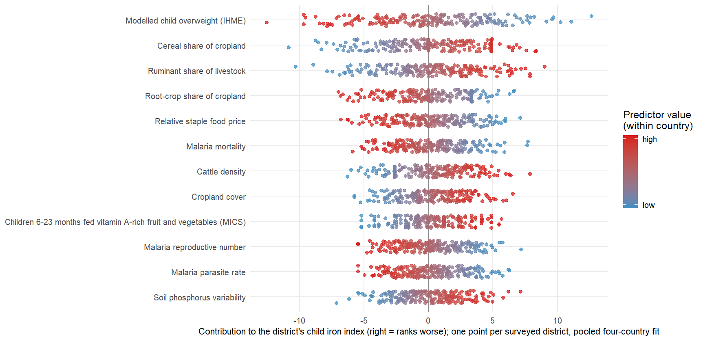{width="9.2in"}

::: {.notes}
The index is linear in the rank-normalised predictors, so each district's score decomposes exactly into per-predictor contributions — the SHAP-style view, computed rather than approximated. One row per predictor, one point per surveyed district, colour showing where the district sits on that predictor. A wide row separates districts strongly; a predictor with a modest average weight can still move a handful of districts a long way.
:::

## Which predictors carry the most weight

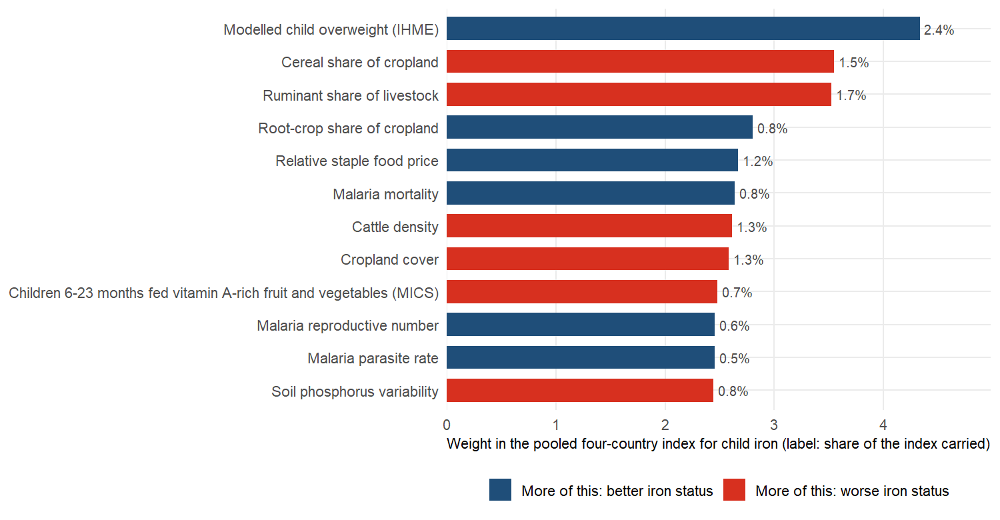{width="9.2in"}

::: {.notes}
The twelve heaviest predictors for children's iron, pooled over the four countries. No single predictor carries more than a few per cent: the index is a sum of many small signals, mostly about landscape and livelihoods, not one master variable.

Asked whether these are causes: they are not. The weights say where deficiency is.
:::

## The weights behind the best ranking: Malawi women's B12

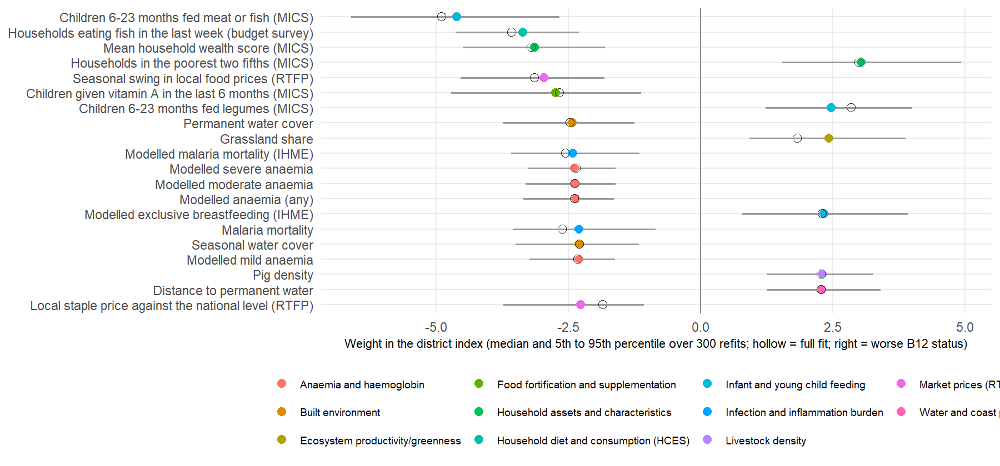{width="9.0in"}

::: {.notes}
The twenty largest weights in the best-predicted combination in the study, with intervals from 300 bootstrap refits of Malawi's 87 surveyed units. Every one keeps its sign in at least 95 per cent of refits.

Districts where more infants are fed meat or fish, more households ate fish last week, and the wealth score is higher have better B12; poorer, grassier districts further from water have worse. The anaemia and malaria surfaces run the other way, which is the surrogate-marker story on the Malawi maps slide.
:::

## What travels across borders, and what does not

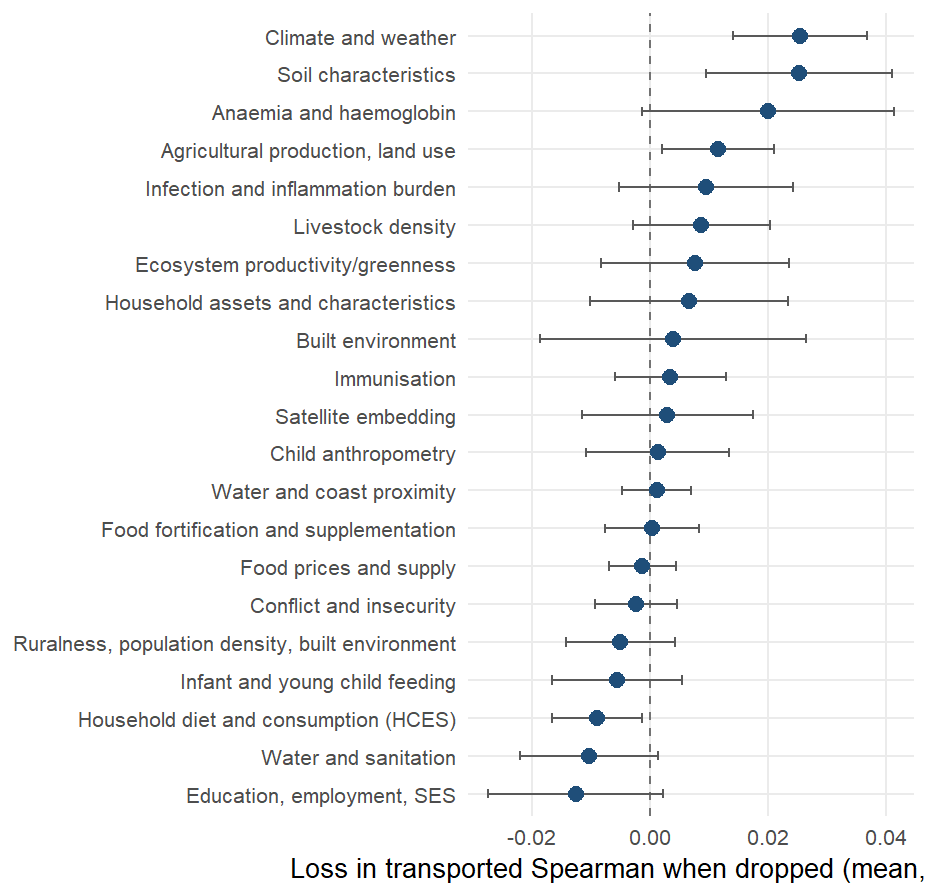{width="9.2in"}

::: {.notes}
Drop each domain in turn, rebuild the components, and see what the transported ranking loses. Climate and soil are load-bearing at about 0.025 each; the anaemia surfaces, agriculture and greenness follow. Seven of 21 domains cost nothing or help when removed — the household-survey items among them.

The physical environment is what carries across a border, and it is also the part a country without a survey can simply download.
:::

## Which associations replicate in every country?

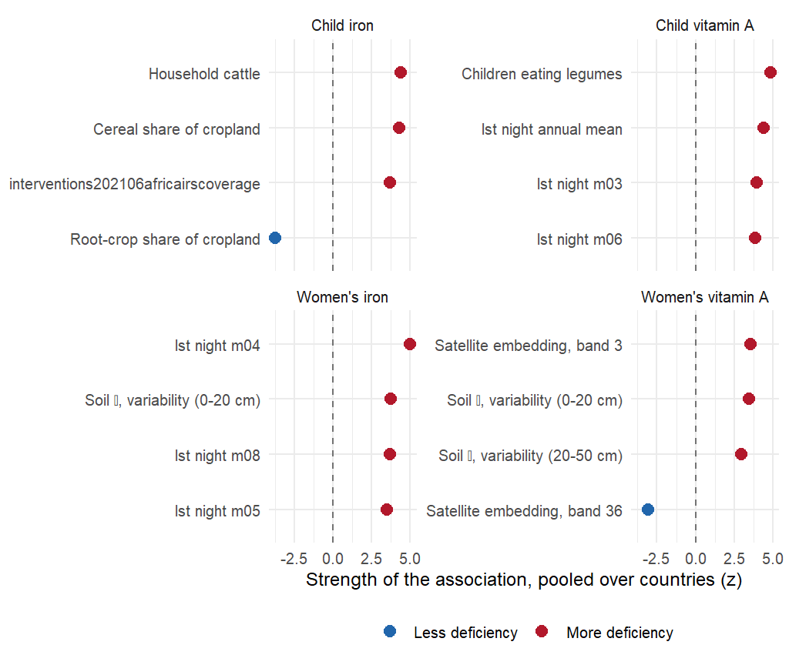{width="9.2in"}

::: {.notes}
Indicators whose district-level association holds the same sign in every country that measured the outcome, ranked by pooled meta-analytic z. Positive means more deficiency.

Read the ecological-fallacy signature honestly: legume cultivation and cattle ownership track more deficiency at district level, the reverse of the household-level dietary relationship. The replicated axis is rural subsistence agro-ecology — useful for deciding where to look, uninformative about what to change.
:::

## Could a small national survey plus the model replace a district survey?

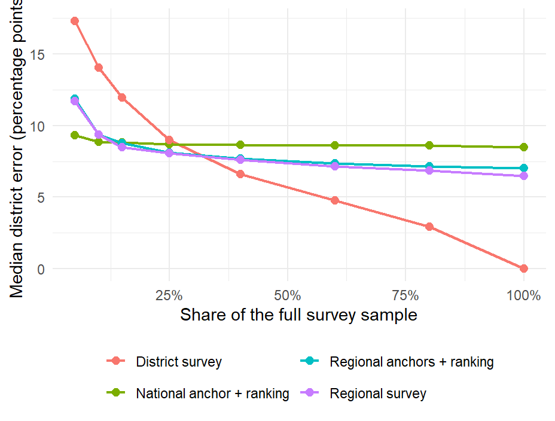{width="9.2in"}

::: {.notes}
Four ways to get district numbers, costed in units of survey sample. A national sample at 5 per cent of a full survey, with the transported ranking spread across districts, gives a median district error of about 9 to 10 percentage points; a district-representative survey needs a quarter to two-fifths of a full sample to match it.

Two honest counterpoints. A regional survey at 10 to 15 per cent does the same job on level. And the anchored design loses to a district survey on burden captured at every size, because burden sits in populous districts that a survey measures precisely. Not a replacement; a cheaper first pass.
:::

## Does each survey added help the others?

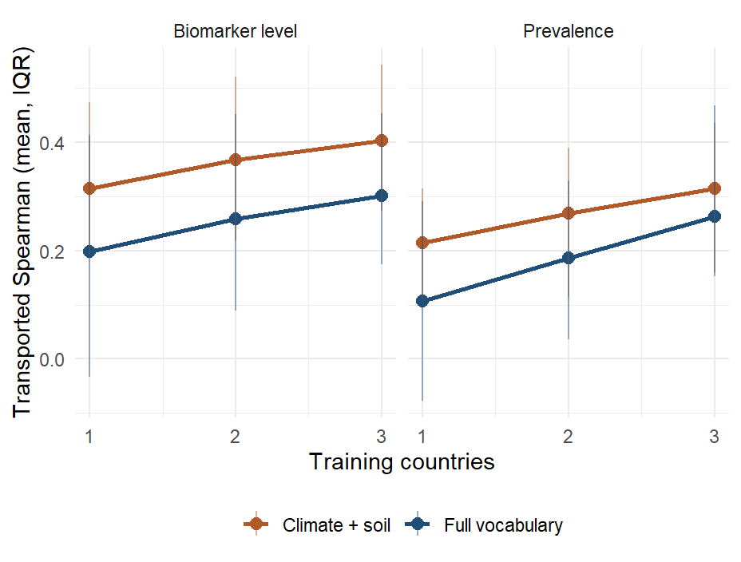{width="9.2in"}

::: {.notes}
Every subset of training countries scored on each held-out country. About +0.05 of transported accuracy per country added, monotone across all four specifications, and not flattened at three.

The qualifier to volunteer: the gain is in The Gambia and Ghana as held-out countries; Malawi and Sierra Leone have not improved.
:::

## Person-level models: a coin toss on proxies alone

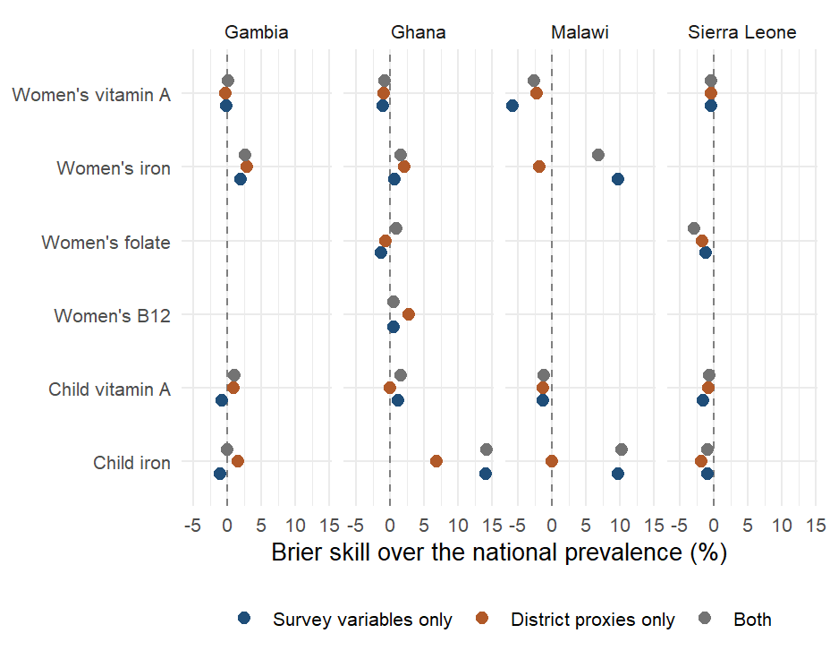{width="9.2in"}

::: {.notes}
The January approach, retained as a sensitivity analysis. A person-level ensemble under district-blocked folds has a mean AUC of 0.50 on district proxies, 0.52 on the survey's own respondent variables, and 0.53 on both. Person-level skill exists for iron only.

The earlier figure of 20 to 60 per cent Brier skill came from folds that were not blocked by district and a variable set that included biomarker-adjacent columns. Aggregating a person-level classifier also biases area means, which is why the area-level model is the headline.
:::
